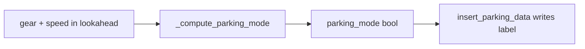
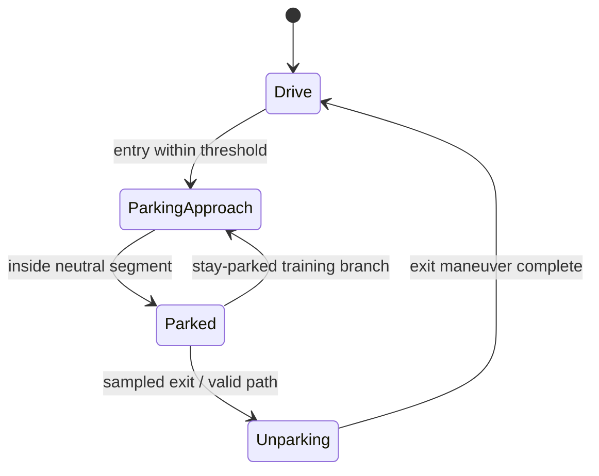
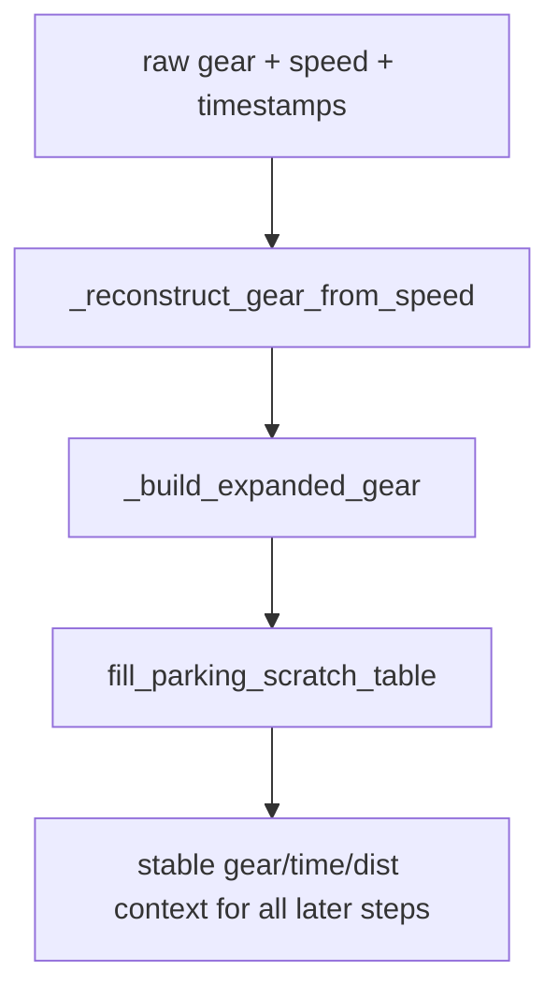
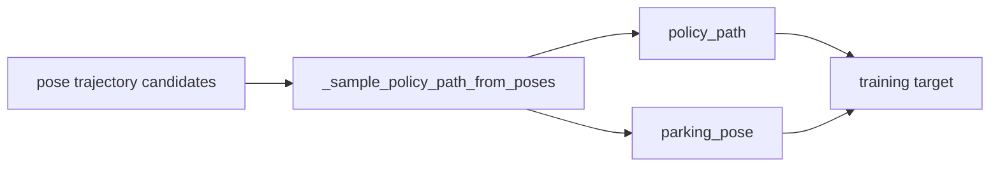

# Parking Augmentation Design Walkthrough (Wonjoon PR)

## What this walkthrough covers
This is a guided walkthrough of the parking augmentation design in Wonjoon’s PR, from the simplest possible approach to the full proposed system.

Goal:
- show what problem each step solves,
- show which method(s) implement that step,
- show why each step was necessary.

---

## The simplest possible parking solution
### Basic idea
Label a sample as parking if neutral gear appears soon in lookahead.

### Methods
- `_compute_parking_mode(...)`
- `insert_parking_data(...)`

### Why this is attractive
- very small implementation surface,
- easy to reason about,
- low coupling to the rest of the pipeline.

### Limitation
It only answers one question: “parking mode on/off?”

---

## Problem 1 with the simple approach
### What breaks
A single boolean cannot separate:
- approaching parking,
- currently parked,
- exiting parking (unparking).

This collapses distinct behaviors into one supervision signal.

### Design need
Introduce explicit maneuver state, not just one gate.

---

## Expansion 1 - richer maneuver state
### Methods
- `ParkingModeResult` (state container)
- `add_parking_mode(...)`
- `_augment_parked_mode(...)`

### What was added
- `parking_mode`
- `unparking_mode`
- internal `parked_mode`
- `parking_start_time_delta`
- `parking_end_time_delta`
- `parking_goal_distance`

### Why it matters
Now the model can distinguish “start parking” from “leave parking”.

---

## Problem 2 - raw gear is noisy around standstill and shifts
### What breaks
Raw gear can be delayed/noisy. Parking boundaries become unstable.

### Design need
Create a cleaner gear signal for parking logic.

---

## Expansion 2 - gear normalization and parking scratch state
### Methods
- `fill_parking_scratch_table(...)`
- `_reconstruct_gear_from_speed(...)`
- `_build_expanded_gear(...)`

### What was added
- speed-derived D/R recovery,
- long P/N segment preservation,
- neutral-segment expansion across near-standstill frames,
- scratch-table staging so downstream steps share consistent derived signals.

### Why it matters
Parking state transitions become more physically aligned, less CAN-noise driven.

---

## Problem 3 - parking needs geometric targets, not only mode labels
### What breaks
Boolean mode labels do not tell the model where to end up.

### Design need
Provide parking-goal pose + policy path supervision.

---

## Expansion 3 - goal pose and policy path
### Methods
- `compute_policy_path(...)`
- `_sample_policy_path_from_poses(...)`

### What was added
- `parking_pose` target,
- `policy_path` sampled in fixed distance steps,
- fallback from additional parking poses to path poses,
- clamping around parking goal distance.

### Why it matters
The model gets geometry to execute parking maneuvers, not just mode flags.

---

## Problem 4 - stationary prefixes dominate parking windows
### What breaks
Long standstill prefixes weaken motion-learning signal and can conflict with transition timing.

### Design need
Re-time policy targets around movement onset while avoiding conflicts with pre-intervention augmentation.

---

## Expansion 4 - standstill handling and policy clamping
### Methods
- `strip_leading_standstill(...)`
- `_pre_intervention_would_fire(...)`
- `clamp_policy_at_first_neutral(...)`

### What was added
- skip/guard logic when pre-intervention would overwrite same targets,
- trajectory retiming from movement onset,
- clamp future policy frames after first neutral in parking context.

### Why it matters
Targets stay physically coherent and less biased toward idle behavior.

---

## Problem 5 - gear supervision still has confounders
### What breaks
At standstill and parked-origin exits, gear labels can remain brittle.

### Design need
Add targeted gear augmentations specifically for parking/unparking contexts.

---

## Expansion 5 - gear augmentations for parking edge cases
### Methods
- `augment_unparking_gear(...)`
- `augment_standstill_gear(...)`

### What was added
- unparking branch augmentation of segment/current gear,
- standstill-time vehicle-gear randomization in parking mode.

### Why it matters
Reduces spurious coupling like “standstill always means one gear class”.

---

## Problem 6 - parking goal may be missing/noisy in production
### Design need
Train for robustness to missing goal signal.

### Expansion 6 method
- `apply_parking_goal_dropout(...)`

### What was added
- keep pre-dropout `parking_pose_gt`,
- optionally drop `parking_pose` to NaN by probability.

### Why it matters
Model is less brittle when goal signal is incomplete.

---

## Optional stopping intent branch
### Methods
- `set_stopping_mode(...)`

### What was added
- optional `stopping_mode` generation:
  - parking context: hazard-informed,
  - non-parking context: randomized PUDO/PARK in current design.

### Why it matters
Adds stop-style conditioning pathway tied to parking/stopping behavior.

---

## Full Wonjoon pipeline (final form)
### Orchestrator
- `insert_parking_data(...)`

### Ordered stages
1. initialize scratch
2. `fill_parking_scratch_table`
3. `add_parking_mode`
4. optional `set_stopping_mode`
5. optional `compute_policy_path`
6. `augment_unparking_gear`
7. optional `strip_leading_standstill`
8. `clamp_policy_at_first_neutral`
9. optional `augment_standstill_gear`
10. optional `apply_parking_goal_dropout`
11. drop scratch

```mermaid
flowchart LR
    A[(table,data)] --> B[init scratch]
    B --> C[fill_parking_scratch_table]
    C --> D[add_parking_mode]
    D --> E{enable_stopping_mode}
    E -- yes --> F[set_stopping_mode]
    E -- no --> G
    F --> G{policy_path enabled}
    G -- yes --> H[compute_policy_path]
    G -- no --> I
    H --> I[augment_unparking_gear]
    I --> J{strip_leading_standstill}
    J -- yes --> K[strip_leading_standstill]
    J -- no --> L
    K --> L[clamp_policy_at_first_neutral]
    L --> M{augment_standstill_gear}
    M -- yes --> N[augment_standstill_gear]
    M -- no --> O
    N --> O{goal dropout}
    O -- yes --> P[apply_parking_goal_dropout]
    O -- no --> Q
    P --> Q[drop scratch]
    Q --> R[(augmented output)]
```

---

## Integration beyond parking.py
### Pipeline wiring
- OTF integration: `make_driving_datapipe(...)` / OTF parking config plumbing
- WFM integration: `_add_parking_data(...)` in WFM pipe

### Config expansion
- schema-level parking options expanded (parking mode config),
- nested parking config adoption + config migration path.

### Why this matters
The proposal is not just a local heuristic; it becomes a configurable subsystem used consistently in both training paths.

---

## Additional thoughts (the critical ones)
1. `parked_mode` vs `parking_mode` semantics can still confuse readers.
2. Unparking detection currently favors reverse-out signatures.
3. Random non-parking stop-mode assignment may inject synthetic label noise.
4. Augmentation ordering is powerful but easy to regress without strict contract tests.

---

## Final takeaway
Wonjoon’s PR is best understood as a sequence of targeted expansions:
- start from simple parking detection,
- add state semantics,
- stabilize gear context,
- add geometric targets,
- harden transition-time augmentation,
- add robustness features,
- package it as a configurable, cross-pipeline parking subsystem.

That is why the final design looks much larger than the original heuristic: each layer directly addresses a failure mode of the simpler layer before it.
