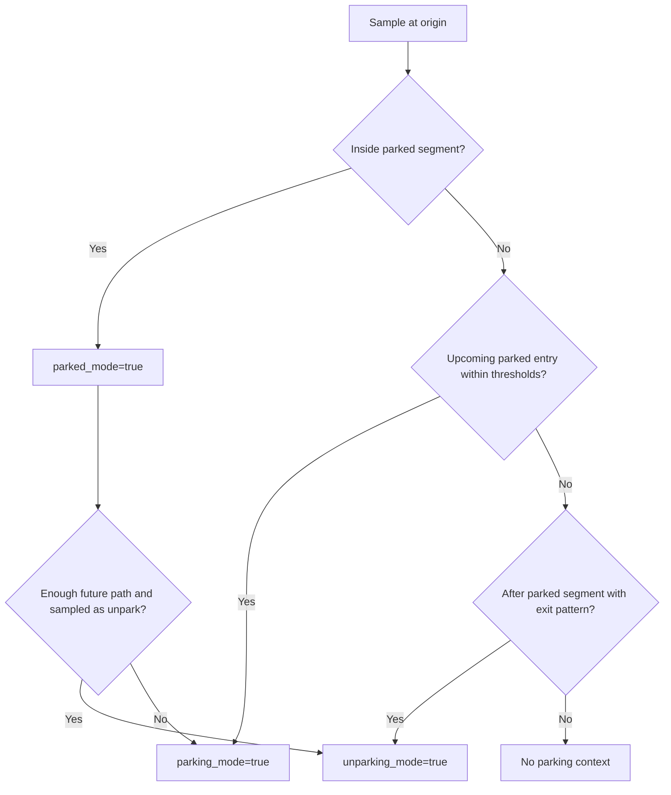

# Parking Augmentation Design Review (Wonjoon Proposal)

## Intent
This design introduces a dedicated parking augmentation stage in the data pipeline so parking and unparking behavior can be trained explicitly, instead of being weakly inferred from generic driving signals.

The proposal expands parking from a single boolean gate into a richer maneuver context:
- explicit parking vs unparking mode signaling,
- parking timing/distance metadata,
- optional stopping intent label,
- parking goal pose and policy path targets,
- targeted gear/path augmentations for standstill and transition moments.

## Existing Baseline (Before This Proposal)
Before this work, parking handling was narrow:
- parking context was essentially a binary parking-window signal,
- stopping intent had limited coupling to parking context,
- no explicit unparking mode label,
- no dedicated parking goal pose target,
- no policy-path sampling tailored to parking goals,
- no standstill-focused parking/unparking augmentations.

This caused two gaps:
1. Parking-specific edge cases (standstill, P/N transitions, reverse-out) were underrepresented.
2. The model had weaker supervision for the distinction between “approaching parking”, “already parked”, and “actively unparking”.

## What Is Added
### 1) New parking interface outputs
The augmentation stage now produces a structured parking context:
- `parking_mode` (active parking context for this sample)
- `unparking_mode` (active unparking context)
- `parking_start_time_delta`
- `parking_end_time_delta`
- `parking_goal_distance`
- optional `parking_pose` and `parking_pose_gt`
- optional `policy_path`
- optional `stopping_mode`

### 2) Unified parking configuration object
Parking behavior is controlled by a single nested parking config object rather than scattered flat fields.

It includes:
- detection thresholds (lookahead/time/distance/min duration),
- gear/sign handling strategy,
- standstill and unparking augmentations,
- optional stopping-mode generation,
- goal dropout,
- policy-path sampling controls.

### 3) Pipeline-level architecture change
Parking is now a staged augmentation block with internal scratch state, enabling:
- deterministic stage ordering,
- reuse of computed signals across stages,
- optional features without repeated table scans.

### 4) OTF + WFM integration parity
Both OTF and WFM pipelines can invoke the same parking block with dynamic origin/lookahead behavior, reducing divergence between training stacks.

### 5) Config migration path
Legacy flat parking config fields are migrated to the nested parking config object (config version bump), preserving backward compatibility for older experiments.

## Required Extended Table/Data Contracts
To enable the full parking pipeline, the table must provide (directly or via standard preprocessing):

### Mandatory signals
- Origin index for the sample.
- Timestamp series.
- Gear direction series.
- Speed series.
- Cumulative distance (or equivalent traveled-distance series).
- Vehicle and policy index mappings for output alignment.

### Required for dynamic lookahead behavior
- Inferred per-sample frequency (or equivalent way to compute lookahead indices from seconds).

### Required for pose/path-dependent parking outputs
- Odometry source context.
- Path pose/curvature (for fallback path sampling), or sufficient pose data to reconstruct relative parking trajectory.

### Optional but used when available
- Indicator light state (for stopping-mode hazard rule).
- Run identifier (for structured skip/drop diagnostics).

## Mode Semantics
### Conceptual states
The design uses three maneuver concepts:
- `parking_mode`: sample belongs to a parking maneuver context.
- `parked_mode` (internal decision state): origin lies inside a neutral parked segment.
- `unparking_mode`: sample belongs to parking-exit context.

### State priority
Detection and augmentation operate in this order:
1. Detect if currently parked.
2. Else detect upcoming parking entry (time/distance thresholds).
3. Else detect unparking after prior parked segment.
4. Apply parked-origin branching augmentation (stay parked vs unpark) based on path feasibility and configured probability.

## End-to-End Augmentation Pipeline

```mermaid
flowchart LR
    T[(Table + base data)] --> S1[Resolve indices + gather parking signals]
    S1 --> S2[Compute maneuver state + parking metadata]
    S2 --> S3{Stopping mode enabled?}
    S3 -- Yes --> S4[Assign stopping mode]
    S3 -- No --> S5
    S4 --> S5{Policy path enabled?}
    S5 -- Yes --> S6[Sample policy path + parking pose]
    S5 -- No --> S7
    S6 --> S7[Unparking gear augmentation]
    S7 --> S8{Strip leading standstill enabled?}
    S8 -- Yes --> S9[Re-time and re-sample policy trajectory]
    S8 -- No --> S10
    S9 --> S10[Clamp policy at first neutral]
    S10 --> S11{Standstill gear augmentation enabled?}
    S11 -- Yes --> S12[Randomize vehicle gear at standstill]
    S11 -- No --> S13
    S12 --> S13{Goal dropout enabled?}
    S13 -- Yes --> S14[Save GT goal + optional dropout]
    S13 -- No --> O
    S14 --> O[(Final augmented sample)]
```

## Augmentation Catalogue and Rationale
### A) Gear reconstruction from speed (optional)
Goal: reduce sensitivity to noisy raw gear signals.

Rationale:
- derive D/R from signed speed dynamics,
- preserve only sufficiently long neutral segments,
- backfill unknown spans for continuity.

Why this approach:
- robust to CAN irregularities without requiring external labels.

Alternative considered:
- trust raw gear entirely.
- rejected because parking detection quality becomes highly dependent on gear-signal hygiene.

### B) Neutral-segment expansion around near-standstill
Goal: include shift-lag periods where vehicle is effectively in parking transition but gear reporting is late/early.

Why:
- better alignment between physical behavior and semantic mode boundary.

### C) Parked-origin branching
Goal: teach both “remain parked” and “start unparking” behavior from parked-origin samples.

Why:
- parked origins are ambiguous supervision points in real data.
- controlled branching broadens supervision without needing extra manual labels.

### D) Unparking gear augmentation
Goal: improve gear-target robustness immediately after parked states.

Why:
- initial unparking frames are often standstill-heavy and under-informative.
- augmentation injects plausible D/R alternatives while preserving scenario context.

### E) Leading standstill stripping
Goal: reduce long stationary prefixes so policy trajectory starts near movement onset.

Why:
- avoids over-training on idle pre-motion frames.
- improves path/speed signal density around actual maneuver execution.

### F) Clamp policy trajectory at first neutral
Goal: keep downstream policy targets physically consistent once parking neutral is reached.

Why:
- prevents contradictory post-stop policy targets after parking completion.

### G) Standstill gear randomization during parking
Goal: break brittle correlation between standstill and specific gear class.

Why:
- prevents overfitting to a single standstill-gear pattern.

### H) Parking goal dropout
Goal: make goal-conditioned behavior robust to missing/invalid goal targets.

Why:
- production conditions can have incomplete goal signal availability.

### I) Stopping mode assignment
Goal: provide stop-type supervision (`PUDO` vs `PARK`) with parking-context dependence.

Current policy:
- in parking context: hazard-based mapping,
- outside parking context: randomized PUDO/PARK to discourage misuse.

## Why This Design, Not Simpler Alternatives
### Option 1: Keep only binary parking_mode
Rejected because it cannot express parked-vs-unparking supervision, goal targets, or transition timing.

### Option 2: Add labels but no augmentation
Rejected because naturally logged parking transitions are sparse and skewed; model would still underfit critical edge cases.

### Option 3: Hard deterministic parked behavior (never branch)
Rejected because parked origins represent both “stay parked” and “exit” futures; deterministic behavior creates bias.

### Option 4: Separate OTF and WFM parking implementations
Rejected to avoid semantic drift and duplicated maintenance burden.

## Reviewer Remarks (Ambiguities / Risks)
### Reviewer remark 1: parked vs parking state overlap is semantically confusing
The design allows “parked-origin samples that are forced into parking_mode for training.”
This is useful operationally, but terminology can mislead because `parked_mode` and `parking_mode` are no longer mutually intuitive.

Suggested refinement:
- define explicit training intent enum (e.g., `PARK_STAY`, `PARK_ENTRY`, `PARK_EXIT`) to avoid overloaded booleans.

### Reviewer remark 2: unparking detection currently emphasizes reverse-out exits
This can miss valid forward-out unparking behavior (head-first exits).

Suggested refinement:
- support both forward and reverse exit signatures with confidence scoring.

### Reviewer remark 3: random stopping mode outside parking may introduce synthetic label noise
Randomization protects against shortcut learning, but it can blur genuine drive-level stop intent semantics.

Suggested refinement:
- add an explicit “unavailable/unknown” stop-intent class instead of forced random assignment.

### Reviewer remark 4: goal-dropout should remain safe when policy-path generation is disabled
Goal-dropout logic depends on parking-goal pose availability; this dependency should be explicit in design to avoid silent runtime coupling.

Suggested refinement:
- always initialize goal tensors independently of policy-path enablement.

### Reviewer remark 5: standstill stripping and other time-axis augmentations can conflict with pre-intervention logic
The design includes safeguards, but ordering semantics are subtle and easy to regress.

Suggested refinement:
- formalize augmentation precedence in one policy table and enforce it with pipeline-level contract tests.

### Reviewer remark 6: gear reconstruction assumptions differ by platform
Some platforms rely on sign-by-gear while others reconstruct gear from speed; this is valid but easy to misconfigure.

Suggested refinement:
- encode platform defaults centrally and validate incompatible settings early.

## Rollout and Validation Strategy
### What should be validated before broad adoption
- Mode distribution shifts (parking/parked/unparking proportions).
- Gear label consistency around standstill and maneuver boundaries.
- Policy-path/parking-goal availability rates.
- Path resampling stability near run boundaries.
- Regression checks for non-parking driving quality.

### Suggested acceptance criteria
- No increase in sample-drop rate from parking stage.
- Stable or improved parking-exit behavior in offline eval slices.
- No degradation in generic driving policy metrics.
- Visualization parity: parking context and gear trajectories are inspectable in the parking-focused plotter.

## Summary
Wonjoon’s proposal is a meaningful expansion from binary parking detection to a full parking maneuver supervision framework, with explicit mode semantics, richer targets, and targeted augmentations for real-world parking edge cases.

The architecture is directionally strong, especially the unified config and cross-pipeline integration. The main review concerns are semantic clarity of modes, forward-unparking coverage, and tighter contracts around augmentation ordering and goal/dropout dependencies.
