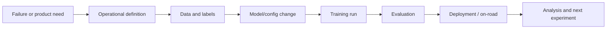

# MLE Role Map

This map explains what a Wayve MLE touches while developing parking/PUDO or driving-feature behavior. It is not an org chart; it is a practical map of responsibilities and handoffs.

## Main Responsibility

An MLE turns a behavior problem into a measured model change. That usually means connecting product intent, data, model architecture, training, evaluation, and deployment into one coherent experiment.

## Knowledge Sources

Use sources in this order:

1. Wiki synthesis pages for orientation.
2. Source summaries for source-backed details.
3. Local code under `/workspace/WayveCode` for implementation truth.
4. Notion docs for design, product, and operational context.
5. Model Catalogue, W&B, Surfboard, Eval Studio, dashboards, and Console for live model/run facts.
6. Slack only when a decision or operational detail is known to live in a thread.

See [[llm_wiki/maps/knowledge-sources|Knowledge Sources]] for source types and caveats.

## Code Areas To Recognize

- `/workspace/WayveCode/wayve/ai/si/` - SI training, configs, CLI, datamodules.
- `/workspace/WayveCode/wayve/ai/zoo/` - model components, adaptors, outputs, deployment wrappers.
- `/workspace/WayveCode/wayve/ai/parking/` - parking notebooks, evaluation, and analysis code.
- `/workspace/WayveCode/wayve/ai/foundation/models/world_model/` - WFM/pretraining area.
- `/workspace/WayveCode/wayve/services/av_test_pipeline/` - AV test and evaluation method surfaces.

Use [[llm_wiki/maps/codebase-map|Codebase Map]] for a fuller map.

## Decisions An MLE Owns Or Shapes

- What behavior are we trying to change?
- Which data examples represent the behavior?
- Which labels or taxonomy categories make the behavior measurable?
- Which model input/output should carry the intent or supervision?
- Which baseline/control makes the experiment interpretable?
- Which metric or event review proves the change helped?
- Which risks should block deployment or require on-road testing?

## Common Failure Modes In MLE Work

- Treating a product ambiguity as a model bug.
- Comparing models without recording data root, binary version, parent checkpoint, and wrapper.
- Assuming PUDO, parking, unparking, and pull-over are interchangeable.
- Trusting run-level model attribution in an interleaved run.
- Using broad intervention/km when a task-specific event metric is needed.
- Adding a new conditioning signal only in BC when it should be aligned earlier in WFM or preserved through RL.

## Useful First Questions

When joining a project or debugging a candidate, ask:

- What is the exact behavior and success criterion?
- Which source says that is the intended behavior?
- Which event table or dashboard measures it?
- Which code path creates the model input or label?
- Which model changed, relative to which control?
- Which evaluation suite is sensitive to this behavior?
- What would invalidate the result?
