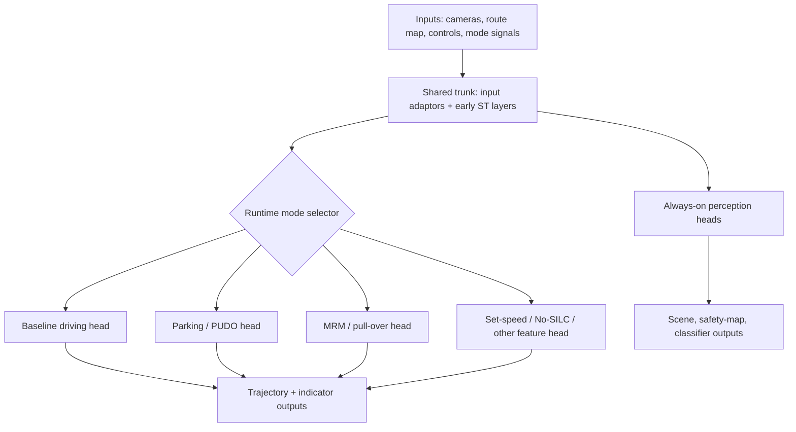
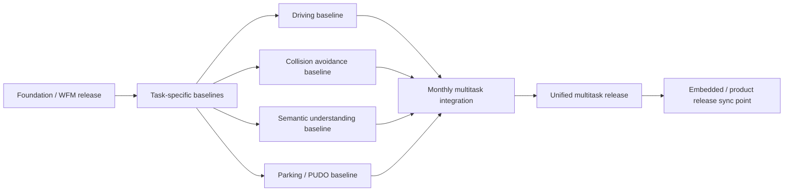

# Drive - Multitask And Multiple Driving Heads

## Sources

- [Multiple Driving Heads - Tech Forum Pre-Read](https://docs.google.com/document/d/1mQs9dxxJ0VwUEAfsGHLwpwVgj3lvjcQE3Y0No7htHrc/edit?tab=t.0#heading=h.b9al0qxx98e2)
- [Multiple driving heads](https://docs.google.com/presentation/d/12tpcS1qH9F9aPjF2qXzpmKeYtpA3KNw3tRDWYtqlJV0/edit?slide=id.g3d84f4801b9_0_5#slide=id.g3d84f4801b9_0_5)
- [AV Engineering Strategy for Post-Training Multitask Models](https://docs.google.com/document/d/1fqWwR4UtlB2UkezGwy2ja8iS0qFNZNIUkecs_HbrUPc/edit?tab=t.0#heading=h.vl11gd9eoyg8)

## Source Status

The multi-head material is proposal/prototype material, not evidence that the architecture is fully adopted in production. The post-training multitask document is strategy material for organizing development around task-specific baselines and monthly integration. Treat both as design direction until confirmed in code, release process, and deployment tooling.

## Core Takeaways

- Wayve is moving from a single end-to-end driving model toward a multi-functional model that must support driving, collision avoidance / geometric reasoning, semantic understanding, and driving features such as parking, PUDO, MRM, No-SILC, set speed, and navigation.
- A single monolithic release train creates integration bottlenecks: each change has to chase a moving baseline, interact with all other tasks, and pass increasingly broad promotion criteria.
- The proposed engineering split is task-specific reference baselines plus a slower multitask integration cycle. Task teams optimize their own baselines, while a dedicated integration function composes them into a unified model.
- Multiple driving heads are one architectural route for isolating mutually exclusive driving modes. A shared trunk computes common representations; a deterministic runtime selector executes one driving head for the current mode.
- Perception-like heads are treated differently from mutually exclusive trajectory heads: they should usually remain always-on and canonical, because their outputs are needed regardless of driving mode.

## Multiple Driving Heads Model

The key latency claim is that only one driving head executes per frame. The runtime cost is approximately `shared trunk + always-on perception heads + max(active driving head)`, not the sum of all driving heads. The memory cost still includes all shipped head weights.

## Development Workflow

The proposed monthly cycle:

- Week 0: release a foundation-model checkpoint.
- Weeks 1-3: task teams build task-specific post-training baselines from the shared foundation model.
- Week 4: integration team combines baselines into a unified multitask model, reconciles recipe differences, tunes losses and data curricula, and manages cross-task regressions.

## Why This Matters For Parking And PUDO

Parking and PUDO are behaviorally different from normal driving:

- low-speed maneuvers,
- gear transitions,
- route-shortening and stop intent,
- hazard / indicator semantics,
- potentially distinct training buckets and validation suites,
- and product-specific notions of success.

In a monolithic model, parking/PUDO changes can regress normal driving even when parking mode is unused. The multi-head proposal tries to make unused parking/PUDO behavior unable to affect baseline driving outputs. The tradeoff is embedded complexity: export, compression, runtime dispatch, state management, and memory.

## Risks And Constraints

- Embedded compilation is a major dependency. Qualcomm has more relevant multi-target precedent than Nvidia in the cited docs.
- Stateful operations in late ST layers complicate head switching. Indicator memory and temporal caches need explicit ownership, preferably in the shared trunk or runtime rather than per-head state.
- Quantization and distillation need head-aware recipes. Shared-trunk quantizers and head-specific quantizers may behave differently.
- Validation does not disappear. It moves from "one giant model" to "task-level gates plus integration gates". The release process must define which regressions block which releases.
- Perception-like tasks should not be duplicated per branch unless the validation burden and output variance are acceptable.

## Evidence For Current Prototype Work

The sources list prototype PRs for frozen policy encoder RL, shared trunk with per-head routing, stitch/deploy CLI work, QNN export/quantization, split-model runtime, generic output adaptor support, and frozen-intermediate worked examples. These are strong signs of active experimentation, but not by themselves proof of a production release path.

## Links Into Wiki

- [[llm_wiki/systems/multi-task-and-multi-driving-heads|Multi-Task And Multi-Driving Heads]]
- [[llm_wiki/systems/parking-and-pull-over|Parking And Pull-Over]]
- [[llm_wiki/systems/parking-model-architecture|Parking Model Architecture]]
- [[llm_wiki/systems/space-time-model-architecture|Space-Time Model Architecture]]
- [[llm_wiki/systems/bc-rl-training|BC And RL Training]]
