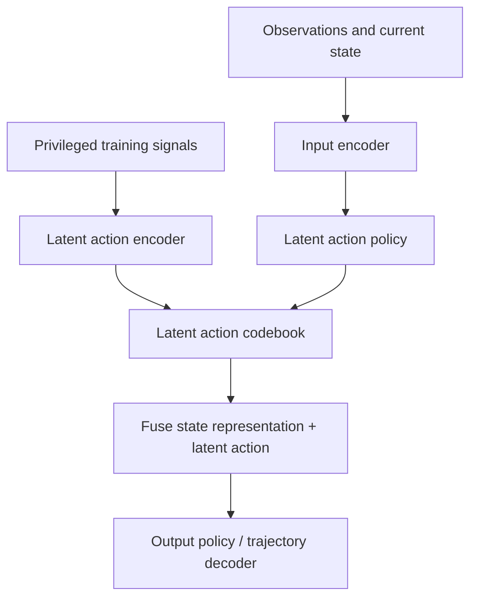

# Notion - Latent Actions, Behavior Control, And Navigation

## Sources

- [Latent Action Models](https://www.notion.so/wayve/Latent-Action-Models-1ec980cd0acb4d1da1b643d108affd31?source=copy_link)
- [ORI Behaviour Optimisation](https://www.notion.so/wayve/ORI-Behaviour-Optimisation-19203da5d69a80b1b98cd5ef20a4fa62?source=copy_link)
- [Navigation Instructions](https://www.notion.so/wayve/Navigation-Instructions-2d103da5d69a80b5b1eac49216b21d82?source=copy_link)
- [Navigation Models](https://www.notion.so/wayve/Navigation-Models-2ae03da5d69a80cca423d45d1d29106f?source=copy_link)
- [ML Guild](https://www.notion.so/wayve/ML-Guild-22b03da5d69a804f80c3dff0e0b95f5e?source=copy_link)

## Source Status

The ORI Behaviour Optimisation page is a historical hub under an outdated parent. Use it as a map to related workstreams, not as current operational authority. ML Guild is a forum for discovery and knowledge sharing; it is not a decision log or blocking review process.

## Latent Action Model Summary

Latent actions are an attempt to model intended behavior between perception and trajectory output. Instead of directly predicting only the final trajectory from observations, the model learns or predicts a compact intent variable and conditions trajectory generation on it.

Key points from the Notion page:

- A latent action can represent target waypoint intent, maneuver class, start/stop, turn, merge, overtake, or wait.
- Spatial latent actions discretize a target location, for example a 2-second future waypoint in an `n x n` grid.
- The latent action codebook can be learned with privileged training information, while inference predicts the latent action from normal model inputs only.
- Multimodality is explicit: the policy can output a distribution over feasible intents.

## Why Latent Actions Matter For Parking/PUDO

Parking and PUDO are intent-heavy. The same visual scene can support driving past, pulling over, parking, or unparking depending on route state, operator controls, destination type, and stop intent. Latent actions could make these alternatives explicit instead of hoping a single trajectory decoder infers intent from weak conditioning.

Potential parking/PUDO uses:

- condition on a short-horizon stop target,
- represent park vs PUDO vs unpark intent,
- separate "where to stop" from "how to maneuver",
- sample candidate maneuver modes before scoring or selecting one,
- expose feasibility of a requested pull-over or parking maneuver.

Risk: the latent action must align with actual downstream control and labels. A latent code that is interpretable in training but not stable under BC/RL or deployment will be difficult to debug.

## Navigation Instructions

MAR supplies navigation instructions in addition to RouteMap. The Notion page describes two major instruction types:

- **Maneuvers**: distance to maneuver, maneuver type, maneuver direction, entry/exit bearing, OSRM step maneuver object.
- **Intersections**: distance to upcoming intersections, number of lanes, valid lanes, active lanes, OSRM lane object.

The current interface compresses upcoming lane information into one model vector. Where lane info is absent, it can be compressed out. Bus lanes are not considered lanes in the described representation.

## Navigation Model Lessons

Navigation failures are a top intervention source. The Navigation Models page captures a multi-quarter history:

- self-hosted Valhalla / OSM routing was introduced after a mapping issue,
- corpus data was backfilled with navigation instructions,
- onboard navigation parsing and DMI entries were implemented,
- a first promotion was rejected because of US regressions and an RL node-count issue,
- a later attempt was rejected because of Japan regression and insufficient quantitative routing improvement,
- including navigation only at BC can conflict with route map,
- including navigation in WFM helped BC use both navigation and route map,
- RL later removed some gains, with a hypothesis around missing/incorrect indicator state for lane-change versus lane-bias behavior.

## Critical Synthesis

Navigation conditioning is not just an input adaptor problem. It is a training-stage alignment problem:

- If navigation is introduced late, the model may treat it as competing with RouteMap.
- If WFM learns navigation jointly with route context, BC can use both signals more coherently.
- RL can erase navigation gains if actor/critic state, indicator memory, and reward signals do not distinguish the behavior being optimized.

For parking/PUDO, this is directly relevant: route shortening, end-of-route triggers, PUDO destination type, and pull-over behavior all sit at the boundary between navigation intent and low-speed maneuvering.

## Links Into Wiki

- [[llm_wiki/systems/latent-actions-and-behavior-control|Latent Actions And Behavior Control]]
- [[llm_wiki/systems/navigation-conditioning|Navigation Conditioning]]
- [[llm_wiki/systems/multi-task-and-multi-driving-heads|Multi-Task And Multi-Driving Heads]]
- [[llm_wiki/systems/parking-product-and-taxonomy|Parking Product And Taxonomy]]
