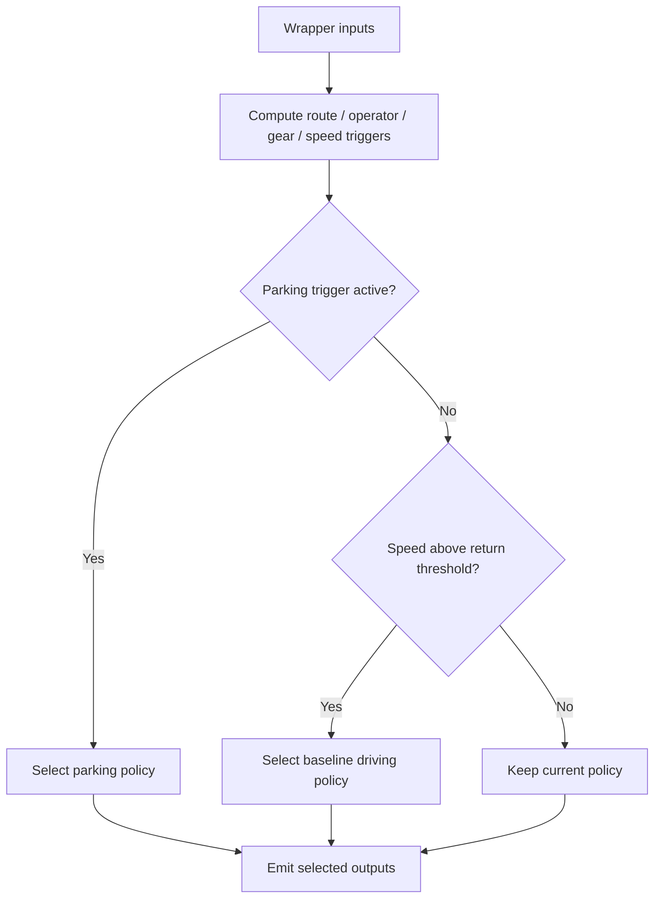
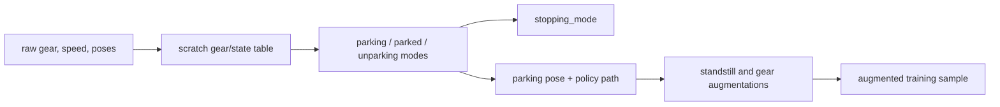

# Notion - Parking Newsletters And Release Tracking

## Sources

- [Newsletter: Interleaving Models in the Parking Deployment Wrapper](https://www.notion.so/30503da5d69a813aa0f7d021923994f5)
- [Newsletter - PUDO/PARK stopping mode](https://www.notion.so/2f403da5d69a818c9fdbefe29a71ed97)
- [Newsletter - Parking WFM Update - project summary](https://www.notion.so/2f403da5d69a81c0ad72e7788fd46b5b)
- [Newsletter: Parking Augmentation Design Walkthrough](https://www.notion.so/33d03da5d69a81728d60e10eafc5cf23)
- [Parking/PUDO model release page](https://www.notion.so/30303da5d69a80da92d5e0a7f8fa38bf)

## Source Status

The newsletters are implementation notes and project summaries. They are useful because they explain why changes were made, but branch names, model nicknames, and exact commands must be checked against current code and Model Catalogue before use.

The WFM update newsletter is archived pending formal WFM release confirmation. Treat it as a known alignment issue, not an active completed migration.

## Interleaving Wrapper

The parking interleaving wrapper ships one model artifact that internally chooses between:

- baseline driving policy,
- parking/PUDO policy.

The decision uses route-completion signals, parking controls, gear state, and speed hysteresis. This lets robot integration see a normal deployment wrapper while policy arbitration happens inside the model artifact.

Key details:

- `route_end_sum_thresh` is the near-end trigger.
- `route_no_sum_thresh` is the effectively-no-route trigger.
- SI medium route config uses a route-map window with 50m behind ego.
- Calibrated conversion in the newsletter: about 230 signal-units per meter.
- Speed switch threshold: 2.235 m/s, about 8 km/h.
- The wrapper currently avoids emitting `interleaved_id` / `interleaved_event` to avoid structured-testing metric collisions.

Critical warning: TorchScript interfaces are fixed. Any change to wrapper type, input signature, or output signature must be reflected in interleaving code at the same time.

## Stopping Mode

`stopping_mode` is a 3-state model input:

- NA,
- PARK,
- PUDO.

The PUDO/PARK newsletter describes mapping onboard DILC toggle to `stopping_mode` and training it on the fly using parking detection plus hazard indicators.

Augmentation rule:

- 90 percent: shorten route polyline to stop index and set `stopping_mode` to PARK or PUDO.
- 10 percent: keep full route and force PARK to preserve baseline behavior.

Critical interpretation: `stopping_mode` and route shortening must tell the same story. If the route still says "keep driving" while the intent says "stop now", the model gets contradictory supervision.

## Parking Augmentation Pipeline

The augmentation walkthrough shows how a simple "neutral gear soon means parking" heuristic grew into a configurable subsystem:

1. compute parking mode,
2. add richer maneuver state: parking, parked, unparking,
3. normalize noisy gear around standstill,
4. compute parking goal pose and policy path,
5. strip leading standstill and clamp policy targets,
6. augment gear labels for parking/unparking edge cases,
7. optionally apply parking-goal dropout,
8. optionally set stopping mode.

Critical notes from the source:

- `parked_mode` vs `parking_mode` semantics can confuse readers.
- Unparking detection can favor reverse-out signatures.
- Random non-parking stop-mode assignment may inject synthetic label noise.
- Augmentation ordering is powerful but easy to regress without contract tests.

## WFM Alignment

The archived WFM update notes say parking training configs had drifted from approved WFM release defaults. The intended fix was to align parking training with the latest approved WFM config and `StBcCfg` defaults, then validate via W&B.

The important lesson for agents is general: parking config drift is a plausible root cause when model behavior changes unexpectedly. Always identify:

- pretrain/WFM config,
- BC training module config,
- data root and binary version,
- route/stopping augmentations,
- gear-label augmentation settings,
- and deployment wrapper.

## Release Tracking

The release page tracks model families, parent relationships, interleaved/available artifacts, commits, binary versions, data roots, mix weights, augmentation settings, and offline/on-road metrics. Use it to understand experiment lineage, but verify final model identity in Model Catalogue before deploying or comparing.

Common ablation dimensions in the release page:

- binary version,
- materialization root type,
- top-level data mix,
- short/very-short bucket fold-in,
- route shortening,
- pre-CA bucket weighting,
- reconstruct gear from speed,
- standstill gear augmentation,
- unparking gear augmentation probability,
- past context seconds,
- gear-label cleanup,
- directional forward/reverse and gear-change buckets.

## Links Into Wiki

- [[llm_wiki/systems/parking-pudo-deployment-and-release|Parking PUDO Deployment And Release]]
- [[llm_wiki/systems/parking-product-and-taxonomy|Parking Product And Taxonomy]]
- [[llm_wiki/systems/parking-pudo-event-pipeline|Parking PUDO Event Pipeline]]
- [[llm_wiki/systems/navigation-conditioning|Navigation Conditioning]]
