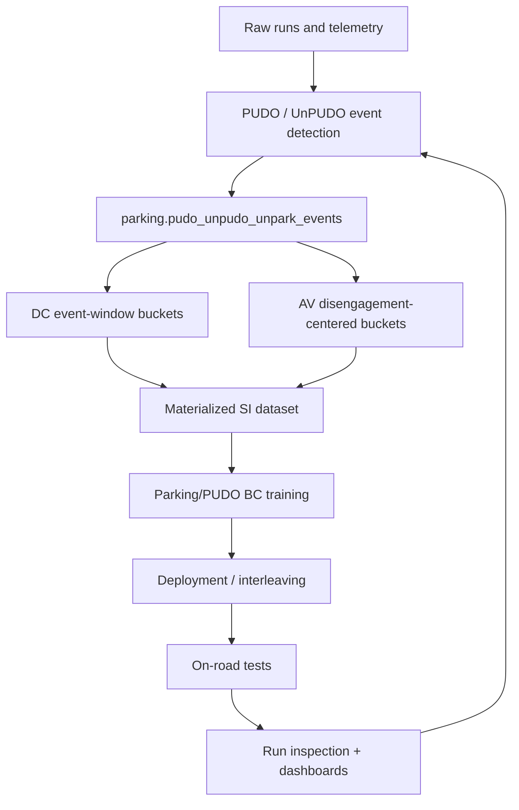

# Notion And Drive - Parking Product, Data, Evaluation

## Sources

- [Team Parking](https://www.notion.so/wayve/Team-Parking-2a603da5d69a80d0b314d24d95efaa41?source=copy_link)
- [Parking/PUDO Model Development and Deployment (SI)](https://www.notion.so/wayve/Parking-PUDO-Model-Development-and-Deployment-SI-2d303da5d69a800c8956cfd9ccaaa8dc?source=copy_link)
- [Evaluation](https://www.notion.so/wayve/Evaluation-2cb03da5d69a80c8ade6e7ba10240586?source=copy_link)
- [PUDO and UnPUDO Event Detection Pipeline](https://www.notion.so/31d03da5d69a8193ab56dc4a12729611)
- [PUDO and UnPUDO Materialization Pipeline](https://www.notion.so/33a03da5d69a8146ae7fe94c053d1b61)
- [Parking Evaluation Notebooks - Data Tables Documentation](https://www.notion.so/2f603da5d69a805c8be6d77683647288)
- [Parking interventions](https://www.notion.so/2c603da5d69a80e1aa2fe95fbb67512b)
- [PUDO less wrong labeling](https://www.notion.so/2f403da5d69a8068ab23e3204a697b50)
- [System Design Overview for Parking/PUDO Features](https://docs.google.com/document/d/19S5azeFAIYO7Bnl5CaJXDGEY0wfieInHH4uC7qrxjvU/edit)
- [Pick-Up and Drop-Off (PUDO) Data Collection SOP](https://docs.google.com/document/d/19_supcKMuus13WO_Ub9s3s-cLXWIpE74Rdv6gveTbBM/edit)
- [Parking/Unpark/PUDO - Taxonomy](https://docs.google.com/spreadsheets/d/1X5BY_0vkRrC1kD37cuFXvwMC9g2mbNYXb4yCUufZHyk#gid=2)

## Parking Team Map

Team Parking is the main hub for parking/PUDO docs. It points to model release tracking, development/deployment docs, newsletters, validation docs, meeting summaries, product docs, and Slack channels. Treat it as the primary source-discovery page for this wiki area.

Core working surfaces:

- model release and model version databases,
- parking/PUDO development and deployment guide,
- parking/PUDO newsletters,
- parking interventions and evaluation pages,
- parking team and cross-functional meeting summaries,
- product/system design docs for APA, P2P, PUDO, PSD, MPA, Park Assist, and RMF integration.

## Product Scope

The product/system-design docs split parking into several related but different capabilities:

- **APA**: automatic parking assist into selected or inferred parking spots.
- **P2P**: parking-lot navigation between points, including search, entry, exit, and spot destination behavior.
- **PUDO**: pick-up/drop-off stop, not long-duration parking.
- **Park Assist / collision awareness**: near-field safety and collision-zone support around parking.
- **PSD**: parking spot detection, likely a perception-style output head.
- **MPA**: memory parking / repeated visual path behavior.
- **RMF pull-over**: risk mitigation stop or pull-over behavior with `MitigationRequest`-style conditioning.

For the user's role, PUDO and RMF/pull-over are adjacent: both require a model to leave normal lane-following behavior and execute a safe stop under intent conditioning.

## Parking/PUDO IO

The product and SI docs name these important inputs and outputs:

- `INITIATE_AUTO_PARKING`: activation or operator-triggered parking/PUDO behavior.
- `PARKING_DIRECTION`: parking maneuver preference, such as head/tail first.
- `ENABLE_SHIFT_BY_WIRE`: enables gear-output path to affect the vehicle.
- gear state / gear direction input and gear state output.
- parking spot selection or target location, where available.
- destination preference / stopping intent, for example PUDO vs parking vs charging vs MRM.
- `stopping_mode`: a 3-state NA/PARK/PUDO input from the PUDO/PARK newsletter.

## Data Collection And Labels

The PUDO SOP says PUDO should simulate ride-hail pick-up/drop-off behavior: convenient, fast, safe, and natural. It is explicitly not parking. The car should stop briefly, typically with hazards while stopped, and then merge back into traffic.

Collection should cover:

- airports, stations, hotels, malls, hospitals, schools, urban curbs,
- dedicated drop-off lanes and curbside areas,
- double-parking where no curb space is available,
- lane changes into drop-off lanes,
- varied curb geometry and dynamic density,
- interaction with bikes, taxis, buses, pedestrians, and doors opening near traffic.

The system-design doc lists approximate target volumes of 50k PUDO maneuvers, 50k parking maneuvers, and 50k P2P maneuvers, marked TBD in the source.

## Taxonomy

There are two taxonomy layers:

- operational taxonomy and intervention labels, which affect VSO/QM labeling and dashboard interpretation;
- less-wrong labels, which are used to form Shadow Gym-style counterfactual tests.

Current spreadsheet categories group failures into PUDO, Unpark, and Park. The spreadsheet was modified on 2026-05-21, making it more current than the older Notion V10 request page, which is marked Outdated.

Representative PUDO categories:

- stop position / incorrect stop location,
- lane merge / incorrect lane,
- unsafe stop side,
- hesitation or no stop,
- overshoot / approach speed,
- dynamic and static safety conflict,
- wrong behavior mode,
- indicator / hazard / gear-shift issues.

Representative Park categories:

- slot selection,
- static/dynamic obstacle,
- space or clearance constraint,
- late/early/wrong turn,
- maneuver comfort,
- trajectory/control error,
- parking quality degradation,
- illegal parking location.

Representative Unpark categories:

- no safe gap,
- blocked by static or dynamic obstacles,
- limited visibility,
- poor initial pose,
- hesitation,
- wrong mode,
- gear shift and signaling errors.

## Data And Evaluation Flow

## Development/Deployment Flow

The SI guide describes parking/PUDO models as trained from a pretrain model with a single BC stage, plus added parking/PUDO buckets and new input/output adaptors. The workflow is:

1. prepare or materialize data,
2. update configs,
3. dispatch training,
4. deploy model,
5. inspect model,
6. run model licensing and Shadow Gym,
7. request on-road experiments,
8. inspect runs and feed failures back into data/evaluation.

## Critical Notes

- PUDO is not just "parking near the road". It has distinct stop-duration, legality, comfort, signaling, and passenger-egress semantics.
- Event detection is anchor-based and heuristic; dashboard success rates inherit those assumptions.
- Model assignment for events must be event-time, not run-level, because interleaving can switch models within a run.
- Taxonomy pages can be outdated. Prefer the current spreadsheet for category names, and use Notion proposal pages for rationale/history.
- Route shortening and `stopping_mode` are part of the data story, not cosmetic model inputs. If they disagree, the model can learn inconsistent stop intent.

## Links Into Wiki

- [[llm_wiki/systems/parking-product-and-taxonomy|Parking Product And Taxonomy]]
- [[llm_wiki/systems/parking-pudo-event-pipeline|Parking PUDO Event Pipeline]]
- [[llm_wiki/systems/parking-pudo-deployment-and-release|Parking PUDO Deployment And Release]]
- [[llm_wiki/systems/parking-model-architecture|Parking Model Architecture]]
- [[llm_wiki/systems/parking-data-and-labels|Parking Data And Labels]]
- [[llm_wiki/systems/evaluation-and-model-ci|Evaluation And Model CI]]
