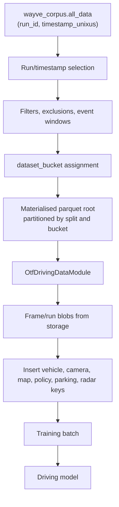

# Data and Materialisation

## Working Synthesis

Wayve training data should be understood as a two-layer system:

- Materialised datasets select examples and assign bucket metadata.
- On-the-fly dataloading uses those lightweight rows to fetch and assemble full tensors for model training.

This split matters because model behavior can change through bucket selection and datapipe insertion even when architecture and losses are unchanged.

## Data Flow



## Materialised Dataset

The Notion training page describes materialised datasets as parquet tables with `run_id`, `timestamp_unixus`, `dataset_split`, and `dataset_bucket`. The SI materialisation README describes the workflow as selecting data points, pulling run data, applying filters, generating buckets, combining/shuffling, and writing parquet files.

Practical implications:

- Buckets are part of the training recipe, not just bookkeeping.
- Bucket weights in a datamodule define the behavior distribution seen by training.
- A materialised root is a versioned data artifact and should be cited in training notes.
- Bucket counts are often timestamp-row counts, not unique event counts.

## OTF Datamodule

`OtfDrivingDataModule` takes materialised rows and assembles real tensors at training time. It can insert many data families:

- Camera/image and calibration tensors.
- Vehicle state such as speed, curvature, pose, and gear.
- Route, map, speed-limit, and navigation tensors.
- Policy supervision.
- Intervention and provenance data.
- Radar/lidar data when configured.
- Parking-specific keys when `ParkingDataConfig` is active.

This means a training config is incomplete until you inspect both the materialised root and the datamodule insert path.

## Bucket Review Checklist

For any model run, record:

- Materialised root path.
- Bucket group or datamodule name.
- Split strategy.
- Bucket names and weights.
- Time window and country/platform scope.
- Event filters and exclusions.
- Any sampling masks around interventions, CA, pre-CA, or DC.
- Validation buckets and whether they mirror training buckets.

## Common Commands

Local materialisation debug:

```bash
bazel run //wayve/ai/si/materialisation:debug -- test_get_run_ids ...
```

Remote materialisation:

```bash
bazel run //wayve/ai/si/materialisation:workflow -- remote run materialise_dataset_workflow ...
```

Parking materialisation example:

```bash
bazel run //wayve/ai/si/materialisation:workflow -- remote run materialise_dataset_workflow --bucket_group parking_buckets_bc --vehicle_platforms partner_mb,gen2,ipace ...
```

## Critical Risks

- A bucket count increase may be duplicated windows, not more unique events.
- CA/pre-CA buckets and DC buckets can encode different semantics and should not be merged casually.
- A training run can point at the right root but use the wrong datamodule group weights.
- A datamodule can delegate to a simpler insertion path and bypass more complex SI augmentations.
- A parking label generated from hazards may not match a product-level destination-defined PUDO event.

## Related Pages

- [[llm_wiki/systems/parking-data-and-labels|Parking data and labels]]
- [[llm_wiki/workflows/parking-development-workflow|Parking development workflow]]
- [[llm_wiki/workflows/training-a-driving-model|Training a driving model]]
