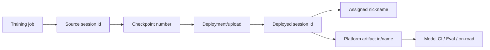

# Deployment and Model Catalogue

## Working Synthesis

Training produces checkpoints; deployment turns one checkpoint into a robot/evaluation-consumable artifact with recorded metadata, input/output keys, wrapper behavior, platform artifact names, and Model Catalogue identity.

For parking/PUDO, deployment is not just "upload the checkpoint." It often creates an interleave-control model, adds parking notes, validates gear-direction support, triggers Model CI, and updates the release row.

## Identity Chain

## Model Catalogue Concepts

Record these identifiers in every durable candidate note:

- Source training session id.
- Source checkpoint number.
- Source/trained model nickname.
- Deployed session id, if different.
- Deployed model nickname.
- Platform artifact name and artifact id.
- Commit and branch used for the source model.
- Console note or release row link.

The distinction between source checkpoint number and deployed checkpoint number matters. A deployed interleave-control upload may have its own checkpoint numbering even when it is based on a later source checkpoint.

## Parking Deployment Specifics

Parking deployment skills expect:

- Resolve the latest or explicit checkpoint.
- Deploy with interleave control group `parking`.
- Resolve the actual deployed nickname after upload.
- Update the Parking/PUDO release row in Notion unless explicitly skipped.
- Add a standard model note: `Parking/PUDO model`, interleave control group, and source model.
- Trigger Gen2 AV Mache Alpha 3 Model CI.
- Run parking-specific follow-up evaluations.

In code, `prepare_deployment_model` also selects parking deployment wrapper logic and guards against missing gear-direction support where required.

## Common Artifact Names

Skill docs list examples:

| Platform | Artifact name |
| --- | --- |
| Jetson Orin | `jetson-orin_linux_10.7.0.trt` |
| Drive Orin | `drive-orin_linux_10.9.0.trt` |
| RTX6000 | `rtx6000_linux_10.9.0.trt` |
| H100 | `h100_linux_10.9.0.trt` |
| TorchScript | `gen2.torch` |

Always resolve the actual artifact id from Model Catalogue or Console before creating CI or on-road payloads.

## Deployment Failure Modes

- Deploying the wrong checkpoint because "latest" was inferred from UI order rather than max checkpoint number.
- Confusing source nickname with deployed interleave-control nickname.
- Missing gear-direction head for a parking wrapper.
- Triggering Model CI on the source artifact instead of the deployed artifact.
- Forgetting the Console note that downstream licensing flows expect.
- Assuming Shadow Gym or Eval Studio results apply to a different artifact.

## Related Pages

- [[llm_wiki/systems/model-vehicle-interface|Model-vehicle interface]]
- [[llm_wiki/systems/evaluation-and-model-ci|Evaluation and Model CI]]
- [[llm_wiki/workflows/parking-development-workflow|Parking development workflow]]
