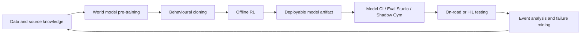

# End-to-End Driving Stack

## Working synthesis

Wayve's driving model is described here as an end-to-end neural network stack whose operational output is the driving trajectory itself. In the user-provided scope for this wiki, the model does not expose object detection, lane detection, or a traditional hand-authored planning stack as the primary interface for driving decisions.

The development pipeline has three major training stages:

1. [[llm_wiki/systems/world-model-pretraining|World model pre-training]]
2. [[llm_wiki/systems/bc-rl-training|Behavioural cloning]]
3. [[llm_wiki/systems/bc-rl-training|Reinforcement learning]]

The SI README confirms that the current baseline training recipe is split into world foundational model pre-training, BC, and RL, and notes that BC and RL are supported directly in the SI codebase. WFM pre-training lives under the foundation world-model code area.

## Lifecycle view

## Core Idea

The system should be understood as a learned driving policy stack:

- Inputs: camera/video context plus structured driving context, depending on model and config.
- Representation: world-model or SI model backbone, often with space-time modeling.
- Outputs: future trajectory or action-related outputs, plus auxiliary heads where configured.
- Training: pre-training for representation/world modeling, then BC/RL for driving behavior.
- Evaluation: offline metrics, simulation/evaluation suites, Model CI, Shadow Gym, HiL, and on-road analysis.

The current architecture pages break this down into implementation layers:

- [[llm_wiki/systems/model-vehicle-interface|Model-vehicle interface]] explains robot/model input and output keys.
- [[llm_wiki/systems/space-time-model-architecture|Space-time model architecture]] explains the input-adaptor to ST-encoder to output-head path.
- [[llm_wiki/systems/data-and-materialisation|Data and materialisation]] explains how corpus rows become training batches.
- [[llm_wiki/systems/deployment-and-model-catalogue|Deployment and Model Catalogue]] explains how checkpoints become deployable artifacts.

## Key code anchors

- `/workspace/WayveCode/wayve/ai/foundation/models/world_model/` - WFM pre-training stack.
- `/workspace/WayveCode/wayve/ai/si/` - SI BC/RL training and development stack.
- `/workspace/WayveCode/wayve/ai/zoo/st/` - space-time model and input adaptor components.
- `/workspace/WayveCode/wayve/ai/zoo/outputs/` - output heads and adaptors.
- `/workspace/WayveCode/wayve/ai/parking/` - parking evaluation, notebooks, and analysis tools.

## Parking relevance

Parking and robotaxi pull-over are capability workstreams inside the larger end-to-end stack. They need:

- Data definitions for PUDO, UNPUDO, unparking, stopping, and route/end-of-route contexts.
- Datamodule and training mix changes.
- Model heads or input adaptors when behavior needs new conditioning or outputs.
- Evaluation suites that isolate parking and pull-over failures.
- On-road experiment design and post-run event analysis.

Related page: [[llm_wiki/systems/parking-and-pull-over|Parking and pull-over]].

## Source gaps

- Need a source-backed page for active pull-over code paths and metrics.
- Need a concrete current release config selected as the canonical architecture graph.
- Need current RL reward/state/action details.
