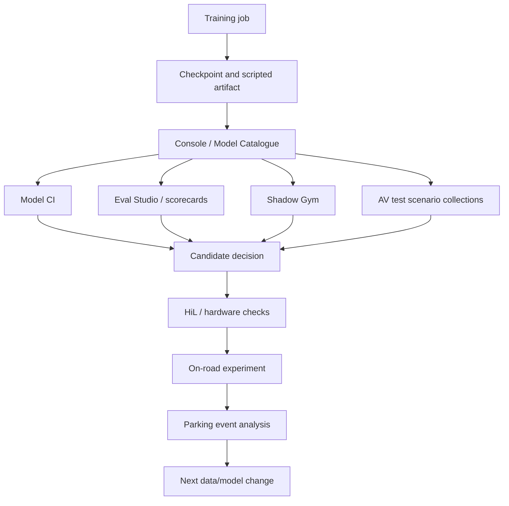

# Evaluation and Model CI

## Evaluation Layers

Evaluation is a stack, not one number. For parking/PUDO, each layer answers a different question:

| Layer | Question | Risk if skipped |
| --- | --- | --- |
| Training/validation metrics | Did the optimization behave and improve expected losses? | Bad runs reach expensive eval. |
| Model CI | Does the uploaded artifact pass standard checks for target vehicle models? | Broken artifacts or regressions enter release flow. |
| Eval Studio / scorecards | How does the model compare on curated test suites? | Improvements are anecdotal. |
| Shadow Gym | How does the model behave in open-loop replay/gym scenarios? | Scenario failures are missed. |
| AV test simulation | How does the model perform across scenario collections with pass/fail criteria? | Segment-level failure rates are unknown. |
| HiL / on-device | Does runtime, compilation, and hardware behavior hold? | Latency or artifact issues are hidden. |
| On-road | Does the model work under operational constraints? | Offline wins fail in real traffic/task context. |
| Event analysis | Why did specific PUDO/UNPUDO/pull-over events succeed or fail? | The next data/model change is poorly targeted. |

## Flow

## Model CI

SI configs expose a `model_ci` block with fields such as:

- `enabled`
- `is_off_road_eval_only`
- `target_vehicle_models`

Parking deployment skills expect Gen2 AV Mache Alpha 3 Model CI for deployed parking artifacts. The deploy flow should record both source/trained model identity and deployed interleave-control identity so Model CI results are attached to the correct artifact.

## Shadow Gym

Shadow Gym is useful for replay/gym-style checks, but Notion discovery found a key limitation: it is open loop and not sensitive to inference latency. Therefore:

- Use Shadow Gym for behavioral scenario signals.
- Do not use Shadow Gym alone to clear on-device runtime risk.
- Escalate to HiL or artifact/runtime checks when temporal cache, TRT, or latency is relevant.

## AV Test Multi-Model Stats

The `av-test-multi-model-stats` skill expects model nicknames and scenario collections, then produces:

- Per model x scenario collection stats.
- Aggregated stats across collections.
- Requested segments, simulation successes/errors, pass/fail/mixed segments, row pass rate, and segment success rate.

For parking/PUDO, this is the right place to compare candidates after Model CI and before on-road decisions, assuming the scenario collections cover the target behavior.

## Event Analysis

The `parking-event-analysis` skill focuses on PUDO/UNPUDO by default. It resolves:

- Event rows from `parking.pudo_unpudo_unpark_events`.
- Destination/task context.
- Driver transcript evidence.
- Gear, indicator, speed, acceleration, and intervention evidence.
- Success/failure classification and issue categories.

This closes the loop from aggregate metrics to actionable data/model changes.

## Open Evaluation Questions

- Which Eval Studio suites are mandatory for parking release candidates?
- Which scenario collections specifically cover pull-over versus PUDO?
- Which Model CI failures block promotion versus trigger follow-up only?
- Which event-analysis classification version is current?

## Related Pages

- [[llm_wiki/systems/deployment-and-model-catalogue|Deployment and Model Catalogue]]
- [[llm_wiki/workflows/parking-development-workflow|Parking development workflow]]
- [[llm_wiki/workflows/on-road-experiment-workflow|On-road experiment workflow]]
