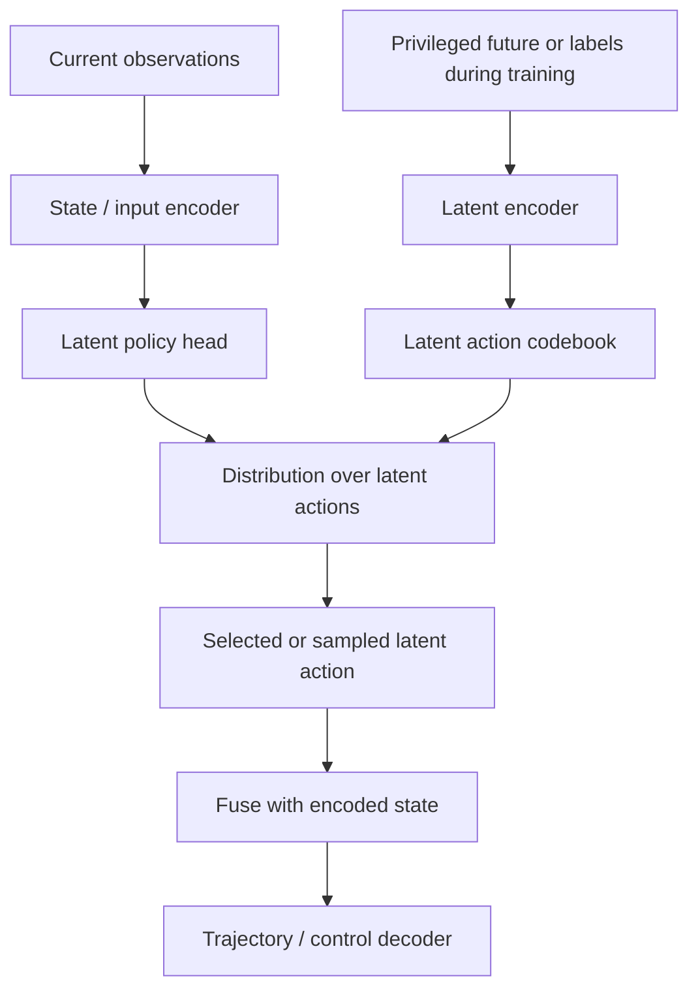
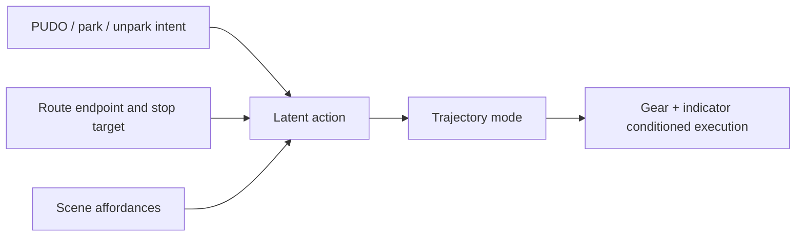

# Latent Actions And Behavior Control

## Definition

A latent action is a compact representation of intended future behavior between state encoding and trajectory decoding. In Wayve's end-to-end setting, it can act as an internal intent variable: the model first decides a coarse maneuver or target mode, then conditions trajectory output on that intent.

## Architecture Pattern

During training, privileged information can define or learn the latent action. During inference, only available inputs can predict it. This lets training use future trajectory, maneuver labels, or target waypoints without requiring those privileged signals at runtime.

## Spatial Latent Actions

The simplest parking-relevant variant is a spatial latent action:

- discretize a short-horizon future target location, often around a 2-second target waypoint,
- predict a probability distribution over target cells,
- condition the trajectory decoder on the selected cell or embedding,
- optionally expose feasibility by inspecting the distribution mass.

This is attractive because it minimally changes the output adaptor and can fall back to normal trajectory prediction if the intent signal is ignored.

## Parking/PUDO Interpretation

Parking/PUDO problems often decompose into:

1. Should the vehicle continue driving, pull over, park, unpark, or stop in lane?
2. Where should the vehicle aim to stop or exit?
3. Which low-speed path should it execute?
4. Which gear and indicator/hazard states are required?

Latent actions mainly address questions 1-3. Gear and signaling still need explicit IO, labels, losses, or post-processing.

## Failure Modes To Watch

- Latent actions that collapse to common driving modes and ignore rare parking/PUDO events.
- A codebook that is interpretable offline but not controllable at inference.
- Conflicting intent sources: route map, navigation instructions, DILC toggles, `stopping_mode`, and wrapper interleaving triggers.
- RL stages that optimize away BC-learned intent behavior because the critic cannot distinguish lane bias, lane change, pull-over, and park/unpark states.

## Agent Guidance

When investigating latent-action code or configs:

- identify whether the latent is supervised, self-supervised, VQ/VAE-style, or hand-discretized,
- check which privileged labels or future trajectory signals define it,
- trace whether it survives BC and RL stages,
- inspect whether parking/PUDO buckets are frequent enough for the latent policy to learn those modes,
- verify how intent is exposed in deployment, if at all.

## Sources

- [[llm_wiki/sources/2026-05-24-notion-latent-actions-navigation-behavior|Notion - Latent Actions, Behavior Control, And Navigation]]
- Related: [[llm_wiki/systems/parking-model-architecture|Parking Model Architecture]], [[llm_wiki/systems/navigation-conditioning|Navigation Conditioning]]
