# Model-Vehicle Interface

## Mental Model

The deployable driving model is a function from robot-provided driving context to robot-consumed driving outputs. The end-to-end claim is not that the model has no internal structure; it is that the external driving decision interface is a learned policy that produces action/trajectory outputs rather than exposing a hand-authored perception/planning cascade.

For an MLE, this means every model change should be traceable through four questions:

1. Which input key does the robot or data loader provide?
2. Which adaptor turns that input into model tokens?
3. Which output key or head supervises the behavior?
4. Which deployment wrapper or robot consumer expects the result?

## Interface Flow

```mermaid
flowchart LR
    robot["Robot software / dataset replay"] --> inputs["Input dictionary"]
    inputs --> validate["interfaces_v2 valid input keys"]
    validate --> adaptors["Input adaptors"]
    adaptors --> model["Space-time driving model"]
    model --> heads["Output adaptor and heads"]
    heads --> outputs["Output dictionary"]
    outputs --> wrapper["Deployment wrapper"]
    wrapper --> robot2["Robot consumer / evaluator"]
```

## Input Families

The interface source and model builder show these important input families:

| Family | Examples | MLE concern |
| --- | --- | --- |
| Camera/video | images, timestamps, intrinsics, extrinsics, distortion | Camera count, frame count, temporal stride, preprocessing, temporal cache. |
| Vehicle state | speed, curvature, pose, orientation, gear direction | Units, sign conventions, standstill behavior, missing values. |
| Map/route | route map, speed limit, route polyline, navigation instructions | Whether the map says to continue, stop, shorten, or end. |
| Driver/control state | indicator, set speed, DILC/driving controls, automation state | Which bits represent intent versus historical action. |
| Domain/context | country, driving side, vehicle model | Whether data and deployment target match. |
| Capability intent | parking mode, stopping mode, mitigation request | Whether labels and deployment overrides agree. |
| Sensor variants | radar, lidar | Whether fusion is early, late, cached, or disabled. |

## Mandatory Outputs

`interfaces_v2.py` identifies core policy outputs such as:

- `policy_time_delta`
- `policy_indicator_weights`
- `policy_waypoints`
- `policy_covariances`

These are the minimum driving outputs to check when asking whether a model artifact is compatible with a robot or evaluation path. Additional heads can be present for training, evaluation, or deployment wrappers, but missing mandatory policy outputs usually means the model cannot be consumed as a normal driving artifact.

## Parking-Relevant Outputs

Parking/PUDO work often requires extra outputs or semantics:

- Future waypoints must represent stopping, pull-over, and low-speed maneuver geometry.
- Indicator weights matter because hazard/indicator behavior can encode PUDO or parking intent.
- Gear-direction output is required by parking deployment wrappers that need model-predicted gear behavior.
- Waypoint covariance/log variance can be used by losses and uncertainty-aware evaluation.

## Debug Checklist

When a model behaves oddly in evaluation or deployment:

- Check the artifact's recorded input/output keys.
- Check whether the deployed wrapper expects a head that the model config did not enable.
- Check whether the datamodule produces the input key for both train and validation.
- Check whether the deployment wrapper can synthesize or override the key at test time.
- Check whether missing-input handling maps to a true unavailable token or a learned value.

## Failure Modes

- A config enables an input adaptor, but the datapipe does not insert that key.
- A training label uses one enum while the adaptor expects another.
- A deployment wrapper expects gear output but the output adaptor did not enable the gear-direction head.
- A local test injects a direct override, but on-road deployment relies on a DILC or robot-control signal.
- Shadow/offline evaluation provides clean keys that on-vehicle logging or runtime does not.

## Related Pages

- [[llm_wiki/systems/space-time-model-architecture|Space-time model architecture]]
- [[llm_wiki/systems/parking-model-architecture|Parking model architecture]]
- [[llm_wiki/systems/deployment-and-model-catalogue|Deployment and Model Catalogue]]
