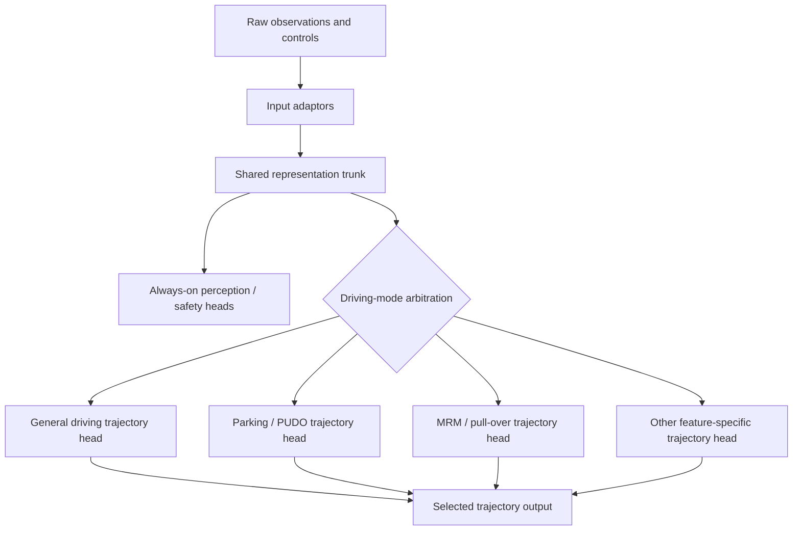

# Multi-Task And Multi-Driving Heads

## What Problem This Solves

Wayve's model development is moving beyond a single trajectory-only driving objective. L2+ NoA and related features require trajectory generation, collision avoidance, semantic understanding, navigation behavior, parking/PUDO, and other behavior-conditioning capabilities to coexist. A single monolithic release path makes every feature change interact with every other capability and forces teams to chase a moving baseline.

Multi-task post-training and multi-driving-head architectures are two related responses:

- **Multi-task post-training**: organize development around task-specific reference baselines and integrate them into a unified release on a slower cadence.
- **Multiple driving heads**: split the model after a shared trunk and route each frame through one mode-specific trajectory head.

## Conceptual Architecture

The shared trunk should contain representations that are useful across tasks. Mode-specific heads should contain behavior specialization, output decoding, and recipe differences. Always-on perception-like heads should remain canonical where possible so downstream systems do not see different semantic outputs depending on active driving mode.

## Development Model

Recommended interpretation for agents:

- Do not treat a parking/PUDO experiment as "just a config tweak". It can change data mix, route conditioning, gear labels, output heads, deployment wrappers, and evaluation.
- Keep task-specific comparisons isolated first. A poor single-task signal is unlikely to become good just because it is mixed into a larger model.
- When a feature depends on a conditional input, first ask whether the input belongs in the task head, shared trunk, WFM, or runtime wrapper. The wrong placement can create conflict between training stages.

## Relationship To Parking/PUDO

Parking/PUDO are especially good candidates for isolation because:

- they are mostly mutually exclusive with normal high-speed driving,
- they use distinct control inputs such as `INITIATE_AUTO_PARKING`, `PARKING_DIRECTION`, `ENABLE_SHIFT_BY_WIRE`, and `stopping_mode`,
- they require gear-state output and gear-label supervision,
- their data distribution is concentrated around stop, park, unpark, and pull-over events,
- their success criteria are product-specific and often not captured by general driving intervention/km.

Current deployed parking/PUDO work also uses an interleaving wrapper, which is a runtime artifact-level alternative to a true shared-trunk multi-head model.

## Critical Open Design Questions

- Where should temporal state live? Per-head state makes switching hard; shared-trunk or runtime-owned state is easier to reason about.
- How many heads fit in embedded memory budgets once quantized weights, activations, and runtime buffers are included?
- What is the release gate for a head that is unused in normal driving but loaded on the vehicle?
- Can a head be retrained independently without changing shared trunk representations?
- How are always-on perception and safety outputs kept canonical when driving heads are split?
- When should a feature become a head versus a conditional input to an existing head?

## Practical Rule Of Thumb

Use a separate head or wrapper when a feature is mutually exclusive, has a distinct evaluation surface, and needs rapid iteration without baseline-driving regressions. Prefer conditioning in the shared model when the feature is always relevant, interacts continuously with driving, or needs shared temporal state.

## Source Notes

- Source-backed summary: [[llm_wiki/sources/2026-05-24-drive-multitask-and-multi-heads|Drive - Multitask And Multiple Driving Heads]]
- Related concepts: [[llm_wiki/systems/latent-actions-and-behavior-control|Latent Actions And Behavior Control]], [[llm_wiki/systems/navigation-conditioning|Navigation Conditioning]], [[llm_wiki/systems/parking-pudo-event-pipeline|Parking PUDO Event Pipeline]]
