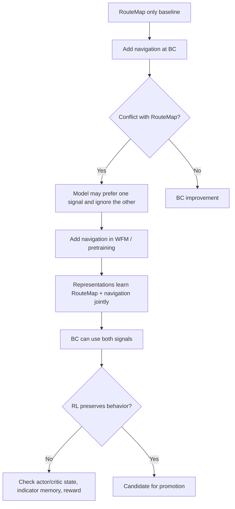

# Navigation Conditioning

## Why It Matters

Navigation is one of the main ways the model receives intent. For normal driving, it tells the vehicle which route to follow. For parking/PUDO and pull-over, route state and route endpoints often become behavioral triggers: near the destination, the model should stop, park, pull over, or hand off to a parking policy.

## Inputs

The Notion navigation docs describe navigation instructions from MAR in addition to RouteMap:

- maneuver distance, type, direction, entry bearing, exit bearing,
- upcoming intersection distance,
- number of lanes,
- valid and active lanes,
- OSRM step/lane references.

These are compressed into vector inputs for the model. Missing lane information can disappear during compression, so absence of signal is not necessarily a reliable semantic "no lanes" input.

## Training-Stage Lesson

The key lesson is that adding a new conditioning signal late can create competition with existing conditioning. WFM-stage exposure can make the signal more compatible with learned route-map features.

## Parking/PUDO Implications

Parking and PUDO use navigation-like intent in several ways:

- route shortening to the stop point,
- end-of-route and no-route triggers in interleaving wrappers,
- destination preference such as PUDO, parking, charging, or MRM,
- stop-zone side and position,
- planned trip destination context.

For agents, this means a parking failure can be caused by:

- bad route/destination conditioning,
- bad stop intent (`stopping_mode` or DILC mapping),
- missing route-shortening augmentation,
- route-map/navigation conflict,
- wrapper trigger thresholds,
- or the parking policy itself.

Do not assume the trajectory decoder is the root cause until input intent and route context are checked.

## Metrics

The navigation sources call out two high-level validation metrics:

- navigation interventions per kilometer,
- navigation failure rate per navigation command.

For parking/PUDO, analogous metrics should separate:

- route/destination intent errors,
- mode errors,
- maneuver quality errors,
- gear/signaling errors,
- and safety conflicts.

## Sources

- [[llm_wiki/sources/2026-05-24-notion-latent-actions-navigation-behavior|Notion - Latent Actions, Behavior Control, And Navigation]]
- Related: [[llm_wiki/systems/parking-product-and-taxonomy|Parking Product And Taxonomy]], [[llm_wiki/systems/parking-pudo-event-pipeline|Parking PUDO Event Pipeline]]
