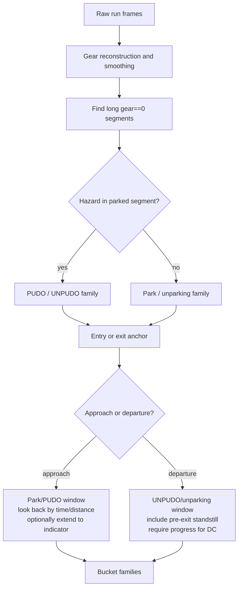

# Parking Data and Labels

## Event Taxonomy

Parking/PUDO data currently revolves around four event families:

| Event | Plain meaning | Typical window |
| --- | --- | --- |
| `park` | Approach into a non-hazard parked/neutral stop. | Backward approach window into `gear == 0`. |
| `pudo` | Approach into a hazard-associated stop for pick-up/drop-off. | Backward approach window into `gear == 0`. |
| `unparking` | Departure from a normal parked segment. | Pre-exit standstill plus departure window. |
| `unpudo` | Departure from a hazard-associated PUDO stop. | Pre-exit standstill plus departure window. |

This taxonomy is implementation-facing. Product-facing robotaxi pull-over may need a stricter definition using task destination, route progress, legal stop context, and passenger state.

## Event Detection Graph

## Current Code Semantics

`ParkingDataConfig` and related insertion code generate several labels:

- `PARKING_MODE`: whether the sample is in a parking approach context.
- `UNPARKING_MODE`: whether the sample is in an unparking departure context.
- Parking start/end deltas and goal distance.
- `VEHICLE_GEAR_DIRECTION` and `POLICY_GEAR_DIRECTION`.
- `STOPPING_MODE`: current code uses `0=UNAVAILABLE`, `1=PUDO`, `2=PARK`.
- Parking pose and policy path variants where configured.

Important code behavior:

- Parking entry is found around long neutral/park segments.
- Current reverse-out unparking is detected; forward unparking is deliberately not detected in the inspected code because forward gear can be normal driving.
- Gear reconstruction derives drive/reverse from signed speed and preserves long P/N segments.
- If not in parking mode, stopping mode may be randomized between PUDO and PARK to avoid training normal driving to rely on the intent token.
- If in parking mode, hazard indicator maps to PUDO and no hazard maps to PARK.

## Bucket Families

Generic materialisation newsletters describe these bucket families:

| Pattern | Meaning |
| --- | --- |
| `dc_{event}_{country}` | Main direct-control all-direction event bucket. |
| `dc_{event}_{country}_forward` | Directional variant using entry gear for park/PUDO or exit gear for UNPUDO/unparking. |
| `dc_{event}_{country}_reverse` | Reverse directional variant. |
| `dc_{event}_{country}_gear_change` | Frames near smoothed gear-change boundaries. |
| `pre_ca_{event}_{country}` | Event-window frames before a valid intervention. |
| `ca_short_{event}_{country}` | Event-window frames immediately after intervention. |
| `ca_long_{event}_{country}` | Later corrective-action frames inside the event window. |

For DC departure buckets, a future-speed filter can require movement around `+0.60s`. CA/pre-CA buckets intentionally avoid this because non-movement can be the failure.

## Notebook Versus Generic Materialisation

The generic path is not guaranteed to match older notebook event tables:

- Generic uses hazard presence in the parked segment to split PUDO from park.
- Notebook/event-table workflows may use richer trip, destination, and disengagement context.
- Generic counts are timestamp rows per bucket; a single event can contribute to multiple bucket variants.

Use the generic path for repeatable data builds, but compare against `parking.pudo_unpudo_unpark_events` when validating semantics.

## Pull-over Gaps

Pull-over is adjacent but not identical to PUDO. The wiki has not yet found an authoritative pull-over taxonomy. Candidate dimensions:

- Is the stop tied to passenger pick-up/drop-off, route end, ride-hail task state, or a generic safe stop?
- Does success require hazard indication?
- Does success require proximity to a destination or legal curb area?
- Are standstill, gear, and indicator expectations different for pick-up versus drop-off?

## Related Pages

- [[llm_wiki/systems/parking-model-architecture|Parking model architecture]]
- [[llm_wiki/systems/data-and-materialisation|Data and materialisation]]
- [[llm_wiki/workflows/parking-development-workflow|Parking development workflow]]
