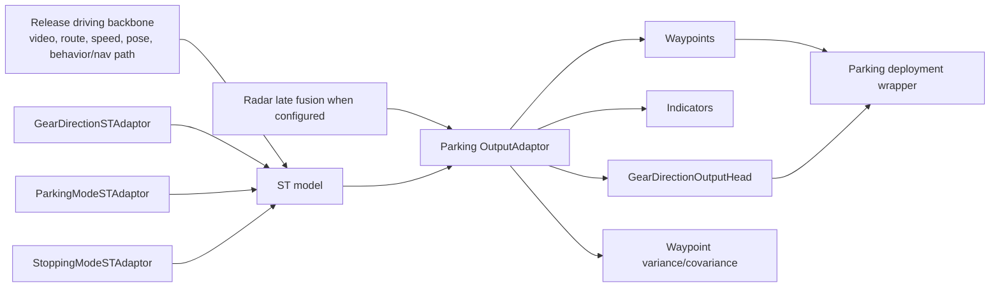

# Parking Model Architecture

## What Changes For Parking/PUDO

Parking/PUDO models should be read as release driving models with targeted changes to data mix, conditioning inputs, output heads, and deployment wrappers. The strongest recurring pattern in the inspected sources is: keep the release driving path intact, then add parking-specific IO and training data.

## Component Graph

## Inputs

Parking/PUDO-specific inputs:

- `parking_mode`: tells the model that the sample belongs to a parking-style approach context.
- `stopping_mode`: distinguishes PUDO from PARK in current code with `0=UNAVAILABLE`, `1=PUDO`, `2=PARK`.
- `gear_direction`: exposes current/past gear direction and helps low-speed maneuver reasoning.

Related release inputs that must remain coherent:

- Route/map/navigation instructions.
- Indicator state.
- Speed and curvature.
- Pose/orientation.
- Radar late-fusion tokens when enabled.

## Outputs And Losses

Parking output adaptor configs can include:

- Waypoint output and waypoint likelihood/log variance.
- Indicator output.
- Gear-direction output head.
- Behavior-control losses.
- Automation-state masking.

For parking, the gear-direction head is not a minor auxiliary. Deployment code has guards that validate the head exists when the wrapper requires gear prediction.

## Stopping Mode

Stopping mode is the intent signal for PARK versus PUDO. The current implementation:

- Uses `0` as unavailable/dropout.
- Uses `1` for PUDO.
- Uses `2` for PARK.
- Can be generated from parking labels and hazard indicators in training.
- Can be driven by DILC/driving-controls plumbing or direct overrides in deployment/test paths.

Critical warning: older writeups used a different naive enum. Do not copy old enum values into code or analysis without checking current adaptors.

## Release Alignment

The PUDO January release update newsletter describes parking/PUDO as aligned with a release behavior+navigation path, with deltas concentrated in:

- Data mix.
- `gear_direction` and `parking_mode` input adaptors.
- Gear-direction output head.
- Radar late fusion for relevant configs.

This is the default design heuristic: preserve release behavior where possible and isolate parking changes to data, conditioning, and low-speed outputs.

## Architecture Review Checklist

- Does the config load the intended WFM/release checkpoint?
- Does it remove or adapt incompatible checkpoint weights intentionally?
- Are parking input adaptors enabled and matched by datamodule keys?
- Is `stopping_mode` enabled only when labels/overrides are valid?
- Is the gear-direction output head enabled when deployment needs it?
- Is radar late fusion expected and supported by the target artifact?
- Does the loss mix supervise the new heads enough to matter?
- Does evaluation isolate stop, gear, indicator, and departure behavior?

## Related Pages

- [[llm_wiki/systems/space-time-model-architecture|Space-time model architecture]]
- [[llm_wiki/systems/parking-data-and-labels|Parking data and labels]]
- [[llm_wiki/systems/deployment-and-model-catalogue|Deployment and Model Catalogue]]
