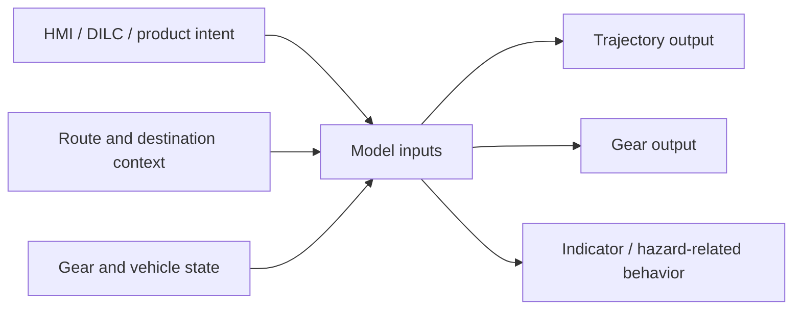
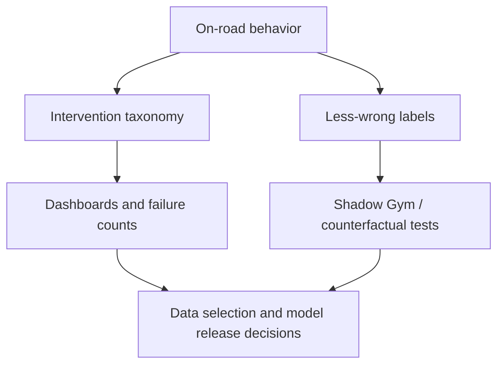

# Parking Product And Taxonomy

## Product Capabilities

Parking is a family of related behaviors, not one feature:

- **APA**: parking into a spot, with possible spot selection and maneuver preference.
- **P2P**: navigation inside parking areas, including entry, search, exit, and destination-conditioned behavior.
- **PUDO**: short pick-up/drop-off stop that should feel like natural ride-hail behavior.
- **UnPUDO**: leaving a PUDO stop and merging back into traffic.
- **Unparking**: leaving a parked state without necessarily later performing PUDO in the same run.
- **RMF / pull-over**: safe-stop behavior triggered by risk mitigation, potentially using parking-style stop conditioning.
- **PSD / Park Assist / MPA**: adjacent perception, collision awareness, and memory-path capabilities.

## PUDO Is Not Parking

PUDO has its own success semantics:

- stop briefly for rider pickup/dropoff,
- choose a safe and convenient stopping location,
- avoid blocking traffic where that would be unacceptable,
- use indicator before pulling in,
- use hazards while stopped,
- shift to park when appropriate,
- then unpark / merge back smoothly.

Parking success is about a final parking pose and maneuver quality. PUDO success is about stop choice, passenger-egress safety, traffic interaction, signaling, and smooth resumption.

## Input/Output Surface

Important inputs and outputs from the source docs:

- `INITIATE_AUTO_PARKING`
- `PARKING_DIRECTION`
- `ENABLE_SHIFT_BY_WIRE`
- gear direction / gear state
- `stopping_mode` with NA/PARK/PUDO semantics
- selected parking spot or target location where available
- parking destination preference: PUDO, parking, charging, MRM
- gear-state output for shift-by-wire-capable deployments

## Taxonomy Layers

Use the current spreadsheet taxonomy for category names when possible. The older Notion V10 page is useful history but is marked Outdated.

## Failure Families

### PUDO

- stop position / incorrect stop location,
- lane merge or curbside-lane error,
- unsafe stop side or passenger-egress risk,
- hesitation or failure to stop,
- approach speed / overshoot,
- dynamic safety conflict,
- static safety conflict,
- intent/mode error,
- left/right curb or double-parked side selection,
- indicator, hazard, and gear-shift errors.

### Park

- slot selection error,
- blocked space or insufficient clearance,
- poor approach angle or overshoot,
- trajectory/control error,
- late/early/wrong turn,
- static/dynamic safety conflict,
- parking preference error,
- comfort issue,
- final-pose quality degradation,
- illegal parking location.

### Unpark / UnPUDO

- no safe gap,
- blocked by vehicles, objects, or dynamic agents,
- static clearance risk,
- limited visibility,
- poor starting pose,
- excessive hesitation,
- wrong behavior mode,
- gear-shift and signaling errors,
- failure to find exit in car-park contexts.

## Agent Guidance

When classifying or debugging a parking/PUDO event, do not jump directly to a model-output explanation. First classify the failure family:

1. Was the high-level intent correct?
2. Was the target stop/slot/side correct?
3. Was the maneuver geometry correct?
4. Was speed/comfort acceptable?
5. Were gear and signaling correct?
6. Was the behavior safe around static and dynamic actors?
7. Was the event table anchor/window correct?

This decomposition prevents mixing product, data, model, wrapper, and evaluation failures into one generic "bad trajectory" bucket.

## Sources

- [[llm_wiki/sources/2026-05-24-notion-parking-product-data-eval|Notion And Drive - Parking Product, Data, Evaluation]]
- Related: [[llm_wiki/systems/parking-pudo-event-pipeline|Parking PUDO Event Pipeline]], [[llm_wiki/systems/navigation-conditioning|Navigation Conditioning]]
