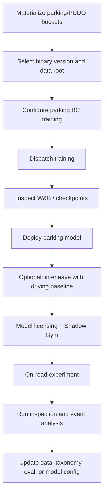

# Parking PUDO Deployment And Release

## Release Surfaces

Parking/PUDO release work spans several separate surfaces:

- model training configs and datamodules,
- binary and materialization roots,
- deployment wrapper,
- interleaving wrapper,
- model licensing and Shadow Gym,
- on-road experiment request,
- run inspection dashboards,
- release tracking page / model catalogue.

Do not treat a "model nickname" as enough context. For meaningful comparison, capture parent model, checkpoint, commit, data root, binary version, config mode, route/stopping augmentations, wrapper, and interleaving partner.

## Standard Development Flow

## Training Position In The Model Lifecycle

The SI docs describe parking/PUDO as currently trained from a pretrain model with a single BC stage. This is different from the full driving release path that may include BC then RL. Parking/PUDO-specific work therefore tends to concentrate in:

- data buckets and materialization,
- new input adaptors,
- gear output adaptor,
- parking/PUDO augmentations,
- route-shortening and stopping-mode conditioning,
- BC recipe and data mix.

## Interleaving

The current wrapper-based interleaving approach keeps one deployed artifact and switches between a baseline driving policy and a parking/PUDO policy. It is useful before true multi-head deployment because it isolates parking behavior without requiring the normal driving model to absorb every parking/PUDO change.

Triggers include:

- near end of route,
- effectively no route,
- `INITIATE_AUTO_PARKING`,
- reverse gear,
- speed hysteresis.

Important threshold from the newsletter:

- `speed_switch_mps = 2.235`, about 8 km/h.

## Deployment Risks

- Wrapper signature drift can break TorchScript compilation.
- Baseline and parking wrappers must have compatible input/output signatures, especially radar and temporal-caching behavior.
- Interleaving telemetry can collide with structured-testing interleaving metrics if `interleaved_id` or `interleaved_event` is emitted without coordination.
- Route-threshold calibration is tied to route-map rendering and window configuration.
- A run can contain events from multiple active models, so evaluation must use event-time model attribution.

## Release/Ablation Dimensions

When comparing parking/PUDO releases, inspect:

- data mix weights: driving / PUDO / UnPUDO / unparking / CA-style windows,
- country/platform roots,
- binary version,
- high-acceleration or smooth-intervention materialization variants,
- directional and gear-change buckets,
- gear-label cleanup,
- `reconstruct_gear_from_speed`,
- `enable_augment_standstill_gear`,
- `parked_unparking_prob`,
- `unparking_gear_augment_prob`,
- route shortening,
- `stopping_mode` augmentation,
- past context seconds,
- interleave partner.

## On-Road Experiment Notes

The deployment guide says on-road requests should specify the theme as parking or PUDO/robotaxi and include relevant test details and driving features. Standard assignment batches include licensing and parking-specific batches where available. Add "enable shift by wire" when testing gear-output-capable parking/PUDO behavior.

## Run Inspection

Use:

- Console videos and graphs,
- Foxglove parking layout,
- Parking Run Inspection Dashboard or Gen2 Run Inspection Dashboard,
- Datadog parking dashboard for model/controller logs,
- model event attribution from `model_episodes` for interleaved runs.

## Agent Checklist

Before recommending a release or drawing conclusions from an experiment:

1. Resolve the exact model session and checkpoint.
2. Identify the interleaved driving baseline, if any.
3. Record data root, binary version, and bucket mix.
4. Record parking augmentation settings.
5. Confirm wrapper input/output compatibility.
6. Check Shadow Gym and on-road metrics separately for PUDO, UnPUDO, unparking, and normal driving.
7. Attribute events by event time, not run-level model.
8. Note taxonomy or dashboard changes that may affect metrics.

## Sources

- [[llm_wiki/sources/2026-05-24-notion-parking-newsletters-release|Notion - Parking Newsletters And Release Tracking]]
- [[llm_wiki/sources/2026-05-24-notion-parking-product-data-eval|Notion And Drive - Parking Product, Data, Evaluation]]
- Related: [[llm_wiki/systems/multi-task-and-multi-driving-heads|Multi-Task And Multi-Driving Heads]], [[llm_wiki/systems/deployment-and-model-catalogue|Deployment And Model Catalogue]]
