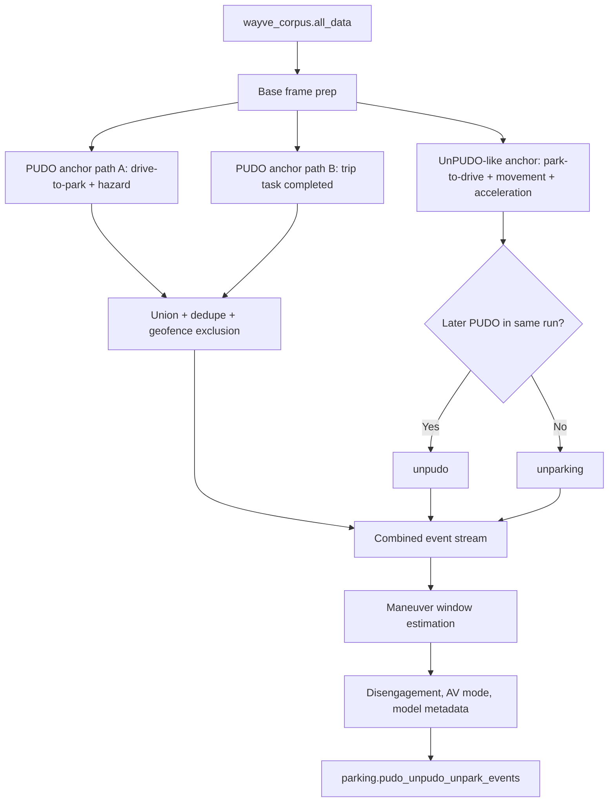
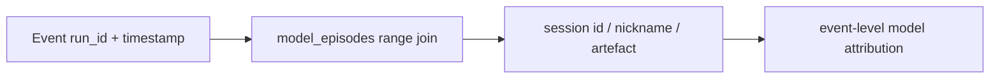
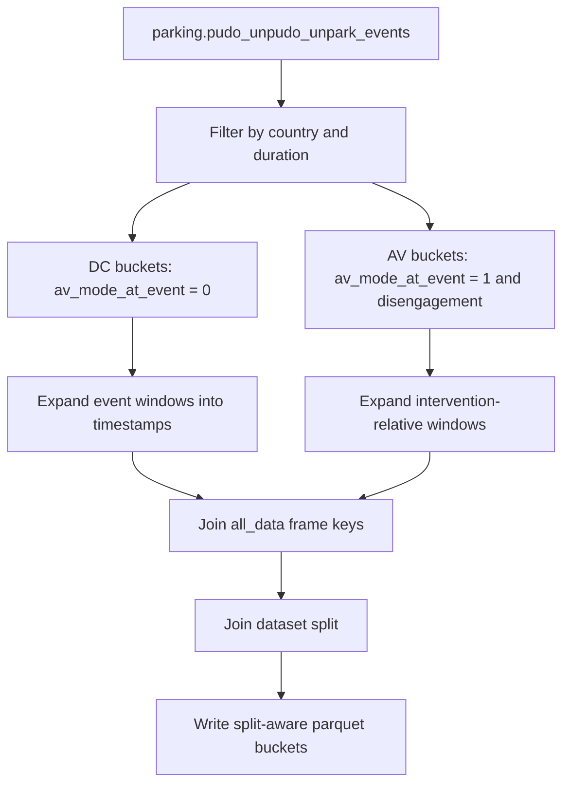

# Parking PUDO Event Pipeline

## Purpose

The PUDO/UnPUDO event pipeline turns raw telemetry into event-level tables and then into training/evaluation buckets. It is the bridge between on-road behavior, dashboards, model training data, and model release decisions.

Core event table:

- `parking.pudo_unpudo_unpark_events`

Core materialized dataset source:

- `hive_metastore.parking.pudo_unpudo_unpark_events`

## Event Types

- `pudo`: parking/PUDO end anchor.
- `unpudo`: unparking start anchor that later has a PUDO in the same run.
- `unparking`: unparking start anchor that does not later have a PUDO in the same run.

This matters because `unparking` is not a separate detector. It is the same UnPUDO-like start logic with a different run-level future outcome.

## Event Detection

Important constants and assumptions from the source:

- PUDO hazard matching uses a +/-10s hazard-light window.
- PUDO anchors are location-deduped at 5m.
- UnPUDO-like anchors are based on park-to-drive transition, movement of at least 5m, and earliest acceleration >= 0.1 m/s^2.
- UnPUDO-like anchors are location-deduped at 10m.
- office geofences are excluded.

## Maneuver Windows

PUDO anchor means "end of stop/parking". The pipeline estimates start by looking backward:

- 30m backward distance rule,
- 12s time cap,
- optional indicator extension,
- overlap protection with previous event.

UnPUDO/unparking anchor means "start of leaving". The pipeline estimates end by looking forward:

- first frame with at least 10m movement and speed >= 2.235 m/s,
- bounded by 90s, 120m, and next event.

## Disengagement Enrichment

The event table includes several disengagement windows:

- main event window,
- fixed 30s window,
- gear-change to start window,
- 10s before gear change,
- 10s before PUDO start.

These are not just debug columns. The dashboard uses them for eligibility and failure logic. For example, PUDO failure can include a disengagement during the maneuver or 10s before estimated PUDO start.

## Model Assignment

Model metadata is joined by event time using `prod_data_pipeline.raw__inference.model_episodes`. This is essential for interleaved deployments because the active model can change within one run.

Run-level model attribution is unsafe for parking/PUDO analysis when interleaving is active.

## Materialization

DC bucket pattern:

- `dc_<event_type>_<country>`
- optional `_short` and `_very_short` variants.

AV bucket pattern:

- `<window_family>_<event_type>_<country>`
- window families: `pre_ca`, `ca_short`, `ca_long`.

The materialized output is a split-aware parquet dataset with README and sidecar metadata.

## Tables Used By Evaluation Notebooks

Important tables and roles:

- `prod_data_pipeline.raw__model_catalogue_sync.model_checkpoint_artefacts`: checkpoint artefacts.
- `prod_data_pipeline.raw__model_catalogue_sync.model_training_sessions`: model nicknames and sessions.
- `analytics.disengagements`: interventions, severity, what/why labels, country, split, speed.
- `prod_data_pipeline.raw__model_catalogue_sync.run_labels`: less-wrong labels.
- `analytics.offroad_shadow_gym_test_metadata`: test usage/deduplication.
- `prod_data_pipeline.wayve_corpus.all_data`: frame telemetry, automation, gear, speed, indicators.
- `users__guy_geva.zak_parking_classification`: parking type predictions.
- `prod_data_pipeline.inferred__scenario.embeddings_head_behavioural_competencies_v2`: behavioral competency predictions.
- `prod_data_pipeline.metadata.dataset_split`: train/validation/test split.

## Critical Checks Before Trusting A Result

- Did event detection use the intended date/platform/country filters?
- Was the event in DC or AV mode?
- Was the event duration removed or trimmed by cutoff logic?
- Was the model attribution event-time or run-level?
- Did the dashboard failure flag use the relevant disengagement window?
- Does the bucket name imply PUDO, UnPUDO, unparking, AV intervention, or DC event-window data?
- Are train-data less-wrong examples accidentally being interpreted as test data?

## Sources

- [[llm_wiki/sources/2026-05-24-notion-parking-product-data-eval|Notion And Drive - Parking Product, Data, Evaluation]]
- Related: [[llm_wiki/systems/parking-data-and-labels|Parking Data And Labels]], [[llm_wiki/systems/evaluation-and-model-ci|Evaluation And Model CI]]
