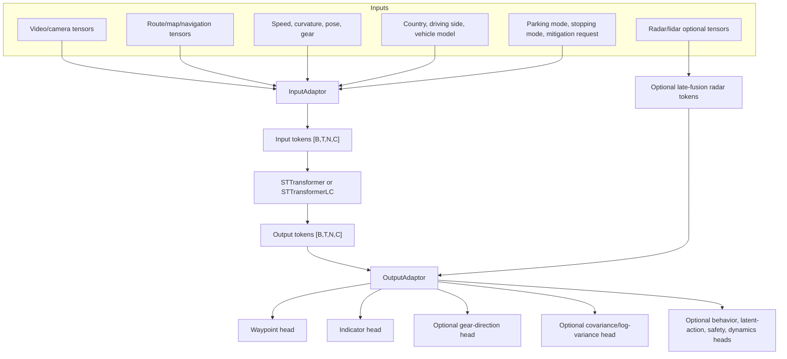

# Space-Time Model Architecture

## Working Synthesis

The inspected SI/Zoo model path is a multi-input multi-output space-time transformer. It converts heterogeneous driving inputs into tokens, applies a space-time encoder, and decodes the resulting tokens into driving outputs through output heads.

This is the model architecture layer most parking/PUDO changes touch when they add a condition such as `parking_mode`, `stopping_mode`, or `gear_direction`.

## Architecture Graph

## Input Adaptors

An input adaptor is the boundary between a named data key and the transformer token stream. The main architectural question for a new input is whether it is:

- Time-varying, such as speed, pose, gear, indicator, or video.
- Static or slowly varying, such as country, driving side, or vehicle model.
- Route/spatial, such as route maps or navigation instructions.
- Intent/conditioning, such as parking mode or stopping mode.
- Sensor-token based, such as radar late fusion.

Parking-specific input adaptors currently include:

- `GearDirectionSTAdaptor`
- `ParkingModeSTAdaptor`
- `StoppingModeSTAdaptor`

## Encoder

The encoder consumes the token sequence and models interactions across time and token type. In the inspected path, the implementation can use `STTransformer` or `STTransformerLC`.

For parking, the important point is not just model capacity. Low-speed maneuvers need the encoder to combine:

- Past vehicle state and gear.
- Immediate route/map target.
- Parking or PUDO intent.
- Indicator/hazard cues.
- Camera/radar context around the curb, bay, or stop location.

## Output Adaptor

The output adaptor attaches heads to output tokens. Important heads:

| Head | Purpose | Parking/PUDO relevance |
| --- | --- | --- |
| Waypoint head | Predict future path or trajectory. | Primary behavior output for stop, pull-over, park, and unpark. |
| Indicator head | Predict indicator weights. | Useful for signaling and PUDO/parking behavior. |
| Gear-direction head | Predict gear direction. | Needed for parking deployment paths that require gear behavior. |
| Waypoint covariance/log variance | Predict uncertainty or loss scale. | Affects training objective and evaluation interpretation. |
| Behavior/latent-action heads | Condition or explain behavior modes. | Can interact with navigation and release behavior paths. |

## Direct Waypoints Versus Rates

`waypoints_heads.py` contains two useful mental models:

- Direct waypoint heads project tokens directly to future waypoint coordinates.
- Rate-based heads predict speed/curvature deltas and integrate them into pose/waypoint sequences.

For parking, this distinction matters because very low-speed and standstill behavior can be sensitive to integration, sign, and gear-direction conventions. A model can look reasonable at normal driving speeds while failing near zero speed if the head/loss/data representation does not make the intended maneuver clear.

## Where To Inspect

- Model builder: `/workspace/WayveCode/wayve/ai/zoo/st/models.py`
- Output adaptor: `/workspace/WayveCode/wayve/ai/zoo/outputs/output_adaptor.py`
- Waypoint heads: `/workspace/WayveCode/wayve/ai/zoo/outputs/waypoints_heads.py`
- Gear head: `/workspace/WayveCode/wayve/ai/zoo/outputs/gear_direction_output_head.py`
- Parking config: `/workspace/WayveCode/wayve/ai/si/configs/parking/parking_config.py`

## Architecture Review Questions

- Is this change a new input, a new output, a new loss, or just a data/config change?
- Does the datamodule always produce the key for train and validation?
- Does deployment have the same key, or only a training-time proxy?
- If an older checkpoint is loaded, are new adaptor/head weights expected to be missing?
- Does the release baseline already include behavior/navigation/radar paths that parking should preserve?

## Related Pages

- [[llm_wiki/systems/model-vehicle-interface|Model-vehicle interface]]
- [[llm_wiki/systems/parking-model-architecture|Parking model architecture]]
- [[llm_wiki/systems/bc-rl-training|BC and RL training]]
