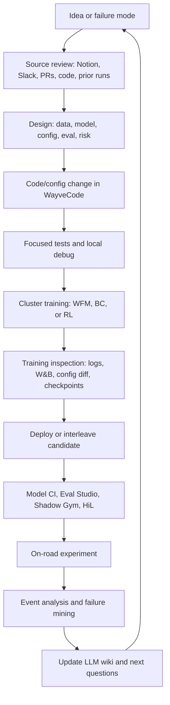

# Model Development Cycle

This is the first-pass workflow map for a Wayve MLE taking a model idea from source knowledge to on-road learning.

## Lifecycle

## Step 1: Source review

Use the wiki first:

- [[llm_wiki/index|Index]]
- [[llm_wiki/log|Log]]
- [[llm_wiki/maps/codebase-map|Codebase map]]
- [[llm_wiki/maps/knowledge-sources|Knowledge sources]]

Then inspect source systems:

- Notion design docs and training recipes.
- GitHub PRs and local code.
- Slack threads for operational decisions and incident context.
- Existing vault task notes.
- Relevant skills in [[llm_wiki/workflows/agent-skill-map|Agent skill map]].

## Step 2: Design

For a model change, record:

- Target capability and failure mode.
- Data sources, filters, materialization roots, and bucket weights.
- Model inputs, outputs, heads, losses, and config paths.
- Baseline/control model.
- Evaluation suites and pass/fail signals.
- Deployment and on-road constraints.
- Known risks and rollback plan.

For substantial WFM work, follow the world-model integration-guide process from `/workspace/WayveCode/wayve/ai/foundation/models/world_model/AGENTS.md`.

## Step 3: Code or config change

Common areas:

- WFM: `/workspace/WayveCode/wayve/ai/foundation/models/world_model/`
- SI training: `/workspace/WayveCode/wayve/ai/si/`
- Model components: `/workspace/WayveCode/wayve/ai/zoo/`
- Parking configs: `/workspace/WayveCode/wayve/ai/si/configs/parking/`
- Parking datamodule: `/workspace/WayveCode/wayve/ai/si/datamodules/parking.py`
- Parking evaluation: `/workspace/WayveCode/wayve/ai/parking/evaluation/`

## Step 4: Local checks

Local checks should match the blast radius:

- Unit/config tests for config or datamodule changes.
- `bazel run //wayve/ai/si:train -- ... dev=True` for SI training sanity checks.
- WFM debug training with `base_config=... debug=True` for WFM changes.
- Config comparison with `--control_model` or config diff tooling.

## Step 5: Cluster training

Use:

- `//tools/wayvecli` for WFM hydra submissions.
- `//wayve/ai/si/cli:cli` for SI BC/RL submissions.

Record:

- Branch and commit.
- Full command.
- Session tag.
- Job ID and session ID.
- Control model.
- Expected checkpoint/step target.
- W&B or Surfboard links when available.

## Step 6: Candidate inspection

Before deployment, answer:

- Did the job actually train, not just dispatch?
- Did config diff match intent?
- Are losses/metrics plausible?
- Did the expected checkpoint upload?
- Does Model Catalogue resolve the candidate?
- Are license/model-ci/deployment settings correct?

## Step 7: Deployment and evaluation

Typical hooks:

- Model Catalogue lookup skills.
- Parking deploy or interleave deploy skills.
- Model CI and Shadow Gym debug skills.
- Eval Studio or AV test workflows.
- HiL checks when hardware latency or on-device behavior matters.

## Step 8: On-road and post-run analysis

For parking and pull-over, post-run analysis should capture:

- Run IDs and model nicknames.
- Scenario or experiment IDs.
- Event timestamps and classifications.
- Destination/pull-over target context.
- Driver transcript alignment when relevant.
- AV-owned versus setup/environment failures.
- Next data/model/config action.

## Step 9: Feed the wiki

Every durable finding should update this wiki:

- Source summary for new docs/threads/PRs.
- System page for stable architecture or workflow facts.
- Run ledger for experiment-heavy debugging.
- Open questions for unresolved gaps.
