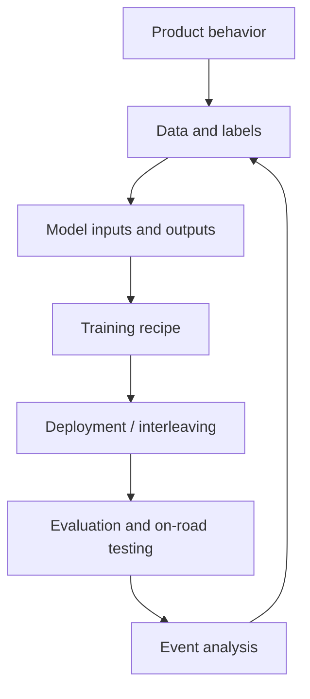

# Newcomer Onboarding

This page is the starting path for a new MLE joining parking, PUDO, pull-over, or adjacent driving-feature work. It is intentionally ordered: read top to bottom the first time, then use the links as a map.

## The Mental Model

Wayve's driving model is end-to-end: the main output is the driving trajectory itself, not an intermediate object/lane/planner stack. The development loop is still structured: source review, data, labels, model IO, training, evaluation, deployment, on-road testing, and post-run analysis.

For parking/PUDO work, most failures are not just "bad trajectory". They can come from product intent, route conditioning, event detection, taxonomy, data buckets, model inputs, output heads, deployment wrappers, or evaluation attribution.

## First Hour

Read these pages in order:

1. [[llm_wiki/README|README]] - what this wiki is and how it is maintained.
2. [[llm_wiki/index|Index]] - full page catalog.
3. [[llm_wiki/glossary|Glossary]] - local vocabulary.
4. [[llm_wiki/maps/mle-role-map|MLE Role Map]] - where an MLE interacts with the system.
5. [[llm_wiki/systems/end-to-end-driving-stack|End-To-End Driving Stack]] - high-level architecture.

You should come away knowing the difference between raw sources, source summaries, system pages, workflows, and open questions.

## First Day

Build the model-development picture:

1. [[llm_wiki/workflows/model-development-cycle|Model Development Cycle]] - idea to on-road loop.
2. [[llm_wiki/systems/world-model-pretraining|World Model Pretraining]] - why WFM matters before BC/RL.
3. [[llm_wiki/systems/bc-rl-training|BC And RL Training]] - post-training stages.
4. [[llm_wiki/systems/space-time-model-architecture|Space-Time Model Architecture]] - adaptors, ST trunk, output heads.
5. [[llm_wiki/systems/model-vehicle-interface|Model Vehicle Interface]] - robot/model IO contract.

Do not try to memorize every code path. Focus on where a behavior change can enter the system: input adaptor, output head, data key, loss, bucket mix, wrapper, or evaluation suite.

## First Parking/PUDO Pass

Read these after the general model pages:

1. [[llm_wiki/systems/parking-and-pull-over|Parking And Pull-Over]] - domain hub.
2. [[llm_wiki/systems/parking-product-and-taxonomy|Parking Product And Taxonomy]] - product scope and failure families.
3. [[llm_wiki/systems/parking-pudo-event-pipeline|Parking PUDO Event Pipeline]] - event detection and materialization.
4. [[llm_wiki/systems/parking-model-architecture|Parking Model Architecture]] - parking model IO and heads.
5. [[llm_wiki/systems/parking-pudo-deployment-and-release|Parking PUDO Deployment And Release]] - release, interleaving, and model comparison.
6. [[llm_wiki/workflows/first-parking-pudo-change|First Parking PUDO Change]] - practical checklist for a first change.

## First Week

Use one concrete issue or run as an anchor. For that issue, identify:

- the intended product behavior,
- the relevant event type and taxonomy label,
- the data source and bucket family,
- the model inputs/outputs involved,
- the control model or release baseline,
- the evaluation signal,
- and the next action.

If any of those cannot be answered, file the gap in [[llm_wiki/questions/parking-pudo-open-questions|Parking PUDO Open Questions]] instead of guessing.

## How To Ask The Wiki Good Questions

Good questions:

- "Which stage could cause PUDO to stop in the wrong place?"
- "What data table backs the PUDO/UnPUDO event dashboard?"
- "What changes should I record before comparing two parking models?"
- "Is this a taxonomy, data, model, wrapper, or evaluation problem?"

Weak questions:

- "Why is the model bad?"
- "Which model is best?"
- "Can we just add more data?"

The wiki is most useful when the question names a behavior, model, run, source page, or suspected subsystem.
