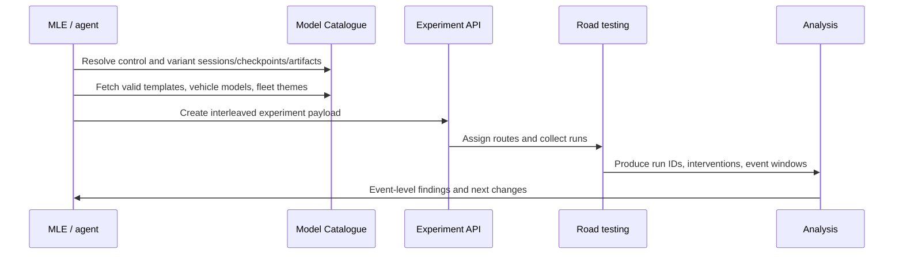

# On-Road Experiment Workflow

## Purpose

On-road experiments should test a clearly documented model hypothesis with resolved model artifacts, valid fleet theme/template choices, and explicit post-run analysis plans.

## Flow

## Required Inputs

From the `create-on-road-experiment` skill:

- Experiment name.
- Description with hypothesis, rationale, and success criteria.
- Fleet theme from the API, not a guessed string.
- Route template from API or a resolved size/km target.
- Vehicle model from supported list.
- Control model session/checkpoint/artifact.
- Variant model sessions/checkpoints/artifacts.
- Tags and priority.

BRT experiments have stricter naming, theme, tag, and template conventions. Use the skill, not memory, when creating one.

## Parking/PUDO Specific Prechecks

Before on-road:

- The deployed model has an interleave-control parking identity if required.
- Model CI has been triggered and blocking failures are understood.
- Parking-specific offline evaluations have a result table or explicit reason for skipping.
- The release row or source note explains what changed.
- Event-analysis plan identifies which run IDs, event tables, and classification version will be used after driving.

## Description Quality Bar

A useful experiment description includes:

- Control model and why it is the right control.
- Candidate model and exact intended delta.
- Capability under test: park, PUDO, UNPUDO, unparking, pull-over, or release regression.
- Expected improvement and expected risk.
- Success metrics and manual review plan.
- Links to source docs or release rows.

## Post-Run Analysis

For parking/PUDO:

- Pull run IDs and experiment branch assignment.
- Query PUDO/UNPUDO/unparking events.
- Resolve destination or route target context.
- Align driver transcript for ambiguous cases.
- Classify success/failure with evidence.
- Record issue categories and next data/model changes.

## Failure Modes

- Guessing a fleet theme or template name instead of resolving it from the API.
- Testing a source training model instead of the deployed artifact.
- Creating an experiment before parking notes/model identity are visible to downstream flows.
- Running on-road without knowing which event table or evaluation report will close the loop.

## Related Pages

- [[llm_wiki/systems/deployment-and-model-catalogue|Deployment and Model Catalogue]]
- [[llm_wiki/systems/evaluation-and-model-ci|Evaluation and Model CI]]
- [[llm_wiki/workflows/parking-development-workflow|Parking development workflow]]
