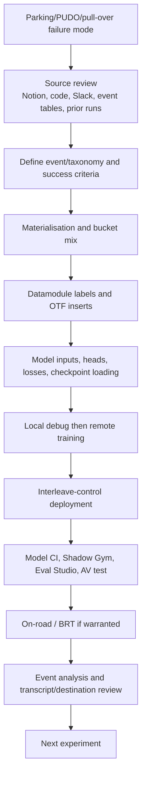

# Parking Development Workflow

## End-to-End Loop

## Step 1: Define The Behavior

Do not start with a config edit. First write the behavior in operational terms:

- What should the car do?
- Is this park, PUDO, UNPUDO, unparking, or pull-over?
- What context tells the model the intent?
- What is the acceptable trajectory, stop point, gear behavior, and indicator behavior?
- What would count as a failure even without a disengagement?

For pull-over, keep a source-gap note unless a Notion SOP or product definition has been ingested.

## Step 2: Inspect Data Semantics

Use [[llm_wiki/systems/parking-data-and-labels|Parking data and labels]] to verify:

- Event family and bucket names.
- Direct-control versus CA/pre-CA source.
- Hazard, destination, and trip context assumptions.
- Progress checks and movement filters.
- Whether counts are event counts or timestamp rows.

Sampling changes are model changes. Review them with the same rigor as architecture changes.

## Step 3: Inspect Datamodule And Config

Check:

- Materialised root.
- Bucket group and weights.
- `ParkingDataConfig` flags.
- Whether `use_zoo_dataloader` delegates to a simpler insertion path.
- Whether stopping mode, parking mode, gear direction, route shortening, and goal dropout are actually enabled.
- Whether train and validation have comparable key coverage.

## Step 4: Inspect Model Architecture

Check:

- WFM or release checkpoint source.
- Input adaptors: `gear_direction`, `parking_mode`, `stopping_mode`.
- Output heads: waypoint, indicator, gear direction, variance/covariance.
- Loss weights and masks.
- Radar/video/cache settings.
- Deployment wrapper expectations.

## Step 5: Train

Use [[llm_wiki/workflows/training-a-driving-model|Training a driving model]] and the `train-parking-model` skill conventions:

- Keep session tag short.
- Capture job/session/nickname identifiers.
- Monitor until the job is actually running.
- Document the release row or explain why it was skipped.

## Step 6: Deploy And Evaluate

Use [[llm_wiki/systems/deployment-and-model-catalogue|Deployment and Model Catalogue]]:

- Resolve exact source checkpoint.
- Deploy interleave-control group `parking`.
- Resolve deployed nickname and artifact id.
- Add standard parking note.
- Trigger Model CI.
- Run parking follow-up evaluations.

## Step 7: Analyze Events

Use event analysis when aggregate metrics are ambiguous. For each run:

- Resolve destination/task context.
- Align driver transcript when relevant.
- Check gear, indicator, speed, acceleration, and route progress.
- Separate AV-owned behavior from setup/environment issues.
- Write the next data/model action, not only the failure label.

## Review Gates

Before calling a parking candidate healthy:

- Data source and bucket mix are explicit.
- Stopping-mode enum is current.
- Gear-direction head is present if deployment needs it.
- Evaluation covers both stop and departure behavior.
- Pull-over claims are not inferred from PUDO evidence unless product docs support it.
