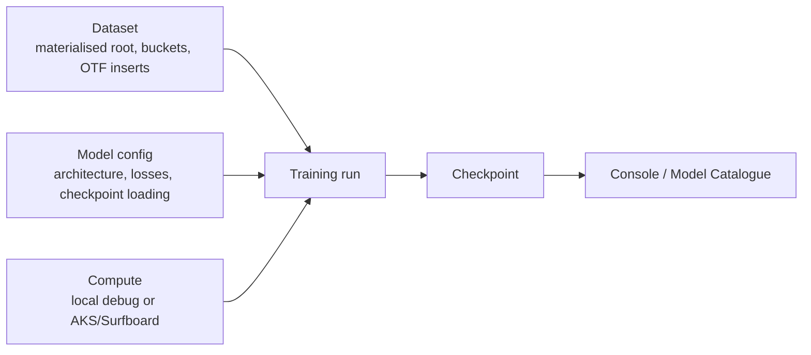

# Training a Driving Model

## Purpose

This workflow turns an idea, failure mode, or release candidate into a traceable SI training run. It is source-backed by the Notion training page, SI README synthesis, and local parking skills.

## Preflight

Before launching:

- Define the hypothesis and expected behavior change.
- Identify baseline/control model.
- Record branch, commit, mode, datamodule, materialised root, and key overrides.
- Check config diff against the control model when possible.
- Run a local debug train if config/data/model wiring changed.
- Decide which metrics/evaluations will determine success.

## Training Ingredients



The Notion training page frames every run around dataset, architecture/objective, and compute. Treat all three as part of the experiment, not only code changes.

## Local Debug

Source-backed local SI shape:

```bash
bazel run //wayve/ai/si:train -- +datamodule=baseline_bc +model=fast_st_debug_bc +mode=C5T4 dev=True
```

For parking, use the current parking mode/datamodule from the relevant release config, not necessarily this old example. Local debug is meant to catch wiring issues, missing keys, import/config failures, and obviously broken losses.

## Remote SI Training

Parking skill defaults currently use this shape unless the user provides a newer command:

```bash
bazel run //wayve/ai/si/cli:cli -- \
  --project Parking \
  -ex parking_bc \
  -st <short_session_tag> \
  --platform AKS \
  -nn 4 \
  --cluster dgx-h100 \
  --no-verify \
  +mode=parking_bc_train_release_2026_5_11 \
  +datamodule=parking_bc_datamodule \
  num_steps=100000 \
  --priority P1
```

Keep session tags short because downstream W&B artifact names have length limits.

## During Submission

Capture:

- Full command.
- Branch and commit.
- Session tag.
- Reason for testing.
- Surfboard job id.
- SI session id.
- W&B URL.
- Datadog URL.
- Any prompt answers, especially permission to proceed with dirty worktree.

## After Submission

Do not stop at "submitted." Check:

- Job reaches a meaningful state such as `Dispatched` or `Running`.
- Model session is visible in Model Catalogue.
- Nickname resolves.
- Checkpoints upload at expected cadence.
- Losses and metrics are plausible.
- Config diff matches intent.

## Handoff To Deployment

Only deploy after:

- Training finished or the intended checkpoint exists.
- Source checkpoint number is explicit.
- Model Catalogue resolves source identity.
- Release row or task note contains enough context for future agents.

Related deployment page: [[llm_wiki/systems/deployment-and-model-catalogue|Deployment and Model Catalogue]].
