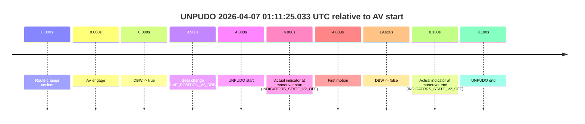
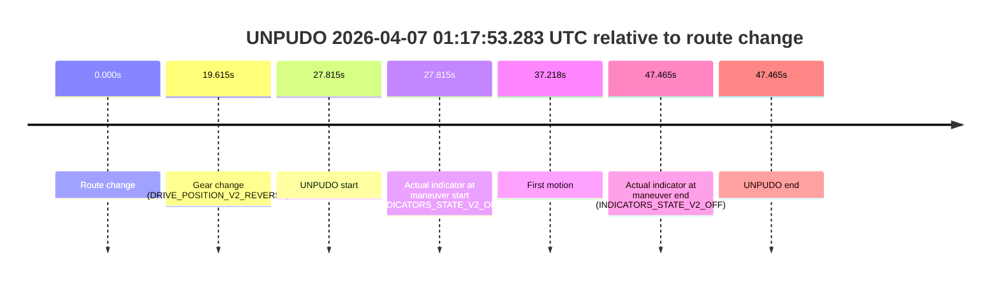
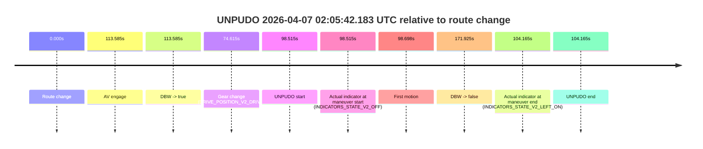
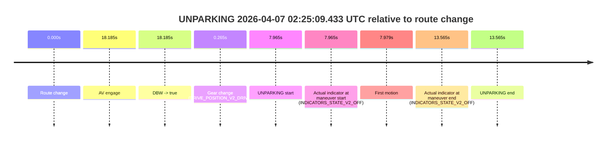

# Run Report: fme10003/2026-04-07--00-53-59--gen2-av-a174aec1-b707-420e-aef2-bca72e45c82a

| Field | Value |
|---|---|
| Run ID | `fme10003/2026-04-07--00-53-59--gen2-av-a174aec1-b707-420e-aef2-bca72e45c82a` |
| Date | `2026-04-07` |
| Model(s) | `lively-orange-horse` |
| Author | `guy.geva` |
| Event count | `17` |

## unpudo 2026-04-07 00:58:43.983 UTC

| Field | Value |
|---|---|
| Model | `lively-orange-horse` |
| Author | `guy.geva` |
| Run ID | `fme10003/2026-04-07--00-53-59--gen2-av-a174aec1-b707-420e-aef2-bca72e45c82a` |
| Date | `2026-04-07` |
| Time (UTC) | `00:58:43.983` |
| Event type | `unpudo` |
| Disengagement type | `failed_to_accelerate` |
| Route change | `unclear` |
| Console | [run](https://console.sso.wayve.ai/run/fme10003/2026-04-07--00-53-59--gen2-av-a174aec1-b707-420e-aef2-bca72e45c82a?id=&time-unixus=1775523523983321) |
| Foxglove | [segment](https://app.foxglove.dev/wayve-on-prem/p/prj_0dX18KZdVHg1fmmI/view?ds=foxglove-stream&ds.deviceName=fme10003&ds.start=2026-04-07T00%3A58%3A22.283311Z&ds.end=2026-04-07T00%3A59%3A57.773014Z&layoutId=lay_0e7VD4WIKDQGU73Y&time=2026-04-07T00%3A58%3A43.983321Z) |

### Event card: fail

- Fail: AV owns part of the segment, but the event still resolves as a model-performance failure under the AV-only scoring rule.

| Event | Time (UTC) | Delta from AV start |
|---|---:|---:|
| Route change unclear | 2026-04-07 00:58:56.833 | `0.000s` |
| AV engage | 2026-04-07 00:58:56.833 | `0.000s` |
| DBW -> true | 2026-04-07 00:58:56.833 | `0.000s` |
| Gear change (DRIVE_POSITION_V2_DRIVE) | 2026-04-07 00:58:32.283 | `-24.550s` |
| UNPUDO start | 2026-04-07 00:58:43.983 | `-12.850s` |
| Actual indicator at maneuver start (INDICATORS_STATE_V2_OFF) | 2026-04-07 00:58:43.983 | `-12.850s` |
| First motion | 2026-04-07 00:58:44.026 | `-12.807s` |
| DBW -> false | 2026-04-07 00:59:47.773 | `50.940s` |
| Actual indicator at maneuver end (INDICATORS_STATE_V2_RIGHT_ON) | 2026-04-07 00:58:49.733 | `-7.100s` |
| UNPUDO end | 2026-04-07 00:58:49.733 | `-7.100s` |

| Metric | Value |
|---|---|
| Outcome | `fail` |
| Effective failure type | `failed_to_accelerate` |
| Route change status | `unclear` |
| DBW at event start | `false` |
| DBW at event end | `false` |
| Predicted gear at AV start | `DRIVE_POSITION_V2_DRIVE` |
| Actual gear at AV start | `DRIVE_POSITION_V2_DRIVE` |
| Predicted gear at event start | `DRIVE_POSITION_V2_DRIVE` |
| Actual gear at event start | `DRIVE_POSITION_V2_DRIVE` |
| Planned indicator direction | `INDICATORS_STATE_V2_OFF` |
| Controller indicator direction | `INDICATORS_STATE_V2_OFF` |
| Actual indicator direction | `INDICATORS_STATE_V2_OFF` |
| Actual indicator at maneuver end | `INDICATORS_STATE_V2_RIGHT_ON` |
| Driver accel help in AV | `false` |
| Driver accel help timestamp | `n/a` |
| Max accel pedal pct in AV | `0.0%` |
| Max brake pedal pct in AV | `0.0%` |
| Max speed mps in AV | `0.000` |
| Route -> AV | `n/a` |
| AV -> event start | `-12.850s` |
| AV -> first motion | `-12.807s` |
| AV duration before disengagement | `50.940s` |
| Trajectory waypoint count | `37` |
| Driving-plan step count | `11` |

The scored portion starts from the AV-owned window, not from the pre-AV setup. Route-change search in the stopped pre-event segment was `unclear`, with the baseline therefore set to AV start. At the event anchor the model predicts `DRIVE_POSITION_V2_DRIVE` and the actual gear is `DRIVE_POSITION_V2_DRIVE`. The effective model outcome is `fail` because `failed_to_accelerate`.

### Resolution

| Field | Value |
|---|---|
| Final outcome | `fail` |
| Do we agree with this label? | `yes` |
| Source disengagement type | `failed_to_accelerate` |
| Resolved effective failure type | `failed_to_accelerate` |
| Confidence | `medium` |

## unpudo 2026-04-07 01:07:21.233 UTC

| Field | Value |
|---|---|
| Model | `lively-orange-horse` |
| Author | `guy.geva` |
| Run ID | `fme10003/2026-04-07--00-53-59--gen2-av-a174aec1-b707-420e-aef2-bca72e45c82a` |
| Date | `2026-04-07` |
| Time (UTC) | `01:07:21.233` |
| Event type | `unpudo` |
| Disengagement type | `failed_to_accelerate` |
| Route change | `found` |
| Console | [run](https://console.sso.wayve.ai/run/fme10003/2026-04-07--00-53-59--gen2-av-a174aec1-b707-420e-aef2-bca72e45c82a?id=&time-unixus=1775524041233299) |
| Foxglove | [segment](https://app.foxglove.dev/wayve-on-prem/p/prj_0dX18KZdVHg1fmmI/view?ds=foxglove-stream&ds.deviceName=fme10003&ds.start=2026-04-07T01%3A07%3A06.018269Z&ds.end=2026-04-07T01%3A08%3A22.733309Z&layoutId=lay_0e7VD4WIKDQGU73Y&time=2026-04-07T01%3A07%3A21.233299Z) |

### Event card: fail

- Fail: AV owns part of the segment, but the event still resolves as a model-performance failure under the AV-only scoring rule.

| Event | Time (UTC) | Delta from route change |
|---|---:|---:|
| Route change | 2026-04-07 01:07:16.018 | `0.000s` |
| AV engage | 2026-04-07 01:07:56.033 | `40.015s` |
| DBW -> true | 2026-04-07 01:07:56.033 | `40.015s` |
| Gear change (DRIVE_POSITION_V2_DRIVE) | 2026-04-07 01:07:18.733 | `2.715s` |
| UNPUDO start | 2026-04-07 01:07:21.233 | `5.215s` |
| Actual indicator at maneuver start (INDICATORS_STATE_V2_OFF) | 2026-04-07 01:07:21.233 | `5.215s` |
| First motion | 2026-04-07 01:07:21.246 | `5.228s` |
| DBW -> false | 2026-04-07 01:08:07.953 | `51.935s` |
| Actual indicator at maneuver end (INDICATORS_STATE_V2_RIGHT_ON) | 2026-04-07 01:08:12.733 | `56.715s` |
| UNPUDO end | 2026-04-07 01:08:12.733 | `56.715s` |

| Metric | Value |
|---|---|
| Outcome | `fail` |
| Effective failure type | `failed_to_accelerate` |
| Route change status | `found` |
| DBW at event start | `false` |
| DBW at event end | `false` |
| Predicted gear at AV start | `DRIVE_POSITION_V2_DRIVE` |
| Actual gear at AV start | `DRIVE_POSITION_V2_PARK` |
| Predicted gear at event start | `DRIVE_POSITION_V2_DRIVE` |
| Actual gear at event start | `DRIVE_POSITION_V2_DRIVE` |
| Planned indicator direction | `INDICATORS_STATE_V2_OFF` |
| Controller indicator direction | `INDICATORS_STATE_V2_OFF` |
| Actual indicator direction | `INDICATORS_STATE_V2_OFF` |
| Actual indicator at maneuver end | `INDICATORS_STATE_V2_RIGHT_ON` |
| Driver accel help in AV | `false` |
| Driver accel help timestamp | `n/a` |
| Max accel pedal pct in AV | `0.0%` |
| Max brake pedal pct in AV | `19.6%` |
| Max speed mps in AV | `0.000` |
| Route -> AV | `40.015s` |
| AV -> event start | `-34.800s` |
| AV -> first motion | `-34.787s` |
| AV duration before disengagement | `11.920s` |
| Trajectory waypoint count | `38` |
| Driving-plan step count | `11` |

The scored portion starts from the AV-owned window, not from the pre-AV setup. Route-change search in the stopped pre-event segment was `found`, with the baseline therefore set to route change. At the event anchor the model predicts `DRIVE_POSITION_V2_DRIVE` and the actual gear is `DRIVE_POSITION_V2_DRIVE`. The effective model outcome is `fail` because `failed_to_accelerate`.

### Resolution

| Field | Value |
|---|---|
| Final outcome | `fail` |
| Do we agree with this label? | `yes` |
| Source disengagement type | `failed_to_accelerate` |
| Resolved effective failure type | `failed_to_accelerate` |
| Confidence | `high` |

## unpudo 2026-04-07 01:09:43.733 UTC

| Field | Value |
|---|---|
| Model | `lively-orange-horse` |
| Author | `guy.geva` |
| Run ID | `fme10003/2026-04-07--00-53-59--gen2-av-a174aec1-b707-420e-aef2-bca72e45c82a` |
| Date | `2026-04-07` |
| Time (UTC) | `01:09:43.733` |
| Event type | `unpudo` |
| Disengagement type | `failed_to_unpudo` |
| Route change | `found` |
| Console | [run](https://console.sso.wayve.ai/run/fme10003/2026-04-07--00-53-59--gen2-av-a174aec1-b707-420e-aef2-bca72e45c82a?id=&time-unixus=1775524183733293) |
| Foxglove | [segment](https://app.foxglove.dev/wayve-on-prem/p/prj_0dX18KZdVHg1fmmI/view?ds=foxglove-stream&ds.deviceName=fme10003&ds.start=2026-04-07T01%3A09%3A08.868260Z&ds.end=2026-04-07T01%3A09%3A53.733293Z&layoutId=lay_0e7VD4WIKDQGU73Y&time=2026-04-07T01%3A09%3A43.733293Z) |

### Event card: fail

- Fail: AV owns part of the segment, but the event still resolves as a model-performance failure under the AV-only scoring rule.

| Event | Time (UTC) | Delta from route change |
|---|---:|---:|
| Route change | 2026-04-07 01:09:18.868 | `0.000s` |
| Gear change (DRIVE_POSITION_V2_REVERSE) | 2026-04-07 01:09:28.333 | `9.465s` |
| UNPUDO start | 2026-04-07 01:09:43.733 | `24.865s` |
| Actual indicator at maneuver start (INDICATORS_STATE_V2_OFF) | 2026-04-07 01:09:43.733 | `24.865s` |
| First motion | 2026-04-07 01:09:50.986 | `32.119s` |
| Actual indicator at maneuver end (INDICATORS_STATE_V2_OFF) | 2026-04-07 01:09:43.733 | `24.865s` |
| UNPUDO end | 2026-04-07 01:09:43.733 | `24.865s` |

| Metric | Value |
|---|---|
| Outcome | `fail` |
| Effective failure type | `failed_to_unpudo` |
| Route change status | `found` |
| DBW at event start | `false` |
| DBW at event end | `false` |
| Predicted gear at AV start | `n/a` |
| Actual gear at AV start | `n/a` |
| Predicted gear at event start | `DRIVE_POSITION_V2_DRIVE` |
| Actual gear at event start | `DRIVE_POSITION_V2_REVERSE` |
| Planned indicator direction | `INDICATORS_STATE_V2_OFF` |
| Controller indicator direction | `INDICATORS_STATE_V2_OFF` |
| Actual indicator direction | `INDICATORS_STATE_V2_OFF` |
| Actual indicator at maneuver end | `INDICATORS_STATE_V2_OFF` |
| Driver accel help in AV | `false` |
| Driver accel help timestamp | `n/a` |
| Max accel pedal pct in AV | `0.0%` |
| Max brake pedal pct in AV | `0.0%` |
| Max speed mps in AV | `0.000` |
| Route -> AV | `n/a` |
| AV -> event start | `n/a` |
| AV -> first motion | `n/a` |
| AV duration before disengagement | `n/a` |
| Trajectory waypoint count | `36` |
| Driving-plan step count | `11` |

The scored portion starts from the AV-owned window, not from the pre-AV setup. Route-change search in the stopped pre-event segment was `found`, with the baseline therefore set to route change. At the event anchor the model predicts `DRIVE_POSITION_V2_DRIVE` and the actual gear is `DRIVE_POSITION_V2_REVERSE`. The effective model outcome is `fail` because `failed_to_unpudo`.

### Resolution

| Field | Value |
|---|---|
| Final outcome | `fail` |
| Do we agree with this label? | `yes` |
| Source disengagement type | `failed_to_unpudo` |
| Resolved effective failure type | `failed_to_unpudo` |
| Confidence | `high` |

## unpudo 2026-04-07 01:11:25.033 UTC

| Field | Value |
|---|---|
| Model | `lively-orange-horse` |
| Author | `guy.geva` |
| Run ID | `fme10003/2026-04-07--00-53-59--gen2-av-a174aec1-b707-420e-aef2-bca72e45c82a` |
| Date | `2026-04-07` |
| Time (UTC) | `01:11:25.033` |
| Event type | `unpudo` |
| Disengagement type | `none observed` |
| Route change | `unclear` |
| Console | [run](https://console.sso.wayve.ai/run/fme10003/2026-04-07--00-53-59--gen2-av-a174aec1-b707-420e-aef2-bca72e45c82a?id=&time-unixus=1775524285033306) |
| Foxglove | [segment](https://app.foxglove.dev/wayve-on-prem/p/prj_0dX18KZdVHg1fmmI/view?ds=foxglove-stream&ds.deviceName=fme10003&ds.start=2026-04-07T01%3A11%3A11.033158Z&ds.end=2026-04-07T01%3A11%3A50.652886Z&layoutId=lay_0e7VD4WIKDQGU73Y&time=2026-04-07T01%3A11%3A25.033306Z) |

### Event card: pass

- Pass: AV owns the credited unpudo through the official event window, the gear state is aligned at the anchor, and the vehicle moves without driver accelerator help in AV.

| Event | Time (UTC) | Delta from AV start |
|---|---:|---:|
| Route change unclear | 2026-04-07 01:11:21.033 | `0.000s` |
| AV engage | 2026-04-07 01:11:21.033 | `0.000s` |
| DBW -> true | 2026-04-07 01:11:21.033 | `0.000s` |
| Gear change (DRIVE_POSITION_V2_DRIVE) | 2026-04-07 01:11:21.533 | `0.500s` |
| UNPUDO start | 2026-04-07 01:11:25.033 | `4.000s` |
| Actual indicator at maneuver start (INDICATORS_STATE_V2_OFF) | 2026-04-07 01:11:25.033 | `4.000s` |
| First motion | 2026-04-07 01:11:25.066 | `4.033s` |
| DBW -> false | 2026-04-07 01:11:40.652 | `19.620s` |
| Actual indicator at maneuver end (INDICATORS_STATE_V2_OFF) | 2026-04-07 01:11:29.133 | `8.100s` |
| UNPUDO end | 2026-04-07 01:11:29.133 | `8.100s` |

| Metric | Value |
|---|---|
| Outcome | `pass` |
| Effective failure type | `none` |
| Route change status | `unclear` |
| DBW at event start | `true` |
| DBW at event end | `true` |
| Predicted gear at AV start | `DRIVE_POSITION_V2_DRIVE` |
| Actual gear at AV start | `DRIVE_POSITION_V2_PARK` |
| Predicted gear at event start | `DRIVE_POSITION_V2_DRIVE` |
| Actual gear at event start | `DRIVE_POSITION_V2_DRIVE` |
| Planned indicator direction | `INDICATORS_STATE_V2_LEFT_ON` |
| Controller indicator direction | `INDICATORS_STATE_V2_LEFT_ON` |
| Actual indicator direction | `INDICATORS_STATE_V2_OFF` |
| Actual indicator at maneuver end | `INDICATORS_STATE_V2_OFF` |
| Driver accel help in AV | `false` |
| Driver accel help timestamp | `n/a` |
| Max accel pedal pct in AV | `0.0%` |
| Max brake pedal pct in AV | `8.0%` |
| Max speed mps in AV | `3.364` |
| Route -> AV | `n/a` |
| AV -> event start | `4.000s` |
| AV -> first motion | `4.033s` |
| AV duration before disengagement | `19.620s` |
| Trajectory waypoint count | `36` |
| Driving-plan step count | `11` |

The scored portion starts from the AV-owned window, not from the pre-AV setup. Route-change search in the stopped pre-event segment was `unclear`, with the baseline therefore set to AV start. At the event anchor the model predicts `DRIVE_POSITION_V2_DRIVE` and the actual gear is `DRIVE_POSITION_V2_DRIVE`. The effective model outcome is `pass` because `the credited maneuver stays AV-owned through the official event end`.

### Resolution

| Field | Value |
|---|---|
| Final outcome | `pass` |
| Do we agree with this label? | `yes` |
| Source disengagement type | `none observed` |
| Resolved effective failure type | `none` |
| Confidence | `medium` |

## unpudo 2026-04-07 01:14:20.683 UTC

| Field | Value |
|---|---|
| Model | `lively-orange-horse` |
| Author | `guy.geva` |
| Run ID | `fme10003/2026-04-07--00-53-59--gen2-av-a174aec1-b707-420e-aef2-bca72e45c82a` |
| Date | `2026-04-07` |
| Time (UTC) | `01:14:20.683` |
| Event type | `unpudo` |
| Disengagement type | `none observed` |
| Route change | `found` |
| Console | [run](https://console.sso.wayve.ai/run/fme10003/2026-04-07--00-53-59--gen2-av-a174aec1-b707-420e-aef2-bca72e45c82a?id=&time-unixus=1775524460683298) |
| Foxglove | [segment](https://app.foxglove.dev/wayve-on-prem/p/prj_0dX18KZdVHg1fmmI/view?ds=foxglove-stream&ds.deviceName=fme10003&ds.start=2026-04-07T01%3A12%3A24.218669Z&ds.end=2026-04-07T01%3A15%3A42.212947Z&layoutId=lay_0e7VD4WIKDQGU73Y&time=2026-04-07T01%3A14%3A20.683298Z) |

### Event card: pass

- Pass: AV owns the credited unpudo through the official event window, the gear state is aligned at the anchor, and the vehicle moves without driver accelerator help in AV.

| Event | Time (UTC) | Delta from route change |
|---|---:|---:|
| Route change | 2026-04-07 01:12:34.218 | `0.000s` |
| AV engage | 2026-04-07 01:14:16.633 | `102.415s` |
| DBW -> true | 2026-04-07 01:14:16.633 | `102.415s` |
| Gear change (DRIVE_POSITION_V2_DRIVE) | 2026-04-07 01:14:17.133 | `102.915s` |
| UNPUDO start | 2026-04-07 01:14:20.683 | `106.465s` |
| Actual indicator at maneuver start (INDICATORS_STATE_V2_OFF) | 2026-04-07 01:14:20.683 | `106.465s` |
| First motion | 2026-04-07 01:14:20.726 | `106.508s` |
| DBW -> false | 2026-04-07 01:15:32.212 | `177.994s` |
| Actual indicator at maneuver end (INDICATORS_STATE_V2_OFF) | 2026-04-07 01:14:26.233 | `112.015s` |
| UNPUDO end | 2026-04-07 01:14:26.233 | `112.015s` |

| Metric | Value |
|---|---|
| Outcome | `pass` |
| Effective failure type | `none` |
| Route change status | `found` |
| DBW at event start | `true` |
| DBW at event end | `true` |
| Predicted gear at AV start | `DRIVE_POSITION_V2_DRIVE` |
| Actual gear at AV start | `DRIVE_POSITION_V2_PARK` |
| Predicted gear at event start | `DRIVE_POSITION_V2_DRIVE` |
| Actual gear at event start | `DRIVE_POSITION_V2_DRIVE` |
| Planned indicator direction | `INDICATORS_STATE_V2_RIGHT_ON` |
| Controller indicator direction | `INDICATORS_STATE_V2_RIGHT_ON` |
| Actual indicator direction | `INDICATORS_STATE_V2_OFF` |
| Actual indicator at maneuver end | `INDICATORS_STATE_V2_OFF` |
| Driver accel help in AV | `false` |
| Driver accel help timestamp | `n/a` |
| Max accel pedal pct in AV | `0.0%` |
| Max brake pedal pct in AV | `8.0%` |
| Max speed mps in AV | `2.433` |
| Route -> AV | `102.415s` |
| AV -> event start | `4.050s` |
| AV -> first motion | `4.094s` |
| AV duration before disengagement | `75.580s` |
| Trajectory waypoint count | `37` |
| Driving-plan step count | `11` |

The scored portion starts from the AV-owned window, not from the pre-AV setup. Route-change search in the stopped pre-event segment was `found`, with the baseline therefore set to route change. At the event anchor the model predicts `DRIVE_POSITION_V2_DRIVE` and the actual gear is `DRIVE_POSITION_V2_DRIVE`. The effective model outcome is `pass` because `the credited maneuver stays AV-owned through the official event end`.

### Resolution

| Field | Value |
|---|---|
| Final outcome | `pass` |
| Do we agree with this label? | `yes` |
| Source disengagement type | `none observed` |
| Resolved effective failure type | `none` |
| Confidence | `high` |

## unpudo 2026-04-07 01:17:53.283 UTC

| Field | Value |
|---|---|
| Model | `lively-orange-horse` |
| Author | `guy.geva` |
| Run ID | `fme10003/2026-04-07--00-53-59--gen2-av-a174aec1-b707-420e-aef2-bca72e45c82a` |
| Date | `2026-04-07` |
| Time (UTC) | `01:17:53.283` |
| Event type | `unpudo` |
| Disengagement type | `failed_to_unpudo` |
| Route change | `found` |
| Console | [run](https://console.sso.wayve.ai/run/fme10003/2026-04-07--00-53-59--gen2-av-a174aec1-b707-420e-aef2-bca72e45c82a?id=&time-unixus=1775524673283312) |
| Foxglove | [segment](https://app.foxglove.dev/wayve-on-prem/p/prj_0dX18KZdVHg1fmmI/view?ds=foxglove-stream&ds.deviceName=fme10003&ds.start=2026-04-07T01%3A17%3A15.468243Z&ds.end=2026-04-07T01%3A18%3A22.933304Z&layoutId=lay_0e7VD4WIKDQGU73Y&time=2026-04-07T01%3A17%3A53.283312Z) |

### Event card: fail

- Fail: AV owns part of the segment, but the event still resolves as a model-performance failure under the AV-only scoring rule.

| Event | Time (UTC) | Delta from route change |
|---|---:|---:|
| Route change | 2026-04-07 01:17:25.468 | `0.000s` |
| Gear change (DRIVE_POSITION_V2_REVERSE) | 2026-04-07 01:17:45.083 | `19.615s` |
| UNPUDO start | 2026-04-07 01:17:53.283 | `27.815s` |
| Actual indicator at maneuver start (INDICATORS_STATE_V2_OFF) | 2026-04-07 01:17:53.283 | `27.815s` |
| First motion | 2026-04-07 01:18:02.686 | `37.218s` |
| Actual indicator at maneuver end (INDICATORS_STATE_V2_OFF) | 2026-04-07 01:18:12.933 | `47.465s` |
| UNPUDO end | 2026-04-07 01:18:12.933 | `47.465s` |

| Metric | Value |
|---|---|
| Outcome | `fail` |
| Effective failure type | `failed_to_unpudo` |
| Route change status | `found` |
| DBW at event start | `false` |
| DBW at event end | `false` |
| Predicted gear at AV start | `n/a` |
| Actual gear at AV start | `n/a` |
| Predicted gear at event start | `DRIVE_POSITION_V2_DRIVE` |
| Actual gear at event start | `DRIVE_POSITION_V2_REVERSE` |
| Planned indicator direction | `INDICATORS_STATE_V2_OFF` |
| Controller indicator direction | `INDICATORS_STATE_V2_OFF` |
| Actual indicator direction | `INDICATORS_STATE_V2_OFF` |
| Actual indicator at maneuver end | `INDICATORS_STATE_V2_OFF` |
| Driver accel help in AV | `false` |
| Driver accel help timestamp | `n/a` |
| Max accel pedal pct in AV | `0.0%` |
| Max brake pedal pct in AV | `0.0%` |
| Max speed mps in AV | `0.000` |
| Route -> AV | `n/a` |
| AV -> event start | `n/a` |
| AV -> first motion | `n/a` |
| AV duration before disengagement | `n/a` |
| Trajectory waypoint count | `37` |
| Driving-plan step count | `11` |

The scored portion starts from the AV-owned window, not from the pre-AV setup. Route-change search in the stopped pre-event segment was `found`, with the baseline therefore set to route change. At the event anchor the model predicts `DRIVE_POSITION_V2_DRIVE` and the actual gear is `DRIVE_POSITION_V2_REVERSE`. The effective model outcome is `fail` because `failed_to_unpudo`.

### Resolution

| Field | Value |
|---|---|
| Final outcome | `fail` |
| Do we agree with this label? | `yes` |
| Source disengagement type | `failed_to_unpudo` |
| Resolved effective failure type | `failed_to_unpudo` |
| Confidence | `high` |

## unpudo 2026-04-07 01:19:03.833 UTC

| Field | Value |
|---|---|
| Model | `lively-orange-horse` |
| Author | `guy.geva` |
| Run ID | `fme10003/2026-04-07--00-53-59--gen2-av-a174aec1-b707-420e-aef2-bca72e45c82a` |
| Date | `2026-04-07` |
| Time (UTC) | `01:19:03.833` |
| Event type | `unpudo` |
| Disengagement type | `uncategorised` |
| Route change | `found` |
| Console | [run](https://console.sso.wayve.ai/run/fme10003/2026-04-07--00-53-59--gen2-av-a174aec1-b707-420e-aef2-bca72e45c82a?id=&time-unixus=1775524743833303) |
| Foxglove | [segment](https://app.foxglove.dev/wayve-on-prem/p/prj_0dX18KZdVHg1fmmI/view?ds=foxglove-stream&ds.deviceName=fme10003&ds.start=2026-04-07T01%3A17%3A15.468243Z&ds.end=2026-04-07T01%3A19%3A23.233290Z&layoutId=lay_0e7VD4WIKDQGU73Y&time=2026-04-07T01%3A19%3A03.833303Z) |

### Event card: fail

- Fail: AV owns part of the segment, but the event still resolves as a model-performance failure under the AV-only scoring rule.

| Event | Time (UTC) | Delta from route change |
|---|---:|---:|
| Route change | 2026-04-07 01:17:25.468 | `0.000s` |
| Gear change (DRIVE_POSITION_V2_REVERSE) | 2026-04-07 01:18:52.933 | `87.465s` |
| UNPUDO start | 2026-04-07 01:19:03.833 | `98.365s` |
| Actual indicator at maneuver start (INDICATORS_STATE_V2_OFF) | 2026-04-07 01:19:03.833 | `98.365s` |
| First motion | 2026-04-07 01:19:05.967 | `100.499s` |
| Actual indicator at maneuver end (INDICATORS_STATE_V2_RIGHT_ON) | 2026-04-07 01:19:13.233 | `107.765s` |
| UNPUDO end | 2026-04-07 01:19:13.233 | `107.765s` |

| Metric | Value |
|---|---|
| Outcome | `fail` |
| Effective failure type | `uncategorised` |
| Route change status | `found` |
| DBW at event start | `false` |
| DBW at event end | `false` |
| Predicted gear at AV start | `n/a` |
| Actual gear at AV start | `n/a` |
| Predicted gear at event start | `DRIVE_POSITION_V2_DRIVE` |
| Actual gear at event start | `DRIVE_POSITION_V2_REVERSE` |
| Planned indicator direction | `INDICATORS_STATE_V2_OFF` |
| Controller indicator direction | `INDICATORS_STATE_V2_OFF` |
| Actual indicator direction | `INDICATORS_STATE_V2_OFF` |
| Actual indicator at maneuver end | `INDICATORS_STATE_V2_RIGHT_ON` |
| Driver accel help in AV | `false` |
| Driver accel help timestamp | `n/a` |
| Max accel pedal pct in AV | `0.0%` |
| Max brake pedal pct in AV | `0.0%` |
| Max speed mps in AV | `0.000` |
| Route -> AV | `n/a` |
| AV -> event start | `n/a` |
| AV -> first motion | `n/a` |
| AV duration before disengagement | `n/a` |
| Trajectory waypoint count | `36` |
| Driving-plan step count | `11` |

The scored portion starts from the AV-owned window, not from the pre-AV setup. Route-change search in the stopped pre-event segment was `found`, with the baseline therefore set to route change. At the event anchor the model predicts `DRIVE_POSITION_V2_DRIVE` and the actual gear is `DRIVE_POSITION_V2_REVERSE`. The effective model outcome is `fail` because `uncategorised`.

### Resolution

| Field | Value |
|---|---|
| Final outcome | `fail` |
| Do we agree with this label? | `yes` |
| Source disengagement type | `uncategorised` |
| Resolved effective failure type | `uncategorised` |
| Confidence | `high` |

## unpudo 2026-04-07 01:29:23.483 UTC

| Field | Value |
|---|---|
| Model | `lively-orange-horse` |
| Author | `guy.geva` |
| Run ID | `fme10003/2026-04-07--00-53-59--gen2-av-a174aec1-b707-420e-aef2-bca72e45c82a` |
| Date | `2026-04-07` |
| Time (UTC) | `01:29:23.483` |
| Event type | `unpudo` |
| Disengagement type | `none observed` |
| Route change | `found` |
| Console | [run](https://console.sso.wayve.ai/run/fme10003/2026-04-07--00-53-59--gen2-av-a174aec1-b707-420e-aef2-bca72e45c82a?id=&time-unixus=1775525363483291) |
| Foxglove | [segment](https://app.foxglove.dev/wayve-on-prem/p/prj_0dX18KZdVHg1fmmI/view?ds=foxglove-stream&ds.deviceName=fme10003&ds.start=2026-04-07T01%3A25%3A27.652404Z&ds.end=2026-04-07T01%3A29%3A42.112408Z&layoutId=lay_0e7VD4WIKDQGU73Y&time=2026-04-07T01%3A29%3A23.483291Z) |

### Event card: pass

- Pass: AV owns the credited unpudo through the official event window, the gear state is aligned at the anchor, and the vehicle moves without driver accelerator help in AV.

| Event | Time (UTC) | Delta from route change |
|---|---:|---:|
| Route change | 2026-04-07 01:29:13.518 | `0.000s` |
| AV engage | 2026-04-07 01:25:37.652 | `-215.866s` |
| DBW -> true | 2026-04-07 01:25:37.652 | `-215.866s` |
| Gear change (DRIVE_POSITION_V2_DRIVE) | 2026-04-07 01:29:13.833 | `0.315s` |
| UNPUDO start | 2026-04-07 01:29:23.483 | `9.965s` |
| Actual indicator at maneuver start (INDICATORS_STATE_V2_OFF) | 2026-04-07 01:29:23.483 | `9.965s` |
| First motion | 2026-04-07 01:29:23.587 | `10.069s` |
| DBW -> false | 2026-04-07 01:29:32.112 | `18.594s` |
| Actual indicator at maneuver end (INDICATORS_STATE_V2_OFF) | 2026-04-07 01:29:29.383 | `15.865s` |
| UNPUDO end | 2026-04-07 01:29:29.383 | `15.865s` |

| Metric | Value |
|---|---|
| Outcome | `pass` |
| Effective failure type | `none` |
| Route change status | `found` |
| DBW at event start | `true` |
| DBW at event end | `true` |
| Predicted gear at AV start | `DRIVE_POSITION_V2_DRIVE` |
| Actual gear at AV start | `DRIVE_POSITION_V2_DRIVE` |
| Predicted gear at event start | `DRIVE_POSITION_V2_DRIVE` |
| Actual gear at event start | `DRIVE_POSITION_V2_DRIVE` |
| Planned indicator direction | `INDICATORS_STATE_V2_OFF` |
| Controller indicator direction | `INDICATORS_STATE_V2_OFF` |
| Actual indicator direction | `INDICATORS_STATE_V2_OFF` |
| Actual indicator at maneuver end | `INDICATORS_STATE_V2_OFF` |
| Driver accel help in AV | `false` |
| Driver accel help timestamp | `n/a` |
| Max accel pedal pct in AV | `0.0%` |
| Max brake pedal pct in AV | `8.0%` |
| Max speed mps in AV | `14.167` |
| Route -> AV | `-215.866s` |
| AV -> event start | `225.831s` |
| AV -> first motion | `225.935s` |
| AV duration before disengagement | `234.460s` |
| Trajectory waypoint count | `37` |
| Driving-plan step count | `11` |

The scored portion starts from the AV-owned window, not from the pre-AV setup. Route-change search in the stopped pre-event segment was `found`, with the baseline therefore set to route change. At the event anchor the model predicts `DRIVE_POSITION_V2_DRIVE` and the actual gear is `DRIVE_POSITION_V2_DRIVE`. The effective model outcome is `pass` because `the credited maneuver stays AV-owned through the official event end`.

### Resolution

| Field | Value |
|---|---|
| Final outcome | `pass` |
| Do we agree with this label? | `yes` |
| Source disengagement type | `none observed` |
| Resolved effective failure type | `none` |
| Confidence | `high` |

## unpudo 2026-04-07 01:52:07.933 UTC

| Field | Value |
|---|---|
| Model | `lively-orange-horse` |
| Author | `guy.geva` |
| Run ID | `fme10003/2026-04-07--00-53-59--gen2-av-a174aec1-b707-420e-aef2-bca72e45c82a` |
| Date | `2026-04-07` |
| Time (UTC) | `01:52:07.933` |
| Event type | `unpudo` |
| Disengagement type | `failed_to_unpudo` |
| Route change | `found` |
| Console | [run](https://console.sso.wayve.ai/run/fme10003/2026-04-07--00-53-59--gen2-av-a174aec1-b707-420e-aef2-bca72e45c82a?id=&time-unixus=1775526727933303) |
| Foxglove | [segment](https://app.foxglove.dev/wayve-on-prem/p/prj_0dX18KZdVHg1fmmI/view?ds=foxglove-stream&ds.deviceName=fme10003&ds.start=2026-04-07T01%3A51%3A07.118346Z&ds.end=2026-04-07T01%3A52%3A57.973048Z&layoutId=lay_0e7VD4WIKDQGU73Y&time=2026-04-07T01%3A52%3A07.933303Z) |

### Event card: fail

- Fail: AV owns part of the segment, but the event still resolves as a model-performance failure under the AV-only scoring rule.

| Event | Time (UTC) | Delta from route change |
|---|---:|---:|
| Route change | 2026-04-07 01:51:17.118 | `0.000s` |
| AV engage | 2026-04-07 01:52:19.673 | `62.555s` |
| DBW -> true | 2026-04-07 01:52:19.673 | `62.555s` |
| Gear change (DRIVE_POSITION_V2_DRIVE) | 2026-04-07 01:51:59.633 | `42.515s` |
| UNPUDO start | 2026-04-07 01:52:07.933 | `50.815s` |
| Actual indicator at maneuver start (INDICATORS_STATE_V2_OFF) | 2026-04-07 01:52:07.933 | `50.815s` |
| First motion | 2026-04-07 01:52:07.946 | `50.829s` |
| DBW -> false | 2026-04-07 01:52:47.973 | `90.855s` |
| Actual indicator at maneuver end (INDICATORS_STATE_V2_OFF) | 2026-04-07 01:52:14.583 | `57.465s` |
| UNPUDO end | 2026-04-07 01:52:14.583 | `57.465s` |

| Metric | Value |
|---|---|
| Outcome | `fail` |
| Effective failure type | `failed_to_unpudo` |
| Route change status | `found` |
| DBW at event start | `false` |
| DBW at event end | `false` |
| Predicted gear at AV start | `DRIVE_POSITION_V2_DRIVE` |
| Actual gear at AV start | `DRIVE_POSITION_V2_DRIVE` |
| Predicted gear at event start | `DRIVE_POSITION_V2_DRIVE` |
| Actual gear at event start | `DRIVE_POSITION_V2_DRIVE` |
| Planned indicator direction | `INDICATORS_STATE_V2_OFF` |
| Controller indicator direction | `INDICATORS_STATE_V2_OFF` |
| Actual indicator direction | `INDICATORS_STATE_V2_OFF` |
| Actual indicator at maneuver end | `INDICATORS_STATE_V2_OFF` |
| Driver accel help in AV | `false` |
| Driver accel help timestamp | `n/a` |
| Max accel pedal pct in AV | `0.0%` |
| Max brake pedal pct in AV | `0.0%` |
| Max speed mps in AV | `0.000` |
| Route -> AV | `62.555s` |
| AV -> event start | `-11.740s` |
| AV -> first motion | `-11.726s` |
| AV duration before disengagement | `28.300s` |
| Trajectory waypoint count | `36` |
| Driving-plan step count | `11` |

The scored portion starts from the AV-owned window, not from the pre-AV setup. Route-change search in the stopped pre-event segment was `found`, with the baseline therefore set to route change. At the event anchor the model predicts `DRIVE_POSITION_V2_DRIVE` and the actual gear is `DRIVE_POSITION_V2_DRIVE`. The effective model outcome is `fail` because `failed_to_unpudo`.

### Resolution

| Field | Value |
|---|---|
| Final outcome | `fail` |
| Do we agree with this label? | `yes` |
| Source disengagement type | `failed_to_unpudo` |
| Resolved effective failure type | `failed_to_unpudo` |
| Confidence | `high` |

## unpudo 2026-04-07 01:54:03.133 UTC

| Field | Value |
|---|---|
| Model | `lively-orange-horse` |
| Author | `guy.geva` |
| Run ID | `fme10003/2026-04-07--00-53-59--gen2-av-a174aec1-b707-420e-aef2-bca72e45c82a` |
| Date | `2026-04-07` |
| Time (UTC) | `01:54:03.133` |
| Event type | `unpudo` |
| Disengagement type | `failed_to_unpudo` |
| Route change | `found` |
| Console | [run](https://console.sso.wayve.ai/run/fme10003/2026-04-07--00-53-59--gen2-av-a174aec1-b707-420e-aef2-bca72e45c82a?id=&time-unixus=1775526843133304) |
| Foxglove | [segment](https://app.foxglove.dev/wayve-on-prem/p/prj_0dX18KZdVHg1fmmI/view?ds=foxglove-stream&ds.deviceName=fme10003&ds.start=2026-04-07T01%3A53%3A12.418260Z&ds.end=2026-04-07T01%3A54%3A17.733319Z&layoutId=lay_0e7VD4WIKDQGU73Y&time=2026-04-07T01%3A54%3A03.133304Z) |

### Event card: fail

- Fail: AV owns part of the segment, but the event still resolves as a model-performance failure under the AV-only scoring rule.

| Event | Time (UTC) | Delta from route change |
|---|---:|---:|
| Route change | 2026-04-07 01:53:22.418 | `0.000s` |
| Gear change (DRIVE_POSITION_V2_DRIVE) | 2026-04-07 01:53:55.533 | `33.115s` |
| UNPUDO start | 2026-04-07 01:54:03.133 | `40.715s` |
| Actual indicator at maneuver start (INDICATORS_STATE_V2_LEFT_ON) | 2026-04-07 01:54:03.133 | `40.715s` |
| First motion | 2026-04-07 01:54:03.147 | `40.729s` |
| Actual indicator at maneuver end (INDICATORS_STATE_V2_OFF) | 2026-04-07 01:54:07.733 | `45.315s` |
| UNPUDO end | 2026-04-07 01:54:07.733 | `45.315s` |

| Metric | Value |
|---|---|
| Outcome | `fail` |
| Effective failure type | `failed_to_unpudo` |
| Route change status | `found` |
| DBW at event start | `false` |
| DBW at event end | `false` |
| Predicted gear at AV start | `n/a` |
| Actual gear at AV start | `n/a` |
| Predicted gear at event start | `DRIVE_POSITION_V2_DRIVE` |
| Actual gear at event start | `DRIVE_POSITION_V2_DRIVE` |
| Planned indicator direction | `INDICATORS_STATE_V2_OFF` |
| Controller indicator direction | `INDICATORS_STATE_V2_OFF` |
| Actual indicator direction | `INDICATORS_STATE_V2_LEFT_ON` |
| Actual indicator at maneuver end | `INDICATORS_STATE_V2_OFF` |
| Driver accel help in AV | `false` |
| Driver accel help timestamp | `n/a` |
| Max accel pedal pct in AV | `0.0%` |
| Max brake pedal pct in AV | `0.0%` |
| Max speed mps in AV | `0.000` |
| Route -> AV | `n/a` |
| AV -> event start | `n/a` |
| AV -> first motion | `n/a` |
| AV duration before disengagement | `n/a` |
| Trajectory waypoint count | `36` |
| Driving-plan step count | `11` |

The scored portion starts from the AV-owned window, not from the pre-AV setup. Route-change search in the stopped pre-event segment was `found`, with the baseline therefore set to route change. At the event anchor the model predicts `DRIVE_POSITION_V2_DRIVE` and the actual gear is `DRIVE_POSITION_V2_DRIVE`. The effective model outcome is `fail` because `failed_to_unpudo`.

### Resolution

| Field | Value |
|---|---|
| Final outcome | `fail` |
| Do we agree with this label? | `yes` |
| Source disengagement type | `failed_to_unpudo` |
| Resolved effective failure type | `failed_to_unpudo` |
| Confidence | `high` |

## unpudo 2026-04-07 02:04:18.933 UTC

| Field | Value |
|---|---|
| Model | `lively-orange-horse` |
| Author | `guy.geva` |
| Run ID | `fme10003/2026-04-07--00-53-59--gen2-av-a174aec1-b707-420e-aef2-bca72e45c82a` |
| Date | `2026-04-07` |
| Time (UTC) | `02:04:18.933` |
| Event type | `unpudo` |
| Disengagement type | `failed_to_unpudo` |
| Route change | `found` |
| Console | [run](https://console.sso.wayve.ai/run/fme10003/2026-04-07--00-53-59--gen2-av-a174aec1-b707-420e-aef2-bca72e45c82a?id=&time-unixus=1775527458933305) |
| Foxglove | [segment](https://app.foxglove.dev/wayve-on-prem/p/prj_0dX18KZdVHg1fmmI/view?ds=foxglove-stream&ds.deviceName=fme10003&ds.start=2026-04-07T02%3A03%3A53.668268Z&ds.end=2026-04-07T02%3A04%3A55.133317Z&layoutId=lay_0e7VD4WIKDQGU73Y&time=2026-04-07T02%3A04%3A18.933305Z) |

### Event card: fail

- Fail: AV owns part of the segment, but the event still resolves as a model-performance failure under the AV-only scoring rule.

| Event | Time (UTC) | Delta from route change |
|---|---:|---:|
| Route change | 2026-04-07 02:04:03.668 | `0.000s` |
| Gear change (DRIVE_POSITION_V2_REVERSE) | 2026-04-07 02:04:04.083 | `0.415s` |
| UNPUDO start | 2026-04-07 02:04:18.933 | `15.265s` |
| Actual indicator at maneuver start (INDICATORS_STATE_V2_OFF) | 2026-04-07 02:04:18.933 | `15.265s` |
| First motion | 2026-04-07 02:04:40.146 | `36.478s` |
| Actual indicator at maneuver end (INDICATORS_STATE_V2_OFF) | 2026-04-07 02:04:45.133 | `41.465s` |
| UNPUDO end | 2026-04-07 02:04:45.133 | `41.465s` |

| Metric | Value |
|---|---|
| Outcome | `fail` |
| Effective failure type | `failed_to_unpudo` |
| Route change status | `found` |
| DBW at event start | `false` |
| DBW at event end | `false` |
| Predicted gear at AV start | `n/a` |
| Actual gear at AV start | `n/a` |
| Predicted gear at event start | `DRIVE_POSITION_V2_DRIVE` |
| Actual gear at event start | `DRIVE_POSITION_V2_REVERSE` |
| Planned indicator direction | `INDICATORS_STATE_V2_OFF` |
| Controller indicator direction | `INDICATORS_STATE_V2_OFF` |
| Actual indicator direction | `INDICATORS_STATE_V2_OFF` |
| Actual indicator at maneuver end | `INDICATORS_STATE_V2_OFF` |
| Driver accel help in AV | `false` |
| Driver accel help timestamp | `n/a` |
| Max accel pedal pct in AV | `0.0%` |
| Max brake pedal pct in AV | `0.0%` |
| Max speed mps in AV | `0.000` |
| Route -> AV | `n/a` |
| AV -> event start | `n/a` |
| AV -> first motion | `n/a` |
| AV duration before disengagement | `n/a` |
| Trajectory waypoint count | `36` |
| Driving-plan step count | `11` |

The scored portion starts from the AV-owned window, not from the pre-AV setup. Route-change search in the stopped pre-event segment was `found`, with the baseline therefore set to route change. At the event anchor the model predicts `DRIVE_POSITION_V2_DRIVE` and the actual gear is `DRIVE_POSITION_V2_REVERSE`. The effective model outcome is `fail` because `failed_to_unpudo`.

### Resolution

| Field | Value |
|---|---|
| Final outcome | `fail` |
| Do we agree with this label? | `yes` |
| Source disengagement type | `failed_to_unpudo` |
| Resolved effective failure type | `failed_to_unpudo` |
| Confidence | `high` |

## unpudo 2026-04-07 02:05:42.183 UTC

| Field | Value |
|---|---|
| Model | `lively-orange-horse` |
| Author | `guy.geva` |
| Run ID | `fme10003/2026-04-07--00-53-59--gen2-av-a174aec1-b707-420e-aef2-bca72e45c82a` |
| Date | `2026-04-07` |
| Time (UTC) | `02:05:42.183` |
| Event type | `unpudo` |
| Disengagement type | `failed_to_accelerate` |
| Route change | `found` |
| Console | [run](https://console.sso.wayve.ai/run/fme10003/2026-04-07--00-53-59--gen2-av-a174aec1-b707-420e-aef2-bca72e45c82a?id=&time-unixus=1775527542183308) |
| Foxglove | [segment](https://app.foxglove.dev/wayve-on-prem/p/prj_0dX18KZdVHg1fmmI/view?ds=foxglove-stream&ds.deviceName=fme10003&ds.start=2026-04-07T02%3A03%3A53.668268Z&ds.end=2026-04-07T02%3A07%3A05.593115Z&layoutId=lay_0e7VD4WIKDQGU73Y&time=2026-04-07T02%3A05%3A42.183308Z) |

### Event card: fail

- Fail: AV owns part of the segment, but the event still resolves as a model-performance failure under the AV-only scoring rule.

| Event | Time (UTC) | Delta from route change |
|---|---:|---:|
| Route change | 2026-04-07 02:04:03.668 | `0.000s` |
| AV engage | 2026-04-07 02:05:57.253 | `113.585s` |
| DBW -> true | 2026-04-07 02:05:57.253 | `113.585s` |
| Gear change (DRIVE_POSITION_V2_DRIVE) | 2026-04-07 02:05:18.283 | `74.615s` |
| UNPUDO start | 2026-04-07 02:05:42.183 | `98.515s` |
| Actual indicator at maneuver start (INDICATORS_STATE_V2_OFF) | 2026-04-07 02:05:42.183 | `98.515s` |
| First motion | 2026-04-07 02:05:42.366 | `98.698s` |
| DBW -> false | 2026-04-07 02:06:55.593 | `171.925s` |
| Actual indicator at maneuver end (INDICATORS_STATE_V2_LEFT_ON) | 2026-04-07 02:05:47.833 | `104.165s` |
| UNPUDO end | 2026-04-07 02:05:47.833 | `104.165s` |

| Metric | Value |
|---|---|
| Outcome | `fail` |
| Effective failure type | `failed_to_accelerate` |
| Route change status | `found` |
| DBW at event start | `false` |
| DBW at event end | `false` |
| Predicted gear at AV start | `DRIVE_POSITION_V2_DRIVE` |
| Actual gear at AV start | `DRIVE_POSITION_V2_DRIVE` |
| Predicted gear at event start | `DRIVE_POSITION_V2_DRIVE` |
| Actual gear at event start | `DRIVE_POSITION_V2_DRIVE` |
| Planned indicator direction | `INDICATORS_STATE_V2_OFF` |
| Controller indicator direction | `INDICATORS_STATE_V2_OFF` |
| Actual indicator direction | `INDICATORS_STATE_V2_OFF` |
| Actual indicator at maneuver end | `INDICATORS_STATE_V2_LEFT_ON` |
| Driver accel help in AV | `false` |
| Driver accel help timestamp | `n/a` |
| Max accel pedal pct in AV | `0.0%` |
| Max brake pedal pct in AV | `0.0%` |
| Max speed mps in AV | `0.000` |
| Route -> AV | `113.585s` |
| AV -> event start | `-15.070s` |
| AV -> first motion | `-14.887s` |
| AV duration before disengagement | `58.340s` |
| Trajectory waypoint count | `37` |
| Driving-plan step count | `11` |

The scored portion starts from the AV-owned window, not from the pre-AV setup. Route-change search in the stopped pre-event segment was `found`, with the baseline therefore set to route change. At the event anchor the model predicts `DRIVE_POSITION_V2_DRIVE` and the actual gear is `DRIVE_POSITION_V2_DRIVE`. The effective model outcome is `fail` because `failed_to_accelerate`.

### Resolution

| Field | Value |
|---|---|
| Final outcome | `fail` |
| Do we agree with this label? | `yes` |
| Source disengagement type | `failed_to_accelerate` |
| Resolved effective failure type | `failed_to_accelerate` |
| Confidence | `high` |

## unpudo 2026-04-07 02:07:26.283 UTC

| Field | Value |
|---|---|
| Model | `lively-orange-horse` |
| Author | `guy.geva` |
| Run ID | `fme10003/2026-04-07--00-53-59--gen2-av-a174aec1-b707-420e-aef2-bca72e45c82a` |
| Date | `2026-04-07` |
| Time (UTC) | `02:07:26.283` |
| Event type | `unpudo` |
| Disengagement type | `failed_to_unpudo` |
| Route change | `found` |
| Console | [run](https://console.sso.wayve.ai/run/fme10003/2026-04-07--00-53-59--gen2-av-a174aec1-b707-420e-aef2-bca72e45c82a?id=&time-unixus=1775527646283316) |
| Foxglove | [segment](https://app.foxglove.dev/wayve-on-prem/p/prj_0dX18KZdVHg1fmmI/view?ds=foxglove-stream&ds.deviceName=fme10003&ds.start=2026-04-07T02%3A06%3A59.118250Z&ds.end=2026-04-07T02%3A08%3A36.792883Z&layoutId=lay_0e7VD4WIKDQGU73Y&time=2026-04-07T02%3A07%3A26.283316Z) |

### Event card: fail

- Fail: AV owns part of the segment, but the event still resolves as a model-performance failure under the AV-only scoring rule.

| Event | Time (UTC) | Delta from route change |
|---|---:|---:|
| Route change | 2026-04-07 02:07:09.118 | `0.000s` |
| AV engage | 2026-04-07 02:07:39.073 | `29.955s` |
| DBW -> true | 2026-04-07 02:07:39.073 | `29.955s` |
| Gear change (DRIVE_POSITION_V2_DRIVE) | 2026-04-07 02:07:18.733 | `9.615s` |
| UNPUDO start | 2026-04-07 02:07:26.283 | `17.165s` |
| Actual indicator at maneuver start (INDICATORS_STATE_V2_OFF) | 2026-04-07 02:07:26.283 | `17.165s` |
| First motion | 2026-04-07 02:07:26.446 | `17.328s` |
| DBW -> false | 2026-04-07 02:08:26.792 | `77.675s` |
| Actual indicator at maneuver end (INDICATORS_STATE_V2_OFF) | 2026-04-07 02:07:54.983 | `45.865s` |
| UNPUDO end | 2026-04-07 02:07:54.983 | `45.865s` |

| Metric | Value |
|---|---|
| Outcome | `fail` |
| Effective failure type | `failed_to_unpudo` |
| Route change status | `found` |
| DBW at event start | `false` |
| DBW at event end | `true` |
| Predicted gear at AV start | `DRIVE_POSITION_V2_DRIVE` |
| Actual gear at AV start | `DRIVE_POSITION_V2_DRIVE` |
| Predicted gear at event start | `DRIVE_POSITION_V2_DRIVE` |
| Actual gear at event start | `DRIVE_POSITION_V2_DRIVE` |
| Planned indicator direction | `INDICATORS_STATE_V2_RIGHT_ON` |
| Controller indicator direction | `INDICATORS_STATE_V2_RIGHT_ON` |
| Actual indicator direction | `INDICATORS_STATE_V2_OFF` |
| Actual indicator at maneuver end | `INDICATORS_STATE_V2_OFF` |
| Driver accel help in AV | `false` |
| Driver accel help timestamp | `n/a` |
| Max accel pedal pct in AV | `0.0%` |
| Max brake pedal pct in AV | `8.0%` |
| Max speed mps in AV | `2.253` |
| Route -> AV | `29.955s` |
| AV -> event start | `-12.790s` |
| AV -> first motion | `-12.627s` |
| AV duration before disengagement | `47.719s` |
| Trajectory waypoint count | `37` |
| Driving-plan step count | `11` |

The scored portion starts from the AV-owned window, not from the pre-AV setup. Route-change search in the stopped pre-event segment was `found`, with the baseline therefore set to route change. At the event anchor the model predicts `DRIVE_POSITION_V2_DRIVE` and the actual gear is `DRIVE_POSITION_V2_DRIVE`. The effective model outcome is `fail` because `failed_to_unpudo`.

### Resolution

| Field | Value |
|---|---|
| Final outcome | `fail` |
| Do we agree with this label? | `yes` |
| Source disengagement type | `failed_to_unpudo` |
| Resolved effective failure type | `failed_to_unpudo` |
| Confidence | `high` |

## unpudo 2026-04-07 02:11:51.733 UTC

| Field | Value |
|---|---|
| Model | `lively-orange-horse` |
| Author | `guy.geva` |
| Run ID | `fme10003/2026-04-07--00-53-59--gen2-av-a174aec1-b707-420e-aef2-bca72e45c82a` |
| Date | `2026-04-07` |
| Time (UTC) | `02:11:51.733` |
| Event type | `unpudo` |
| Disengagement type | `failed_to_unpudo` |
| Route change | `found` |
| Console | [run](https://console.sso.wayve.ai/run/fme10003/2026-04-07--00-53-59--gen2-av-a174aec1-b707-420e-aef2-bca72e45c82a?id=&time-unixus=1775527911733304) |
| Foxglove | [segment](https://app.foxglove.dev/wayve-on-prem/p/prj_0dX18KZdVHg1fmmI/view?ds=foxglove-stream&ds.deviceName=fme10003&ds.start=2026-04-07T02%3A11%3A29.818264Z&ds.end=2026-04-07T02%3A14%3A08.434199Z&layoutId=lay_0e7VD4WIKDQGU73Y&time=2026-04-07T02%3A11%3A51.733304Z) |

### Event card: fail

- Fail: AV owns part of the segment, but the event still resolves as a model-performance failure under the AV-only scoring rule.

| Event | Time (UTC) | Delta from route change |
|---|---:|---:|
| Route change | 2026-04-07 02:11:39.818 | `0.000s` |
| AV engage | 2026-04-07 02:12:01.393 | `21.575s` |
| DBW -> true | 2026-04-07 02:12:01.393 | `21.575s` |
| Gear change (DRIVE_POSITION_V2_DRIVE) | 2026-04-07 02:11:40.133 | `0.315s` |
| UNPUDO start | 2026-04-07 02:11:51.733 | `11.915s` |
| Actual indicator at maneuver start (INDICATORS_STATE_V2_LEFT_ON) | 2026-04-07 02:11:51.733 | `11.915s` |
| First motion | 2026-04-07 02:11:51.846 | `12.028s` |
| DBW -> false | 2026-04-07 02:13:58.434 | `138.616s` |
| Actual indicator at maneuver end (INDICATORS_STATE_V2_OFF) | 2026-04-07 02:11:56.483 | `16.665s` |
| UNPUDO end | 2026-04-07 02:11:56.483 | `16.665s` |

| Metric | Value |
|---|---|
| Outcome | `fail` |
| Effective failure type | `failed_to_unpudo` |
| Route change status | `found` |
| DBW at event start | `false` |
| DBW at event end | `false` |
| Predicted gear at AV start | `DRIVE_POSITION_V2_DRIVE` |
| Actual gear at AV start | `DRIVE_POSITION_V2_DRIVE` |
| Predicted gear at event start | `DRIVE_POSITION_V2_DRIVE` |
| Actual gear at event start | `DRIVE_POSITION_V2_DRIVE` |
| Planned indicator direction | `INDICATORS_STATE_V2_LEFT_ON` |
| Controller indicator direction | `INDICATORS_STATE_V2_LEFT_ON` |
| Actual indicator direction | `INDICATORS_STATE_V2_LEFT_ON` |
| Actual indicator at maneuver end | `INDICATORS_STATE_V2_OFF` |
| Driver accel help in AV | `false` |
| Driver accel help timestamp | `n/a` |
| Max accel pedal pct in AV | `0.0%` |
| Max brake pedal pct in AV | `0.0%` |
| Max speed mps in AV | `0.000` |
| Route -> AV | `21.575s` |
| AV -> event start | `-9.660s` |
| AV -> first motion | `-9.547s` |
| AV duration before disengagement | `117.041s` |
| Trajectory waypoint count | `36` |
| Driving-plan step count | `11` |

The scored portion starts from the AV-owned window, not from the pre-AV setup. Route-change search in the stopped pre-event segment was `found`, with the baseline therefore set to route change. At the event anchor the model predicts `DRIVE_POSITION_V2_DRIVE` and the actual gear is `DRIVE_POSITION_V2_DRIVE`. The effective model outcome is `fail` because `failed_to_unpudo`.

### Resolution

| Field | Value |
|---|---|
| Final outcome | `fail` |
| Do we agree with this label? | `yes` |
| Source disengagement type | `failed_to_unpudo` |
| Resolved effective failure type | `failed_to_unpudo` |
| Confidence | `high` |

## unpudo 2026-04-07 02:15:30.133 UTC

| Field | Value |
|---|---|
| Model | `lively-orange-horse` |
| Author | `guy.geva` |
| Run ID | `fme10003/2026-04-07--00-53-59--gen2-av-a174aec1-b707-420e-aef2-bca72e45c82a` |
| Date | `2026-04-07` |
| Time (UTC) | `02:15:30.133` |
| Event type | `unpudo` |
| Disengagement type | `failed_to_unpudo` |
| Route change | `found` |
| Console | [run](https://console.sso.wayve.ai/run/fme10003/2026-04-07--00-53-59--gen2-av-a174aec1-b707-420e-aef2-bca72e45c82a?id=&time-unixus=1775528130133302) |
| Foxglove | [segment](https://app.foxglove.dev/wayve-on-prem/p/prj_0dX18KZdVHg1fmmI/view?ds=foxglove-stream&ds.deviceName=fme10003&ds.start=2026-04-07T02%3A15%3A01.018682Z&ds.end=2026-04-07T02%3A17%3A40.634377Z&layoutId=lay_0e7VD4WIKDQGU73Y&time=2026-04-07T02%3A15%3A30.133302Z) |

### Event card: fail

- Fail: AV owns part of the segment, but the event still resolves as a model-performance failure under the AV-only scoring rule.

| Event | Time (UTC) | Delta from route change |
|---|---:|---:|
| Route change | 2026-04-07 02:15:11.018 | `0.000s` |
| AV engage | 2026-04-07 02:15:58.933 | `47.914s` |
| DBW -> true | 2026-04-07 02:15:58.933 | `47.914s` |
| Gear change (DRIVE_POSITION_V2_DRIVE) | 2026-04-07 02:15:21.533 | `10.515s` |
| UNPUDO start | 2026-04-07 02:15:30.133 | `19.115s` |
| Actual indicator at maneuver start (INDICATORS_STATE_V2_OFF) | 2026-04-07 02:15:30.133 | `19.115s` |
| First motion | 2026-04-07 02:15:30.146 | `19.128s` |
| DBW -> false | 2026-04-07 02:17:30.634 | `139.616s` |
| Actual indicator at maneuver end (INDICATORS_STATE_V2_RIGHT_ON) | 2026-04-07 02:15:42.333 | `31.315s` |
| UNPUDO end | 2026-04-07 02:15:42.333 | `31.315s` |

| Metric | Value |
|---|---|
| Outcome | `fail` |
| Effective failure type | `failed_to_unpudo` |
| Route change status | `found` |
| DBW at event start | `false` |
| DBW at event end | `false` |
| Predicted gear at AV start | `DRIVE_POSITION_V2_DRIVE` |
| Actual gear at AV start | `DRIVE_POSITION_V2_DRIVE` |
| Predicted gear at event start | `DRIVE_POSITION_V2_DRIVE` |
| Actual gear at event start | `DRIVE_POSITION_V2_DRIVE` |
| Planned indicator direction | `INDICATORS_STATE_V2_OFF` |
| Controller indicator direction | `INDICATORS_STATE_V2_OFF` |
| Actual indicator direction | `INDICATORS_STATE_V2_OFF` |
| Actual indicator at maneuver end | `INDICATORS_STATE_V2_RIGHT_ON` |
| Driver accel help in AV | `false` |
| Driver accel help timestamp | `n/a` |
| Max accel pedal pct in AV | `0.0%` |
| Max brake pedal pct in AV | `0.0%` |
| Max speed mps in AV | `0.000` |
| Route -> AV | `47.914s` |
| AV -> event start | `-28.800s` |
| AV -> first motion | `-28.787s` |
| AV duration before disengagement | `91.701s` |
| Trajectory waypoint count | `36` |
| Driving-plan step count | `11` |

The scored portion starts from the AV-owned window, not from the pre-AV setup. Route-change search in the stopped pre-event segment was `found`, with the baseline therefore set to route change. At the event anchor the model predicts `DRIVE_POSITION_V2_DRIVE` and the actual gear is `DRIVE_POSITION_V2_DRIVE`. The effective model outcome is `fail` because `failed_to_unpudo`.

### Resolution

| Field | Value |
|---|---|
| Final outcome | `fail` |
| Do we agree with this label? | `yes` |
| Source disengagement type | `failed_to_unpudo` |
| Resolved effective failure type | `failed_to_unpudo` |
| Confidence | `high` |

## unpudo 2026-04-07 02:18:31.583 UTC

| Field | Value |
|---|---|
| Model | `lively-orange-horse` |
| Author | `guy.geva` |
| Run ID | `fme10003/2026-04-07--00-53-59--gen2-av-a174aec1-b707-420e-aef2-bca72e45c82a` |
| Date | `2026-04-07` |
| Time (UTC) | `02:18:31.583` |
| Event type | `unpudo` |
| Disengagement type | `failed_to_unpudo` |
| Route change | `found` |
| Console | [run](https://console.sso.wayve.ai/run/fme10003/2026-04-07--00-53-59--gen2-av-a174aec1-b707-420e-aef2-bca72e45c82a?id=&time-unixus=1775528311583298) |
| Foxglove | [segment](https://app.foxglove.dev/wayve-on-prem/p/prj_0dX18KZdVHg1fmmI/view?ds=foxglove-stream&ds.deviceName=fme10003&ds.start=2026-04-07T02%3A18%3A08.868248Z&ds.end=2026-04-07T02%3A18%3A47.983299Z&layoutId=lay_0e7VD4WIKDQGU73Y&time=2026-04-07T02%3A18%3A31.583298Z) |

### Event card: fail

- Fail: AV owns part of the segment, but the event still resolves as a model-performance failure under the AV-only scoring rule.

| Event | Time (UTC) | Delta from route change |
|---|---:|---:|
| Route change | 2026-04-07 02:18:18.868 | `0.000s` |
| Gear change (DRIVE_POSITION_V2_DRIVE) | 2026-04-07 02:18:24.433 | `5.565s` |
| UNPUDO start | 2026-04-07 02:18:31.583 | `12.715s` |
| Actual indicator at maneuver start (INDICATORS_STATE_V2_OFF) | 2026-04-07 02:18:31.583 | `12.715s` |
| First motion | 2026-04-07 02:18:31.607 | `12.739s` |
| Actual indicator at maneuver end (INDICATORS_STATE_V2_OFF) | 2026-04-07 02:18:37.983 | `19.115s` |
| UNPUDO end | 2026-04-07 02:18:37.983 | `19.115s` |

| Metric | Value |
|---|---|
| Outcome | `fail` |
| Effective failure type | `failed_to_unpudo` |
| Route change status | `found` |
| DBW at event start | `false` |
| DBW at event end | `false` |
| Predicted gear at AV start | `n/a` |
| Actual gear at AV start | `n/a` |
| Predicted gear at event start | `DRIVE_POSITION_V2_DRIVE` |
| Actual gear at event start | `DRIVE_POSITION_V2_DRIVE` |
| Planned indicator direction | `INDICATORS_STATE_V2_LEFT_ON` |
| Controller indicator direction | `INDICATORS_STATE_V2_LEFT_ON` |
| Actual indicator direction | `INDICATORS_STATE_V2_OFF` |
| Actual indicator at maneuver end | `INDICATORS_STATE_V2_OFF` |
| Driver accel help in AV | `false` |
| Driver accel help timestamp | `n/a` |
| Max accel pedal pct in AV | `0.0%` |
| Max brake pedal pct in AV | `0.0%` |
| Max speed mps in AV | `0.000` |
| Route -> AV | `n/a` |
| AV -> event start | `n/a` |
| AV -> first motion | `n/a` |
| AV duration before disengagement | `n/a` |
| Trajectory waypoint count | `37` |
| Driving-plan step count | `11` |

The scored portion starts from the AV-owned window, not from the pre-AV setup. Route-change search in the stopped pre-event segment was `found`, with the baseline therefore set to route change. At the event anchor the model predicts `DRIVE_POSITION_V2_DRIVE` and the actual gear is `DRIVE_POSITION_V2_DRIVE`. The effective model outcome is `fail` because `failed_to_unpudo`.

### Resolution

| Field | Value |
|---|---|
| Final outcome | `fail` |
| Do we agree with this label? | `yes` |
| Source disengagement type | `failed_to_unpudo` |
| Resolved effective failure type | `failed_to_unpudo` |
| Confidence | `high` |

## unparking 2026-04-07 02:25:09.433 UTC

| Field | Value |
|---|---|
| Model | `lively-orange-horse` |
| Author | `guy.geva` |
| Run ID | `fme10003/2026-04-07--00-53-59--gen2-av-a174aec1-b707-420e-aef2-bca72e45c82a` |
| Date | `2026-04-07` |
| Time (UTC) | `02:25:09.433` |
| Event type | `unparking` |
| Disengagement type | `failed_to_unpudo` |
| Route change | `found` |
| Console | [run](https://console.sso.wayve.ai/run/fme10003/2026-04-07--00-53-59--gen2-av-a174aec1-b707-420e-aef2-bca72e45c82a?id=&time-unixus=1775528709433306) |
| Foxglove | [segment](https://app.foxglove.dev/wayve-on-prem/p/prj_0dX18KZdVHg1fmmI/view?ds=foxglove-stream&ds.deviceName=fme10003&ds.start=2026-04-07T02%3A24%3A51.468290Z&ds.end=2026-04-07T02%3A25%3A25.033294Z&layoutId=lay_0e7VD4WIKDQGU73Y&time=2026-04-07T02%3A25%3A09.433306Z) |

### Event card: fail

- Fail: AV owns part of the segment, but the event still resolves as a model-performance failure under the AV-only scoring rule.

| Event | Time (UTC) | Delta from route change |
|---|---:|---:|
| Route change | 2026-04-07 02:25:01.468 | `0.000s` |
| AV engage | 2026-04-07 02:25:19.653 | `18.185s` |
| DBW -> true | 2026-04-07 02:25:19.653 | `18.185s` |
| Gear change (DRIVE_POSITION_V2_DRIVE) | 2026-04-07 02:25:01.733 | `0.265s` |
| UNPARKING start | 2026-04-07 02:25:09.433 | `7.965s` |
| Actual indicator at maneuver start (INDICATORS_STATE_V2_OFF) | 2026-04-07 02:25:09.433 | `7.965s` |
| First motion | 2026-04-07 02:25:09.447 | `7.979s` |
| Actual indicator at maneuver end (INDICATORS_STATE_V2_OFF) | 2026-04-07 02:25:15.033 | `13.565s` |
| UNPARKING end | 2026-04-07 02:25:15.033 | `13.565s` |

| Metric | Value |
|---|---|
| Outcome | `fail` |
| Effective failure type | `failed_to_unpudo` |
| Route change status | `found` |
| DBW at event start | `false` |
| DBW at event end | `false` |
| Predicted gear at AV start | `DRIVE_POSITION_V2_DRIVE` |
| Actual gear at AV start | `DRIVE_POSITION_V2_DRIVE` |
| Predicted gear at event start | `DRIVE_POSITION_V2_DRIVE` |
| Actual gear at event start | `DRIVE_POSITION_V2_DRIVE` |
| Planned indicator direction | `INDICATORS_STATE_V2_LEFT_ON` |
| Controller indicator direction | `INDICATORS_STATE_V2_LEFT_ON` |
| Actual indicator direction | `INDICATORS_STATE_V2_OFF` |
| Actual indicator at maneuver end | `INDICATORS_STATE_V2_OFF` |
| Driver accel help in AV | `false` |
| Driver accel help timestamp | `n/a` |
| Max accel pedal pct in AV | `0.0%` |
| Max brake pedal pct in AV | `0.0%` |
| Max speed mps in AV | `0.000` |
| Route -> AV | `18.185s` |
| AV -> event start | `-10.220s` |
| AV -> first motion | `-10.206s` |
| AV duration before disengagement | `n/a` |
| Trajectory waypoint count | `36` |
| Driving-plan step count | `11` |

The scored portion starts from the AV-owned window, not from the pre-AV setup. Route-change search in the stopped pre-event segment was `found`, with the baseline therefore set to route change. At the event anchor the model predicts `DRIVE_POSITION_V2_DRIVE` and the actual gear is `DRIVE_POSITION_V2_DRIVE`. The effective model outcome is `fail` because `failed_to_unpudo`.

### Resolution

| Field | Value |
|---|---|
| Final outcome | `fail` |
| Do we agree with this label? | `yes` |
| Source disengagement type | `failed_to_unpudo` |
| Resolved effective failure type | `failed_to_unpudo` |
| Confidence | `high` |
