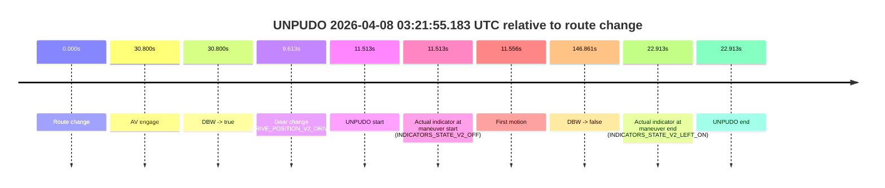
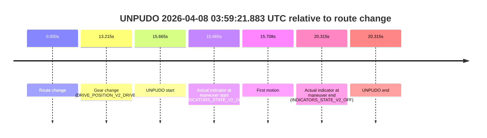
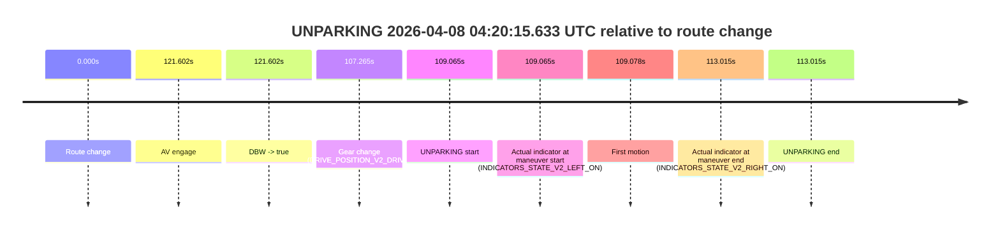

# Run Report: fme10003/2026-04-08--03-00-38--gen2-av-ab66eb4f-59cc-4c20-94a3-358b77d91256

| Field | Value |
|---|---|
| Run ID | `fme10003/2026-04-08--03-00-38--gen2-av-ab66eb4f-59cc-4c20-94a3-358b77d91256` |
| Date | `2026-04-08` |
| Model(s) | `lively-orange-horse` |
| Author | `guy.geva` |
| Event count | `9` |

## unpudo 2026-04-08 03:19:19.733 UTC

| Field | Value |
|---|---|
| Model | `lively-orange-horse` |
| Author | `guy.geva` |
| Run ID | `fme10003/2026-04-08--03-00-38--gen2-av-ab66eb4f-59cc-4c20-94a3-358b77d91256` |
| Date | `2026-04-08` |
| Time (UTC) | `03:19:19.733` |
| Event type | `unpudo` |
| Disengagement type | `none observed` |
| Route change | `found` |
| Console | [run](https://console.sso.wayve.ai/run/fme10003/2026-04-08--03-00-38--gen2-av-ab66eb4f-59cc-4c20-94a3-358b77d91256?id=&time-unixus=1775618359733311) |
| Foxglove | [segment](https://app.foxglove.dev/wayve-on-prem/p/prj_0dX18KZdVHg1fmmI/view?ds=foxglove-stream&ds.deviceName=fme10003&ds.start=2026-04-08T03%3A18%3A38.368308Z&ds.end=2026-04-08T03%3A19%3A29.733311Z&layoutId=lay_0e7VD4WIKDQGU73Y&time=2026-04-08T03%3A19%3A19.733311Z) |

### Event card: non-av

- Non-AV: the detected unpudo starts outside AV ownership, so it is kept for coverage but excluded from model success / failure scoring.

| Event | Time (UTC) | Delta from route change |
|---|---:|---:|
| Route change | 2026-04-08 03:18:48.368 | `0.000s` |
| Gear change (DRIVE_POSITION_V2_REVERSE) | 2026-04-08 03:19:10.533 | `22.165s` |
| UNPUDO start | 2026-04-08 03:19:19.733 | `31.365s` |
| Actual indicator at maneuver start (INDICATORS_STATE_V2_OFF) | 2026-04-08 03:19:19.733 | `31.365s` |
| First motion | 2026-04-08 03:19:28.106 | `39.738s` |
| Actual indicator at maneuver end (INDICATORS_STATE_V2_OFF) | 2026-04-08 03:19:19.733 | `31.365s` |
| UNPUDO end | 2026-04-08 03:19:19.733 | `31.365s` |

| Metric | Value |
|---|---|
| Outcome | `non-av` |
| Effective failure type | `none` |
| Route change status | `found` |
| DBW at event start | `false` |
| DBW at event end | `false` |
| Predicted gear at AV start | `n/a` |
| Actual gear at AV start | `n/a` |
| Predicted gear at event start | `DRIVE_POSITION_V2_DRIVE` |
| Actual gear at event start | `DRIVE_POSITION_V2_REVERSE` |
| Planned indicator direction | `INDICATORS_STATE_V2_OFF` |
| Controller indicator direction | `INDICATORS_STATE_V2_OFF` |
| Actual indicator direction | `INDICATORS_STATE_V2_OFF` |
| Actual indicator at maneuver end | `INDICATORS_STATE_V2_OFF` |
| Driver accel help in AV | `false` |
| Driver accel help timestamp | `n/a` |
| Max accel pedal pct in AV | `0.0%` |
| Max brake pedal pct in AV | `0.0%` |
| Max speed mps in AV | `0.000` |
| Route -> AV | `n/a` |
| AV -> event start | `n/a` |
| AV -> first motion | `n/a` |
| AV duration before disengagement | `n/a` |
| Trajectory waypoint count | `36` |
| Driving-plan step count | `11` |

The scored portion starts from the AV-owned window, not from the pre-AV setup. Route-change search in the stopped pre-event segment was `found`, with the baseline therefore set to route change. At the event anchor the model predicts `DRIVE_POSITION_V2_DRIVE` and the actual gear is `DRIVE_POSITION_V2_REVERSE`. The effective model outcome is `non-av` because `the event does not begin in AV ownership`.

### Resolution

| Field | Value |
|---|---|
| Final outcome | `non-av` |
| Do we agree with this label? | `yes` |
| Source disengagement type | `none observed` |
| Resolved effective failure type | `none` |
| Confidence | `high` |

## unpudo 2026-04-08 03:21:55.183 UTC

| Field | Value |
|---|---|
| Model | `lively-orange-horse` |
| Author | `guy.geva` |
| Run ID | `fme10003/2026-04-08--03-00-38--gen2-av-ab66eb4f-59cc-4c20-94a3-358b77d91256` |
| Date | `2026-04-08` |
| Time (UTC) | `03:21:55.183` |
| Event type | `unpudo` |
| Disengagement type | `failed_to_unpudo` |
| Route change | `found` |
| Console | [run](https://console.sso.wayve.ai/run/fme10003/2026-04-08--03-00-38--gen2-av-ab66eb4f-59cc-4c20-94a3-358b77d91256?id=&time-unixus=1775618515183306) |
| Foxglove | [segment](https://app.foxglove.dev/wayve-on-prem/p/prj_0dX18KZdVHg1fmmI/view?ds=foxglove-stream&ds.deviceName=fme10003&ds.start=2026-04-08T03%3A21%3A33.670084Z&ds.end=2026-04-08T03%3A24%3A20.531023Z&layoutId=lay_0e7VD4WIKDQGU73Y&time=2026-04-08T03%3A21%3A55.183306Z) |

### Event card: accidental

- Accidental: AV ownership is present for less than `2s`, so this is treated as an accidental brush with the maneuver rather than a meaningful model attempt.

| Event | Time (UTC) | Delta from route change |
|---|---:|---:|
| Route change | 2026-04-08 03:21:43.670 | `0.000s` |
| AV engage | 2026-04-08 03:22:14.470 | `30.800s` |
| DBW -> true | 2026-04-08 03:22:14.470 | `30.800s` |
| Gear change (DRIVE_POSITION_V2_DRIVE) | 2026-04-08 03:21:53.283 | `9.613s` |
| UNPUDO start | 2026-04-08 03:21:55.183 | `11.513s` |
| Actual indicator at maneuver start (INDICATORS_STATE_V2_OFF) | 2026-04-08 03:21:55.183 | `11.513s` |
| First motion | 2026-04-08 03:21:55.225 | `11.556s` |
| DBW -> false | 2026-04-08 03:24:10.531 | `146.861s` |
| Actual indicator at maneuver end (INDICATORS_STATE_V2_LEFT_ON) | 2026-04-08 03:22:06.583 | `22.913s` |
| UNPUDO end | 2026-04-08 03:22:06.583 | `22.913s` |

| Metric | Value |
|---|---|
| Outcome | `accidental` |
| Effective failure type | `none` |
| Route change status | `found` |
| DBW at event start | `false` |
| DBW at event end | `false` |
| Predicted gear at AV start | `DRIVE_POSITION_V2_DRIVE` |
| Actual gear at AV start | `DRIVE_POSITION_V2_DRIVE` |
| Predicted gear at event start | `DRIVE_POSITION_V2_DRIVE` |
| Actual gear at event start | `DRIVE_POSITION_V2_DRIVE` |
| Planned indicator direction | `INDICATORS_STATE_V2_OFF` |
| Controller indicator direction | `INDICATORS_STATE_V2_OFF` |
| Actual indicator direction | `INDICATORS_STATE_V2_OFF` |
| Actual indicator at maneuver end | `INDICATORS_STATE_V2_LEFT_ON` |
| Driver accel help in AV | `false` |
| Driver accel help timestamp | `n/a` |
| Max accel pedal pct in AV | `0.0%` |
| Max brake pedal pct in AV | `0.0%` |
| Max speed mps in AV | `0.000` |
| Route -> AV | `30.800s` |
| AV -> event start | `-19.287s` |
| AV -> first motion | `-19.245s` |
| AV duration before disengagement | `116.061s` |
| Trajectory waypoint count | `37` |
| Driving-plan step count | `11` |

The scored portion starts from the AV-owned window, not from the pre-AV setup. Route-change search in the stopped pre-event segment was `found`, with the baseline therefore set to route change. At the event anchor the model predicts `DRIVE_POSITION_V2_DRIVE` and the actual gear is `DRIVE_POSITION_V2_DRIVE`. The effective model outcome is `accidental` because `the AV-owned portion is shorter than 2s`.

### Resolution

| Field | Value |
|---|---|
| Final outcome | `accidental` |
| Do we agree with this label? | `yes` |
| Source disengagement type | `failed_to_unpudo` |
| Resolved effective failure type | `none` |
| Confidence | `high` |

## unpudo 2026-04-08 03:24:19.283 UTC

| Field | Value |
|---|---|
| Model | `lively-orange-horse` |
| Author | `guy.geva` |
| Run ID | `fme10003/2026-04-08--03-00-38--gen2-av-ab66eb4f-59cc-4c20-94a3-358b77d91256` |
| Date | `2026-04-08` |
| Time (UTC) | `03:24:19.283` |
| Event type | `unpudo` |
| Disengagement type | `failed_to_unpudo` |
| Route change | `found` |
| Console | [run](https://console.sso.wayve.ai/run/fme10003/2026-04-08--03-00-38--gen2-av-ab66eb4f-59cc-4c20-94a3-358b77d91256?id=&time-unixus=1775618659283319) |
| Foxglove | [segment](https://app.foxglove.dev/wayve-on-prem/p/prj_0dX18KZdVHg1fmmI/view?ds=foxglove-stream&ds.deviceName=fme10003&ds.start=2026-04-08T03%3A23%3A52.768300Z&ds.end=2026-04-08T03%3A30%3A22.090402Z&layoutId=lay_0e7VD4WIKDQGU73Y&time=2026-04-08T03%3A24%3A19.283319Z) |

### Event card: accidental

- Accidental: AV ownership is present for less than `2s`, so this is treated as an accidental brush with the maneuver rather than a meaningful model attempt.

| Event | Time (UTC) | Delta from route change |
|---|---:|---:|
| Route change | 2026-04-08 03:24:02.768 | `0.000s` |
| AV engage | 2026-04-08 03:24:24.010 | `21.242s` |
| DBW -> true | 2026-04-08 03:24:24.010 | `21.242s` |
| Gear change (DRIVE_POSITION_V2_DRIVE) | 2026-04-08 03:24:13.883 | `11.115s` |
| UNPUDO start | 2026-04-08 03:24:19.283 | `16.515s` |
| Actual indicator at maneuver start (INDICATORS_STATE_V2_OFF) | 2026-04-08 03:24:19.283 | `16.515s` |
| First motion | 2026-04-08 03:24:19.406 | `16.638s` |
| DBW -> false | 2026-04-08 03:30:12.090 | `369.322s` |
| Actual indicator at maneuver end (INDICATORS_STATE_V2_OFF) | 2026-04-08 03:24:24.883 | `22.115s` |
| UNPUDO end | 2026-04-08 03:24:24.883 | `22.115s` |

| Metric | Value |
|---|---|
| Outcome | `accidental` |
| Effective failure type | `none` |
| Route change status | `found` |
| DBW at event start | `false` |
| DBW at event end | `true` |
| Predicted gear at AV start | `DRIVE_POSITION_V2_DRIVE` |
| Actual gear at AV start | `DRIVE_POSITION_V2_DRIVE` |
| Predicted gear at event start | `DRIVE_POSITION_V2_DRIVE` |
| Actual gear at event start | `DRIVE_POSITION_V2_DRIVE` |
| Planned indicator direction | `INDICATORS_STATE_V2_LEFT_ON` |
| Controller indicator direction | `INDICATORS_STATE_V2_LEFT_ON` |
| Actual indicator direction | `INDICATORS_STATE_V2_OFF` |
| Actual indicator at maneuver end | `INDICATORS_STATE_V2_OFF` |
| Driver accel help in AV | `false` |
| Driver accel help timestamp | `n/a` |
| Max accel pedal pct in AV | `0.0%` |
| Max brake pedal pct in AV | `0.0%` |
| Max speed mps in AV | `3.064` |
| Route -> AV | `21.242s` |
| AV -> event start | `-4.727s` |
| AV -> first motion | `-4.604s` |
| AV duration before disengagement | `348.080s` |
| Trajectory waypoint count | `37` |
| Driving-plan step count | `11` |

The scored portion starts from the AV-owned window, not from the pre-AV setup. Route-change search in the stopped pre-event segment was `found`, with the baseline therefore set to route change. At the event anchor the model predicts `DRIVE_POSITION_V2_DRIVE` and the actual gear is `DRIVE_POSITION_V2_DRIVE`. The effective model outcome is `accidental` because `the AV-owned portion is shorter than 2s`.

### Resolution

| Field | Value |
|---|---|
| Final outcome | `accidental` |
| Do we agree with this label? | `yes` |
| Source disengagement type | `failed_to_unpudo` |
| Resolved effective failure type | `none` |
| Confidence | `high` |

## unpudo 2026-04-08 03:38:43.683 UTC

| Field | Value |
|---|---|
| Model | `lively-orange-horse` |
| Author | `guy.geva` |
| Run ID | `fme10003/2026-04-08--03-00-38--gen2-av-ab66eb4f-59cc-4c20-94a3-358b77d91256` |
| Date | `2026-04-08` |
| Time (UTC) | `03:38:43.683` |
| Event type | `unpudo` |
| Disengagement type | `failed_to_unpudo` |
| Route change | `found` |
| Console | [run](https://console.sso.wayve.ai/run/fme10003/2026-04-08--03-00-38--gen2-av-ab66eb4f-59cc-4c20-94a3-358b77d91256?id=&time-unixus=1775619523683310) |
| Foxglove | [segment](https://app.foxglove.dev/wayve-on-prem/p/prj_0dX18KZdVHg1fmmI/view?ds=foxglove-stream&ds.deviceName=fme10003&ds.start=2026-04-08T03%3A38%3A15.868288Z&ds.end=2026-04-08T03%3A42%3A59.632514Z&layoutId=lay_0e7VD4WIKDQGU73Y&time=2026-04-08T03%3A38%3A43.683310Z) |

### Event card: accidental

- Accidental: AV ownership is present for less than `2s`, so this is treated as an accidental brush with the maneuver rather than a meaningful model attempt.

| Event | Time (UTC) | Delta from route change |
|---|---:|---:|
| Route change | 2026-04-08 03:38:25.868 | `0.000s` |
| AV engage | 2026-04-08 03:38:55.131 | `29.264s` |
| DBW -> true | 2026-04-08 03:38:55.131 | `29.264s` |
| Gear change (DRIVE_POSITION_V2_DRIVE) | 2026-04-08 03:38:41.483 | `15.615s` |
| UNPUDO start | 2026-04-08 03:38:43.683 | `17.815s` |
| Actual indicator at maneuver start (INDICATORS_STATE_V2_OFF) | 2026-04-08 03:38:43.683 | `17.815s` |
| First motion | 2026-04-08 03:38:43.705 | `17.837s` |
| DBW -> false | 2026-04-08 03:42:49.632 | `263.764s` |
| Actual indicator at maneuver end (INDICATORS_STATE_V2_OFF) | 2026-04-08 03:38:51.933 | `26.065s` |
| UNPUDO end | 2026-04-08 03:38:51.933 | `26.065s` |

| Metric | Value |
|---|---|
| Outcome | `accidental` |
| Effective failure type | `none` |
| Route change status | `found` |
| DBW at event start | `false` |
| DBW at event end | `false` |
| Predicted gear at AV start | `DRIVE_POSITION_V2_DRIVE` |
| Actual gear at AV start | `DRIVE_POSITION_V2_DRIVE` |
| Predicted gear at event start | `DRIVE_POSITION_V2_DRIVE` |
| Actual gear at event start | `DRIVE_POSITION_V2_DRIVE` |
| Planned indicator direction | `INDICATORS_STATE_V2_LEFT_ON` |
| Controller indicator direction | `INDICATORS_STATE_V2_LEFT_ON` |
| Actual indicator direction | `INDICATORS_STATE_V2_OFF` |
| Actual indicator at maneuver end | `INDICATORS_STATE_V2_OFF` |
| Driver accel help in AV | `false` |
| Driver accel help timestamp | `n/a` |
| Max accel pedal pct in AV | `0.0%` |
| Max brake pedal pct in AV | `0.0%` |
| Max speed mps in AV | `0.000` |
| Route -> AV | `29.264s` |
| AV -> event start | `-11.449s` |
| AV -> first motion | `-11.426s` |
| AV duration before disengagement | `234.501s` |
| Trajectory waypoint count | `37` |
| Driving-plan step count | `11` |

The scored portion starts from the AV-owned window, not from the pre-AV setup. Route-change search in the stopped pre-event segment was `found`, with the baseline therefore set to route change. At the event anchor the model predicts `DRIVE_POSITION_V2_DRIVE` and the actual gear is `DRIVE_POSITION_V2_DRIVE`. The effective model outcome is `accidental` because `the AV-owned portion is shorter than 2s`.

### Resolution

| Field | Value |
|---|---|
| Final outcome | `accidental` |
| Do we agree with this label? | `yes` |
| Source disengagement type | `failed_to_unpudo` |
| Resolved effective failure type | `none` |
| Confidence | `high` |

## unpudo 2026-04-08 03:49:22.233 UTC

| Field | Value |
|---|---|
| Model | `lively-orange-horse` |
| Author | `guy.geva` |
| Run ID | `fme10003/2026-04-08--03-00-38--gen2-av-ab66eb4f-59cc-4c20-94a3-358b77d91256` |
| Date | `2026-04-08` |
| Time (UTC) | `03:49:22.233` |
| Event type | `unpudo` |
| Disengagement type | `none observed` |
| Route change | `found` |
| Console | [run](https://console.sso.wayve.ai/run/fme10003/2026-04-08--03-00-38--gen2-av-ab66eb4f-59cc-4c20-94a3-358b77d91256?id=&time-unixus=1775620162233290) |
| Foxglove | [segment](https://app.foxglove.dev/wayve-on-prem/p/prj_0dX18KZdVHg1fmmI/view?ds=foxglove-stream&ds.deviceName=fme10003&ds.start=2026-04-08T03%3A49%3A05.268300Z&ds.end=2026-04-08T03%3A55%3A14.630376Z&layoutId=lay_0e7VD4WIKDQGU73Y&time=2026-04-08T03%3A49%3A22.233290Z) |

### Event card: accidental

- Accidental: AV ownership is present for less than `2s`, so this is treated as an accidental brush with the maneuver rather than a meaningful model attempt.

| Event | Time (UTC) | Delta from route change |
|---|---:|---:|
| Route change | 2026-04-08 03:49:15.268 | `0.000s` |
| AV engage | 2026-04-08 03:49:52.191 | `36.923s` |
| DBW -> true | 2026-04-08 03:49:52.191 | `36.923s` |
| Gear change (DRIVE_POSITION_V2_DRIVE) | 2026-04-08 03:49:20.783 | `5.515s` |
| UNPUDO start | 2026-04-08 03:49:22.233 | `6.965s` |
| Actual indicator at maneuver start (INDICATORS_STATE_V2_OFF) | 2026-04-08 03:49:22.233 | `6.965s` |
| First motion | 2026-04-08 03:49:22.285 | `7.017s` |
| DBW -> false | 2026-04-08 03:55:04.630 | `349.362s` |
| Actual indicator at maneuver end (INDICATORS_STATE_V2_OFF) | 2026-04-08 03:49:43.683 | `28.415s` |
| UNPUDO end | 2026-04-08 03:49:43.683 | `28.415s` |

| Metric | Value |
|---|---|
| Outcome | `accidental` |
| Effective failure type | `none` |
| Route change status | `found` |
| DBW at event start | `false` |
| DBW at event end | `false` |
| Predicted gear at AV start | `DRIVE_POSITION_V2_DRIVE` |
| Actual gear at AV start | `DRIVE_POSITION_V2_DRIVE` |
| Predicted gear at event start | `DRIVE_POSITION_V2_DRIVE` |
| Actual gear at event start | `DRIVE_POSITION_V2_DRIVE` |
| Planned indicator direction | `INDICATORS_STATE_V2_OFF` |
| Controller indicator direction | `INDICATORS_STATE_V2_OFF` |
| Actual indicator direction | `INDICATORS_STATE_V2_OFF` |
| Actual indicator at maneuver end | `INDICATORS_STATE_V2_OFF` |
| Driver accel help in AV | `false` |
| Driver accel help timestamp | `n/a` |
| Max accel pedal pct in AV | `0.0%` |
| Max brake pedal pct in AV | `0.0%` |
| Max speed mps in AV | `0.000` |
| Route -> AV | `36.923s` |
| AV -> event start | `-29.958s` |
| AV -> first motion | `-29.906s` |
| AV duration before disengagement | `312.439s` |
| Trajectory waypoint count | `36` |
| Driving-plan step count | `11` |

The scored portion starts from the AV-owned window, not from the pre-AV setup. Route-change search in the stopped pre-event segment was `found`, with the baseline therefore set to route change. At the event anchor the model predicts `DRIVE_POSITION_V2_DRIVE` and the actual gear is `DRIVE_POSITION_V2_DRIVE`. The effective model outcome is `accidental` because `the AV-owned portion is shorter than 2s`.

### Resolution

| Field | Value |
|---|---|
| Final outcome | `accidental` |
| Do we agree with this label? | `yes` |
| Source disengagement type | `none observed` |
| Resolved effective failure type | `none` |
| Confidence | `high` |

## unpudo 2026-04-08 03:57:39.583 UTC

| Field | Value |
|---|---|
| Model | `lively-orange-horse` |
| Author | `guy.geva` |
| Run ID | `fme10003/2026-04-08--03-00-38--gen2-av-ab66eb4f-59cc-4c20-94a3-358b77d91256` |
| Date | `2026-04-08` |
| Time (UTC) | `03:57:39.583` |
| Event type | `unpudo` |
| Disengagement type | `failed_to_unpudo` |
| Route change | `found` |
| Console | [run](https://console.sso.wayve.ai/run/fme10003/2026-04-08--03-00-38--gen2-av-ab66eb4f-59cc-4c20-94a3-358b77d91256?id=&time-unixus=1775620659583319) |
| Foxglove | [segment](https://app.foxglove.dev/wayve-on-prem/p/prj_0dX18KZdVHg1fmmI/view?ds=foxglove-stream&ds.deviceName=fme10003&ds.start=2026-04-08T03%3A57%3A06.468254Z&ds.end=2026-04-08T03%3A59%3A26.251096Z&layoutId=lay_0e7VD4WIKDQGU73Y&time=2026-04-08T03%3A57%3A39.583319Z) |

### Event card: accidental

- Accidental: AV ownership is present for less than `2s`, so this is treated as an accidental brush with the maneuver rather than a meaningful model attempt.

| Event | Time (UTC) | Delta from route change |
|---|---:|---:|
| Route change | 2026-04-08 03:57:16.468 | `0.000s` |
| AV engage | 2026-04-08 03:57:47.391 | `30.923s` |
| DBW -> true | 2026-04-08 03:57:47.391 | `30.923s` |
| Gear change (DRIVE_POSITION_V2_DRIVE) | 2026-04-08 03:57:36.783 | `20.315s` |
| UNPUDO start | 2026-04-08 03:57:39.583 | `23.115s` |
| Actual indicator at maneuver start (INDICATORS_STATE_V2_RIGHT_ON) | 2026-04-08 03:57:39.583 | `23.115s` |
| First motion | 2026-04-08 03:57:39.605 | `23.138s` |
| DBW -> false | 2026-04-08 03:59:16.251 | `119.783s` |
| Actual indicator at maneuver end (INDICATORS_STATE_V2_OFF) | 2026-04-08 03:57:45.133 | `28.665s` |
| UNPUDO end | 2026-04-08 03:57:45.133 | `28.665s` |

| Metric | Value |
|---|---|
| Outcome | `accidental` |
| Effective failure type | `none` |
| Route change status | `found` |
| DBW at event start | `false` |
| DBW at event end | `false` |
| Predicted gear at AV start | `DRIVE_POSITION_V2_DRIVE` |
| Actual gear at AV start | `DRIVE_POSITION_V2_DRIVE` |
| Predicted gear at event start | `DRIVE_POSITION_V2_DRIVE` |
| Actual gear at event start | `DRIVE_POSITION_V2_DRIVE` |
| Planned indicator direction | `INDICATORS_STATE_V2_RIGHT_ON` |
| Controller indicator direction | `INDICATORS_STATE_V2_RIGHT_ON` |
| Actual indicator direction | `INDICATORS_STATE_V2_RIGHT_ON` |
| Actual indicator at maneuver end | `INDICATORS_STATE_V2_OFF` |
| Driver accel help in AV | `false` |
| Driver accel help timestamp | `n/a` |
| Max accel pedal pct in AV | `0.0%` |
| Max brake pedal pct in AV | `0.0%` |
| Max speed mps in AV | `0.000` |
| Route -> AV | `30.923s` |
| AV -> event start | `-7.808s` |
| AV -> first motion | `-7.785s` |
| AV duration before disengagement | `88.860s` |
| Trajectory waypoint count | `37` |
| Driving-plan step count | `11` |

The scored portion starts from the AV-owned window, not from the pre-AV setup. Route-change search in the stopped pre-event segment was `found`, with the baseline therefore set to route change. At the event anchor the model predicts `DRIVE_POSITION_V2_DRIVE` and the actual gear is `DRIVE_POSITION_V2_DRIVE`. The effective model outcome is `accidental` because `the AV-owned portion is shorter than 2s`.

### Resolution

| Field | Value |
|---|---|
| Final outcome | `accidental` |
| Do we agree with this label? | `yes` |
| Source disengagement type | `failed_to_unpudo` |
| Resolved effective failure type | `none` |
| Confidence | `high` |

## unpudo 2026-04-08 03:59:21.883 UTC

| Field | Value |
|---|---|
| Model | `lively-orange-horse` |
| Author | `guy.geva` |
| Run ID | `fme10003/2026-04-08--03-00-38--gen2-av-ab66eb4f-59cc-4c20-94a3-358b77d91256` |
| Date | `2026-04-08` |
| Time (UTC) | `03:59:21.883` |
| Event type | `unpudo` |
| Disengagement type | `failed_to_unpudo` |
| Route change | `found` |
| Console | [run](https://console.sso.wayve.ai/run/fme10003/2026-04-08--03-00-38--gen2-av-ab66eb4f-59cc-4c20-94a3-358b77d91256?id=&time-unixus=1775620761883319) |
| Foxglove | [segment](https://app.foxglove.dev/wayve-on-prem/p/prj_0dX18KZdVHg1fmmI/view?ds=foxglove-stream&ds.deviceName=fme10003&ds.start=2026-04-08T03%3A58%3A56.218250Z&ds.end=2026-04-08T03%3A59%3A36.533304Z&layoutId=lay_0e7VD4WIKDQGU73Y&time=2026-04-08T03%3A59%3A21.883319Z) |

### Event card: non-av

- Non-AV: the detected unpudo starts outside AV ownership, so it is kept for coverage but excluded from model success / failure scoring.

| Event | Time (UTC) | Delta from route change |
|---|---:|---:|
| Route change | 2026-04-08 03:59:06.218 | `0.000s` |
| Gear change (DRIVE_POSITION_V2_DRIVE) | 2026-04-08 03:59:19.433 | `13.215s` |
| UNPUDO start | 2026-04-08 03:59:21.883 | `15.665s` |
| Actual indicator at maneuver start (INDICATORS_STATE_V2_OFF) | 2026-04-08 03:59:21.883 | `15.665s` |
| First motion | 2026-04-08 03:59:21.926 | `15.708s` |
| Actual indicator at maneuver end (INDICATORS_STATE_V2_OFF) | 2026-04-08 03:59:26.533 | `20.315s` |
| UNPUDO end | 2026-04-08 03:59:26.533 | `20.315s` |

| Metric | Value |
|---|---|
| Outcome | `non-av` |
| Effective failure type | `none` |
| Route change status | `found` |
| DBW at event start | `false` |
| DBW at event end | `false` |
| Predicted gear at AV start | `n/a` |
| Actual gear at AV start | `n/a` |
| Predicted gear at event start | `DRIVE_POSITION_V2_DRIVE` |
| Actual gear at event start | `DRIVE_POSITION_V2_DRIVE` |
| Planned indicator direction | `INDICATORS_STATE_V2_OFF` |
| Controller indicator direction | `INDICATORS_STATE_V2_OFF` |
| Actual indicator direction | `INDICATORS_STATE_V2_OFF` |
| Actual indicator at maneuver end | `INDICATORS_STATE_V2_OFF` |
| Driver accel help in AV | `false` |
| Driver accel help timestamp | `n/a` |
| Max accel pedal pct in AV | `0.0%` |
| Max brake pedal pct in AV | `0.0%` |
| Max speed mps in AV | `0.000` |
| Route -> AV | `n/a` |
| AV -> event start | `n/a` |
| AV -> first motion | `n/a` |
| AV duration before disengagement | `n/a` |
| Trajectory waypoint count | `37` |
| Driving-plan step count | `11` |

The scored portion starts from the AV-owned window, not from the pre-AV setup. Route-change search in the stopped pre-event segment was `found`, with the baseline therefore set to route change. At the event anchor the model predicts `DRIVE_POSITION_V2_DRIVE` and the actual gear is `DRIVE_POSITION_V2_DRIVE`. The effective model outcome is `non-av` because `the event does not begin in AV ownership`.

### Resolution

| Field | Value |
|---|---|
| Final outcome | `non-av` |
| Do we agree with this label? | `yes` |
| Source disengagement type | `failed_to_unpudo` |
| Resolved effective failure type | `none` |
| Confidence | `high` |

## unpudo 2026-04-08 04:16:51.933 UTC

| Field | Value |
|---|---|
| Model | `lively-orange-horse` |
| Author | `guy.geva` |
| Run ID | `fme10003/2026-04-08--03-00-38--gen2-av-ab66eb4f-59cc-4c20-94a3-358b77d91256` |
| Date | `2026-04-08` |
| Time (UTC) | `04:16:51.933` |
| Event type | `unpudo` |
| Disengagement type | `failed_to_unpudo` |
| Route change | `found` |
| Console | [run](https://console.sso.wayve.ai/run/fme10003/2026-04-08--03-00-38--gen2-av-ab66eb4f-59cc-4c20-94a3-358b77d91256?id=&time-unixus=1775621811933300) |
| Foxglove | [segment](https://app.foxglove.dev/wayve-on-prem/p/prj_0dX18KZdVHg1fmmI/view?ds=foxglove-stream&ds.deviceName=fme10003&ds.start=2026-04-08T04%3A16%3A25.968257Z&ds.end=2026-04-08T04%3A17%3A54.130315Z&layoutId=lay_0e7VD4WIKDQGU73Y&time=2026-04-08T04%3A16%3A51.933300Z) |

### Event card: accidental

- Accidental: AV ownership is present for less than `2s`, so this is treated as an accidental brush with the maneuver rather than a meaningful model attempt.

| Event | Time (UTC) | Delta from route change |
|---|---:|---:|
| Route change | 2026-04-08 04:16:35.968 | `0.000s` |
| AV engage | 2026-04-08 04:17:23.071 | `47.104s` |
| DBW -> true | 2026-04-08 04:17:23.071 | `47.104s` |
| Gear change (DRIVE_POSITION_V2_DRIVE) | 2026-04-08 04:16:48.733 | `12.765s` |
| UNPUDO start | 2026-04-08 04:16:51.933 | `15.965s` |
| Actual indicator at maneuver start (INDICATORS_STATE_V2_OFF) | 2026-04-08 04:16:51.933 | `15.965s` |
| First motion | 2026-04-08 04:16:51.945 | `15.978s` |
| DBW -> false | 2026-04-08 04:17:44.130 | `68.162s` |
| Actual indicator at maneuver end (INDICATORS_STATE_V2_RIGHT_ON) | 2026-04-08 04:17:19.233 | `43.265s` |
| UNPUDO end | 2026-04-08 04:17:19.233 | `43.265s` |

| Metric | Value |
|---|---|
| Outcome | `accidental` |
| Effective failure type | `none` |
| Route change status | `found` |
| DBW at event start | `false` |
| DBW at event end | `false` |
| Predicted gear at AV start | `DRIVE_POSITION_V2_DRIVE` |
| Actual gear at AV start | `DRIVE_POSITION_V2_DRIVE` |
| Predicted gear at event start | `DRIVE_POSITION_V2_DRIVE` |
| Actual gear at event start | `DRIVE_POSITION_V2_DRIVE` |
| Planned indicator direction | `INDICATORS_STATE_V2_OFF` |
| Controller indicator direction | `INDICATORS_STATE_V2_OFF` |
| Actual indicator direction | `INDICATORS_STATE_V2_OFF` |
| Actual indicator at maneuver end | `INDICATORS_STATE_V2_RIGHT_ON` |
| Driver accel help in AV | `false` |
| Driver accel help timestamp | `n/a` |
| Max accel pedal pct in AV | `0.0%` |
| Max brake pedal pct in AV | `0.0%` |
| Max speed mps in AV | `0.000` |
| Route -> AV | `47.104s` |
| AV -> event start | `-31.138s` |
| AV -> first motion | `-31.126s` |
| AV duration before disengagement | `21.059s` |
| Trajectory waypoint count | `36` |
| Driving-plan step count | `11` |

The scored portion starts from the AV-owned window, not from the pre-AV setup. Route-change search in the stopped pre-event segment was `found`, with the baseline therefore set to route change. At the event anchor the model predicts `DRIVE_POSITION_V2_DRIVE` and the actual gear is `DRIVE_POSITION_V2_DRIVE`. The effective model outcome is `accidental` because `the AV-owned portion is shorter than 2s`.

### Resolution

| Field | Value |
|---|---|
| Final outcome | `accidental` |
| Do we agree with this label? | `yes` |
| Source disengagement type | `failed_to_unpudo` |
| Resolved effective failure type | `none` |
| Confidence | `high` |

## unparking 2026-04-08 04:20:15.633 UTC

| Field | Value |
|---|---|
| Model | `lively-orange-horse` |
| Author | `guy.geva` |
| Run ID | `fme10003/2026-04-08--03-00-38--gen2-av-ab66eb4f-59cc-4c20-94a3-358b77d91256` |
| Date | `2026-04-08` |
| Time (UTC) | `04:20:15.633` |
| Event type | `unparking` |
| Disengagement type | `failed_to_unpudo` |
| Route change | `found` |
| Console | [run](https://console.sso.wayve.ai/run/fme10003/2026-04-08--03-00-38--gen2-av-ab66eb4f-59cc-4c20-94a3-358b77d91256?id=&time-unixus=1775622015633321) |
| Foxglove | [segment](https://app.foxglove.dev/wayve-on-prem/p/prj_0dX18KZdVHg1fmmI/view?ds=foxglove-stream&ds.deviceName=fme10003&ds.start=2026-04-08T04%3A18%3A16.568234Z&ds.end=2026-04-08T04%3A20%3A29.583315Z&layoutId=lay_0e7VD4WIKDQGU73Y&time=2026-04-08T04%3A20%3A15.633321Z) |

### Event card: accidental

- Accidental: AV ownership is present for less than `2s`, so this is treated as an accidental brush with the maneuver rather than a meaningful model attempt.

| Event | Time (UTC) | Delta from route change |
|---|---:|---:|
| Route change | 2026-04-08 04:18:26.568 | `0.000s` |
| AV engage | 2026-04-08 04:20:28.170 | `121.602s` |
| DBW -> true | 2026-04-08 04:20:28.170 | `121.602s` |
| Gear change (DRIVE_POSITION_V2_DRIVE) | 2026-04-08 04:20:13.833 | `107.265s` |
| UNPARKING start | 2026-04-08 04:20:15.633 | `109.065s` |
| Actual indicator at maneuver start (INDICATORS_STATE_V2_LEFT_ON) | 2026-04-08 04:20:15.633 | `109.065s` |
| First motion | 2026-04-08 04:20:15.646 | `109.078s` |
| Actual indicator at maneuver end (INDICATORS_STATE_V2_RIGHT_ON) | 2026-04-08 04:20:19.583 | `113.015s` |
| UNPARKING end | 2026-04-08 04:20:19.583 | `113.015s` |

| Metric | Value |
|---|---|
| Outcome | `accidental` |
| Effective failure type | `none` |
| Route change status | `found` |
| DBW at event start | `false` |
| DBW at event end | `false` |
| Predicted gear at AV start | `DRIVE_POSITION_V2_DRIVE` |
| Actual gear at AV start | `DRIVE_POSITION_V2_DRIVE` |
| Predicted gear at event start | `DRIVE_POSITION_V2_DRIVE` |
| Actual gear at event start | `DRIVE_POSITION_V2_DRIVE` |
| Planned indicator direction | `INDICATORS_STATE_V2_LEFT_ON` |
| Controller indicator direction | `INDICATORS_STATE_V2_LEFT_ON` |
| Actual indicator direction | `INDICATORS_STATE_V2_LEFT_ON` |
| Actual indicator at maneuver end | `INDICATORS_STATE_V2_RIGHT_ON` |
| Driver accel help in AV | `false` |
| Driver accel help timestamp | `n/a` |
| Max accel pedal pct in AV | `0.0%` |
| Max brake pedal pct in AV | `0.0%` |
| Max speed mps in AV | `0.000` |
| Route -> AV | `121.602s` |
| AV -> event start | `-12.537s` |
| AV -> first motion | `-12.524s` |
| AV duration before disengagement | `n/a` |
| Trajectory waypoint count | `36` |
| Driving-plan step count | `11` |

The scored portion starts from the AV-owned window, not from the pre-AV setup. Route-change search in the stopped pre-event segment was `found`, with the baseline therefore set to route change. At the event anchor the model predicts `DRIVE_POSITION_V2_DRIVE` and the actual gear is `DRIVE_POSITION_V2_DRIVE`. The effective model outcome is `accidental` because `the AV-owned portion is shorter than 2s`.

### Resolution

| Field | Value |
|---|---|
| Final outcome | `accidental` |
| Do we agree with this label? | `yes` |
| Source disengagement type | `failed_to_unpudo` |
| Resolved effective failure type | `none` |
| Confidence | `high` |
