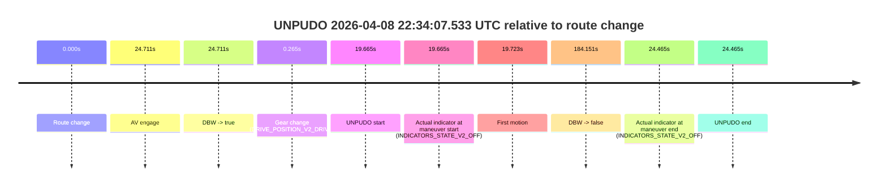
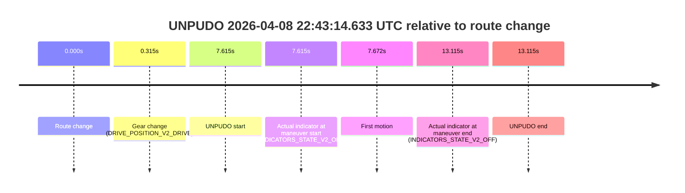
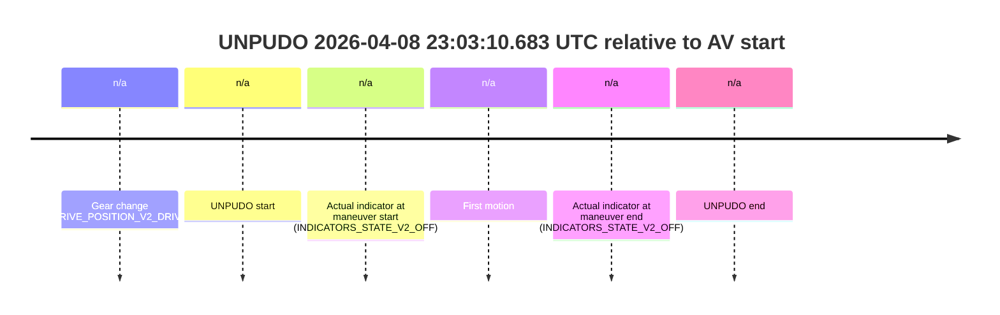
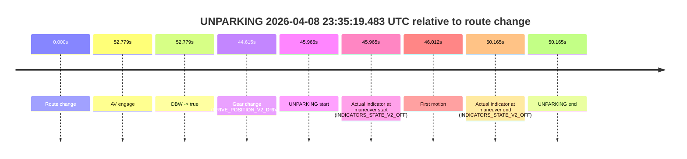

# Run Report: fme10003/2026-04-08--22-12-18--gen2-av-13023eb2-6ca1-4bc7-8aff-40841b6dbdd8

| Field | Value |
|---|---|
| Run ID | `fme10003/2026-04-08--22-12-18--gen2-av-13023eb2-6ca1-4bc7-8aff-40841b6dbdd8` |
| Date | `2026-04-08` |
| Model(s) | `lively-orange-horse` |
| Author | `guy.geva` |
| Event count | `14` |

## unpudo 2026-04-08 22:23:07.633 UTC

| Field | Value |
|---|---|
| Model | `lively-orange-horse` |
| Author | `guy.geva` |
| Run ID | `fme10003/2026-04-08--22-12-18--gen2-av-13023eb2-6ca1-4bc7-8aff-40841b6dbdd8` |
| Date | `2026-04-08` |
| Time (UTC) | `22:23:07.633` |
| Event type | `unpudo` |
| Disengagement type | `failed_to_unpudo` |
| Route change | `found` |
| Console | [run](https://console.sso.wayve.ai/run/fme10003/2026-04-08--22-12-18--gen2-av-13023eb2-6ca1-4bc7-8aff-40841b6dbdd8?id=&time-unixus=1775686987633297) |
| Foxglove | [segment](https://app.foxglove.dev/wayve-on-prem/p/prj_0dX18KZdVHg1fmmI/view?ds=foxglove-stream&ds.deviceName=fme10003&ds.start=2026-04-08T22%3A22%3A43.118266Z&ds.end=2026-04-08T22%3A23%3A31.033304Z&layoutId=lay_0e7VD4WIKDQGU73Y&time=2026-04-08T22%3A23%3A07.633297Z) |

### Event card: non-av

- Non-AV: the detected unpudo starts outside AV ownership, so it is kept for coverage but excluded from model success / failure scoring.

| Event | Time (UTC) | Delta from route change |
|---|---:|---:|
| Route change | 2026-04-08 22:22:53.118 | `0.000s` |
| Gear change (DRIVE_POSITION_V2_DRIVE) | 2026-04-08 22:22:53.383 | `0.265s` |
| UNPUDO start | 2026-04-08 22:23:07.633 | `14.515s` |
| Actual indicator at maneuver start (INDICATORS_STATE_V2_OFF) | 2026-04-08 22:23:07.633 | `14.515s` |
| First motion | 2026-04-08 22:23:07.690 | `14.572s` |
| Actual indicator at maneuver end (INDICATORS_STATE_V2_OFF) | 2026-04-08 22:23:21.033 | `27.915s` |
| UNPUDO end | 2026-04-08 22:23:21.033 | `27.915s` |

| Metric | Value |
|---|---|
| Outcome | `non-av` |
| Effective failure type | `none` |
| Route change status | `found` |
| DBW at event start | `false` |
| DBW at event end | `false` |
| Predicted gear at AV start | `n/a` |
| Actual gear at AV start | `n/a` |
| Predicted gear at event start | `DRIVE_POSITION_V2_DRIVE` |
| Actual gear at event start | `DRIVE_POSITION_V2_DRIVE` |
| Planned indicator direction | `INDICATORS_STATE_V2_OFF` |
| Controller indicator direction | `INDICATORS_STATE_V2_OFF` |
| Actual indicator direction | `INDICATORS_STATE_V2_OFF` |
| Actual indicator at maneuver end | `INDICATORS_STATE_V2_OFF` |
| Driver accel help in AV | `false` |
| Driver accel help timestamp | `n/a` |
| Max accel pedal pct in AV | `0.0%` |
| Max brake pedal pct in AV | `0.0%` |
| Max speed mps in AV | `0.000` |
| Route -> AV | `n/a` |
| AV -> event start | `n/a` |
| AV -> first motion | `n/a` |
| AV duration before disengagement | `n/a` |
| Trajectory waypoint count | `37` |
| Driving-plan step count | `11` |

The scored portion starts from the AV-owned window, not from the pre-AV setup. Route-change search in the stopped pre-event segment was `found`, with the baseline therefore set to route change. At the event anchor the model predicts `DRIVE_POSITION_V2_DRIVE` and the actual gear is `DRIVE_POSITION_V2_DRIVE`. The effective model outcome is `non-av` because `the event does not begin in AV ownership`.

### Resolution

| Field | Value |
|---|---|
| Final outcome | `non-av` |
| Do we agree with this label? | `yes` |
| Source disengagement type | `failed_to_unpudo` |
| Resolved effective failure type | `none` |
| Confidence | `high` |

## unpudo 2026-04-08 22:25:53.333 UTC

| Field | Value |
|---|---|
| Model | `lively-orange-horse` |
| Author | `guy.geva` |
| Run ID | `fme10003/2026-04-08--22-12-18--gen2-av-13023eb2-6ca1-4bc7-8aff-40841b6dbdd8` |
| Date | `2026-04-08` |
| Time (UTC) | `22:25:53.333` |
| Event type | `unpudo` |
| Disengagement type | `failed_to_unpudo` |
| Route change | `found` |
| Console | [run](https://console.sso.wayve.ai/run/fme10003/2026-04-08--22-12-18--gen2-av-13023eb2-6ca1-4bc7-8aff-40841b6dbdd8?id=&time-unixus=1775687153333303) |
| Foxglove | [segment](https://app.foxglove.dev/wayve-on-prem/p/prj_0dX18KZdVHg1fmmI/view?ds=foxglove-stream&ds.deviceName=fme10003&ds.start=2026-04-08T22%3A25%3A24.268255Z&ds.end=2026-04-08T22%3A27%3A50.497972Z&layoutId=lay_0e7VD4WIKDQGU73Y&time=2026-04-08T22%3A25%3A53.333303Z) |

### Event card: accidental

- Accidental: AV ownership is present for less than `2s`, so this is treated as an accidental brush with the maneuver rather than a meaningful model attempt.

| Event | Time (UTC) | Delta from route change |
|---|---:|---:|
| Route change | 2026-04-08 22:25:34.268 | `0.000s` |
| AV engage | 2026-04-08 22:26:09.817 | `35.549s` |
| DBW -> true | 2026-04-08 22:26:09.817 | `35.549s` |
| Gear change (DRIVE_POSITION_V2_DRIVE) | 2026-04-08 22:25:35.533 | `1.265s` |
| UNPUDO start | 2026-04-08 22:25:53.333 | `19.065s` |
| Actual indicator at maneuver start (INDICATORS_STATE_V2_OFF) | 2026-04-08 22:25:53.333 | `19.065s` |
| First motion | 2026-04-08 22:25:53.471 | `19.203s` |
| DBW -> false | 2026-04-08 22:27:40.497 | `126.230s` |
| Actual indicator at maneuver end (INDICATORS_STATE_V2_OFF) | 2026-04-08 22:25:58.683 | `24.415s` |
| UNPUDO end | 2026-04-08 22:25:58.683 | `24.415s` |

| Metric | Value |
|---|---|
| Outcome | `accidental` |
| Effective failure type | `none` |
| Route change status | `found` |
| DBW at event start | `false` |
| DBW at event end | `false` |
| Predicted gear at AV start | `DRIVE_POSITION_V2_DRIVE` |
| Actual gear at AV start | `DRIVE_POSITION_V2_DRIVE` |
| Predicted gear at event start | `DRIVE_POSITION_V2_DRIVE` |
| Actual gear at event start | `DRIVE_POSITION_V2_DRIVE` |
| Planned indicator direction | `INDICATORS_STATE_V2_LEFT_ON` |
| Controller indicator direction | `INDICATORS_STATE_V2_LEFT_ON` |
| Actual indicator direction | `INDICATORS_STATE_V2_OFF` |
| Actual indicator at maneuver end | `INDICATORS_STATE_V2_OFF` |
| Driver accel help in AV | `false` |
| Driver accel help timestamp | `n/a` |
| Max accel pedal pct in AV | `0.0%` |
| Max brake pedal pct in AV | `0.0%` |
| Max speed mps in AV | `0.000` |
| Route -> AV | `35.549s` |
| AV -> event start | `-16.484s` |
| AV -> first motion | `-16.346s` |
| AV duration before disengagement | `90.680s` |
| Trajectory waypoint count | `35` |
| Driving-plan step count | `11` |

The scored portion starts from the AV-owned window, not from the pre-AV setup. Route-change search in the stopped pre-event segment was `found`, with the baseline therefore set to route change. At the event anchor the model predicts `DRIVE_POSITION_V2_DRIVE` and the actual gear is `DRIVE_POSITION_V2_DRIVE`. The effective model outcome is `accidental` because `the AV-owned portion is shorter than 2s`.

### Resolution

| Field | Value |
|---|---|
| Final outcome | `accidental` |
| Do we agree with this label? | `yes` |
| Source disengagement type | `failed_to_unpudo` |
| Resolved effective failure type | `none` |
| Confidence | `high` |

## unpudo 2026-04-08 22:34:07.533 UTC

| Field | Value |
|---|---|
| Model | `lively-orange-horse` |
| Author | `guy.geva` |
| Run ID | `fme10003/2026-04-08--22-12-18--gen2-av-13023eb2-6ca1-4bc7-8aff-40841b6dbdd8` |
| Date | `2026-04-08` |
| Time (UTC) | `22:34:07.533` |
| Event type | `unpudo` |
| Disengagement type | `failed_to_unpudo` |
| Route change | `found` |
| Console | [run](https://console.sso.wayve.ai/run/fme10003/2026-04-08--22-12-18--gen2-av-13023eb2-6ca1-4bc7-8aff-40841b6dbdd8?id=&time-unixus=1775687647533314) |
| Foxglove | [segment](https://app.foxglove.dev/wayve-on-prem/p/prj_0dX18KZdVHg1fmmI/view?ds=foxglove-stream&ds.deviceName=fme10003&ds.start=2026-04-08T22%3A33%3A37.868300Z&ds.end=2026-04-08T22%3A37%3A02.018873Z&layoutId=lay_0e7VD4WIKDQGU73Y&time=2026-04-08T22%3A34%3A07.533314Z) |

### Event card: accidental

- Accidental: AV ownership is present for less than `2s`, so this is treated as an accidental brush with the maneuver rather than a meaningful model attempt.

| Event | Time (UTC) | Delta from route change |
|---|---:|---:|
| Route change | 2026-04-08 22:33:47.868 | `0.000s` |
| AV engage | 2026-04-08 22:34:12.579 | `24.711s` |
| DBW -> true | 2026-04-08 22:34:12.579 | `24.711s` |
| Gear change (DRIVE_POSITION_V2_DRIVE) | 2026-04-08 22:33:48.133 | `0.265s` |
| UNPUDO start | 2026-04-08 22:34:07.533 | `19.665s` |
| Actual indicator at maneuver start (INDICATORS_STATE_V2_OFF) | 2026-04-08 22:34:07.533 | `19.665s` |
| First motion | 2026-04-08 22:34:07.591 | `19.723s` |
| DBW -> false | 2026-04-08 22:36:52.018 | `184.151s` |
| Actual indicator at maneuver end (INDICATORS_STATE_V2_OFF) | 2026-04-08 22:34:12.333 | `24.465s` |
| UNPUDO end | 2026-04-08 22:34:12.333 | `24.465s` |

| Metric | Value |
|---|---|
| Outcome | `accidental` |
| Effective failure type | `none` |
| Route change status | `found` |
| DBW at event start | `false` |
| DBW at event end | `false` |
| Predicted gear at AV start | `DRIVE_POSITION_V2_DRIVE` |
| Actual gear at AV start | `DRIVE_POSITION_V2_DRIVE` |
| Predicted gear at event start | `DRIVE_POSITION_V2_DRIVE` |
| Actual gear at event start | `DRIVE_POSITION_V2_DRIVE` |
| Planned indicator direction | `INDICATORS_STATE_V2_LEFT_ON` |
| Controller indicator direction | `INDICATORS_STATE_V2_LEFT_ON` |
| Actual indicator direction | `INDICATORS_STATE_V2_OFF` |
| Actual indicator at maneuver end | `INDICATORS_STATE_V2_OFF` |
| Driver accel help in AV | `false` |
| Driver accel help timestamp | `n/a` |
| Max accel pedal pct in AV | `0.0%` |
| Max brake pedal pct in AV | `0.0%` |
| Max speed mps in AV | `0.000` |
| Route -> AV | `24.711s` |
| AV -> event start | `-5.046s` |
| AV -> first motion | `-4.988s` |
| AV duration before disengagement | `159.440s` |
| Trajectory waypoint count | `35` |
| Driving-plan step count | `11` |

The scored portion starts from the AV-owned window, not from the pre-AV setup. Route-change search in the stopped pre-event segment was `found`, with the baseline therefore set to route change. At the event anchor the model predicts `DRIVE_POSITION_V2_DRIVE` and the actual gear is `DRIVE_POSITION_V2_DRIVE`. The effective model outcome is `accidental` because `the AV-owned portion is shorter than 2s`.

### Resolution

| Field | Value |
|---|---|
| Final outcome | `accidental` |
| Do we agree with this label? | `yes` |
| Source disengagement type | `failed_to_unpudo` |
| Resolved effective failure type | `none` |
| Confidence | `high` |

## unpudo 2026-04-08 22:40:05.733 UTC

| Field | Value |
|---|---|
| Model | `lively-orange-horse` |
| Author | `guy.geva` |
| Run ID | `fme10003/2026-04-08--22-12-18--gen2-av-13023eb2-6ca1-4bc7-8aff-40841b6dbdd8` |
| Date | `2026-04-08` |
| Time (UTC) | `22:40:05.733` |
| Event type | `unpudo` |
| Disengagement type | `failed_to_unpudo` |
| Route change | `found` |
| Console | [run](https://console.sso.wayve.ai/run/fme10003/2026-04-08--22-12-18--gen2-av-13023eb2-6ca1-4bc7-8aff-40841b6dbdd8?id=&time-unixus=1775688005733301) |
| Foxglove | [segment](https://app.foxglove.dev/wayve-on-prem/p/prj_0dX18KZdVHg1fmmI/view?ds=foxglove-stream&ds.deviceName=fme10003&ds.start=2026-04-08T22%3A39%3A40.268272Z&ds.end=2026-04-08T22%3A41%3A35.517696Z&layoutId=lay_0e7VD4WIKDQGU73Y&time=2026-04-08T22%3A40%3A05.733301Z) |

### Event card: accidental

- Accidental: AV ownership is present for less than `2s`, so this is treated as an accidental brush with the maneuver rather than a meaningful model attempt.

| Event | Time (UTC) | Delta from route change |
|---|---:|---:|
| Route change | 2026-04-08 22:39:50.268 | `0.000s` |
| AV engage | 2026-04-08 22:40:15.437 | `25.170s` |
| DBW -> true | 2026-04-08 22:40:15.437 | `25.170s` |
| Gear change (DRIVE_POSITION_V2_DRIVE) | 2026-04-08 22:39:55.933 | `5.665s` |
| UNPUDO start | 2026-04-08 22:40:05.733 | `15.465s` |
| Actual indicator at maneuver start (INDICATORS_STATE_V2_OFF) | 2026-04-08 22:40:05.733 | `15.465s` |
| First motion | 2026-04-08 22:40:05.750 | `15.482s` |
| DBW -> false | 2026-04-08 22:41:25.517 | `95.249s` |
| Actual indicator at maneuver end (INDICATORS_STATE_V2_OFF) | 2026-04-08 22:40:10.283 | `20.015s` |
| UNPUDO end | 2026-04-08 22:40:10.283 | `20.015s` |

| Metric | Value |
|---|---|
| Outcome | `accidental` |
| Effective failure type | `none` |
| Route change status | `found` |
| DBW at event start | `false` |
| DBW at event end | `false` |
| Predicted gear at AV start | `DRIVE_POSITION_V2_DRIVE` |
| Actual gear at AV start | `DRIVE_POSITION_V2_DRIVE` |
| Predicted gear at event start | `DRIVE_POSITION_V2_DRIVE` |
| Actual gear at event start | `DRIVE_POSITION_V2_DRIVE` |
| Planned indicator direction | `INDICATORS_STATE_V2_LEFT_ON` |
| Controller indicator direction | `INDICATORS_STATE_V2_LEFT_ON` |
| Actual indicator direction | `INDICATORS_STATE_V2_OFF` |
| Actual indicator at maneuver end | `INDICATORS_STATE_V2_OFF` |
| Driver accel help in AV | `false` |
| Driver accel help timestamp | `n/a` |
| Max accel pedal pct in AV | `0.0%` |
| Max brake pedal pct in AV | `0.0%` |
| Max speed mps in AV | `0.000` |
| Route -> AV | `25.170s` |
| AV -> event start | `-9.705s` |
| AV -> first motion | `-9.687s` |
| AV duration before disengagement | `70.080s` |
| Trajectory waypoint count | `35` |
| Driving-plan step count | `11` |

The scored portion starts from the AV-owned window, not from the pre-AV setup. Route-change search in the stopped pre-event segment was `found`, with the baseline therefore set to route change. At the event anchor the model predicts `DRIVE_POSITION_V2_DRIVE` and the actual gear is `DRIVE_POSITION_V2_DRIVE`. The effective model outcome is `accidental` because `the AV-owned portion is shorter than 2s`.

### Resolution

| Field | Value |
|---|---|
| Final outcome | `accidental` |
| Do we agree with this label? | `yes` |
| Source disengagement type | `failed_to_unpudo` |
| Resolved effective failure type | `none` |
| Confidence | `high` |

## unpudo 2026-04-08 22:43:14.633 UTC

| Field | Value |
|---|---|
| Model | `lively-orange-horse` |
| Author | `guy.geva` |
| Run ID | `fme10003/2026-04-08--22-12-18--gen2-av-13023eb2-6ca1-4bc7-8aff-40841b6dbdd8` |
| Date | `2026-04-08` |
| Time (UTC) | `22:43:14.633` |
| Event type | `unpudo` |
| Disengagement type | `failed_to_unpudo` |
| Route change | `found` |
| Console | [run](https://console.sso.wayve.ai/run/fme10003/2026-04-08--22-12-18--gen2-av-13023eb2-6ca1-4bc7-8aff-40841b6dbdd8?id=&time-unixus=1775688194633314) |
| Foxglove | [segment](https://app.foxglove.dev/wayve-on-prem/p/prj_0dX18KZdVHg1fmmI/view?ds=foxglove-stream&ds.deviceName=fme10003&ds.start=2026-04-08T22%3A42%3A57.018277Z&ds.end=2026-04-08T22%3A43%3A30.133314Z&layoutId=lay_0e7VD4WIKDQGU73Y&time=2026-04-08T22%3A43%3A14.633314Z) |

### Event card: non-av

- Non-AV: the detected unpudo starts outside AV ownership, so it is kept for coverage but excluded from model success / failure scoring.

| Event | Time (UTC) | Delta from route change |
|---|---:|---:|
| Route change | 2026-04-08 22:43:07.018 | `0.000s` |
| Gear change (DRIVE_POSITION_V2_DRIVE) | 2026-04-08 22:43:07.333 | `0.315s` |
| UNPUDO start | 2026-04-08 22:43:14.633 | `7.615s` |
| Actual indicator at maneuver start (INDICATORS_STATE_V2_OFF) | 2026-04-08 22:43:14.633 | `7.615s` |
| First motion | 2026-04-08 22:43:14.690 | `7.672s` |
| Actual indicator at maneuver end (INDICATORS_STATE_V2_OFF) | 2026-04-08 22:43:20.133 | `13.115s` |
| UNPUDO end | 2026-04-08 22:43:20.133 | `13.115s` |

| Metric | Value |
|---|---|
| Outcome | `non-av` |
| Effective failure type | `none` |
| Route change status | `found` |
| DBW at event start | `false` |
| DBW at event end | `false` |
| Predicted gear at AV start | `n/a` |
| Actual gear at AV start | `n/a` |
| Predicted gear at event start | `DRIVE_POSITION_V2_DRIVE` |
| Actual gear at event start | `DRIVE_POSITION_V2_DRIVE` |
| Planned indicator direction | `INDICATORS_STATE_V2_OFF` |
| Controller indicator direction | `INDICATORS_STATE_V2_OFF` |
| Actual indicator direction | `INDICATORS_STATE_V2_OFF` |
| Actual indicator at maneuver end | `INDICATORS_STATE_V2_OFF` |
| Driver accel help in AV | `false` |
| Driver accel help timestamp | `n/a` |
| Max accel pedal pct in AV | `0.0%` |
| Max brake pedal pct in AV | `0.0%` |
| Max speed mps in AV | `0.000` |
| Route -> AV | `n/a` |
| AV -> event start | `n/a` |
| AV -> first motion | `n/a` |
| AV duration before disengagement | `n/a` |
| Trajectory waypoint count | `37` |
| Driving-plan step count | `11` |

The scored portion starts from the AV-owned window, not from the pre-AV setup. Route-change search in the stopped pre-event segment was `found`, with the baseline therefore set to route change. At the event anchor the model predicts `DRIVE_POSITION_V2_DRIVE` and the actual gear is `DRIVE_POSITION_V2_DRIVE`. The effective model outcome is `non-av` because `the event does not begin in AV ownership`.

### Resolution

| Field | Value |
|---|---|
| Final outcome | `non-av` |
| Do we agree with this label? | `yes` |
| Source disengagement type | `failed_to_unpudo` |
| Resolved effective failure type | `none` |
| Confidence | `high` |

## unpudo 2026-04-08 22:44:44.483 UTC

| Field | Value |
|---|---|
| Model | `lively-orange-horse` |
| Author | `guy.geva` |
| Run ID | `fme10003/2026-04-08--22-12-18--gen2-av-13023eb2-6ca1-4bc7-8aff-40841b6dbdd8` |
| Date | `2026-04-08` |
| Time (UTC) | `22:44:44.483` |
| Event type | `unpudo` |
| Disengagement type | `failed_to_unpudo` |
| Route change | `found` |
| Console | [run](https://console.sso.wayve.ai/run/fme10003/2026-04-08--22-12-18--gen2-av-13023eb2-6ca1-4bc7-8aff-40841b6dbdd8?id=&time-unixus=1775688284483304) |
| Foxglove | [segment](https://app.foxglove.dev/wayve-on-prem/p/prj_0dX18KZdVHg1fmmI/view?ds=foxglove-stream&ds.deviceName=fme10003&ds.start=2026-04-08T22%3A42%3A57.018277Z&ds.end=2026-04-08T22%3A46%3A14.577789Z&layoutId=lay_0e7VD4WIKDQGU73Y&time=2026-04-08T22%3A44%3A44.483304Z) |

### Event card: accidental

- Accidental: AV ownership is present for less than `2s`, so this is treated as an accidental brush with the maneuver rather than a meaningful model attempt.

| Event | Time (UTC) | Delta from route change |
|---|---:|---:|
| Route change | 2026-04-08 22:43:07.018 | `0.000s` |
| AV engage | 2026-04-08 22:45:09.937 | `122.920s` |
| DBW -> true | 2026-04-08 22:45:09.937 | `122.920s` |
| Gear change (DRIVE_POSITION_V2_DRIVE) | 2026-04-08 22:44:34.433 | `87.415s` |
| UNPUDO start | 2026-04-08 22:44:44.483 | `97.465s` |
| Actual indicator at maneuver start (INDICATORS_STATE_V2_OFF) | 2026-04-08 22:44:44.483 | `97.465s` |
| First motion | 2026-04-08 22:44:44.530 | `97.512s` |
| DBW -> false | 2026-04-08 22:46:04.577 | `177.560s` |
| Actual indicator at maneuver end (INDICATORS_STATE_V2_OFF) | 2026-04-08 22:45:06.333 | `119.315s` |
| UNPUDO end | 2026-04-08 22:45:06.333 | `119.315s` |

| Metric | Value |
|---|---|
| Outcome | `accidental` |
| Effective failure type | `none` |
| Route change status | `found` |
| DBW at event start | `false` |
| DBW at event end | `false` |
| Predicted gear at AV start | `DRIVE_POSITION_V2_DRIVE` |
| Actual gear at AV start | `DRIVE_POSITION_V2_DRIVE` |
| Predicted gear at event start | `DRIVE_POSITION_V2_DRIVE` |
| Actual gear at event start | `DRIVE_POSITION_V2_DRIVE` |
| Planned indicator direction | `INDICATORS_STATE_V2_OFF` |
| Controller indicator direction | `INDICATORS_STATE_V2_OFF` |
| Actual indicator direction | `INDICATORS_STATE_V2_OFF` |
| Actual indicator at maneuver end | `INDICATORS_STATE_V2_OFF` |
| Driver accel help in AV | `false` |
| Driver accel help timestamp | `n/a` |
| Max accel pedal pct in AV | `0.0%` |
| Max brake pedal pct in AV | `0.0%` |
| Max speed mps in AV | `0.000` |
| Route -> AV | `122.920s` |
| AV -> event start | `-25.455s` |
| AV -> first motion | `-25.408s` |
| AV duration before disengagement | `54.640s` |
| Trajectory waypoint count | `36` |
| Driving-plan step count | `11` |

The scored portion starts from the AV-owned window, not from the pre-AV setup. Route-change search in the stopped pre-event segment was `found`, with the baseline therefore set to route change. At the event anchor the model predicts `DRIVE_POSITION_V2_DRIVE` and the actual gear is `DRIVE_POSITION_V2_DRIVE`. The effective model outcome is `accidental` because `the AV-owned portion is shorter than 2s`.

### Resolution

| Field | Value |
|---|---|
| Final outcome | `accidental` |
| Do we agree with this label? | `yes` |
| Source disengagement type | `failed_to_unpudo` |
| Resolved effective failure type | `none` |
| Confidence | `high` |

## unpudo 2026-04-08 22:52:18.283 UTC

| Field | Value |
|---|---|
| Model | `lively-orange-horse` |
| Author | `guy.geva` |
| Run ID | `fme10003/2026-04-08--22-12-18--gen2-av-13023eb2-6ca1-4bc7-8aff-40841b6dbdd8` |
| Date | `2026-04-08` |
| Time (UTC) | `22:52:18.283` |
| Event type | `unpudo` |
| Disengagement type | `failed_to_unpudo` |
| Route change | `found` |
| Console | [run](https://console.sso.wayve.ai/run/fme10003/2026-04-08--22-12-18--gen2-av-13023eb2-6ca1-4bc7-8aff-40841b6dbdd8?id=&time-unixus=1775688738283313) |
| Foxglove | [segment](https://app.foxglove.dev/wayve-on-prem/p/prj_0dX18KZdVHg1fmmI/view?ds=foxglove-stream&ds.deviceName=fme10003&ds.start=2026-04-08T22%3A51%3A48.618252Z&ds.end=2026-04-08T22%3A52%3A49.578646Z&layoutId=lay_0e7VD4WIKDQGU73Y&time=2026-04-08T22%3A52%3A18.283313Z) |

### Event card: accidental

- Accidental: AV ownership is present for less than `2s`, so this is treated as an accidental brush with the maneuver rather than a meaningful model attempt.

| Event | Time (UTC) | Delta from route change |
|---|---:|---:|
| Route change | 2026-04-08 22:51:58.618 | `0.000s` |
| AV engage | 2026-04-08 22:52:26.158 | `27.541s` |
| DBW -> true | 2026-04-08 22:52:26.158 | `27.541s` |
| Gear change (DRIVE_POSITION_V2_DRIVE) | 2026-04-08 22:51:59.733 | `1.115s` |
| UNPUDO start | 2026-04-08 22:52:18.283 | `19.665s` |
| Actual indicator at maneuver start (INDICATORS_STATE_V2_OFF) | 2026-04-08 22:52:18.283 | `19.665s` |
| First motion | 2026-04-08 22:52:18.390 | `19.772s` |
| DBW -> false | 2026-04-08 22:52:39.578 | `40.960s` |
| Actual indicator at maneuver end (INDICATORS_STATE_V2_OFF) | 2026-04-08 22:52:23.833 | `25.215s` |
| UNPUDO end | 2026-04-08 22:52:23.833 | `25.215s` |

| Metric | Value |
|---|---|
| Outcome | `accidental` |
| Effective failure type | `none` |
| Route change status | `found` |
| DBW at event start | `false` |
| DBW at event end | `false` |
| Predicted gear at AV start | `DRIVE_POSITION_V2_DRIVE` |
| Actual gear at AV start | `DRIVE_POSITION_V2_DRIVE` |
| Predicted gear at event start | `DRIVE_POSITION_V2_DRIVE` |
| Actual gear at event start | `DRIVE_POSITION_V2_DRIVE` |
| Planned indicator direction | `INDICATORS_STATE_V2_OFF` |
| Controller indicator direction | `INDICATORS_STATE_V2_OFF` |
| Actual indicator direction | `INDICATORS_STATE_V2_OFF` |
| Actual indicator at maneuver end | `INDICATORS_STATE_V2_OFF` |
| Driver accel help in AV | `false` |
| Driver accel help timestamp | `n/a` |
| Max accel pedal pct in AV | `0.0%` |
| Max brake pedal pct in AV | `0.0%` |
| Max speed mps in AV | `0.000` |
| Route -> AV | `27.541s` |
| AV -> event start | `-7.876s` |
| AV -> first motion | `-7.769s` |
| AV duration before disengagement | `13.420s` |
| Trajectory waypoint count | `37` |
| Driving-plan step count | `11` |

The scored portion starts from the AV-owned window, not from the pre-AV setup. Route-change search in the stopped pre-event segment was `found`, with the baseline therefore set to route change. At the event anchor the model predicts `DRIVE_POSITION_V2_DRIVE` and the actual gear is `DRIVE_POSITION_V2_DRIVE`. The effective model outcome is `accidental` because `the AV-owned portion is shorter than 2s`.

### Resolution

| Field | Value |
|---|---|
| Final outcome | `accidental` |
| Do we agree with this label? | `yes` |
| Source disengagement type | `failed_to_unpudo` |
| Resolved effective failure type | `none` |
| Confidence | `high` |

## unpudo 2026-04-08 22:55:54.583 UTC

| Field | Value |
|---|---|
| Model | `lively-orange-horse` |
| Author | `guy.geva` |
| Run ID | `fme10003/2026-04-08--22-12-18--gen2-av-13023eb2-6ca1-4bc7-8aff-40841b6dbdd8` |
| Date | `2026-04-08` |
| Time (UTC) | `22:55:54.583` |
| Event type | `unpudo` |
| Disengagement type | `failed_to_unpudo` |
| Route change | `found` |
| Console | [run](https://console.sso.wayve.ai/run/fme10003/2026-04-08--22-12-18--gen2-av-13023eb2-6ca1-4bc7-8aff-40841b6dbdd8?id=&time-unixus=1775688954583308) |
| Foxglove | [segment](https://app.foxglove.dev/wayve-on-prem/p/prj_0dX18KZdVHg1fmmI/view?ds=foxglove-stream&ds.deviceName=fme10003&ds.start=2026-04-08T22%3A55%3A25.418246Z&ds.end=2026-04-08T22%3A56%3A04.583308Z&layoutId=lay_0e7VD4WIKDQGU73Y&time=2026-04-08T22%3A55%3A54.583308Z) |

### Event card: non-av

- Non-AV: the detected unpudo starts outside AV ownership, so it is kept for coverage but excluded from model success / failure scoring.

| Event | Time (UTC) | Delta from route change |
|---|---:|---:|
| Route change | 2026-04-08 22:55:35.418 | `0.000s` |
| Gear change (DRIVE_POSITION_V2_REVERSE) | 2026-04-08 22:55:48.583 | `13.165s` |
| UNPUDO start | 2026-04-08 22:55:54.583 | `19.165s` |
| Actual indicator at maneuver start (INDICATORS_STATE_V2_OFF) | 2026-04-08 22:55:54.583 | `19.165s` |
| First motion | 2026-04-08 22:55:56.350 | `20.932s` |
| Actual indicator at maneuver end (INDICATORS_STATE_V2_OFF) | 2026-04-08 22:55:54.583 | `19.165s` |
| UNPUDO end | 2026-04-08 22:55:54.583 | `19.165s` |

| Metric | Value |
|---|---|
| Outcome | `non-av` |
| Effective failure type | `none` |
| Route change status | `found` |
| DBW at event start | `false` |
| DBW at event end | `false` |
| Predicted gear at AV start | `n/a` |
| Actual gear at AV start | `n/a` |
| Predicted gear at event start | `DRIVE_POSITION_V2_DRIVE` |
| Actual gear at event start | `DRIVE_POSITION_V2_REVERSE` |
| Planned indicator direction | `INDICATORS_STATE_V2_OFF` |
| Controller indicator direction | `INDICATORS_STATE_V2_OFF` |
| Actual indicator direction | `INDICATORS_STATE_V2_OFF` |
| Actual indicator at maneuver end | `INDICATORS_STATE_V2_OFF` |
| Driver accel help in AV | `false` |
| Driver accel help timestamp | `n/a` |
| Max accel pedal pct in AV | `0.0%` |
| Max brake pedal pct in AV | `0.0%` |
| Max speed mps in AV | `0.000` |
| Route -> AV | `n/a` |
| AV -> event start | `n/a` |
| AV -> first motion | `n/a` |
| AV duration before disengagement | `n/a` |
| Trajectory waypoint count | `36` |
| Driving-plan step count | `11` |

The scored portion starts from the AV-owned window, not from the pre-AV setup. Route-change search in the stopped pre-event segment was `found`, with the baseline therefore set to route change. At the event anchor the model predicts `DRIVE_POSITION_V2_DRIVE` and the actual gear is `DRIVE_POSITION_V2_REVERSE`. The effective model outcome is `non-av` because `the event does not begin in AV ownership`.

### Resolution

| Field | Value |
|---|---|
| Final outcome | `non-av` |
| Do we agree with this label? | `yes` |
| Source disengagement type | `failed_to_unpudo` |
| Resolved effective failure type | `none` |
| Confidence | `high` |

## unpudo 2026-04-08 22:56:14.133 UTC

| Field | Value |
|---|---|
| Model | `lively-orange-horse` |
| Author | `guy.geva` |
| Run ID | `fme10003/2026-04-08--22-12-18--gen2-av-13023eb2-6ca1-4bc7-8aff-40841b6dbdd8` |
| Date | `2026-04-08` |
| Time (UTC) | `22:56:14.133` |
| Event type | `unpudo` |
| Disengagement type | `none observed` |
| Route change | `found` |
| Console | [run](https://console.sso.wayve.ai/run/fme10003/2026-04-08--22-12-18--gen2-av-13023eb2-6ca1-4bc7-8aff-40841b6dbdd8?id=&time-unixus=1775688974133296) |
| Foxglove | [segment](https://app.foxglove.dev/wayve-on-prem/p/prj_0dX18KZdVHg1fmmI/view?ds=foxglove-stream&ds.deviceName=fme10003&ds.start=2026-04-08T22%3A55%3A25.418246Z&ds.end=2026-04-08T22%3A57%3A32.897843Z&layoutId=lay_0e7VD4WIKDQGU73Y&time=2026-04-08T22%3A56%3A14.133296Z) |

### Event card: accidental

- Accidental: AV ownership is present for less than `2s`, so this is treated as an accidental brush with the maneuver rather than a meaningful model attempt.

| Event | Time (UTC) | Delta from route change |
|---|---:|---:|
| Route change | 2026-04-08 22:55:35.418 | `0.000s` |
| AV engage | 2026-04-08 22:56:24.357 | `48.940s` |
| DBW -> true | 2026-04-08 22:56:24.357 | `48.940s` |
| Gear change (DRIVE_POSITION_V2_DRIVE) | 2026-04-08 22:56:12.833 | `37.415s` |
| UNPUDO start | 2026-04-08 22:56:14.133 | `38.715s` |
| Actual indicator at maneuver start (INDICATORS_STATE_V2_OFF) | 2026-04-08 22:56:14.133 | `38.715s` |
| First motion | 2026-04-08 22:56:14.250 | `38.832s` |
| DBW -> false | 2026-04-08 22:57:22.897 | `107.480s` |
| Actual indicator at maneuver end (INDICATORS_STATE_V2_OFF) | 2026-04-08 22:56:19.133 | `43.715s` |
| UNPUDO end | 2026-04-08 22:56:19.133 | `43.715s` |

| Metric | Value |
|---|---|
| Outcome | `accidental` |
| Effective failure type | `none` |
| Route change status | `found` |
| DBW at event start | `false` |
| DBW at event end | `false` |
| Predicted gear at AV start | `DRIVE_POSITION_V2_DRIVE` |
| Actual gear at AV start | `DRIVE_POSITION_V2_DRIVE` |
| Predicted gear at event start | `DRIVE_POSITION_V2_DRIVE` |
| Actual gear at event start | `DRIVE_POSITION_V2_DRIVE` |
| Planned indicator direction | `INDICATORS_STATE_V2_LEFT_ON` |
| Controller indicator direction | `INDICATORS_STATE_V2_LEFT_ON` |
| Actual indicator direction | `INDICATORS_STATE_V2_OFF` |
| Actual indicator at maneuver end | `INDICATORS_STATE_V2_OFF` |
| Driver accel help in AV | `false` |
| Driver accel help timestamp | `n/a` |
| Max accel pedal pct in AV | `0.0%` |
| Max brake pedal pct in AV | `0.0%` |
| Max speed mps in AV | `0.000` |
| Route -> AV | `48.940s` |
| AV -> event start | `-10.225s` |
| AV -> first motion | `-10.107s` |
| AV duration before disengagement | `58.540s` |
| Trajectory waypoint count | `36` |
| Driving-plan step count | `11` |

The scored portion starts from the AV-owned window, not from the pre-AV setup. Route-change search in the stopped pre-event segment was `found`, with the baseline therefore set to route change. At the event anchor the model predicts `DRIVE_POSITION_V2_DRIVE` and the actual gear is `DRIVE_POSITION_V2_DRIVE`. The effective model outcome is `accidental` because `the AV-owned portion is shorter than 2s`.

### Resolution

| Field | Value |
|---|---|
| Final outcome | `accidental` |
| Do we agree with this label? | `yes` |
| Source disengagement type | `none observed` |
| Resolved effective failure type | `none` |
| Confidence | `high` |

## unpudo 2026-04-08 23:00:40.083 UTC

| Field | Value |
|---|---|
| Model | `lively-orange-horse` |
| Author | `guy.geva` |
| Run ID | `fme10003/2026-04-08--22-12-18--gen2-av-13023eb2-6ca1-4bc7-8aff-40841b6dbdd8` |
| Date | `2026-04-08` |
| Time (UTC) | `23:00:40.083` |
| Event type | `unpudo` |
| Disengagement type | `failed_to_unpudo` |
| Route change | `found` |
| Console | [run](https://console.sso.wayve.ai/run/fme10003/2026-04-08--22-12-18--gen2-av-13023eb2-6ca1-4bc7-8aff-40841b6dbdd8?id=&time-unixus=1775689240083301) |
| Foxglove | [segment](https://app.foxglove.dev/wayve-on-prem/p/prj_0dX18KZdVHg1fmmI/view?ds=foxglove-stream&ds.deviceName=fme10003&ds.start=2026-04-08T23%3A00%3A18.168501Z&ds.end=2026-04-08T23%3A00%3A54.033302Z&layoutId=lay_0e7VD4WIKDQGU73Y&time=2026-04-08T23%3A00%3A40.083301Z) |

### Event card: non-av

- Non-AV: the detected unpudo starts outside AV ownership, so it is kept for coverage but excluded from model success / failure scoring.

| Event | Time (UTC) | Delta from route change |
|---|---:|---:|
| Route change | 2026-04-08 23:00:28.168 | `0.000s` |
| Gear change (DRIVE_POSITION_V2_DRIVE) | 2026-04-08 23:00:28.433 | `0.265s` |
| UNPUDO start | 2026-04-08 23:00:40.083 | `11.915s` |
| Actual indicator at maneuver start (INDICATORS_STATE_V2_OFF) | 2026-04-08 23:00:40.083 | `11.915s` |
| First motion | 2026-04-08 23:00:40.110 | `11.942s` |
| Actual indicator at maneuver end (INDICATORS_STATE_V2_OFF) | 2026-04-08 23:00:44.033 | `15.865s` |
| UNPUDO end | 2026-04-08 23:00:44.033 | `15.865s` |

| Metric | Value |
|---|---|
| Outcome | `non-av` |
| Effective failure type | `none` |
| Route change status | `found` |
| DBW at event start | `false` |
| DBW at event end | `false` |
| Predicted gear at AV start | `n/a` |
| Actual gear at AV start | `n/a` |
| Predicted gear at event start | `DRIVE_POSITION_V2_DRIVE` |
| Actual gear at event start | `DRIVE_POSITION_V2_DRIVE` |
| Planned indicator direction | `INDICATORS_STATE_V2_OFF` |
| Controller indicator direction | `INDICATORS_STATE_V2_OFF` |
| Actual indicator direction | `INDICATORS_STATE_V2_OFF` |
| Actual indicator at maneuver end | `INDICATORS_STATE_V2_OFF` |
| Driver accel help in AV | `false` |
| Driver accel help timestamp | `n/a` |
| Max accel pedal pct in AV | `0.0%` |
| Max brake pedal pct in AV | `0.0%` |
| Max speed mps in AV | `0.000` |
| Route -> AV | `n/a` |
| AV -> event start | `n/a` |
| AV -> first motion | `n/a` |
| AV duration before disengagement | `n/a` |
| Trajectory waypoint count | `36` |
| Driving-plan step count | `11` |

The scored portion starts from the AV-owned window, not from the pre-AV setup. Route-change search in the stopped pre-event segment was `found`, with the baseline therefore set to route change. At the event anchor the model predicts `DRIVE_POSITION_V2_DRIVE` and the actual gear is `DRIVE_POSITION_V2_DRIVE`. The effective model outcome is `non-av` because `the event does not begin in AV ownership`.

### Resolution

| Field | Value |
|---|---|
| Final outcome | `non-av` |
| Do we agree with this label? | `yes` |
| Source disengagement type | `failed_to_unpudo` |
| Resolved effective failure type | `none` |
| Confidence | `high` |

## unpudo 2026-04-08 23:00:56.433 UTC

| Field | Value |
|---|---|
| Model | `lively-orange-horse` |
| Author | `guy.geva` |
| Run ID | `fme10003/2026-04-08--22-12-18--gen2-av-13023eb2-6ca1-4bc7-8aff-40841b6dbdd8` |
| Date | `2026-04-08` |
| Time (UTC) | `23:00:56.433` |
| Event type | `unpudo` |
| Disengagement type | `none observed` |
| Route change | `found` |
| Console | [run](https://console.sso.wayve.ai/run/fme10003/2026-04-08--22-12-18--gen2-av-13023eb2-6ca1-4bc7-8aff-40841b6dbdd8?id=&time-unixus=1775689256433313) |
| Foxglove | [segment](https://app.foxglove.dev/wayve-on-prem/p/prj_0dX18KZdVHg1fmmI/view?ds=foxglove-stream&ds.deviceName=fme10003&ds.start=2026-04-08T23%3A00%3A18.168501Z&ds.end=2026-04-08T23%3A02%3A05.239278Z&layoutId=lay_0e7VD4WIKDQGU73Y&time=2026-04-08T23%3A00%3A56.433313Z) |

### Event card: non-av

- Non-AV: the detected unpudo starts outside AV ownership, so it is kept for coverage but excluded from model success / failure scoring.

| Event | Time (UTC) | Delta from route change |
|---|---:|---:|
| Route change | 2026-04-08 23:00:28.168 | `0.000s` |
| AV engage | 2026-04-08 23:01:05.457 | `37.289s` |
| DBW -> true | 2026-04-08 23:01:05.457 | `37.289s` |
| Gear change (DRIVE_POSITION_V2_REVERSE) | 2026-04-08 23:00:52.783 | `24.615s` |
| UNPUDO start | 2026-04-08 23:00:56.433 | `28.265s` |
| Actual indicator at maneuver start (INDICATORS_STATE_V2_OFF) | 2026-04-08 23:00:56.433 | `28.265s` |
| First motion | 2026-04-08 23:00:58.830 | `30.662s` |
| DBW -> false | 2026-04-08 23:01:55.239 | `87.071s` |
| Actual indicator at maneuver end (INDICATORS_STATE_V2_OFF) | 2026-04-08 23:01:30.583 | `62.415s` |
| UNPUDO end | 2026-04-08 23:01:30.583 | `62.415s` |

| Metric | Value |
|---|---|
| Outcome | `non-av` |
| Effective failure type | `none` |
| Route change status | `found` |
| DBW at event start | `false` |
| DBW at event end | `true` |
| Predicted gear at AV start | `DRIVE_POSITION_V2_DRIVE` |
| Actual gear at AV start | `DRIVE_POSITION_V2_DRIVE` |
| Predicted gear at event start | `DRIVE_POSITION_V2_DRIVE` |
| Actual gear at event start | `DRIVE_POSITION_V2_REVERSE` |
| Planned indicator direction | `INDICATORS_STATE_V2_OFF` |
| Controller indicator direction | `INDICATORS_STATE_V2_OFF` |
| Actual indicator direction | `INDICATORS_STATE_V2_OFF` |
| Actual indicator at maneuver end | `INDICATORS_STATE_V2_OFF` |
| Driver accel help in AV | `false` |
| Driver accel help timestamp | `n/a` |
| Max accel pedal pct in AV | `0.0%` |
| Max brake pedal pct in AV | `10.2%` |
| Max speed mps in AV | `2.247` |
| Route -> AV | `37.289s` |
| AV -> event start | `-9.024s` |
| AV -> first motion | `-6.627s` |
| AV duration before disengagement | `49.782s` |
| Trajectory waypoint count | `36` |
| Driving-plan step count | `11` |

The scored portion starts from the AV-owned window, not from the pre-AV setup. Route-change search in the stopped pre-event segment was `found`, with the baseline therefore set to route change. At the event anchor the model predicts `DRIVE_POSITION_V2_DRIVE` and the actual gear is `DRIVE_POSITION_V2_REVERSE`. The effective model outcome is `non-av` because `the event does not begin in AV ownership`.

### Resolution

| Field | Value |
|---|---|
| Final outcome | `non-av` |
| Do we agree with this label? | `yes` |
| Source disengagement type | `none observed` |
| Resolved effective failure type | `none` |
| Confidence | `high` |

## unpudo 2026-04-08 23:03:10.683 UTC

| Field | Value |
|---|---|
| Model | `lively-orange-horse` |
| Author | `guy.geva` |
| Run ID | `fme10003/2026-04-08--22-12-18--gen2-av-13023eb2-6ca1-4bc7-8aff-40841b6dbdd8` |
| Date | `2026-04-08` |
| Time (UTC) | `23:03:10.683` |
| Event type | `unpudo` |
| Disengagement type | `failed_to_pudo` |
| Route change | `unclear` |
| Console | [run](https://console.sso.wayve.ai/run/fme10003/2026-04-08--22-12-18--gen2-av-13023eb2-6ca1-4bc7-8aff-40841b6dbdd8?id=&time-unixus=1775689390683294) |
| Foxglove | [segment](https://app.foxglove.dev/wayve-on-prem/p/prj_0dX18KZdVHg1fmmI/view?ds=foxglove-stream&ds.deviceName=fme10003&ds.start=2026-04-08T23%3A02%3A58.033293Z&ds.end=2026-04-08T23%3A03%3A20.683294Z&layoutId=lay_0e7VD4WIKDQGU73Y&time=2026-04-08T23%3A03%3A10.683294Z) |

### Event card: non-av

- Non-AV: the detected unpudo starts outside AV ownership, so it is kept for coverage but excluded from model success / failure scoring.

| Event | Time (UTC) | Delta from AV start |
|---|---:|---:|
| Gear change (DRIVE_POSITION_V2_DRIVE) | 2026-04-08 23:03:08.033 | `n/a` |
| UNPUDO start | 2026-04-08 23:03:10.683 | `n/a` |
| Actual indicator at maneuver start (INDICATORS_STATE_V2_OFF) | 2026-04-08 23:03:10.683 | `n/a` |
| First motion | 2026-04-08 23:03:10.831 | `n/a` |
| Actual indicator at maneuver end (INDICATORS_STATE_V2_OFF) | 2026-04-08 23:03:10.683 | `n/a` |
| UNPUDO end | 2026-04-08 23:03:10.683 | `n/a` |

| Metric | Value |
|---|---|
| Outcome | `non-av` |
| Effective failure type | `none` |
| Route change status | `unclear` |
| DBW at event start | `false` |
| DBW at event end | `false` |
| Predicted gear at AV start | `n/a` |
| Actual gear at AV start | `n/a` |
| Predicted gear at event start | `DRIVE_POSITION_V2_DRIVE` |
| Actual gear at event start | `DRIVE_POSITION_V2_DRIVE` |
| Planned indicator direction | `INDICATORS_STATE_V2_OFF` |
| Controller indicator direction | `INDICATORS_STATE_V2_OFF` |
| Actual indicator direction | `INDICATORS_STATE_V2_OFF` |
| Actual indicator at maneuver end | `INDICATORS_STATE_V2_OFF` |
| Driver accel help in AV | `false` |
| Driver accel help timestamp | `n/a` |
| Max accel pedal pct in AV | `0.0%` |
| Max brake pedal pct in AV | `0.0%` |
| Max speed mps in AV | `0.000` |
| Route -> AV | `n/a` |
| AV -> event start | `n/a` |
| AV -> first motion | `n/a` |
| AV duration before disengagement | `n/a` |
| Trajectory waypoint count | `36` |
| Driving-plan step count | `11` |

The scored portion starts from the AV-owned window, not from the pre-AV setup. Route-change search in the stopped pre-event segment was `unclear`, with the baseline therefore set to AV start. At the event anchor the model predicts `DRIVE_POSITION_V2_DRIVE` and the actual gear is `DRIVE_POSITION_V2_DRIVE`. The effective model outcome is `non-av` because `the event does not begin in AV ownership`.

### Resolution

| Field | Value |
|---|---|
| Final outcome | `non-av` |
| Do we agree with this label? | `yes` |
| Source disengagement type | `failed_to_pudo` |
| Resolved effective failure type | `none` |
| Confidence | `medium` |

## unpudo 2026-04-08 23:21:58.583 UTC

| Field | Value |
|---|---|
| Model | `lively-orange-horse` |
| Author | `guy.geva` |
| Run ID | `fme10003/2026-04-08--22-12-18--gen2-av-13023eb2-6ca1-4bc7-8aff-40841b6dbdd8` |
| Date | `2026-04-08` |
| Time (UTC) | `23:21:58.583` |
| Event type | `unpudo` |
| Disengagement type | `failed_to_unpudo` |
| Route change | `found` |
| Console | [run](https://console.sso.wayve.ai/run/fme10003/2026-04-08--22-12-18--gen2-av-13023eb2-6ca1-4bc7-8aff-40841b6dbdd8?id=&time-unixus=1775690518583291) |
| Foxglove | [segment](https://app.foxglove.dev/wayve-on-prem/p/prj_0dX18KZdVHg1fmmI/view?ds=foxglove-stream&ds.deviceName=fme10003&ds.start=2026-04-08T23%3A20%3A17.468268Z&ds.end=2026-04-08T23%3A22%3A19.538675Z&layoutId=lay_0e7VD4WIKDQGU73Y&time=2026-04-08T23%3A21%3A58.583291Z) |

### Event card: accidental

- Accidental: AV ownership is present for less than `2s`, so this is treated as an accidental brush with the maneuver rather than a meaningful model attempt.

| Event | Time (UTC) | Delta from route change |
|---|---:|---:|
| Route change | 2026-04-08 23:20:27.468 | `0.000s` |
| AV engage | 2026-04-08 23:22:02.339 | `94.871s` |
| DBW -> true | 2026-04-08 23:22:02.339 | `94.871s` |
| Gear change (DRIVE_POSITION_V2_DRIVE) | 2026-04-08 23:21:48.333 | `80.865s` |
| UNPUDO start | 2026-04-08 23:21:58.583 | `91.115s` |
| Actual indicator at maneuver start (INDICATORS_STATE_V2_OFF) | 2026-04-08 23:21:58.583 | `91.115s` |
| First motion | 2026-04-08 23:21:58.610 | `91.142s` |
| DBW -> false | 2026-04-08 23:22:09.538 | `102.070s` |
| Actual indicator at maneuver end (INDICATORS_STATE_V2_OFF) | 2026-04-08 23:22:03.383 | `95.915s` |
| UNPUDO end | 2026-04-08 23:22:03.383 | `95.915s` |

| Metric | Value |
|---|---|
| Outcome | `accidental` |
| Effective failure type | `none` |
| Route change status | `found` |
| DBW at event start | `false` |
| DBW at event end | `true` |
| Predicted gear at AV start | `DRIVE_POSITION_V2_DRIVE` |
| Actual gear at AV start | `DRIVE_POSITION_V2_DRIVE` |
| Predicted gear at event start | `DRIVE_POSITION_V2_DRIVE` |
| Actual gear at event start | `DRIVE_POSITION_V2_DRIVE` |
| Planned indicator direction | `INDICATORS_STATE_V2_LEFT_ON` |
| Controller indicator direction | `INDICATORS_STATE_V2_LEFT_ON` |
| Actual indicator direction | `INDICATORS_STATE_V2_OFF` |
| Actual indicator at maneuver end | `INDICATORS_STATE_V2_OFF` |
| Driver accel help in AV | `false` |
| Driver accel help timestamp | `n/a` |
| Max accel pedal pct in AV | `0.0%` |
| Max brake pedal pct in AV | `0.0%` |
| Max speed mps in AV | `2.764` |
| Route -> AV | `94.871s` |
| AV -> event start | `-3.756s` |
| AV -> first motion | `-3.729s` |
| AV duration before disengagement | `7.199s` |
| Trajectory waypoint count | `36` |
| Driving-plan step count | `11` |

The scored portion starts from the AV-owned window, not from the pre-AV setup. Route-change search in the stopped pre-event segment was `found`, with the baseline therefore set to route change. At the event anchor the model predicts `DRIVE_POSITION_V2_DRIVE` and the actual gear is `DRIVE_POSITION_V2_DRIVE`. The effective model outcome is `accidental` because `the AV-owned portion is shorter than 2s`.

### Resolution

| Field | Value |
|---|---|
| Final outcome | `accidental` |
| Do we agree with this label? | `yes` |
| Source disengagement type | `failed_to_unpudo` |
| Resolved effective failure type | `none` |
| Confidence | `high` |

## unparking 2026-04-08 23:35:19.483 UTC

| Field | Value |
|---|---|
| Model | `lively-orange-horse` |
| Author | `guy.geva` |
| Run ID | `fme10003/2026-04-08--22-12-18--gen2-av-13023eb2-6ca1-4bc7-8aff-40841b6dbdd8` |
| Date | `2026-04-08` |
| Time (UTC) | `23:35:19.483` |
| Event type | `unparking` |
| Disengagement type | `failed_to_unpudo` |
| Route change | `found` |
| Console | [run](https://console.sso.wayve.ai/run/fme10003/2026-04-08--22-12-18--gen2-av-13023eb2-6ca1-4bc7-8aff-40841b6dbdd8?id=&time-unixus=1775691319483318) |
| Foxglove | [segment](https://app.foxglove.dev/wayve-on-prem/p/prj_0dX18KZdVHg1fmmI/view?ds=foxglove-stream&ds.deviceName=fme10003&ds.start=2026-04-08T23%3A34%3A23.518428Z&ds.end=2026-04-08T23%3A35%3A33.683300Z&layoutId=lay_0e7VD4WIKDQGU73Y&time=2026-04-08T23%3A35%3A19.483318Z) |

### Event card: accidental

- Accidental: AV ownership is present for less than `2s`, so this is treated as an accidental brush with the maneuver rather than a meaningful model attempt.

| Event | Time (UTC) | Delta from route change |
|---|---:|---:|
| Route change | 2026-04-08 23:34:33.518 | `0.000s` |
| AV engage | 2026-04-08 23:35:26.297 | `52.779s` |
| DBW -> true | 2026-04-08 23:35:26.297 | `52.779s` |
| Gear change (DRIVE_POSITION_V2_DRIVE) | 2026-04-08 23:35:18.133 | `44.615s` |
| UNPARKING start | 2026-04-08 23:35:19.483 | `45.965s` |
| Actual indicator at maneuver start (INDICATORS_STATE_V2_OFF) | 2026-04-08 23:35:19.483 | `45.965s` |
| First motion | 2026-04-08 23:35:19.530 | `46.012s` |
| Actual indicator at maneuver end (INDICATORS_STATE_V2_OFF) | 2026-04-08 23:35:23.683 | `50.165s` |
| UNPARKING end | 2026-04-08 23:35:23.683 | `50.165s` |

| Metric | Value |
|---|---|
| Outcome | `accidental` |
| Effective failure type | `none` |
| Route change status | `found` |
| DBW at event start | `false` |
| DBW at event end | `false` |
| Predicted gear at AV start | `DRIVE_POSITION_V2_DRIVE` |
| Actual gear at AV start | `DRIVE_POSITION_V2_DRIVE` |
| Predicted gear at event start | `DRIVE_POSITION_V2_DRIVE` |
| Actual gear at event start | `DRIVE_POSITION_V2_DRIVE` |
| Planned indicator direction | `INDICATORS_STATE_V2_LEFT_ON` |
| Controller indicator direction | `INDICATORS_STATE_V2_LEFT_ON` |
| Actual indicator direction | `INDICATORS_STATE_V2_OFF` |
| Actual indicator at maneuver end | `INDICATORS_STATE_V2_OFF` |
| Driver accel help in AV | `false` |
| Driver accel help timestamp | `n/a` |
| Max accel pedal pct in AV | `0.0%` |
| Max brake pedal pct in AV | `0.0%` |
| Max speed mps in AV | `0.000` |
| Route -> AV | `52.779s` |
| AV -> event start | `-6.814s` |
| AV -> first motion | `-6.767s` |
| AV duration before disengagement | `n/a` |
| Trajectory waypoint count | `36` |
| Driving-plan step count | `11` |

The scored portion starts from the AV-owned window, not from the pre-AV setup. Route-change search in the stopped pre-event segment was `found`, with the baseline therefore set to route change. At the event anchor the model predicts `DRIVE_POSITION_V2_DRIVE` and the actual gear is `DRIVE_POSITION_V2_DRIVE`. The effective model outcome is `accidental` because `the AV-owned portion is shorter than 2s`.

### Resolution

| Field | Value |
|---|---|
| Final outcome | `accidental` |
| Do we agree with this label? | `yes` |
| Source disengagement type | `failed_to_unpudo` |
| Resolved effective failure type | `none` |
| Confidence | `high` |
