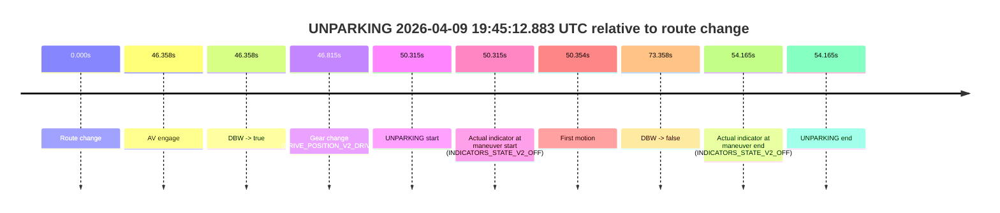

# Run Report: fme10003/2026-04-09--19-23-32--gen2-av-83a35bf3-02d2-47a4-82c6-7decfa48b0af

| Field | Value |
|---|---|
| Run ID | `fme10003/2026-04-09--19-23-32--gen2-av-83a35bf3-02d2-47a4-82c6-7decfa48b0af` |
| Date | `2026-04-09` |
| Model(s) | `lively-orange-horse` |
| Author | `guy.geva` |
| Event count | `1` |

## unparking 2026-04-09 19:45:12.883 UTC

| Field | Value |
|---|---|
| Model | `lively-orange-horse` |
| Author | `guy.geva` |
| Run ID | `fme10003/2026-04-09--19-23-32--gen2-av-83a35bf3-02d2-47a4-82c6-7decfa48b0af` |
| Date | `2026-04-09` |
| Time (UTC) | `19:45:12.883` |
| Event type | `unparking` |
| Disengagement type | `none observed` |
| Route change | `found` |
| Console | [run](https://console.sso.wayve.ai/run/fme10003/2026-04-09--19-23-32--gen2-av-83a35bf3-02d2-47a4-82c6-7decfa48b0af?id=&time-unixus=1775763912883308) |
| Foxglove | [segment](https://app.foxglove.dev/wayve-on-prem/p/prj_0dX18KZdVHg1fmmI/view?ds=foxglove-stream&ds.deviceName=fme10003&ds.start=2026-04-09T19%3A44%3A12.568608Z&ds.end=2026-04-09T19%3A45%3A45.926718Z&layoutId=lay_0e7VD4WIKDQGU73Y&time=2026-04-09T19%3A45%3A12.883308Z) |

### Event card: pass

- Pass: AV owns the credited unparking through the official event window, the gear state is aligned at the anchor, and the vehicle moves without driver accelerator help in AV.

| Event | Time (UTC) | Delta from route change |
|---|---:|---:|
| Route change | 2026-04-09 19:44:22.568 | `0.000s` |
| AV engage | 2026-04-09 19:45:08.926 | `46.358s` |
| DBW -> true | 2026-04-09 19:45:08.926 | `46.358s` |
| Gear change (DRIVE_POSITION_V2_DRIVE) | 2026-04-09 19:45:09.383 | `46.815s` |
| UNPARKING start | 2026-04-09 19:45:12.883 | `50.315s` |
| Actual indicator at maneuver start (INDICATORS_STATE_V2_OFF) | 2026-04-09 19:45:12.883 | `50.315s` |
| First motion | 2026-04-09 19:45:12.922 | `50.354s` |
| DBW -> false | 2026-04-09 19:45:35.926 | `73.358s` |
| Actual indicator at maneuver end (INDICATORS_STATE_V2_OFF) | 2026-04-09 19:45:16.733 | `54.165s` |
| UNPARKING end | 2026-04-09 19:45:16.733 | `54.165s` |

| Metric | Value |
|---|---|
| Outcome | `pass` |
| Effective failure type | `none` |
| Route change status | `found` |
| DBW at event start | `true` |
| DBW at event end | `true` |
| Predicted gear at AV start | `DRIVE_POSITION_V2_DRIVE` |
| Actual gear at AV start | `DRIVE_POSITION_V2_PARK` |
| Predicted gear at event start | `DRIVE_POSITION_V2_DRIVE` |
| Actual gear at event start | `DRIVE_POSITION_V2_DRIVE` |
| Planned indicator direction | `INDICATORS_STATE_V2_RIGHT_ON` |
| Controller indicator direction | `INDICATORS_STATE_V2_RIGHT_ON` |
| Actual indicator direction | `INDICATORS_STATE_V2_OFF` |
| Actual indicator at maneuver end | `INDICATORS_STATE_V2_OFF` |
| Driver accel help in AV | `false` |
| Driver accel help timestamp | `n/a` |
| Max accel pedal pct in AV | `0.0%` |
| Max brake pedal pct in AV | `8.0%` |
| Max speed mps in AV | `4.467` |
| Route -> AV | `46.358s` |
| AV -> event start | `3.956s` |
| AV -> first motion | `3.996s` |
| AV duration before disengagement | `27.000s` |
| Trajectory waypoint count | `36` |
| Driving-plan step count | `11` |

The scored portion starts from the AV-owned window, not from the pre-AV setup. Route-change search in the stopped pre-event segment was `found`, with the baseline therefore set to route change. At the event anchor the model predicts `DRIVE_POSITION_V2_DRIVE` and the actual gear is `DRIVE_POSITION_V2_DRIVE`. The effective model outcome is `pass` because `the credited maneuver stays AV-owned through the official event end`.

### Resolution

| Field | Value |
|---|---|
| Final outcome | `pass` |
| Do we agree with this label? | `yes` |
| Source disengagement type | `none observed` |
| Resolved effective failure type | `none` |
| Confidence | `high` |
