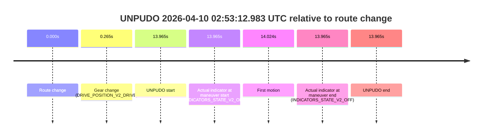
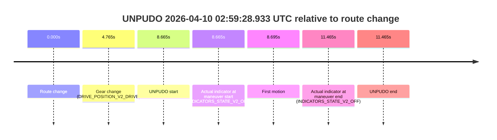
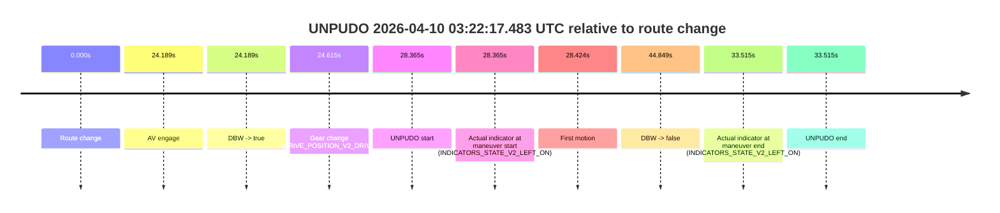

# Run Report: fme10003/2026-04-10--02-40-10--gen2-av-47706f86-f580-47be-938a-85fa535f85bb

| Field | Value |
|---|---|
| Run ID | `fme10003/2026-04-10--02-40-10--gen2-av-47706f86-f580-47be-938a-85fa535f85bb` |
| Date | `2026-04-10` |
| Model(s) | `lively-orange-horse` |
| Author | `guy.geva` |
| Event count | `9` |

## unpudo 2026-04-10 02:46:20.483 UTC

| Field | Value |
|---|---|
| Model | `lively-orange-horse` |
| Author | `guy.geva` |
| Run ID | `fme10003/2026-04-10--02-40-10--gen2-av-47706f86-f580-47be-938a-85fa535f85bb` |
| Date | `2026-04-10` |
| Time (UTC) | `02:46:20.483` |
| Event type | `unpudo` |
| Disengagement type | `failed_to_unpudo` |
| Route change | `found` |
| Console | [run](https://console.sso.wayve.ai/run/fme10003/2026-04-10--02-40-10--gen2-av-47706f86-f580-47be-938a-85fa535f85bb?id=&time-unixus=1775789180483304) |
| Foxglove | [segment](https://app.foxglove.dev/wayve-on-prem/p/prj_0dX18KZdVHg1fmmI/view?ds=foxglove-stream&ds.deviceName=fme10003&ds.start=2026-04-10T02%3A45%3A58.568296Z&ds.end=2026-04-10T02%3A48%3A07.067349Z&layoutId=lay_0e7VD4WIKDQGU73Y&time=2026-04-10T02%3A46%3A20.483304Z) |

### Event card: fail

- Fail: AV owns part of the segment, but the event still resolves as a model-performance failure under the AV-only scoring rule.

| Event | Time (UTC) | Delta from route change |
|---|---:|---:|
| Route change | 2026-04-10 02:46:08.568 | `0.000s` |
| AV engage | 2026-04-10 02:46:31.767 | `23.199s` |
| DBW -> true | 2026-04-10 02:46:31.767 | `23.199s` |
| Gear change (DRIVE_POSITION_V2_DRIVE) | 2026-04-10 02:46:15.933 | `7.365s` |
| UNPUDO start | 2026-04-10 02:46:20.483 | `11.915s` |
| Actual indicator at maneuver start (INDICATORS_STATE_V2_RIGHT_ON) | 2026-04-10 02:46:20.483 | `11.915s` |
| First motion | 2026-04-10 02:46:20.542 | `11.974s` |
| DBW -> false | 2026-04-10 02:47:57.067 | `108.499s` |
| Actual indicator at maneuver end (INDICATORS_STATE_V2_OFF) | 2026-04-10 02:46:23.133 | `14.565s` |
| UNPUDO end | 2026-04-10 02:46:23.133 | `14.565s` |

| Metric | Value |
|---|---|
| Outcome | `fail` |
| Effective failure type | `failed_to_unpudo` |
| Route change status | `found` |
| DBW at event start | `false` |
| DBW at event end | `false` |
| Predicted gear at AV start | `DRIVE_POSITION_V2_DRIVE` |
| Actual gear at AV start | `DRIVE_POSITION_V2_DRIVE` |
| Predicted gear at event start | `DRIVE_POSITION_V2_DRIVE` |
| Actual gear at event start | `DRIVE_POSITION_V2_DRIVE` |
| Planned indicator direction | `INDICATORS_STATE_V2_LEFT_ON` |
| Controller indicator direction | `INDICATORS_STATE_V2_LEFT_ON` |
| Actual indicator direction | `INDICATORS_STATE_V2_RIGHT_ON` |
| Actual indicator at maneuver end | `INDICATORS_STATE_V2_OFF` |
| Driver accel help in AV | `false` |
| Driver accel help timestamp | `n/a` |
| Max accel pedal pct in AV | `0.0%` |
| Max brake pedal pct in AV | `0.0%` |
| Max speed mps in AV | `0.000` |
| Route -> AV | `23.199s` |
| AV -> event start | `-11.284s` |
| AV -> first motion | `-11.225s` |
| AV duration before disengagement | `85.300s` |
| Trajectory waypoint count | `36` |
| Driving-plan step count | `11` |

The scored portion starts from the AV-owned window, not from the pre-AV setup. Route-change search in the stopped pre-event segment was `found`, with the baseline therefore set to route change. At the event anchor the model predicts `DRIVE_POSITION_V2_DRIVE` and the actual gear is `DRIVE_POSITION_V2_DRIVE`. The effective model outcome is `fail` because `failed_to_unpudo`.

### Resolution

| Field | Value |
|---|---|
| Final outcome | `fail` |
| Do we agree with this label? | `yes` |
| Source disengagement type | `failed_to_unpudo` |
| Resolved effective failure type | `failed_to_unpudo` |
| Confidence | `high` |

## unpudo 2026-04-10 02:49:27.283 UTC

| Field | Value |
|---|---|
| Model | `lively-orange-horse` |
| Author | `guy.geva` |
| Run ID | `fme10003/2026-04-10--02-40-10--gen2-av-47706f86-f580-47be-938a-85fa535f85bb` |
| Date | `2026-04-10` |
| Time (UTC) | `02:49:27.283` |
| Event type | `unpudo` |
| Disengagement type | `failed_to_unpudo` |
| Route change | `found` |
| Console | [run](https://console.sso.wayve.ai/run/fme10003/2026-04-10--02-40-10--gen2-av-47706f86-f580-47be-938a-85fa535f85bb?id=&time-unixus=1775789367283298) |
| Foxglove | [segment](https://app.foxglove.dev/wayve-on-prem/p/prj_0dX18KZdVHg1fmmI/view?ds=foxglove-stream&ds.deviceName=fme10003&ds.start=2026-04-10T02%3A48%3A47.168332Z&ds.end=2026-04-10T02%3A50%3A27.827331Z&layoutId=lay_0e7VD4WIKDQGU73Y&time=2026-04-10T02%3A49%3A27.283298Z) |

### Event card: fail

- Fail: AV owns part of the segment, but the event still resolves as a model-performance failure under the AV-only scoring rule.

| Event | Time (UTC) | Delta from route change |
|---|---:|---:|
| Route change | 2026-04-10 02:48:57.168 | `0.000s` |
| AV engage | 2026-04-10 02:49:36.468 | `39.300s` |
| DBW -> true | 2026-04-10 02:49:36.468 | `39.300s` |
| Gear change (DRIVE_POSITION_V2_DRIVE) | 2026-04-10 02:49:20.783 | `23.615s` |
| UNPUDO start | 2026-04-10 02:49:27.283 | `30.115s` |
| Actual indicator at maneuver start (INDICATORS_STATE_V2_OFF) | 2026-04-10 02:49:27.283 | `30.115s` |
| First motion | 2026-04-10 02:49:27.342 | `30.174s` |
| DBW -> false | 2026-04-10 02:50:17.827 | `80.659s` |
| Actual indicator at maneuver end (INDICATORS_STATE_V2_OFF) | 2026-04-10 02:49:30.283 | `33.115s` |
| UNPUDO end | 2026-04-10 02:49:30.283 | `33.115s` |

| Metric | Value |
|---|---|
| Outcome | `fail` |
| Effective failure type | `failed_to_unpudo` |
| Route change status | `found` |
| DBW at event start | `false` |
| DBW at event end | `false` |
| Predicted gear at AV start | `DRIVE_POSITION_V2_DRIVE` |
| Actual gear at AV start | `DRIVE_POSITION_V2_DRIVE` |
| Predicted gear at event start | `DRIVE_POSITION_V2_DRIVE` |
| Actual gear at event start | `DRIVE_POSITION_V2_DRIVE` |
| Planned indicator direction | `INDICATORS_STATE_V2_LEFT_ON` |
| Controller indicator direction | `INDICATORS_STATE_V2_LEFT_ON` |
| Actual indicator direction | `INDICATORS_STATE_V2_OFF` |
| Actual indicator at maneuver end | `INDICATORS_STATE_V2_OFF` |
| Driver accel help in AV | `false` |
| Driver accel help timestamp | `n/a` |
| Max accel pedal pct in AV | `0.0%` |
| Max brake pedal pct in AV | `0.0%` |
| Max speed mps in AV | `0.000` |
| Route -> AV | `39.300s` |
| AV -> event start | `-9.185s` |
| AV -> first motion | `-9.126s` |
| AV duration before disengagement | `41.359s` |
| Trajectory waypoint count | `36` |
| Driving-plan step count | `11` |

The scored portion starts from the AV-owned window, not from the pre-AV setup. Route-change search in the stopped pre-event segment was `found`, with the baseline therefore set to route change. At the event anchor the model predicts `DRIVE_POSITION_V2_DRIVE` and the actual gear is `DRIVE_POSITION_V2_DRIVE`. The effective model outcome is `fail` because `failed_to_unpudo`.

### Resolution

| Field | Value |
|---|---|
| Final outcome | `fail` |
| Do we agree with this label? | `yes` |
| Source disengagement type | `failed_to_unpudo` |
| Resolved effective failure type | `failed_to_unpudo` |
| Confidence | `high` |

## unpudo 2026-04-10 02:50:40.083 UTC

| Field | Value |
|---|---|
| Model | `lively-orange-horse` |
| Author | `guy.geva` |
| Run ID | `fme10003/2026-04-10--02-40-10--gen2-av-47706f86-f580-47be-938a-85fa535f85bb` |
| Date | `2026-04-10` |
| Time (UTC) | `02:50:40.083` |
| Event type | `unpudo` |
| Disengagement type | `none observed` |
| Route change | `found` |
| Console | [run](https://console.sso.wayve.ai/run/fme10003/2026-04-10--02-40-10--gen2-av-47706f86-f580-47be-938a-85fa535f85bb?id=&time-unixus=1775789440083310) |
| Foxglove | [segment](https://app.foxglove.dev/wayve-on-prem/p/prj_0dX18KZdVHg1fmmI/view?ds=foxglove-stream&ds.deviceName=fme10003&ds.start=2026-04-10T02%3A48%3A47.168332Z&ds.end=2026-04-10T02%3A51%3A03.347862Z&layoutId=lay_0e7VD4WIKDQGU73Y&time=2026-04-10T02%3A50%3A40.083310Z) |

### Event card: fail

- Fail: the credited unpudo does not stay AV-owned. The event window starts with DBW false, and the maneuver outcome lands outside a clean AV-owned segment.

| Event | Time (UTC) | Delta from route change |
|---|---:|---:|
| Route change | 2026-04-10 02:48:57.168 | `0.000s` |
| AV engage | 2026-04-10 02:50:48.567 | `111.399s` |
| DBW -> true | 2026-04-10 02:50:48.567 | `111.399s` |
| Gear change (DRIVE_POSITION_V2_DRIVE) | 2026-04-10 02:50:40.083 | `102.915s` |
| UNPUDO start | 2026-04-10 02:50:40.083 | `102.915s` |
| Actual indicator at maneuver start (INDICATORS_STATE_V2_OFF) | 2026-04-10 02:50:40.083 | `102.915s` |
| First motion | 2026-04-10 02:50:41.062 | `103.894s` |
| DBW -> false | 2026-04-10 02:50:53.347 | `116.180s` |
| Actual indicator at maneuver end (INDICATORS_STATE_V2_OFF) | 2026-04-10 02:50:44.333 | `107.165s` |
| UNPUDO end | 2026-04-10 02:50:44.333 | `107.165s` |

| Metric | Value |
|---|---|
| Outcome | `fail` |
| Effective failure type | `completed_outside_av` |
| Route change status | `found` |
| DBW at event start | `false` |
| DBW at event end | `false` |
| Predicted gear at AV start | `DRIVE_POSITION_V2_DRIVE` |
| Actual gear at AV start | `DRIVE_POSITION_V2_PARK` |
| Predicted gear at event start | `DRIVE_POSITION_V2_DRIVE` |
| Actual gear at event start | `DRIVE_POSITION_V2_DRIVE` |
| Planned indicator direction | `INDICATORS_STATE_V2_OFF` |
| Controller indicator direction | `INDICATORS_STATE_V2_OFF` |
| Actual indicator direction | `INDICATORS_STATE_V2_OFF` |
| Actual indicator at maneuver end | `INDICATORS_STATE_V2_OFF` |
| Driver accel help in AV | `false` |
| Driver accel help timestamp | `n/a` |
| Max accel pedal pct in AV | `0.0%` |
| Max brake pedal pct in AV | `0.0%` |
| Max speed mps in AV | `0.000` |
| Route -> AV | `111.399s` |
| AV -> event start | `-8.484s` |
| AV -> first motion | `-7.505s` |
| AV duration before disengagement | `4.780s` |
| Trajectory waypoint count | `37` |
| Driving-plan step count | `11` |

The scored portion starts from the AV-owned window, not from the pre-AV setup. Route-change search in the stopped pre-event segment was `found`, with the baseline therefore set to route change. At the event anchor the model predicts `DRIVE_POSITION_V2_DRIVE` and the actual gear is `DRIVE_POSITION_V2_DRIVE`. The effective model outcome is `fail` because `completed_outside_av`.

### Resolution

| Field | Value |
|---|---|
| Final outcome | `fail` |
| Do we agree with this label? | `yes` |
| Source disengagement type | `none observed` |
| Resolved effective failure type | `completed_outside_av` |
| Confidence | `high` |

## unpudo 2026-04-10 02:50:53.833 UTC

| Field | Value |
|---|---|
| Model | `lively-orange-horse` |
| Author | `guy.geva` |
| Run ID | `fme10003/2026-04-10--02-40-10--gen2-av-47706f86-f580-47be-938a-85fa535f85bb` |
| Date | `2026-04-10` |
| Time (UTC) | `02:50:53.833` |
| Event type | `unpudo` |
| Disengagement type | `failed_to_accelerate` |
| Route change | `found` |
| Console | [run](https://console.sso.wayve.ai/run/fme10003/2026-04-10--02-40-10--gen2-av-47706f86-f580-47be-938a-85fa535f85bb?id=&time-unixus=1775789453833312) |
| Foxglove | [segment](https://app.foxglove.dev/wayve-on-prem/p/prj_0dX18KZdVHg1fmmI/view?ds=foxglove-stream&ds.deviceName=fme10003&ds.start=2026-04-10T02%3A48%3A47.168332Z&ds.end=2026-04-10T02%3A51%3A29.967420Z&layoutId=lay_0e7VD4WIKDQGU73Y&time=2026-04-10T02%3A50%3A53.833312Z) |

### Event card: fail

- Fail: AV owns part of the segment, but the event still resolves as a model-performance failure under the AV-only scoring rule.

| Event | Time (UTC) | Delta from route change |
|---|---:|---:|
| Route change | 2026-04-10 02:48:57.168 | `0.000s` |
| AV engage | 2026-04-10 02:51:03.867 | `126.699s` |
| DBW -> true | 2026-04-10 02:51:03.867 | `126.699s` |
| Gear change (DRIVE_POSITION_V2_DRIVE) | 2026-04-10 02:50:48.933 | `111.765s` |
| UNPUDO start | 2026-04-10 02:50:53.833 | `116.665s` |
| Actual indicator at maneuver start (INDICATORS_STATE_V2_LEFT_ON) | 2026-04-10 02:50:53.833 | `116.665s` |
| First motion | 2026-04-10 02:50:53.883 | `116.715s` |
| DBW -> false | 2026-04-10 02:51:19.967 | `142.799s` |
| Actual indicator at maneuver end (INDICATORS_STATE_V2_LEFT_ON) | 2026-04-10 02:50:57.583 | `120.415s` |
| UNPUDO end | 2026-04-10 02:50:57.583 | `120.415s` |

| Metric | Value |
|---|---|
| Outcome | `fail` |
| Effective failure type | `failed_to_accelerate` |
| Route change status | `found` |
| DBW at event start | `false` |
| DBW at event end | `false` |
| Predicted gear at AV start | `DRIVE_POSITION_V2_DRIVE` |
| Actual gear at AV start | `DRIVE_POSITION_V2_DRIVE` |
| Predicted gear at event start | `DRIVE_POSITION_V2_DRIVE` |
| Actual gear at event start | `DRIVE_POSITION_V2_DRIVE` |
| Planned indicator direction | `INDICATORS_STATE_V2_LEFT_ON` |
| Controller indicator direction | `INDICATORS_STATE_V2_LEFT_ON` |
| Actual indicator direction | `INDICATORS_STATE_V2_LEFT_ON` |
| Actual indicator at maneuver end | `INDICATORS_STATE_V2_LEFT_ON` |
| Driver accel help in AV | `false` |
| Driver accel help timestamp | `n/a` |
| Max accel pedal pct in AV | `0.0%` |
| Max brake pedal pct in AV | `0.0%` |
| Max speed mps in AV | `0.000` |
| Route -> AV | `126.699s` |
| AV -> event start | `-10.034s` |
| AV -> first motion | `-9.984s` |
| AV duration before disengagement | `16.100s` |
| Trajectory waypoint count | `37` |
| Driving-plan step count | `11` |

The scored portion starts from the AV-owned window, not from the pre-AV setup. Route-change search in the stopped pre-event segment was `found`, with the baseline therefore set to route change. At the event anchor the model predicts `DRIVE_POSITION_V2_DRIVE` and the actual gear is `DRIVE_POSITION_V2_DRIVE`. The effective model outcome is `fail` because `failed_to_accelerate`.

### Resolution

| Field | Value |
|---|---|
| Final outcome | `fail` |
| Do we agree with this label? | `yes` |
| Source disengagement type | `failed_to_accelerate` |
| Resolved effective failure type | `failed_to_accelerate` |
| Confidence | `high` |

## unpudo 2026-04-10 02:53:12.983 UTC

| Field | Value |
|---|---|
| Model | `lively-orange-horse` |
| Author | `guy.geva` |
| Run ID | `fme10003/2026-04-10--02-40-10--gen2-av-47706f86-f580-47be-938a-85fa535f85bb` |
| Date | `2026-04-10` |
| Time (UTC) | `02:53:12.983` |
| Event type | `unpudo` |
| Disengagement type | `failed_to_unpudo` |
| Route change | `found` |
| Console | [run](https://console.sso.wayve.ai/run/fme10003/2026-04-10--02-40-10--gen2-av-47706f86-f580-47be-938a-85fa535f85bb?id=&time-unixus=1775789592983293) |
| Foxglove | [segment](https://app.foxglove.dev/wayve-on-prem/p/prj_0dX18KZdVHg1fmmI/view?ds=foxglove-stream&ds.deviceName=fme10003&ds.start=2026-04-10T02%3A52%3A49.018318Z&ds.end=2026-04-10T02%3A53%3A22.983293Z&layoutId=lay_0e7VD4WIKDQGU73Y&time=2026-04-10T02%3A53%3A12.983293Z) |

### Event card: fail

- Fail: AV owns part of the segment, but the event still resolves as a model-performance failure under the AV-only scoring rule.

| Event | Time (UTC) | Delta from route change |
|---|---:|---:|
| Route change | 2026-04-10 02:52:59.018 | `0.000s` |
| Gear change (DRIVE_POSITION_V2_DRIVE) | 2026-04-10 02:52:59.283 | `0.265s` |
| UNPUDO start | 2026-04-10 02:53:12.983 | `13.965s` |
| Actual indicator at maneuver start (INDICATORS_STATE_V2_OFF) | 2026-04-10 02:53:12.983 | `13.965s` |
| First motion | 2026-04-10 02:53:13.042 | `14.024s` |
| Actual indicator at maneuver end (INDICATORS_STATE_V2_OFF) | 2026-04-10 02:53:12.983 | `13.965s` |
| UNPUDO end | 2026-04-10 02:53:12.983 | `13.965s` |

| Metric | Value |
|---|---|
| Outcome | `fail` |
| Effective failure type | `failed_to_unpudo` |
| Route change status | `found` |
| DBW at event start | `false` |
| DBW at event end | `false` |
| Predicted gear at AV start | `n/a` |
| Actual gear at AV start | `n/a` |
| Predicted gear at event start | `DRIVE_POSITION_V2_DRIVE` |
| Actual gear at event start | `DRIVE_POSITION_V2_DRIVE` |
| Planned indicator direction | `INDICATORS_STATE_V2_OFF` |
| Controller indicator direction | `INDICATORS_STATE_V2_OFF` |
| Actual indicator direction | `INDICATORS_STATE_V2_OFF` |
| Actual indicator at maneuver end | `INDICATORS_STATE_V2_OFF` |
| Driver accel help in AV | `false` |
| Driver accel help timestamp | `n/a` |
| Max accel pedal pct in AV | `0.0%` |
| Max brake pedal pct in AV | `0.0%` |
| Max speed mps in AV | `0.000` |
| Route -> AV | `n/a` |
| AV -> event start | `n/a` |
| AV -> first motion | `n/a` |
| AV duration before disengagement | `n/a` |
| Trajectory waypoint count | `36` |
| Driving-plan step count | `11` |

The scored portion starts from the AV-owned window, not from the pre-AV setup. Route-change search in the stopped pre-event segment was `found`, with the baseline therefore set to route change. At the event anchor the model predicts `DRIVE_POSITION_V2_DRIVE` and the actual gear is `DRIVE_POSITION_V2_DRIVE`. The effective model outcome is `fail` because `failed_to_unpudo`.

### Resolution

| Field | Value |
|---|---|
| Final outcome | `fail` |
| Do we agree with this label? | `yes` |
| Source disengagement type | `failed_to_unpudo` |
| Resolved effective failure type | `failed_to_unpudo` |
| Confidence | `high` |

## unpudo 2026-04-10 02:53:38.483 UTC

| Field | Value |
|---|---|
| Model | `lively-orange-horse` |
| Author | `guy.geva` |
| Run ID | `fme10003/2026-04-10--02-40-10--gen2-av-47706f86-f580-47be-938a-85fa535f85bb` |
| Date | `2026-04-10` |
| Time (UTC) | `02:53:38.483` |
| Event type | `unpudo` |
| Disengagement type | `none observed` |
| Route change | `found` |
| Console | [run](https://console.sso.wayve.ai/run/fme10003/2026-04-10--02-40-10--gen2-av-47706f86-f580-47be-938a-85fa535f85bb?id=&time-unixus=1775789618483306) |
| Foxglove | [segment](https://app.foxglove.dev/wayve-on-prem/p/prj_0dX18KZdVHg1fmmI/view?ds=foxglove-stream&ds.deviceName=fme10003&ds.start=2026-04-10T02%3A52%3A49.018318Z&ds.end=2026-04-10T02%3A59%3A16.868616Z&layoutId=lay_0e7VD4WIKDQGU73Y&time=2026-04-10T02%3A53%3A38.483306Z) |

### Event card: fail

- Fail: the credited unpudo does not stay AV-owned. The event window starts with DBW false, and the maneuver outcome lands outside a clean AV-owned segment.

| Event | Time (UTC) | Delta from route change |
|---|---:|---:|
| Route change | 2026-04-10 02:52:59.018 | `0.000s` |
| AV engage | 2026-04-10 02:54:17.927 | `78.909s` |
| DBW -> true | 2026-04-10 02:54:17.927 | `78.909s` |
| Gear change (DRIVE_POSITION_V2_DRIVE) | 2026-04-10 02:53:38.383 | `39.365s` |
| UNPUDO start | 2026-04-10 02:53:38.483 | `39.465s` |
| Actual indicator at maneuver start (INDICATORS_STATE_V2_OFF) | 2026-04-10 02:53:38.483 | `39.465s` |
| First motion | 2026-04-10 02:53:39.903 | `40.885s` |
| DBW -> false | 2026-04-10 02:59:06.868 | `367.850s` |
| Actual indicator at maneuver end (INDICATORS_STATE_V2_RIGHT_ON) | 2026-04-10 02:54:01.533 | `62.515s` |
| UNPUDO end | 2026-04-10 02:54:01.533 | `62.515s` |

| Metric | Value |
|---|---|
| Outcome | `fail` |
| Effective failure type | `completed_outside_av` |
| Route change status | `found` |
| DBW at event start | `false` |
| DBW at event end | `false` |
| Predicted gear at AV start | `DRIVE_POSITION_V2_DRIVE` |
| Actual gear at AV start | `DRIVE_POSITION_V2_PARK` |
| Predicted gear at event start | `DRIVE_POSITION_V2_DRIVE` |
| Actual gear at event start | `DRIVE_POSITION_V2_DRIVE` |
| Planned indicator direction | `INDICATORS_STATE_V2_OFF` |
| Controller indicator direction | `INDICATORS_STATE_V2_OFF` |
| Actual indicator direction | `INDICATORS_STATE_V2_OFF` |
| Actual indicator at maneuver end | `INDICATORS_STATE_V2_RIGHT_ON` |
| Driver accel help in AV | `false` |
| Driver accel help timestamp | `n/a` |
| Max accel pedal pct in AV | `0.0%` |
| Max brake pedal pct in AV | `0.0%` |
| Max speed mps in AV | `0.000` |
| Route -> AV | `78.909s` |
| AV -> event start | `-39.444s` |
| AV -> first motion | `-38.024s` |
| AV duration before disengagement | `288.941s` |
| Trajectory waypoint count | `37` |
| Driving-plan step count | `11` |

The scored portion starts from the AV-owned window, not from the pre-AV setup. Route-change search in the stopped pre-event segment was `found`, with the baseline therefore set to route change. At the event anchor the model predicts `DRIVE_POSITION_V2_DRIVE` and the actual gear is `DRIVE_POSITION_V2_DRIVE`. The effective model outcome is `fail` because `completed_outside_av`.

### Resolution

| Field | Value |
|---|---|
| Final outcome | `fail` |
| Do we agree with this label? | `yes` |
| Source disengagement type | `none observed` |
| Resolved effective failure type | `completed_outside_av` |
| Confidence | `high` |

## unpudo 2026-04-10 02:59:28.933 UTC

| Field | Value |
|---|---|
| Model | `lively-orange-horse` |
| Author | `guy.geva` |
| Run ID | `fme10003/2026-04-10--02-40-10--gen2-av-47706f86-f580-47be-938a-85fa535f85bb` |
| Date | `2026-04-10` |
| Time (UTC) | `02:59:28.933` |
| Event type | `unpudo` |
| Disengagement type | `failed_to_unpudo` |
| Route change | `found` |
| Console | [run](https://console.sso.wayve.ai/run/fme10003/2026-04-10--02-40-10--gen2-av-47706f86-f580-47be-938a-85fa535f85bb?id=&time-unixus=1775789968933312) |
| Foxglove | [segment](https://app.foxglove.dev/wayve-on-prem/p/prj_0dX18KZdVHg1fmmI/view?ds=foxglove-stream&ds.deviceName=fme10003&ds.start=2026-04-10T02%3A59%3A10.268281Z&ds.end=2026-04-10T02%3A59%3A41.733291Z&layoutId=lay_0e7VD4WIKDQGU73Y&time=2026-04-10T02%3A59%3A28.933312Z) |

### Event card: fail

- Fail: AV owns part of the segment, but the event still resolves as a model-performance failure under the AV-only scoring rule.

| Event | Time (UTC) | Delta from route change |
|---|---:|---:|
| Route change | 2026-04-10 02:59:20.268 | `0.000s` |
| Gear change (DRIVE_POSITION_V2_DRIVE) | 2026-04-10 02:59:25.033 | `4.765s` |
| UNPUDO start | 2026-04-10 02:59:28.933 | `8.665s` |
| Actual indicator at maneuver start (INDICATORS_STATE_V2_OFF) | 2026-04-10 02:59:28.933 | `8.665s` |
| First motion | 2026-04-10 02:59:28.962 | `8.695s` |
| Actual indicator at maneuver end (INDICATORS_STATE_V2_OFF) | 2026-04-10 02:59:31.733 | `11.465s` |
| UNPUDO end | 2026-04-10 02:59:31.733 | `11.465s` |

| Metric | Value |
|---|---|
| Outcome | `fail` |
| Effective failure type | `failed_to_unpudo` |
| Route change status | `found` |
| DBW at event start | `false` |
| DBW at event end | `false` |
| Predicted gear at AV start | `n/a` |
| Actual gear at AV start | `n/a` |
| Predicted gear at event start | `DRIVE_POSITION_V2_DRIVE` |
| Actual gear at event start | `DRIVE_POSITION_V2_DRIVE` |
| Planned indicator direction | `INDICATORS_STATE_V2_LEFT_ON` |
| Controller indicator direction | `INDICATORS_STATE_V2_OFF` |
| Actual indicator direction | `INDICATORS_STATE_V2_OFF` |
| Actual indicator at maneuver end | `INDICATORS_STATE_V2_OFF` |
| Driver accel help in AV | `false` |
| Driver accel help timestamp | `n/a` |
| Max accel pedal pct in AV | `0.0%` |
| Max brake pedal pct in AV | `0.0%` |
| Max speed mps in AV | `0.000` |
| Route -> AV | `n/a` |
| AV -> event start | `n/a` |
| AV -> first motion | `n/a` |
| AV duration before disengagement | `n/a` |
| Trajectory waypoint count | `35` |
| Driving-plan step count | `11` |

The scored portion starts from the AV-owned window, not from the pre-AV setup. Route-change search in the stopped pre-event segment was `found`, with the baseline therefore set to route change. At the event anchor the model predicts `DRIVE_POSITION_V2_DRIVE` and the actual gear is `DRIVE_POSITION_V2_DRIVE`. The effective model outcome is `fail` because `failed_to_unpudo`.

### Resolution

| Field | Value |
|---|---|
| Final outcome | `fail` |
| Do we agree with this label? | `yes` |
| Source disengagement type | `failed_to_unpudo` |
| Resolved effective failure type | `failed_to_unpudo` |
| Confidence | `high` |

## unpudo 2026-04-10 03:17:13.183 UTC

| Field | Value |
|---|---|
| Model | `lively-orange-horse` |
| Author | `guy.geva` |
| Run ID | `fme10003/2026-04-10--02-40-10--gen2-av-47706f86-f580-47be-938a-85fa535f85bb` |
| Date | `2026-04-10` |
| Time (UTC) | `03:17:13.183` |
| Event type | `unpudo` |
| Disengagement type | `failed_to_unpudo` |
| Route change | `found` |
| Console | [run](https://console.sso.wayve.ai/run/fme10003/2026-04-10--02-40-10--gen2-av-47706f86-f580-47be-938a-85fa535f85bb?id=&time-unixus=1775791033183302) |
| Foxglove | [segment](https://app.foxglove.dev/wayve-on-prem/p/prj_0dX18KZdVHg1fmmI/view?ds=foxglove-stream&ds.deviceName=fme10003&ds.start=2026-04-10T03%3A16%3A44.718285Z&ds.end=2026-04-10T03%3A17%3A41.147545Z&layoutId=lay_0e7VD4WIKDQGU73Y&time=2026-04-10T03%3A17%3A13.183302Z) |

### Event card: fail

- Fail: AV owns part of the segment, but the event still resolves as a model-performance failure under the AV-only scoring rule.

| Event | Time (UTC) | Delta from route change |
|---|---:|---:|
| Route change | 2026-04-10 03:16:54.718 | `0.000s` |
| AV engage | 2026-04-10 03:17:26.807 | `32.089s` |
| DBW -> true | 2026-04-10 03:17:26.807 | `32.089s` |
| Gear change (DRIVE_POSITION_V2_DRIVE) | 2026-04-10 03:17:08.333 | `13.615s` |
| UNPUDO start | 2026-04-10 03:17:13.183 | `18.465s` |
| Actual indicator at maneuver start (INDICATORS_STATE_V2_OFF) | 2026-04-10 03:17:13.183 | `18.465s` |
| First motion | 2026-04-10 03:17:13.202 | `18.484s` |
| DBW -> false | 2026-04-10 03:17:31.147 | `36.429s` |
| Actual indicator at maneuver end (INDICATORS_STATE_V2_OFF) | 2026-04-10 03:17:17.483 | `22.765s` |
| UNPUDO end | 2026-04-10 03:17:17.483 | `22.765s` |

| Metric | Value |
|---|---|
| Outcome | `fail` |
| Effective failure type | `failed_to_unpudo` |
| Route change status | `found` |
| DBW at event start | `false` |
| DBW at event end | `false` |
| Predicted gear at AV start | `DRIVE_POSITION_V2_DRIVE` |
| Actual gear at AV start | `DRIVE_POSITION_V2_DRIVE` |
| Predicted gear at event start | `DRIVE_POSITION_V2_DRIVE` |
| Actual gear at event start | `DRIVE_POSITION_V2_DRIVE` |
| Planned indicator direction | `INDICATORS_STATE_V2_OFF` |
| Controller indicator direction | `INDICATORS_STATE_V2_OFF` |
| Actual indicator direction | `INDICATORS_STATE_V2_OFF` |
| Actual indicator at maneuver end | `INDICATORS_STATE_V2_OFF` |
| Driver accel help in AV | `false` |
| Driver accel help timestamp | `n/a` |
| Max accel pedal pct in AV | `0.0%` |
| Max brake pedal pct in AV | `0.0%` |
| Max speed mps in AV | `0.000` |
| Route -> AV | `32.089s` |
| AV -> event start | `-13.624s` |
| AV -> first motion | `-13.605s` |
| AV duration before disengagement | `4.340s` |
| Trajectory waypoint count | `36` |
| Driving-plan step count | `11` |

The scored portion starts from the AV-owned window, not from the pre-AV setup. Route-change search in the stopped pre-event segment was `found`, with the baseline therefore set to route change. At the event anchor the model predicts `DRIVE_POSITION_V2_DRIVE` and the actual gear is `DRIVE_POSITION_V2_DRIVE`. The effective model outcome is `fail` because `failed_to_unpudo`.

### Resolution

| Field | Value |
|---|---|
| Final outcome | `fail` |
| Do we agree with this label? | `yes` |
| Source disengagement type | `failed_to_unpudo` |
| Resolved effective failure type | `failed_to_unpudo` |
| Confidence | `high` |

## unpudo 2026-04-10 03:22:17.483 UTC

| Field | Value |
|---|---|
| Model | `lively-orange-horse` |
| Author | `guy.geva` |
| Run ID | `fme10003/2026-04-10--02-40-10--gen2-av-47706f86-f580-47be-938a-85fa535f85bb` |
| Date | `2026-04-10` |
| Time (UTC) | `03:22:17.483` |
| Event type | `unpudo` |
| Disengagement type | `none observed` |
| Route change | `found` |
| Console | [run](https://console.sso.wayve.ai/run/fme10003/2026-04-10--02-40-10--gen2-av-47706f86-f580-47be-938a-85fa535f85bb?id=&time-unixus=1775791337483315) |
| Foxglove | [segment](https://app.foxglove.dev/wayve-on-prem/p/prj_0dX18KZdVHg1fmmI/view?ds=foxglove-stream&ds.deviceName=fme10003&ds.start=2026-04-10T03%3A21%3A39.118386Z&ds.end=2026-04-10T03%3A22%3A43.967811Z&layoutId=lay_0e7VD4WIKDQGU73Y&time=2026-04-10T03%3A22%3A17.483315Z) |

### Event card: pass

- Pass: AV owns the credited unpudo through the official event window, the gear state is aligned at the anchor, and the vehicle moves without driver accelerator help in AV.

| Event | Time (UTC) | Delta from route change |
|---|---:|---:|
| Route change | 2026-04-10 03:21:49.118 | `0.000s` |
| AV engage | 2026-04-10 03:22:13.307 | `24.189s` |
| DBW -> true | 2026-04-10 03:22:13.307 | `24.189s` |
| Gear change (DRIVE_POSITION_V2_DRIVE) | 2026-04-10 03:22:13.733 | `24.615s` |
| UNPUDO start | 2026-04-10 03:22:17.483 | `28.365s` |
| Actual indicator at maneuver start (INDICATORS_STATE_V2_LEFT_ON) | 2026-04-10 03:22:17.483 | `28.365s` |
| First motion | 2026-04-10 03:22:17.542 | `28.424s` |
| DBW -> false | 2026-04-10 03:22:33.967 | `44.849s` |
| Actual indicator at maneuver end (INDICATORS_STATE_V2_LEFT_ON) | 2026-04-10 03:22:22.633 | `33.515s` |
| UNPUDO end | 2026-04-10 03:22:22.633 | `33.515s` |

| Metric | Value |
|---|---|
| Outcome | `pass` |
| Effective failure type | `none` |
| Route change status | `found` |
| DBW at event start | `true` |
| DBW at event end | `true` |
| Predicted gear at AV start | `DRIVE_POSITION_V2_DRIVE` |
| Actual gear at AV start | `DRIVE_POSITION_V2_PARK` |
| Predicted gear at event start | `DRIVE_POSITION_V2_DRIVE` |
| Actual gear at event start | `DRIVE_POSITION_V2_DRIVE` |
| Planned indicator direction | `INDICATORS_STATE_V2_OFF` |
| Controller indicator direction | `INDICATORS_STATE_V2_OFF` |
| Actual indicator direction | `INDICATORS_STATE_V2_LEFT_ON` |
| Actual indicator at maneuver end | `INDICATORS_STATE_V2_LEFT_ON` |
| Driver accel help in AV | `false` |
| Driver accel help timestamp | `n/a` |
| Max accel pedal pct in AV | `0.0%` |
| Max brake pedal pct in AV | `8.0%` |
| Max speed mps in AV | `2.681` |
| Route -> AV | `24.189s` |
| AV -> event start | `4.176s` |
| AV -> first motion | `4.235s` |
| AV duration before disengagement | `20.660s` |
| Trajectory waypoint count | `36` |
| Driving-plan step count | `11` |

The scored portion starts from the AV-owned window, not from the pre-AV setup. Route-change search in the stopped pre-event segment was `found`, with the baseline therefore set to route change. At the event anchor the model predicts `DRIVE_POSITION_V2_DRIVE` and the actual gear is `DRIVE_POSITION_V2_DRIVE`. The effective model outcome is `pass` because `the credited maneuver stays AV-owned through the official event end`.

### Resolution

| Field | Value |
|---|---|
| Final outcome | `pass` |
| Do we agree with this label? | `yes` |
| Source disengagement type | `none observed` |
| Resolved effective failure type | `none` |
| Confidence | `high` |
