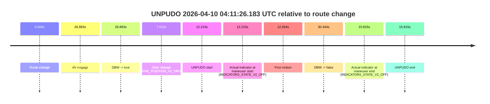
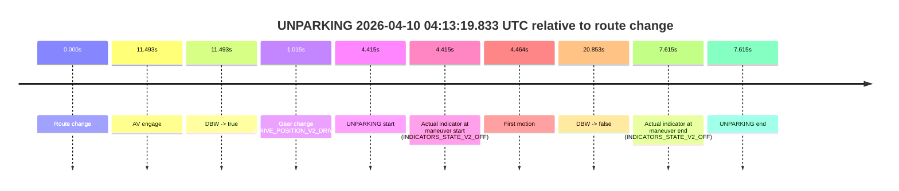

# Run Report: fme10003/2026-04-10--03-54-51--gen2-av-9e8b5afe-08a8-4d49-ad4c-ee67f98a5d81

| Field | Value |
|---|---|
| Run ID | `fme10003/2026-04-10--03-54-51--gen2-av-9e8b5afe-08a8-4d49-ad4c-ee67f98a5d81` |
| Date | `2026-04-10` |
| Model(s) | `lively-orange-horse` |
| Author | `guy.geva` |
| Event count | `3` |

## unpudo 2026-04-10 04:03:28.583 UTC

| Field | Value |
|---|---|
| Model | `lively-orange-horse` |
| Author | `guy.geva` |
| Run ID | `fme10003/2026-04-10--03-54-51--gen2-av-9e8b5afe-08a8-4d49-ad4c-ee67f98a5d81` |
| Date | `2026-04-10` |
| Time (UTC) | `04:03:28.583` |
| Event type | `unpudo` |
| Disengagement type | `none observed` |
| Route change | `found` |
| Console | [run](https://console.sso.wayve.ai/run/fme10003/2026-04-10--03-54-51--gen2-av-9e8b5afe-08a8-4d49-ad4c-ee67f98a5d81?id=&time-unixus=1775793808583301) |
| Foxglove | [segment](https://app.foxglove.dev/wayve-on-prem/p/prj_0dX18KZdVHg1fmmI/view?ds=foxglove-stream&ds.deviceName=fme10003&ds.start=2026-04-10T04%3A03%3A12.918260Z&ds.end=2026-04-10T04%3A04%3A43.152435Z&layoutId=lay_0e7VD4WIKDQGU73Y&time=2026-04-10T04%3A03%3A28.583301Z) |

### Event card: accidental

- Accidental: AV ownership is present for less than `2s`, so this is treated as an accidental brush with the maneuver rather than a meaningful model attempt.

| Event | Time (UTC) | Delta from route change |
|---|---:|---:|
| Route change | 2026-04-10 04:03:22.918 | `0.000s` |
| AV engage | 2026-04-10 04:03:50.291 | `27.373s` |
| DBW -> true | 2026-04-10 04:03:50.291 | `27.373s` |
| Gear change (DRIVE_POSITION_V2_DRIVE) | 2026-04-10 04:03:28.583 | `5.665s` |
| UNPUDO start | 2026-04-10 04:03:28.583 | `5.665s` |
| Actual indicator at maneuver start (INDICATORS_STATE_V2_OFF) | 2026-04-10 04:03:28.583 | `5.665s` |
| First motion | 2026-04-10 04:03:29.682 | `6.764s` |
| DBW -> false | 2026-04-10 04:04:33.152 | `70.234s` |
| Actual indicator at maneuver end (INDICATORS_STATE_V2_OFF) | 2026-04-10 04:03:34.183 | `11.265s` |
| UNPUDO end | 2026-04-10 04:03:34.183 | `11.265s` |

| Metric | Value |
|---|---|
| Outcome | `accidental` |
| Effective failure type | `none` |
| Route change status | `found` |
| DBW at event start | `false` |
| DBW at event end | `false` |
| Predicted gear at AV start | `DRIVE_POSITION_V2_PARK` |
| Actual gear at AV start | `DRIVE_POSITION_V2_PARK` |
| Predicted gear at event start | `DRIVE_POSITION_V2_DRIVE` |
| Actual gear at event start | `DRIVE_POSITION_V2_DRIVE` |
| Planned indicator direction | `INDICATORS_STATE_V2_OFF` |
| Controller indicator direction | `INDICATORS_STATE_V2_OFF` |
| Actual indicator direction | `INDICATORS_STATE_V2_OFF` |
| Actual indicator at maneuver end | `INDICATORS_STATE_V2_OFF` |
| Driver accel help in AV | `false` |
| Driver accel help timestamp | `n/a` |
| Max accel pedal pct in AV | `0.0%` |
| Max brake pedal pct in AV | `0.0%` |
| Max speed mps in AV | `0.000` |
| Route -> AV | `27.373s` |
| AV -> event start | `-21.708s` |
| AV -> first motion | `-20.608s` |
| AV duration before disengagement | `42.861s` |
| Trajectory waypoint count | `37` |
| Driving-plan step count | `11` |

The scored portion starts from the AV-owned window, not from the pre-AV setup. Route-change search in the stopped pre-event segment was `found`, with the baseline therefore set to route change. At the event anchor the model predicts `DRIVE_POSITION_V2_DRIVE` and the actual gear is `DRIVE_POSITION_V2_DRIVE`. The effective model outcome is `accidental` because `the AV-owned portion is shorter than 2s`.

### Resolution

| Field | Value |
|---|---|
| Final outcome | `accidental` |
| Do we agree with this label? | `yes` |
| Source disengagement type | `none observed` |
| Resolved effective failure type | `none` |
| Confidence | `high` |

## unpudo 2026-04-10 04:11:26.183 UTC

| Field | Value |
|---|---|
| Model | `lively-orange-horse` |
| Author | `guy.geva` |
| Run ID | `fme10003/2026-04-10--03-54-51--gen2-av-9e8b5afe-08a8-4d49-ad4c-ee67f98a5d81` |
| Date | `2026-04-10` |
| Time (UTC) | `04:11:26.183` |
| Event type | `unpudo` |
| Disengagement type | `failed_to_unpudo` |
| Route change | `found` |
| Console | [run](https://console.sso.wayve.ai/run/fme10003/2026-04-10--03-54-51--gen2-av-9e8b5afe-08a8-4d49-ad4c-ee67f98a5d81?id=&time-unixus=1775794286183299) |
| Foxglove | [segment](https://app.foxglove.dev/wayve-on-prem/p/prj_0dX18KZdVHg1fmmI/view?ds=foxglove-stream&ds.deviceName=fme10003&ds.start=2026-04-10T04%3A11%3A03.968265Z&ds.end=2026-04-10T04%3A11%3A54.312177Z&layoutId=lay_0e7VD4WIKDQGU73Y&time=2026-04-10T04%3A11%3A26.183299Z) |

### Event card: accidental

- Accidental: AV ownership is present for less than `2s`, so this is treated as an accidental brush with the maneuver rather than a meaningful model attempt.

| Event | Time (UTC) | Delta from route change |
|---|---:|---:|
| Route change | 2026-04-10 04:11:13.968 | `0.000s` |
| AV engage | 2026-04-10 04:11:40.851 | `26.883s` |
| DBW -> true | 2026-04-10 04:11:40.851 | `26.883s` |
| Gear change (DRIVE_POSITION_V2_DRIVE) | 2026-04-10 04:11:21.883 | `7.915s` |
| UNPUDO start | 2026-04-10 04:11:26.183 | `12.215s` |
| Actual indicator at maneuver start (INDICATORS_STATE_V2_OFF) | 2026-04-10 04:11:26.183 | `12.215s` |
| First motion | 2026-04-10 04:11:26.222 | `12.254s` |
| DBW -> false | 2026-04-10 04:11:44.312 | `30.344s` |
| Actual indicator at maneuver end (INDICATORS_STATE_V2_OFF) | 2026-04-10 04:11:29.783 | `15.815s` |
| UNPUDO end | 2026-04-10 04:11:29.783 | `15.815s` |

| Metric | Value |
|---|---|
| Outcome | `accidental` |
| Effective failure type | `none` |
| Route change status | `found` |
| DBW at event start | `false` |
| DBW at event end | `false` |
| Predicted gear at AV start | `DRIVE_POSITION_V2_DRIVE` |
| Actual gear at AV start | `DRIVE_POSITION_V2_DRIVE` |
| Predicted gear at event start | `DRIVE_POSITION_V2_DRIVE` |
| Actual gear at event start | `DRIVE_POSITION_V2_DRIVE` |
| Planned indicator direction | `INDICATORS_STATE_V2_LEFT_ON` |
| Controller indicator direction | `INDICATORS_STATE_V2_LEFT_ON` |
| Actual indicator direction | `INDICATORS_STATE_V2_OFF` |
| Actual indicator at maneuver end | `INDICATORS_STATE_V2_OFF` |
| Driver accel help in AV | `false` |
| Driver accel help timestamp | `n/a` |
| Max accel pedal pct in AV | `0.0%` |
| Max brake pedal pct in AV | `0.0%` |
| Max speed mps in AV | `0.000` |
| Route -> AV | `26.883s` |
| AV -> event start | `-14.668s` |
| AV -> first motion | `-14.629s` |
| AV duration before disengagement | `3.460s` |
| Trajectory waypoint count | `37` |
| Driving-plan step count | `11` |

The scored portion starts from the AV-owned window, not from the pre-AV setup. Route-change search in the stopped pre-event segment was `found`, with the baseline therefore set to route change. At the event anchor the model predicts `DRIVE_POSITION_V2_DRIVE` and the actual gear is `DRIVE_POSITION_V2_DRIVE`. The effective model outcome is `accidental` because `the AV-owned portion is shorter than 2s`.

### Resolution

| Field | Value |
|---|---|
| Final outcome | `accidental` |
| Do we agree with this label? | `yes` |
| Source disengagement type | `failed_to_unpudo` |
| Resolved effective failure type | `none` |
| Confidence | `high` |

## unparking 2026-04-10 04:13:19.833 UTC

| Field | Value |
|---|---|
| Model | `lively-orange-horse` |
| Author | `guy.geva` |
| Run ID | `fme10003/2026-04-10--03-54-51--gen2-av-9e8b5afe-08a8-4d49-ad4c-ee67f98a5d81` |
| Date | `2026-04-10` |
| Time (UTC) | `04:13:19.833` |
| Event type | `unparking` |
| Disengagement type | `failed_to_unpudo` |
| Route change | `found` |
| Console | [run](https://console.sso.wayve.ai/run/fme10003/2026-04-10--03-54-51--gen2-av-9e8b5afe-08a8-4d49-ad4c-ee67f98a5d81?id=&time-unixus=1775794399833289) |
| Foxglove | [segment](https://app.foxglove.dev/wayve-on-prem/p/prj_0dX18KZdVHg1fmmI/view?ds=foxglove-stream&ds.deviceName=fme10003&ds.start=2026-04-10T04%3A13%3A05.418255Z&ds.end=2026-04-10T04%3A13%3A46.271144Z&layoutId=lay_0e7VD4WIKDQGU73Y&time=2026-04-10T04%3A13%3A19.833289Z) |

### Event card: accidental

- Accidental: AV ownership is present for less than `2s`, so this is treated as an accidental brush with the maneuver rather than a meaningful model attempt.

| Event | Time (UTC) | Delta from route change |
|---|---:|---:|
| Route change | 2026-04-10 04:13:15.418 | `0.000s` |
| AV engage | 2026-04-10 04:13:26.911 | `11.493s` |
| DBW -> true | 2026-04-10 04:13:26.911 | `11.493s` |
| Gear change (DRIVE_POSITION_V2_DRIVE) | 2026-04-10 04:13:16.433 | `1.015s` |
| UNPARKING start | 2026-04-10 04:13:19.833 | `4.415s` |
| Actual indicator at maneuver start (INDICATORS_STATE_V2_OFF) | 2026-04-10 04:13:19.833 | `4.415s` |
| First motion | 2026-04-10 04:13:19.882 | `4.464s` |
| DBW -> false | 2026-04-10 04:13:36.271 | `20.853s` |
| Actual indicator at maneuver end (INDICATORS_STATE_V2_OFF) | 2026-04-10 04:13:23.033 | `7.615s` |
| UNPARKING end | 2026-04-10 04:13:23.033 | `7.615s` |

| Metric | Value |
|---|---|
| Outcome | `accidental` |
| Effective failure type | `none` |
| Route change status | `found` |
| DBW at event start | `false` |
| DBW at event end | `false` |
| Predicted gear at AV start | `DRIVE_POSITION_V2_DRIVE` |
| Actual gear at AV start | `DRIVE_POSITION_V2_DRIVE` |
| Predicted gear at event start | `DRIVE_POSITION_V2_DRIVE` |
| Actual gear at event start | `DRIVE_POSITION_V2_DRIVE` |
| Planned indicator direction | `INDICATORS_STATE_V2_OFF` |
| Controller indicator direction | `INDICATORS_STATE_V2_OFF` |
| Actual indicator direction | `INDICATORS_STATE_V2_OFF` |
| Actual indicator at maneuver end | `INDICATORS_STATE_V2_OFF` |
| Driver accel help in AV | `false` |
| Driver accel help timestamp | `n/a` |
| Max accel pedal pct in AV | `0.0%` |
| Max brake pedal pct in AV | `0.0%` |
| Max speed mps in AV | `0.000` |
| Route -> AV | `11.493s` |
| AV -> event start | `-7.078s` |
| AV -> first motion | `-7.029s` |
| AV duration before disengagement | `9.360s` |
| Trajectory waypoint count | `36` |
| Driving-plan step count | `11` |

The scored portion starts from the AV-owned window, not from the pre-AV setup. Route-change search in the stopped pre-event segment was `found`, with the baseline therefore set to route change. At the event anchor the model predicts `DRIVE_POSITION_V2_DRIVE` and the actual gear is `DRIVE_POSITION_V2_DRIVE`. The effective model outcome is `accidental` because `the AV-owned portion is shorter than 2s`.

### Resolution

| Field | Value |
|---|---|
| Final outcome | `accidental` |
| Do we agree with this label? | `yes` |
| Source disengagement type | `failed_to_unpudo` |
| Resolved effective failure type | `none` |
| Confidence | `high` |
