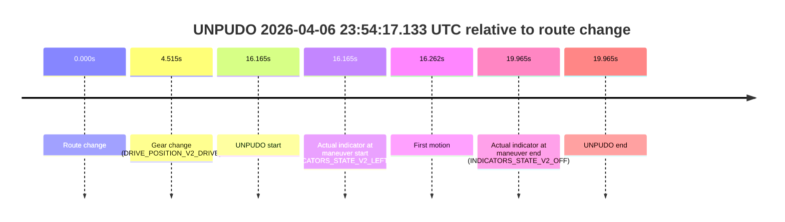
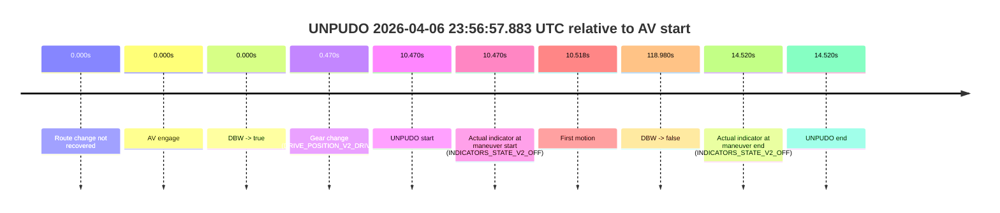
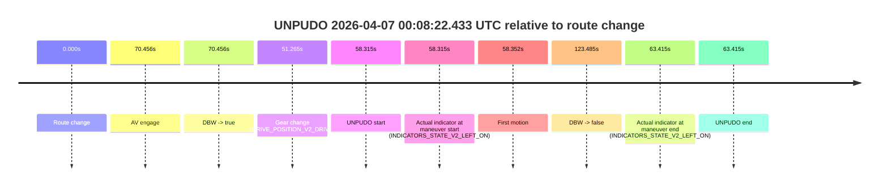
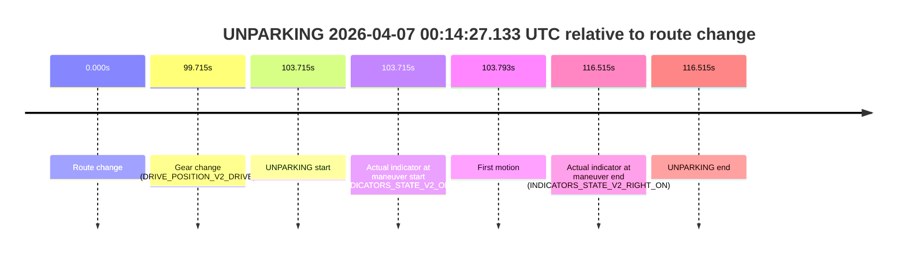

# Run Report: fme10005/2026-04-06--22-59-19--gen2-av-ace71b58-df94-4493-bb23-8d4bb4ad4c3e

| Field | Value |
|---|---|
| Run ID | `fme10005/2026-04-06--22-59-19--gen2-av-ace71b58-df94-4493-bb23-8d4bb4ad4c3e` |
| Date | `2026-04-06` |
| Model(s) | `lively-orange-horse` |
| Author | `guy.geva` |
| Event count | `13` |

## unpudo 2026-04-06 23:21:56.483 UTC

| Field | Value |
|---|---|
| Model | `lively-orange-horse` |
| Author | `guy.geva` |
| Run ID | `fme10005/2026-04-06--22-59-19--gen2-av-ace71b58-df94-4493-bb23-8d4bb4ad4c3e` |
| Date | `2026-04-06` |
| Time (UTC) | `23:21:56.483` |
| Event type | `unpudo` |
| Disengagement type | `none observed` |
| Route change | `found` |
| Console | [run](https://console.sso.wayve.ai/run/fme10005/2026-04-06--22-59-19--gen2-av-ace71b58-df94-4493-bb23-8d4bb4ad4c3e?id=&time-unixus=1775517716483296) |
| Foxglove | [segment](https://app.foxglove.dev/wayve-on-prem/p/prj_0dX18KZdVHg1fmmI/view?ds=foxglove-stream&ds.deviceName=fme10005&ds.start=2026-04-06T23%3A19%3A52.518267Z&ds.end=2026-04-06T23%3A25%3A00.433117Z&layoutId=lay_0e7VD4WIKDQGU73Y&time=2026-04-06T23%3A21%3A56.483296Z) |

### Event card: fail

- Fail: the credited unpudo does not stay AV-owned. The event window starts with DBW false, and the maneuver outcome lands outside a clean AV-owned segment.

| Event | Time (UTC) | Delta from route change |
|---|---:|---:|
| Route change | 2026-04-06 23:20:02.518 | `0.000s` |
| AV engage | 2026-04-06 23:22:08.043 | `125.525s` |
| DBW -> true | 2026-04-06 23:22:08.043 | `125.525s` |
| Gear change (DRIVE_POSITION_V2_REVERSE) | 2026-04-06 23:21:42.233 | `99.715s` |
| UNPUDO start | 2026-04-06 23:21:56.483 | `113.965s` |
| Actual indicator at maneuver start (INDICATORS_STATE_V2_OFF) | 2026-04-06 23:21:56.483 | `113.965s` |
| First motion | 2026-04-06 23:22:00.110 | `117.593s` |
| DBW -> false | 2026-04-06 23:24:50.433 | `287.915s` |
| Actual indicator at maneuver end (INDICATORS_STATE_V2_OFF) | 2026-04-06 23:22:10.083 | `127.565s` |
| UNPUDO end | 2026-04-06 23:22:10.083 | `127.565s` |

| Metric | Value |
|---|---|
| Outcome | `fail` |
| Effective failure type | `completed_outside_av` |
| Route change status | `found` |
| DBW at event start | `false` |
| DBW at event end | `true` |
| Predicted gear at AV start | `DRIVE_POSITION_V2_DRIVE` |
| Actual gear at AV start | `DRIVE_POSITION_V2_DRIVE` |
| Predicted gear at event start | `DRIVE_POSITION_V2_DRIVE` |
| Actual gear at event start | `DRIVE_POSITION_V2_REVERSE` |
| Planned indicator direction | `INDICATORS_STATE_V2_OFF` |
| Controller indicator direction | `INDICATORS_STATE_V2_OFF` |
| Actual indicator direction | `INDICATORS_STATE_V2_OFF` |
| Actual indicator at maneuver end | `INDICATORS_STATE_V2_OFF` |
| Driver accel help in AV | `false` |
| Driver accel help timestamp | `n/a` |
| Max accel pedal pct in AV | `0.0%` |
| Max brake pedal pct in AV | `10.0%` |
| Max speed mps in AV | `2.242` |
| Route -> AV | `125.525s` |
| AV -> event start | `-11.560s` |
| AV -> first motion | `-7.933s` |
| AV duration before disengagement | `162.390s` |
| Trajectory waypoint count | `37` |
| Driving-plan step count | `11` |

The scored portion starts from the AV-owned window, not from the pre-AV setup. Route-change search in the stopped pre-event segment was `found`, with the baseline therefore set to route change. At the event anchor the model predicts `DRIVE_POSITION_V2_DRIVE` and the actual gear is `DRIVE_POSITION_V2_REVERSE`. The effective model outcome is `fail` because `completed_outside_av`.

### Resolution

| Field | Value |
|---|---|
| Final outcome | `fail` |
| Do we agree with this label? | `yes` |
| Source disengagement type | `none observed` |
| Resolved effective failure type | `completed_outside_av` |
| Confidence | `high` |

## unpudo 2026-04-06 23:30:48.633 UTC

| Field | Value |
|---|---|
| Model | `lively-orange-horse` |
| Author | `guy.geva` |
| Run ID | `fme10005/2026-04-06--22-59-19--gen2-av-ace71b58-df94-4493-bb23-8d4bb4ad4c3e` |
| Date | `2026-04-06` |
| Time (UTC) | `23:30:48.633` |
| Event type | `unpudo` |
| Disengagement type | `failed_to_unpudo` |
| Route change | `found` |
| Console | [run](https://console.sso.wayve.ai/run/fme10005/2026-04-06--22-59-19--gen2-av-ace71b58-df94-4493-bb23-8d4bb4ad4c3e?id=&time-unixus=1775518248633318) |
| Foxglove | [segment](https://app.foxglove.dev/wayve-on-prem/p/prj_0dX18KZdVHg1fmmI/view?ds=foxglove-stream&ds.deviceName=fme10005&ds.start=2026-04-06T23%3A30%3A27.718251Z&ds.end=2026-04-06T23%3A31%3A48.634086Z&layoutId=lay_0e7VD4WIKDQGU73Y&time=2026-04-06T23%3A30%3A48.633318Z) |

### Event card: fail

- Fail: AV owns part of the segment, but the event still resolves as a model-performance failure under the AV-only scoring rule.

| Event | Time (UTC) | Delta from route change |
|---|---:|---:|
| Route change | 2026-04-06 23:30:37.718 | `0.000s` |
| AV engage | 2026-04-06 23:31:00.652 | `22.935s` |
| DBW -> true | 2026-04-06 23:31:00.652 | `22.935s` |
| Gear change (DRIVE_POSITION_V2_DRIVE) | 2026-04-06 23:30:43.983 | `6.265s` |
| UNPUDO start | 2026-04-06 23:30:48.633 | `10.915s` |
| Actual indicator at maneuver start (INDICATORS_STATE_V2_OFF) | 2026-04-06 23:30:48.633 | `10.915s` |
| First motion | 2026-04-06 23:30:48.690 | `10.973s` |
| DBW -> false | 2026-04-06 23:31:38.634 | `60.916s` |
| Actual indicator at maneuver end (INDICATORS_STATE_V2_OFF) | 2026-04-06 23:30:54.933 | `17.215s` |
| UNPUDO end | 2026-04-06 23:30:54.933 | `17.215s` |

| Metric | Value |
|---|---|
| Outcome | `fail` |
| Effective failure type | `failed_to_unpudo` |
| Route change status | `found` |
| DBW at event start | `false` |
| DBW at event end | `false` |
| Predicted gear at AV start | `DRIVE_POSITION_V2_DRIVE` |
| Actual gear at AV start | `DRIVE_POSITION_V2_DRIVE` |
| Predicted gear at event start | `DRIVE_POSITION_V2_DRIVE` |
| Actual gear at event start | `DRIVE_POSITION_V2_DRIVE` |
| Planned indicator direction | `INDICATORS_STATE_V2_OFF` |
| Controller indicator direction | `INDICATORS_STATE_V2_OFF` |
| Actual indicator direction | `INDICATORS_STATE_V2_OFF` |
| Actual indicator at maneuver end | `INDICATORS_STATE_V2_OFF` |
| Driver accel help in AV | `false` |
| Driver accel help timestamp | `n/a` |
| Max accel pedal pct in AV | `0.0%` |
| Max brake pedal pct in AV | `0.0%` |
| Max speed mps in AV | `0.000` |
| Route -> AV | `22.935s` |
| AV -> event start | `-12.020s` |
| AV -> first motion | `-11.962s` |
| AV duration before disengagement | `37.981s` |
| Trajectory waypoint count | `36` |
| Driving-plan step count | `11` |

The scored portion starts from the AV-owned window, not from the pre-AV setup. Route-change search in the stopped pre-event segment was `found`, with the baseline therefore set to route change. At the event anchor the model predicts `DRIVE_POSITION_V2_DRIVE` and the actual gear is `DRIVE_POSITION_V2_DRIVE`. The effective model outcome is `fail` because `failed_to_unpudo`.

### Resolution

| Field | Value |
|---|---|
| Final outcome | `fail` |
| Do we agree with this label? | `yes` |
| Source disengagement type | `failed_to_unpudo` |
| Resolved effective failure type | `failed_to_unpudo` |
| Confidence | `high` |

## unpudo 2026-04-06 23:35:44.733 UTC

| Field | Value |
|---|---|
| Model | `lively-orange-horse` |
| Author | `guy.geva` |
| Run ID | `fme10005/2026-04-06--22-59-19--gen2-av-ace71b58-df94-4493-bb23-8d4bb4ad4c3e` |
| Date | `2026-04-06` |
| Time (UTC) | `23:35:44.733` |
| Event type | `unpudo` |
| Disengagement type | `none observed` |
| Route change | `found` |
| Console | [run](https://console.sso.wayve.ai/run/fme10005/2026-04-06--22-59-19--gen2-av-ace71b58-df94-4493-bb23-8d4bb4ad4c3e?id=&time-unixus=1775518544733302) |
| Foxglove | [segment](https://app.foxglove.dev/wayve-on-prem/p/prj_0dX18KZdVHg1fmmI/view?ds=foxglove-stream&ds.deviceName=fme10005&ds.start=2026-04-06T23%3A34%3A33.062996Z&ds.end=2026-04-06T23%3A36%3A07.232962Z&layoutId=lay_0e7VD4WIKDQGU73Y&time=2026-04-06T23%3A35%3A44.733302Z) |

### Event card: pass

- Pass: AV owns the credited unpudo through the official event window, the gear state is aligned at the anchor, and the vehicle moves without driver accelerator help in AV.

| Event | Time (UTC) | Delta from route change |
|---|---:|---:|
| Route change | 2026-04-06 23:35:37.168 | `0.000s` |
| AV engage | 2026-04-06 23:34:43.062 | `-54.105s` |
| DBW -> true | 2026-04-06 23:34:43.062 | `-54.105s` |
| Gear change (DRIVE_POSITION_V2_DRIVE) | 2026-04-06 23:35:37.483 | `0.315s` |
| UNPUDO start | 2026-04-06 23:35:44.733 | `7.565s` |
| Actual indicator at maneuver start (INDICATORS_STATE_V2_OFF) | 2026-04-06 23:35:44.733 | `7.565s` |
| First motion | 2026-04-06 23:35:44.890 | `7.722s` |
| DBW -> false | 2026-04-06 23:35:57.232 | `20.065s` |
| Actual indicator at maneuver end (INDICATORS_STATE_V2_OFF) | 2026-04-06 23:35:50.183 | `13.015s` |
| UNPUDO end | 2026-04-06 23:35:50.183 | `13.015s` |

| Metric | Value |
|---|---|
| Outcome | `pass` |
| Effective failure type | `none` |
| Route change status | `found` |
| DBW at event start | `true` |
| DBW at event end | `true` |
| Predicted gear at AV start | `DRIVE_POSITION_V2_DRIVE` |
| Actual gear at AV start | `DRIVE_POSITION_V2_DRIVE` |
| Predicted gear at event start | `DRIVE_POSITION_V2_DRIVE` |
| Actual gear at event start | `DRIVE_POSITION_V2_DRIVE` |
| Planned indicator direction | `INDICATORS_STATE_V2_OFF` |
| Controller indicator direction | `INDICATORS_STATE_V2_OFF` |
| Actual indicator direction | `INDICATORS_STATE_V2_OFF` |
| Actual indicator at maneuver end | `INDICATORS_STATE_V2_OFF` |
| Driver accel help in AV | `false` |
| Driver accel help timestamp | `n/a` |
| Max accel pedal pct in AV | `0.0%` |
| Max brake pedal pct in AV | `8.0%` |
| Max speed mps in AV | `11.175` |
| Route -> AV | `-54.105s` |
| AV -> event start | `61.670s` |
| AV -> first motion | `61.828s` |
| AV duration before disengagement | `74.170s` |
| Trajectory waypoint count | `36` |
| Driving-plan step count | `11` |

The scored portion starts from the AV-owned window, not from the pre-AV setup. Route-change search in the stopped pre-event segment was `found`, with the baseline therefore set to route change. At the event anchor the model predicts `DRIVE_POSITION_V2_DRIVE` and the actual gear is `DRIVE_POSITION_V2_DRIVE`. The effective model outcome is `pass` because `the credited maneuver stays AV-owned through the official event end`.

### Resolution

| Field | Value |
|---|---|
| Final outcome | `pass` |
| Do we agree with this label? | `yes` |
| Source disengagement type | `none observed` |
| Resolved effective failure type | `none` |
| Confidence | `high` |

## unpudo 2026-04-06 23:36:10.983 UTC

| Field | Value |
|---|---|
| Model | `lively-orange-horse` |
| Author | `guy.geva` |
| Run ID | `fme10005/2026-04-06--22-59-19--gen2-av-ace71b58-df94-4493-bb23-8d4bb4ad4c3e` |
| Date | `2026-04-06` |
| Time (UTC) | `23:36:10.983` |
| Event type | `unpudo` |
| Disengagement type | `diversion` |
| Route change | `found` |
| Console | [run](https://console.sso.wayve.ai/run/fme10005/2026-04-06--22-59-19--gen2-av-ace71b58-df94-4493-bb23-8d4bb4ad4c3e?id=&time-unixus=1775518570983316) |
| Foxglove | [segment](https://app.foxglove.dev/wayve-on-prem/p/prj_0dX18KZdVHg1fmmI/view?ds=foxglove-stream&ds.deviceName=fme10005&ds.start=2026-04-06T23%3A35%3A27.168276Z&ds.end=2026-04-06T23%3A37%3A24.663320Z&layoutId=lay_0e7VD4WIKDQGU73Y&time=2026-04-06T23%3A36%3A10.983316Z) |

### Event card: fail

- Fail: AV owns part of the segment, but the event still resolves as a model-performance failure under the AV-only scoring rule.

| Event | Time (UTC) | Delta from route change |
|---|---:|---:|
| Route change | 2026-04-06 23:35:37.168 | `0.000s` |
| AV engage | 2026-04-06 23:36:39.392 | `62.225s` |
| DBW -> true | 2026-04-06 23:36:39.392 | `62.225s` |
| Gear change (DRIVE_POSITION_V2_REVERSE) | 2026-04-06 23:36:05.983 | `28.815s` |
| UNPUDO start | 2026-04-06 23:36:10.983 | `33.815s` |
| Actual indicator at maneuver start (INDICATORS_STATE_V2_OFF) | 2026-04-06 23:36:10.983 | `33.815s` |
| First motion | 2026-04-06 23:36:18.470 | `41.302s` |
| DBW -> false | 2026-04-06 23:37:14.663 | `97.495s` |
| Actual indicator at maneuver end (INDICATORS_STATE_V2_OFF) | 2026-04-06 23:36:36.233 | `59.065s` |
| UNPUDO end | 2026-04-06 23:36:36.233 | `59.065s` |

| Metric | Value |
|---|---|
| Outcome | `fail` |
| Effective failure type | `diversion` |
| Route change status | `found` |
| DBW at event start | `false` |
| DBW at event end | `false` |
| Predicted gear at AV start | `DRIVE_POSITION_V2_DRIVE` |
| Actual gear at AV start | `DRIVE_POSITION_V2_DRIVE` |
| Predicted gear at event start | `DRIVE_POSITION_V2_DRIVE` |
| Actual gear at event start | `DRIVE_POSITION_V2_REVERSE` |
| Planned indicator direction | `INDICATORS_STATE_V2_OFF` |
| Controller indicator direction | `INDICATORS_STATE_V2_OFF` |
| Actual indicator direction | `INDICATORS_STATE_V2_OFF` |
| Actual indicator at maneuver end | `INDICATORS_STATE_V2_OFF` |
| Driver accel help in AV | `false` |
| Driver accel help timestamp | `n/a` |
| Max accel pedal pct in AV | `0.0%` |
| Max brake pedal pct in AV | `0.0%` |
| Max speed mps in AV | `0.000` |
| Route -> AV | `62.225s` |
| AV -> event start | `-28.410s` |
| AV -> first motion | `-20.922s` |
| AV duration before disengagement | `35.270s` |
| Trajectory waypoint count | `37` |
| Driving-plan step count | `11` |

The scored portion starts from the AV-owned window, not from the pre-AV setup. Route-change search in the stopped pre-event segment was `found`, with the baseline therefore set to route change. At the event anchor the model predicts `DRIVE_POSITION_V2_DRIVE` and the actual gear is `DRIVE_POSITION_V2_REVERSE`. The effective model outcome is `fail` because `diversion`.

### Resolution

| Field | Value |
|---|---|
| Final outcome | `fail` |
| Do we agree with this label? | `yes` |
| Source disengagement type | `diversion` |
| Resolved effective failure type | `diversion` |
| Confidence | `high` |

## unpudo 2026-04-06 23:50:04.083 UTC

| Field | Value |
|---|---|
| Model | `lively-orange-horse` |
| Author | `guy.geva` |
| Run ID | `fme10005/2026-04-06--22-59-19--gen2-av-ace71b58-df94-4493-bb23-8d4bb4ad4c3e` |
| Date | `2026-04-06` |
| Time (UTC) | `23:50:04.083` |
| Event type | `unpudo` |
| Disengagement type | `failed_to_unpudo` |
| Route change | `found` |
| Console | [run](https://console.sso.wayve.ai/run/fme10005/2026-04-06--22-59-19--gen2-av-ace71b58-df94-4493-bb23-8d4bb4ad4c3e?id=&time-unixus=1775519404083317) |
| Foxglove | [segment](https://app.foxglove.dev/wayve-on-prem/p/prj_0dX18KZdVHg1fmmI/view?ds=foxglove-stream&ds.deviceName=fme10005&ds.start=2026-04-06T23%3A49%3A27.668253Z&ds.end=2026-04-06T23%3A50%3A42.634162Z&layoutId=lay_0e7VD4WIKDQGU73Y&time=2026-04-06T23%3A50%3A04.083317Z) |

### Event card: fail

- Fail: AV owns part of the segment, but the event still resolves as a model-performance failure under the AV-only scoring rule.

| Event | Time (UTC) | Delta from route change |
|---|---:|---:|
| Route change | 2026-04-06 23:49:37.668 | `0.000s` |
| AV engage | 2026-04-06 23:50:11.862 | `34.195s` |
| DBW -> true | 2026-04-06 23:50:11.862 | `34.195s` |
| Gear change (DRIVE_POSITION_V2_DRIVE) | 2026-04-06 23:50:02.383 | `24.715s` |
| UNPUDO start | 2026-04-06 23:50:04.083 | `26.415s` |
| Actual indicator at maneuver start (INDICATORS_STATE_V2_LEFT_ON) | 2026-04-06 23:50:04.083 | `26.415s` |
| First motion | 2026-04-06 23:50:04.150 | `26.483s` |
| DBW -> false | 2026-04-06 23:50:32.634 | `54.966s` |
| Actual indicator at maneuver end (INDICATORS_STATE_V2_OFF) | 2026-04-06 23:50:08.433 | `30.765s` |
| UNPUDO end | 2026-04-06 23:50:08.433 | `30.765s` |

| Metric | Value |
|---|---|
| Outcome | `fail` |
| Effective failure type | `failed_to_unpudo` |
| Route change status | `found` |
| DBW at event start | `false` |
| DBW at event end | `false` |
| Predicted gear at AV start | `DRIVE_POSITION_V2_DRIVE` |
| Actual gear at AV start | `DRIVE_POSITION_V2_DRIVE` |
| Predicted gear at event start | `DRIVE_POSITION_V2_DRIVE` |
| Actual gear at event start | `DRIVE_POSITION_V2_DRIVE` |
| Planned indicator direction | `INDICATORS_STATE_V2_RIGHT_ON` |
| Controller indicator direction | `INDICATORS_STATE_V2_RIGHT_ON` |
| Actual indicator direction | `INDICATORS_STATE_V2_LEFT_ON` |
| Actual indicator at maneuver end | `INDICATORS_STATE_V2_OFF` |
| Driver accel help in AV | `false` |
| Driver accel help timestamp | `n/a` |
| Max accel pedal pct in AV | `0.0%` |
| Max brake pedal pct in AV | `0.0%` |
| Max speed mps in AV | `0.000` |
| Route -> AV | `34.195s` |
| AV -> event start | `-7.780s` |
| AV -> first motion | `-7.712s` |
| AV duration before disengagement | `20.771s` |
| Trajectory waypoint count | `37` |
| Driving-plan step count | `11` |

The scored portion starts from the AV-owned window, not from the pre-AV setup. Route-change search in the stopped pre-event segment was `found`, with the baseline therefore set to route change. At the event anchor the model predicts `DRIVE_POSITION_V2_DRIVE` and the actual gear is `DRIVE_POSITION_V2_DRIVE`. The effective model outcome is `fail` because `failed_to_unpudo`.

### Resolution

| Field | Value |
|---|---|
| Final outcome | `fail` |
| Do we agree with this label? | `yes` |
| Source disengagement type | `failed_to_unpudo` |
| Resolved effective failure type | `failed_to_unpudo` |
| Confidence | `high` |

## unpudo 2026-04-06 23:52:51.783 UTC

| Field | Value |
|---|---|
| Model | `lively-orange-horse` |
| Author | `guy.geva` |
| Run ID | `fme10005/2026-04-06--22-59-19--gen2-av-ace71b58-df94-4493-bb23-8d4bb4ad4c3e` |
| Date | `2026-04-06` |
| Time (UTC) | `23:52:51.783` |
| Event type | `unpudo` |
| Disengagement type | `failed_to_unpudo` |
| Route change | `found` |
| Console | [run](https://console.sso.wayve.ai/run/fme10005/2026-04-06--22-59-19--gen2-av-ace71b58-df94-4493-bb23-8d4bb4ad4c3e?id=&time-unixus=1775519571783300) |
| Foxglove | [segment](https://app.foxglove.dev/wayve-on-prem/p/prj_0dX18KZdVHg1fmmI/view?ds=foxglove-stream&ds.deviceName=fme10005&ds.start=2026-04-06T23%3A51%3A29.118255Z&ds.end=2026-04-06T23%3A54%3A04.333253Z&layoutId=lay_0e7VD4WIKDQGU73Y&time=2026-04-06T23%3A52%3A51.783300Z) |

### Event card: fail

- Fail: AV owns part of the segment, but the event still resolves as a model-performance failure under the AV-only scoring rule.

| Event | Time (UTC) | Delta from route change |
|---|---:|---:|
| Route change | 2026-04-06 23:51:39.118 | `0.000s` |
| AV engage | 2026-04-06 23:53:00.172 | `81.055s` |
| DBW -> true | 2026-04-06 23:53:00.172 | `81.055s` |
| Gear change (DRIVE_POSITION_V2_DRIVE) | 2026-04-06 23:52:49.433 | `70.315s` |
| UNPUDO start | 2026-04-06 23:52:51.783 | `72.665s` |
| Actual indicator at maneuver start (INDICATORS_STATE_V2_LEFT_ON) | 2026-04-06 23:52:51.783 | `72.665s` |
| First motion | 2026-04-06 23:52:51.910 | `72.793s` |
| DBW -> false | 2026-04-06 23:53:54.333 | `135.215s` |
| Actual indicator at maneuver end (INDICATORS_STATE_V2_OFF) | 2026-04-06 23:52:57.933 | `78.815s` |
| UNPUDO end | 2026-04-06 23:52:57.933 | `78.815s` |

| Metric | Value |
|---|---|
| Outcome | `fail` |
| Effective failure type | `failed_to_unpudo` |
| Route change status | `found` |
| DBW at event start | `false` |
| DBW at event end | `false` |
| Predicted gear at AV start | `DRIVE_POSITION_V2_DRIVE` |
| Actual gear at AV start | `DRIVE_POSITION_V2_DRIVE` |
| Predicted gear at event start | `DRIVE_POSITION_V2_DRIVE` |
| Actual gear at event start | `DRIVE_POSITION_V2_DRIVE` |
| Planned indicator direction | `INDICATORS_STATE_V2_LEFT_ON` |
| Controller indicator direction | `INDICATORS_STATE_V2_LEFT_ON` |
| Actual indicator direction | `INDICATORS_STATE_V2_LEFT_ON` |
| Actual indicator at maneuver end | `INDICATORS_STATE_V2_OFF` |
| Driver accel help in AV | `false` |
| Driver accel help timestamp | `n/a` |
| Max accel pedal pct in AV | `0.0%` |
| Max brake pedal pct in AV | `0.0%` |
| Max speed mps in AV | `0.000` |
| Route -> AV | `81.055s` |
| AV -> event start | `-8.390s` |
| AV -> first motion | `-8.262s` |
| AV duration before disengagement | `54.160s` |
| Trajectory waypoint count | `37` |
| Driving-plan step count | `11` |

The scored portion starts from the AV-owned window, not from the pre-AV setup. Route-change search in the stopped pre-event segment was `found`, with the baseline therefore set to route change. At the event anchor the model predicts `DRIVE_POSITION_V2_DRIVE` and the actual gear is `DRIVE_POSITION_V2_DRIVE`. The effective model outcome is `fail` because `failed_to_unpudo`.

### Resolution

| Field | Value |
|---|---|
| Final outcome | `fail` |
| Do we agree with this label? | `yes` |
| Source disengagement type | `failed_to_unpudo` |
| Resolved effective failure type | `failed_to_unpudo` |
| Confidence | `high` |

## unpudo 2026-04-06 23:54:17.133 UTC

| Field | Value |
|---|---|
| Model | `lively-orange-horse` |
| Author | `guy.geva` |
| Run ID | `fme10005/2026-04-06--22-59-19--gen2-av-ace71b58-df94-4493-bb23-8d4bb4ad4c3e` |
| Date | `2026-04-06` |
| Time (UTC) | `23:54:17.133` |
| Event type | `unpudo` |
| Disengagement type | `none observed` |
| Route change | `found` |
| Console | [run](https://console.sso.wayve.ai/run/fme10005/2026-04-06--22-59-19--gen2-av-ace71b58-df94-4493-bb23-8d4bb4ad4c3e?id=&time-unixus=1775519657133310) |
| Foxglove | [segment](https://app.foxglove.dev/wayve-on-prem/p/prj_0dX18KZdVHg1fmmI/view?ds=foxglove-stream&ds.deviceName=fme10005&ds.start=2026-04-06T23%3A53%3A50.968325Z&ds.end=2026-04-06T23%3A54%3A30.933305Z&layoutId=lay_0e7VD4WIKDQGU73Y&time=2026-04-06T23%3A54%3A17.133310Z) |

### Event card: fail

- Fail: the credited unpudo does not stay AV-owned. The event window starts with DBW false, and the maneuver outcome lands outside a clean AV-owned segment.

| Event | Time (UTC) | Delta from route change |
|---|---:|---:|
| Route change | 2026-04-06 23:54:00.968 | `0.000s` |
| Gear change (DRIVE_POSITION_V2_DRIVE) | 2026-04-06 23:54:05.483 | `4.515s` |
| UNPUDO start | 2026-04-06 23:54:17.133 | `16.165s` |
| Actual indicator at maneuver start (INDICATORS_STATE_V2_LEFT_ON) | 2026-04-06 23:54:17.133 | `16.165s` |
| First motion | 2026-04-06 23:54:17.230 | `16.262s` |
| Actual indicator at maneuver end (INDICATORS_STATE_V2_OFF) | 2026-04-06 23:54:20.933 | `19.965s` |
| UNPUDO end | 2026-04-06 23:54:20.933 | `19.965s` |

| Metric | Value |
|---|---|
| Outcome | `fail` |
| Effective failure type | `not_av_owned` |
| Route change status | `found` |
| DBW at event start | `false` |
| DBW at event end | `false` |
| Predicted gear at AV start | `n/a` |
| Actual gear at AV start | `n/a` |
| Predicted gear at event start | `DRIVE_POSITION_V2_DRIVE` |
| Actual gear at event start | `DRIVE_POSITION_V2_DRIVE` |
| Planned indicator direction | `INDICATORS_STATE_V2_RIGHT_ON` |
| Controller indicator direction | `INDICATORS_STATE_V2_RIGHT_ON` |
| Actual indicator direction | `INDICATORS_STATE_V2_LEFT_ON` |
| Actual indicator at maneuver end | `INDICATORS_STATE_V2_OFF` |
| Driver accel help in AV | `false` |
| Driver accel help timestamp | `n/a` |
| Max accel pedal pct in AV | `0.0%` |
| Max brake pedal pct in AV | `0.0%` |
| Max speed mps in AV | `0.000` |
| Route -> AV | `n/a` |
| AV -> event start | `n/a` |
| AV -> first motion | `n/a` |
| AV duration before disengagement | `n/a` |
| Trajectory waypoint count | `38` |
| Driving-plan step count | `11` |

The scored portion starts from the AV-owned window, not from the pre-AV setup. Route-change search in the stopped pre-event segment was `found`, with the baseline therefore set to route change. At the event anchor the model predicts `DRIVE_POSITION_V2_DRIVE` and the actual gear is `DRIVE_POSITION_V2_DRIVE`. The effective model outcome is `fail` because `not_av_owned`.

### Resolution

| Field | Value |
|---|---|
| Final outcome | `fail` |
| Do we agree with this label? | `yes` |
| Source disengagement type | `none observed` |
| Resolved effective failure type | `not_av_owned` |
| Confidence | `high` |

## unpudo 2026-04-06 23:56:57.883 UTC

| Field | Value |
|---|---|
| Model | `lively-orange-horse` |
| Author | `guy.geva` |
| Run ID | `fme10005/2026-04-06--22-59-19--gen2-av-ace71b58-df94-4493-bb23-8d4bb4ad4c3e` |
| Date | `2026-04-06` |
| Time (UTC) | `23:56:57.883` |
| Event type | `unpudo` |
| Disengagement type | `none observed` |
| Route change | `not found` |
| Console | [run](https://console.sso.wayve.ai/run/fme10005/2026-04-06--22-59-19--gen2-av-ace71b58-df94-4493-bb23-8d4bb4ad4c3e?id=&time-unixus=1775519817883293) |
| Foxglove | [segment](https://app.foxglove.dev/wayve-on-prem/p/prj_0dX18KZdVHg1fmmI/view?ds=foxglove-stream&ds.deviceName=fme10005&ds.start=2026-04-06T23%3A56%3A37.413100Z&ds.end=2026-04-06T23%3A58%3A56.392923Z&layoutId=lay_0e7VD4WIKDQGU73Y&time=2026-04-06T23%3A56%3A57.883293Z) |

### Event card: pass

- Pass: AV owns the credited unpudo through the official event window, the gear state is aligned at the anchor, and the vehicle moves without driver accelerator help in AV.

| Event | Time (UTC) | Delta from AV start |
|---|---:|---:|
| Route change not recovered | 2026-04-06 23:56:47.413 | `0.000s` |
| AV engage | 2026-04-06 23:56:47.413 | `0.000s` |
| DBW -> true | 2026-04-06 23:56:47.413 | `0.000s` |
| Gear change (DRIVE_POSITION_V2_DRIVE) | 2026-04-06 23:56:47.883 | `0.470s` |
| UNPUDO start | 2026-04-06 23:56:57.883 | `10.470s` |
| Actual indicator at maneuver start (INDICATORS_STATE_V2_OFF) | 2026-04-06 23:56:57.883 | `10.470s` |
| First motion | 2026-04-06 23:56:57.930 | `10.518s` |
| DBW -> false | 2026-04-06 23:58:46.392 | `118.980s` |
| Actual indicator at maneuver end (INDICATORS_STATE_V2_OFF) | 2026-04-06 23:57:01.933 | `14.520s` |
| UNPUDO end | 2026-04-06 23:57:01.933 | `14.520s` |

| Metric | Value |
|---|---|
| Outcome | `pass` |
| Effective failure type | `none` |
| Route change status | `not found` |
| DBW at event start | `true` |
| DBW at event end | `true` |
| Predicted gear at AV start | `DRIVE_POSITION_V2_DRIVE` |
| Actual gear at AV start | `DRIVE_POSITION_V2_PARK` |
| Predicted gear at event start | `DRIVE_POSITION_V2_DRIVE` |
| Actual gear at event start | `DRIVE_POSITION_V2_DRIVE` |
| Planned indicator direction | `INDICATORS_STATE_V2_LEFT_ON` |
| Controller indicator direction | `INDICATORS_STATE_V2_LEFT_ON` |
| Actual indicator direction | `INDICATORS_STATE_V2_OFF` |
| Actual indicator at maneuver end | `INDICATORS_STATE_V2_OFF` |
| Driver accel help in AV | `false` |
| Driver accel help timestamp | `n/a` |
| Max accel pedal pct in AV | `0.0%` |
| Max brake pedal pct in AV | `9.0%` |
| Max speed mps in AV | `5.133` |
| Route -> AV | `n/a` |
| AV -> event start | `10.470s` |
| AV -> first motion | `10.518s` |
| AV duration before disengagement | `118.980s` |
| Trajectory waypoint count | `37` |
| Driving-plan step count | `11` |

The scored portion starts from the AV-owned window, not from the pre-AV setup. Route-change search in the stopped pre-event segment was `not found`, with the baseline therefore set to AV start. At the event anchor the model predicts `DRIVE_POSITION_V2_DRIVE` and the actual gear is `DRIVE_POSITION_V2_DRIVE`. The effective model outcome is `pass` because `the credited maneuver stays AV-owned through the official event end`.

### Resolution

| Field | Value |
|---|---|
| Final outcome | `pass` |
| Do we agree with this label? | `yes` |
| Source disengagement type | `none observed` |
| Resolved effective failure type | `none` |
| Confidence | `high` |

## unpudo 2026-04-06 23:59:36.633 UTC

| Field | Value |
|---|---|
| Model | `lively-orange-horse` |
| Author | `guy.geva` |
| Run ID | `fme10005/2026-04-06--22-59-19--gen2-av-ace71b58-df94-4493-bb23-8d4bb4ad4c3e` |
| Date | `2026-04-06` |
| Time (UTC) | `23:59:36.633` |
| Event type | `unpudo` |
| Disengagement type | `failed_to_unpudo` |
| Route change | `found` |
| Console | [run](https://console.sso.wayve.ai/run/fme10005/2026-04-06--22-59-19--gen2-av-ace71b58-df94-4493-bb23-8d4bb4ad4c3e?id=&time-unixus=1775519976633313) |
| Foxglove | [segment](https://app.foxglove.dev/wayve-on-prem/p/prj_0dX18KZdVHg1fmmI/view?ds=foxglove-stream&ds.deviceName=fme10005&ds.start=2026-04-06T23%3A59%3A05.518271Z&ds.end=2026-04-07T00%3A02%3A21.674225Z&layoutId=lay_0e7VD4WIKDQGU73Y&time=2026-04-06T23%3A59%3A36.633313Z) |

### Event card: fail

- Fail: AV owns part of the segment, but the event still resolves as a model-performance failure under the AV-only scoring rule.

| Event | Time (UTC) | Delta from route change |
|---|---:|---:|
| Route change | 2026-04-06 23:59:15.518 | `0.000s` |
| AV engage | 2026-04-06 23:59:42.612 | `27.095s` |
| DBW -> true | 2026-04-06 23:59:42.612 | `27.095s` |
| Gear change (DRIVE_POSITION_V2_DRIVE) | 2026-04-06 23:59:33.983 | `18.465s` |
| UNPUDO start | 2026-04-06 23:59:36.633 | `21.115s` |
| Actual indicator at maneuver start (INDICATORS_STATE_V2_LEFT_ON) | 2026-04-06 23:59:36.633 | `21.115s` |
| First motion | 2026-04-06 23:59:36.691 | `21.173s` |
| DBW -> false | 2026-04-07 00:02:11.674 | `176.156s` |
| Actual indicator at maneuver end (INDICATORS_STATE_V2_OFF) | 2026-04-06 23:59:40.983 | `25.465s` |
| UNPUDO end | 2026-04-06 23:59:40.983 | `25.465s` |

| Metric | Value |
|---|---|
| Outcome | `fail` |
| Effective failure type | `failed_to_unpudo` |
| Route change status | `found` |
| DBW at event start | `false` |
| DBW at event end | `false` |
| Predicted gear at AV start | `DRIVE_POSITION_V2_DRIVE` |
| Actual gear at AV start | `DRIVE_POSITION_V2_DRIVE` |
| Predicted gear at event start | `DRIVE_POSITION_V2_DRIVE` |
| Actual gear at event start | `DRIVE_POSITION_V2_DRIVE` |
| Planned indicator direction | `INDICATORS_STATE_V2_LEFT_ON` |
| Controller indicator direction | `INDICATORS_STATE_V2_LEFT_ON` |
| Actual indicator direction | `INDICATORS_STATE_V2_LEFT_ON` |
| Actual indicator at maneuver end | `INDICATORS_STATE_V2_OFF` |
| Driver accel help in AV | `false` |
| Driver accel help timestamp | `n/a` |
| Max accel pedal pct in AV | `0.0%` |
| Max brake pedal pct in AV | `0.0%` |
| Max speed mps in AV | `0.000` |
| Route -> AV | `27.095s` |
| AV -> event start | `-5.980s` |
| AV -> first motion | `-5.922s` |
| AV duration before disengagement | `149.061s` |
| Trajectory waypoint count | `38` |
| Driving-plan step count | `11` |

The scored portion starts from the AV-owned window, not from the pre-AV setup. Route-change search in the stopped pre-event segment was `found`, with the baseline therefore set to route change. At the event anchor the model predicts `DRIVE_POSITION_V2_DRIVE` and the actual gear is `DRIVE_POSITION_V2_DRIVE`. The effective model outcome is `fail` because `failed_to_unpudo`.

### Resolution

| Field | Value |
|---|---|
| Final outcome | `fail` |
| Do we agree with this label? | `yes` |
| Source disengagement type | `failed_to_unpudo` |
| Resolved effective failure type | `failed_to_unpudo` |
| Confidence | `high` |

## unpudo 2026-04-07 00:02:11.733 UTC

| Field | Value |
|---|---|
| Model | `lively-orange-horse` |
| Author | `guy.geva` |
| Run ID | `fme10005/2026-04-06--22-59-19--gen2-av-ace71b58-df94-4493-bb23-8d4bb4ad4c3e` |
| Date | `2026-04-06` |
| Time (UTC) | `00:02:11.733` |
| Event type | `unpudo` |
| Disengagement type | `failed_to_pudo` |
| Route change | `found` |
| Console | [run](https://console.sso.wayve.ai/run/fme10005/2026-04-06--22-59-19--gen2-av-ace71b58-df94-4493-bb23-8d4bb4ad4c3e?id=&time-unixus=1775520131733300) |
| Foxglove | [segment](https://app.foxglove.dev/wayve-on-prem/p/prj_0dX18KZdVHg1fmmI/view?ds=foxglove-stream&ds.deviceName=fme10005&ds.start=2026-04-07T00%3A01%3A52.518254Z&ds.end=2026-04-07T00%3A02%3A48.634392Z&layoutId=lay_0e7VD4WIKDQGU73Y&time=2026-04-07T00%3A02%3A11.733300Z) |

### Event card: fail

- Fail: AV owns part of the segment, but the event still resolves as a model-performance failure under the AV-only scoring rule.

| Event | Time (UTC) | Delta from route change |
|---|---:|---:|
| Route change | 2026-04-07 00:02:02.518 | `0.000s` |
| AV engage | 2026-04-07 00:02:21.472 | `18.955s` |
| DBW -> true | 2026-04-07 00:02:21.472 | `18.955s` |
| Gear change (DRIVE_POSITION_V2_DRIVE) | 2026-04-07 00:02:02.783 | `0.265s` |
| UNPUDO start | 2026-04-07 00:02:11.733 | `9.215s` |
| Actual indicator at maneuver start (INDICATORS_STATE_V2_OFF) | 2026-04-07 00:02:11.733 | `9.215s` |
| First motion | 2026-04-07 00:02:11.931 | `9.413s` |
| DBW -> false | 2026-04-07 00:02:38.634 | `36.116s` |
| Actual indicator at maneuver end (INDICATORS_STATE_V2_OFF) | 2026-04-07 00:02:19.633 | `17.115s` |
| UNPUDO end | 2026-04-07 00:02:19.633 | `17.115s` |

| Metric | Value |
|---|---|
| Outcome | `fail` |
| Effective failure type | `failed_to_pudo` |
| Route change status | `found` |
| DBW at event start | `false` |
| DBW at event end | `false` |
| Predicted gear at AV start | `DRIVE_POSITION_V2_DRIVE` |
| Actual gear at AV start | `DRIVE_POSITION_V2_DRIVE` |
| Predicted gear at event start | `DRIVE_POSITION_V2_DRIVE` |
| Actual gear at event start | `DRIVE_POSITION_V2_DRIVE` |
| Planned indicator direction | `INDICATORS_STATE_V2_LEFT_ON` |
| Controller indicator direction | `INDICATORS_STATE_V2_LEFT_ON` |
| Actual indicator direction | `INDICATORS_STATE_V2_OFF` |
| Actual indicator at maneuver end | `INDICATORS_STATE_V2_OFF` |
| Driver accel help in AV | `false` |
| Driver accel help timestamp | `n/a` |
| Max accel pedal pct in AV | `0.0%` |
| Max brake pedal pct in AV | `0.0%` |
| Max speed mps in AV | `0.000` |
| Route -> AV | `18.955s` |
| AV -> event start | `-9.740s` |
| AV -> first motion | `-9.541s` |
| AV duration before disengagement | `17.161s` |
| Trajectory waypoint count | `36` |
| Driving-plan step count | `11` |

The scored portion starts from the AV-owned window, not from the pre-AV setup. Route-change search in the stopped pre-event segment was `found`, with the baseline therefore set to route change. At the event anchor the model predicts `DRIVE_POSITION_V2_DRIVE` and the actual gear is `DRIVE_POSITION_V2_DRIVE`. The effective model outcome is `fail` because `failed_to_pudo`.

### Resolution

| Field | Value |
|---|---|
| Final outcome | `fail` |
| Do we agree with this label? | `yes` |
| Source disengagement type | `failed_to_pudo` |
| Resolved effective failure type | `failed_to_pudo` |
| Confidence | `high` |

## unpudo 2026-04-07 00:08:22.433 UTC

| Field | Value |
|---|---|
| Model | `lively-orange-horse` |
| Author | `guy.geva` |
| Run ID | `fme10005/2026-04-06--22-59-19--gen2-av-ace71b58-df94-4493-bb23-8d4bb4ad4c3e` |
| Date | `2026-04-06` |
| Time (UTC) | `00:08:22.433` |
| Event type | `unpudo` |
| Disengagement type | `failed_to_unpudo` |
| Route change | `found` |
| Console | [run](https://console.sso.wayve.ai/run/fme10005/2026-04-06--22-59-19--gen2-av-ace71b58-df94-4493-bb23-8d4bb4ad4c3e?id=&time-unixus=1775520502433304) |
| Foxglove | [segment](https://app.foxglove.dev/wayve-on-prem/p/prj_0dX18KZdVHg1fmmI/view?ds=foxglove-stream&ds.deviceName=fme10005&ds.start=2026-04-07T00%3A07%3A14.118250Z&ds.end=2026-04-07T00%3A09%3A37.602983Z&layoutId=lay_0e7VD4WIKDQGU73Y&time=2026-04-07T00%3A08%3A22.433304Z) |

### Event card: fail

- Fail: AV owns part of the segment, but the event still resolves as a model-performance failure under the AV-only scoring rule.

| Event | Time (UTC) | Delta from route change |
|---|---:|---:|
| Route change | 2026-04-07 00:07:24.118 | `0.000s` |
| AV engage | 2026-04-07 00:08:34.574 | `70.456s` |
| DBW -> true | 2026-04-07 00:08:34.574 | `70.456s` |
| Gear change (DRIVE_POSITION_V2_DRIVE) | 2026-04-07 00:08:15.383 | `51.265s` |
| UNPUDO start | 2026-04-07 00:08:22.433 | `58.315s` |
| Actual indicator at maneuver start (INDICATORS_STATE_V2_LEFT_ON) | 2026-04-07 00:08:22.433 | `58.315s` |
| First motion | 2026-04-07 00:08:22.470 | `58.352s` |
| DBW -> false | 2026-04-07 00:09:27.602 | `123.485s` |
| Actual indicator at maneuver end (INDICATORS_STATE_V2_LEFT_ON) | 2026-04-07 00:08:27.533 | `63.415s` |
| UNPUDO end | 2026-04-07 00:08:27.533 | `63.415s` |

| Metric | Value |
|---|---|
| Outcome | `fail` |
| Effective failure type | `failed_to_unpudo` |
| Route change status | `found` |
| DBW at event start | `false` |
| DBW at event end | `false` |
| Predicted gear at AV start | `DRIVE_POSITION_V2_DRIVE` |
| Actual gear at AV start | `DRIVE_POSITION_V2_DRIVE` |
| Predicted gear at event start | `DRIVE_POSITION_V2_DRIVE` |
| Actual gear at event start | `DRIVE_POSITION_V2_DRIVE` |
| Planned indicator direction | `INDICATORS_STATE_V2_LEFT_ON` |
| Controller indicator direction | `INDICATORS_STATE_V2_LEFT_ON` |
| Actual indicator direction | `INDICATORS_STATE_V2_LEFT_ON` |
| Actual indicator at maneuver end | `INDICATORS_STATE_V2_LEFT_ON` |
| Driver accel help in AV | `false` |
| Driver accel help timestamp | `n/a` |
| Max accel pedal pct in AV | `0.0%` |
| Max brake pedal pct in AV | `0.0%` |
| Max speed mps in AV | `0.000` |
| Route -> AV | `70.456s` |
| AV -> event start | `-12.141s` |
| AV -> first motion | `-12.104s` |
| AV duration before disengagement | `53.029s` |
| Trajectory waypoint count | `36` |
| Driving-plan step count | `11` |

The scored portion starts from the AV-owned window, not from the pre-AV setup. Route-change search in the stopped pre-event segment was `found`, with the baseline therefore set to route change. At the event anchor the model predicts `DRIVE_POSITION_V2_DRIVE` and the actual gear is `DRIVE_POSITION_V2_DRIVE`. The effective model outcome is `fail` because `failed_to_unpudo`.

### Resolution

| Field | Value |
|---|---|
| Final outcome | `fail` |
| Do we agree with this label? | `yes` |
| Source disengagement type | `failed_to_unpudo` |
| Resolved effective failure type | `failed_to_unpudo` |
| Confidence | `high` |

## unpudo 2026-04-07 00:13:47.283 UTC

| Field | Value |
|---|---|
| Model | `lively-orange-horse` |
| Author | `guy.geva` |
| Run ID | `fme10005/2026-04-06--22-59-19--gen2-av-ace71b58-df94-4493-bb23-8d4bb4ad4c3e` |
| Date | `2026-04-06` |
| Time (UTC) | `00:13:47.283` |
| Event type | `unpudo` |
| Disengagement type | `failed_to_unpudo` |
| Route change | `found` |
| Console | [run](https://console.sso.wayve.ai/run/fme10005/2026-04-06--22-59-19--gen2-av-ace71b58-df94-4493-bb23-8d4bb4ad4c3e?id=&time-unixus=1775520827283309) |
| Foxglove | [segment](https://app.foxglove.dev/wayve-on-prem/p/prj_0dX18KZdVHg1fmmI/view?ds=foxglove-stream&ds.deviceName=fme10005&ds.start=2026-04-07T00%3A12%3A33.418261Z&ds.end=2026-04-07T00%3A14%3A28.513086Z&layoutId=lay_0e7VD4WIKDQGU73Y&time=2026-04-07T00%3A13%3A47.283309Z) |

### Event card: fail

- Fail: AV owns part of the segment, but the event still resolves as a model-performance failure under the AV-only scoring rule.

| Event | Time (UTC) | Delta from route change |
|---|---:|---:|
| Route change | 2026-04-07 00:12:43.418 | `0.000s` |
| AV engage | 2026-04-07 00:13:54.834 | `71.416s` |
| DBW -> true | 2026-04-07 00:13:54.834 | `71.416s` |
| Gear change (DRIVE_POSITION_V2_DRIVE) | 2026-04-07 00:13:35.433 | `52.015s` |
| UNPUDO start | 2026-04-07 00:13:47.283 | `63.865s` |
| Actual indicator at maneuver start (INDICATORS_STATE_V2_LEFT_ON) | 2026-04-07 00:13:47.283 | `63.865s` |
| First motion | 2026-04-07 00:13:47.310 | `63.893s` |
| DBW -> false | 2026-04-07 00:14:18.513 | `95.095s` |
| Actual indicator at maneuver end (INDICATORS_STATE_V2_OFF) | 2026-04-07 00:13:51.533 | `68.115s` |
| UNPUDO end | 2026-04-07 00:13:51.533 | `68.115s` |

| Metric | Value |
|---|---|
| Outcome | `fail` |
| Effective failure type | `failed_to_unpudo` |
| Route change status | `found` |
| DBW at event start | `false` |
| DBW at event end | `false` |
| Predicted gear at AV start | `DRIVE_POSITION_V2_DRIVE` |
| Actual gear at AV start | `DRIVE_POSITION_V2_DRIVE` |
| Predicted gear at event start | `DRIVE_POSITION_V2_DRIVE` |
| Actual gear at event start | `DRIVE_POSITION_V2_DRIVE` |
| Planned indicator direction | `INDICATORS_STATE_V2_LEFT_ON` |
| Controller indicator direction | `INDICATORS_STATE_V2_LEFT_ON` |
| Actual indicator direction | `INDICATORS_STATE_V2_LEFT_ON` |
| Actual indicator at maneuver end | `INDICATORS_STATE_V2_OFF` |
| Driver accel help in AV | `false` |
| Driver accel help timestamp | `n/a` |
| Max accel pedal pct in AV | `0.0%` |
| Max brake pedal pct in AV | `0.0%` |
| Max speed mps in AV | `0.000` |
| Route -> AV | `71.416s` |
| AV -> event start | `-7.551s` |
| AV -> first motion | `-7.523s` |
| AV duration before disengagement | `23.679s` |
| Trajectory waypoint count | `37` |
| Driving-plan step count | `11` |

The scored portion starts from the AV-owned window, not from the pre-AV setup. Route-change search in the stopped pre-event segment was `found`, with the baseline therefore set to route change. At the event anchor the model predicts `DRIVE_POSITION_V2_DRIVE` and the actual gear is `DRIVE_POSITION_V2_DRIVE`. The effective model outcome is `fail` because `failed_to_unpudo`.

### Resolution

| Field | Value |
|---|---|
| Final outcome | `fail` |
| Do we agree with this label? | `yes` |
| Source disengagement type | `failed_to_unpudo` |
| Resolved effective failure type | `failed_to_unpudo` |
| Confidence | `high` |

## unparking 2026-04-07 00:14:27.133 UTC

| Field | Value |
|---|---|
| Model | `lively-orange-horse` |
| Author | `guy.geva` |
| Run ID | `fme10005/2026-04-06--22-59-19--gen2-av-ace71b58-df94-4493-bb23-8d4bb4ad4c3e` |
| Date | `2026-04-06` |
| Time (UTC) | `00:14:27.133` |
| Event type | `unparking` |
| Disengagement type | `failed_to_unpudo` |
| Route change | `found` |
| Console | [run](https://console.sso.wayve.ai/run/fme10005/2026-04-06--22-59-19--gen2-av-ace71b58-df94-4493-bb23-8d4bb4ad4c3e?id=&time-unixus=1775520867133300) |
| Foxglove | [segment](https://app.foxglove.dev/wayve-on-prem/p/prj_0dX18KZdVHg1fmmI/view?ds=foxglove-stream&ds.deviceName=fme10005&ds.start=2026-04-07T00%3A12%3A33.418261Z&ds.end=2026-04-07T00%3A14%3A49.933304Z&layoutId=lay_0e7VD4WIKDQGU73Y&time=2026-04-07T00%3A14%3A27.133300Z) |

### Event card: fail

- Fail: AV owns part of the segment, but the event still resolves as a model-performance failure under the AV-only scoring rule.

| Event | Time (UTC) | Delta from route change |
|---|---:|---:|
| Route change | 2026-04-07 00:12:43.418 | `0.000s` |
| Gear change (DRIVE_POSITION_V2_DRIVE) | 2026-04-07 00:14:23.133 | `99.715s` |
| UNPARKING start | 2026-04-07 00:14:27.133 | `103.715s` |
| Actual indicator at maneuver start (INDICATORS_STATE_V2_OFF) | 2026-04-07 00:14:27.133 | `103.715s` |
| First motion | 2026-04-07 00:14:27.211 | `103.793s` |
| Actual indicator at maneuver end (INDICATORS_STATE_V2_RIGHT_ON) | 2026-04-07 00:14:39.933 | `116.515s` |
| UNPARKING end | 2026-04-07 00:14:39.933 | `116.515s` |

| Metric | Value |
|---|---|
| Outcome | `fail` |
| Effective failure type | `failed_to_unpudo` |
| Route change status | `found` |
| DBW at event start | `false` |
| DBW at event end | `false` |
| Predicted gear at AV start | `n/a` |
| Actual gear at AV start | `n/a` |
| Predicted gear at event start | `DRIVE_POSITION_V2_DRIVE` |
| Actual gear at event start | `DRIVE_POSITION_V2_DRIVE` |
| Planned indicator direction | `INDICATORS_STATE_V2_RIGHT_ON` |
| Controller indicator direction | `INDICATORS_STATE_V2_RIGHT_ON` |
| Actual indicator direction | `INDICATORS_STATE_V2_OFF` |
| Actual indicator at maneuver end | `INDICATORS_STATE_V2_RIGHT_ON` |
| Driver accel help in AV | `false` |
| Driver accel help timestamp | `n/a` |
| Max accel pedal pct in AV | `0.0%` |
| Max brake pedal pct in AV | `0.0%` |
| Max speed mps in AV | `0.000` |
| Route -> AV | `n/a` |
| AV -> event start | `n/a` |
| AV -> first motion | `n/a` |
| AV duration before disengagement | `n/a` |
| Trajectory waypoint count | `38` |
| Driving-plan step count | `11` |

The scored portion starts from the AV-owned window, not from the pre-AV setup. Route-change search in the stopped pre-event segment was `found`, with the baseline therefore set to route change. At the event anchor the model predicts `DRIVE_POSITION_V2_DRIVE` and the actual gear is `DRIVE_POSITION_V2_DRIVE`. The effective model outcome is `fail` because `failed_to_unpudo`.

### Resolution

| Field | Value |
|---|---|
| Final outcome | `fail` |
| Do we agree with this label? | `yes` |
| Source disengagement type | `failed_to_unpudo` |
| Resolved effective failure type | `failed_to_unpudo` |
| Confidence | `high` |
