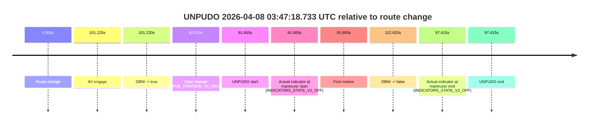
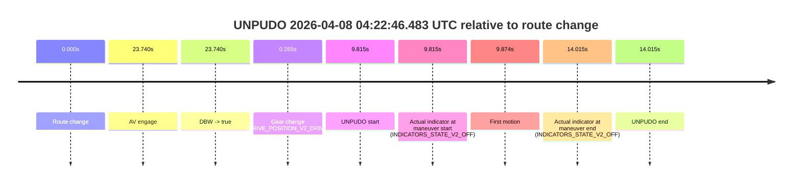

# Run Report: fme10005/2026-04-08--03-44-02--gen2-av-a7b9cb94-3b9e-479c-b71b-f3789d0b09d8

| Field | Value |
|---|---|
| Run ID | `fme10005/2026-04-08--03-44-02--gen2-av-a7b9cb94-3b9e-479c-b71b-f3789d0b09d8` |
| Date | `2026-04-08` |
| Model(s) | `lively-orange-horse` |
| Author | `guy.geva` |
| Event count | `5` |

## unpudo 2026-04-08 03:47:18.733 UTC

| Field | Value |
|---|---|
| Model | `lively-orange-horse` |
| Author | `guy.geva` |
| Run ID | `fme10005/2026-04-08--03-44-02--gen2-av-a7b9cb94-3b9e-479c-b71b-f3789d0b09d8` |
| Date | `2026-04-08` |
| Time (UTC) | `03:47:18.733` |
| Event type | `unpudo` |
| Disengagement type | `failed_to_accelerate` |
| Route change | `found` |
| Console | [run](https://console.sso.wayve.ai/run/fme10005/2026-04-08--03-44-02--gen2-av-a7b9cb94-3b9e-479c-b71b-f3789d0b09d8?id=&time-unixus=1775620038733293) |
| Foxglove | [segment](https://app.foxglove.dev/wayve-on-prem/p/prj_0dX18KZdVHg1fmmI/view?ds=foxglove-stream&ds.deviceName=fme10005&ds.start=2026-04-08T03%3A45%3A37.068321Z&ds.end=2026-04-08T03%3A47%3A49.688732Z&layoutId=lay_0e7VD4WIKDQGU73Y&time=2026-04-08T03%3A47%3A18.733293Z) |

### Event card: fail

- Fail: AV owns part of the segment, but the event still resolves as a model-performance failure under the AV-only scoring rule.

| Event | Time (UTC) | Delta from route change |
|---|---:|---:|
| Route change | 2026-04-08 03:45:47.068 | `0.000s` |
| AV engage | 2026-04-08 03:47:28.288 | `101.220s` |
| DBW -> true | 2026-04-08 03:47:28.288 | `101.220s` |
| Gear change (DRIVE_POSITION_V2_DRIVE) | 2026-04-08 03:47:09.683 | `82.615s` |
| UNPUDO start | 2026-04-08 03:47:18.733 | `91.665s` |
| Actual indicator at maneuver start (INDICATORS_STATE_V2_OFF) | 2026-04-08 03:47:18.733 | `91.665s` |
| First motion | 2026-04-08 03:47:18.761 | `91.693s` |
| DBW -> false | 2026-04-08 03:47:39.688 | `112.620s` |
| Actual indicator at maneuver end (INDICATORS_STATE_V2_OFF) | 2026-04-08 03:47:24.483 | `97.415s` |
| UNPUDO end | 2026-04-08 03:47:24.483 | `97.415s` |

| Metric | Value |
|---|---|
| Outcome | `fail` |
| Effective failure type | `failed_to_accelerate` |
| Route change status | `found` |
| DBW at event start | `false` |
| DBW at event end | `false` |
| Predicted gear at AV start | `DRIVE_POSITION_V2_DRIVE` |
| Actual gear at AV start | `DRIVE_POSITION_V2_DRIVE` |
| Predicted gear at event start | `DRIVE_POSITION_V2_DRIVE` |
| Actual gear at event start | `DRIVE_POSITION_V2_DRIVE` |
| Planned indicator direction | `INDICATORS_STATE_V2_OFF` |
| Controller indicator direction | `INDICATORS_STATE_V2_OFF` |
| Actual indicator direction | `INDICATORS_STATE_V2_OFF` |
| Actual indicator at maneuver end | `INDICATORS_STATE_V2_OFF` |
| Driver accel help in AV | `false` |
| Driver accel help timestamp | `n/a` |
| Max accel pedal pct in AV | `0.0%` |
| Max brake pedal pct in AV | `0.0%` |
| Max speed mps in AV | `0.000` |
| Route -> AV | `101.220s` |
| AV -> event start | `-9.555s` |
| AV -> first motion | `-9.527s` |
| AV duration before disengagement | `11.400s` |
| Trajectory waypoint count | `37` |
| Driving-plan step count | `11` |

The scored portion starts from the AV-owned window, not from the pre-AV setup. Route-change search in the stopped pre-event segment was `found`, with the baseline therefore set to route change. At the event anchor the model predicts `DRIVE_POSITION_V2_DRIVE` and the actual gear is `DRIVE_POSITION_V2_DRIVE`. The effective model outcome is `fail` because `failed_to_accelerate`.

### Resolution

| Field | Value |
|---|---|
| Final outcome | `fail` |
| Do we agree with this label? | `yes` |
| Source disengagement type | `failed_to_accelerate` |
| Resolved effective failure type | `failed_to_accelerate` |
| Confidence | `high` |

## unpudo 2026-04-08 03:59:21.433 UTC

| Field | Value |
|---|---|
| Model | `lively-orange-horse` |
| Author | `guy.geva` |
| Run ID | `fme10005/2026-04-08--03-44-02--gen2-av-a7b9cb94-3b9e-479c-b71b-f3789d0b09d8` |
| Date | `2026-04-08` |
| Time (UTC) | `03:59:21.433` |
| Event type | `unpudo` |
| Disengagement type | `failed_to_unpudo` |
| Route change | `found` |
| Console | [run](https://console.sso.wayve.ai/run/fme10005/2026-04-08--03-44-02--gen2-av-a7b9cb94-3b9e-479c-b71b-f3789d0b09d8?id=&time-unixus=1775620761433290) |
| Foxglove | [segment](https://app.foxglove.dev/wayve-on-prem/p/prj_0dX18KZdVHg1fmmI/view?ds=foxglove-stream&ds.deviceName=fme10005&ds.start=2026-04-08T03%3A58%3A59.618261Z&ds.end=2026-04-08T04%3A00%3A54.028726Z&layoutId=lay_0e7VD4WIKDQGU73Y&time=2026-04-08T03%3A59%3A21.433290Z) |

### Event card: fail

- Fail: AV owns part of the segment, but the event still resolves as a model-performance failure under the AV-only scoring rule.

| Event | Time (UTC) | Delta from route change |
|---|---:|---:|
| Route change | 2026-04-08 03:59:09.618 | `0.000s` |
| AV engage | 2026-04-08 03:59:44.748 | `35.130s` |
| DBW -> true | 2026-04-08 03:59:44.748 | `35.130s` |
| Gear change (DRIVE_POSITION_V2_DRIVE) | 2026-04-08 03:59:12.533 | `2.915s` |
| UNPUDO start | 2026-04-08 03:59:21.433 | `11.815s` |
| Actual indicator at maneuver start (INDICATORS_STATE_V2_OFF) | 2026-04-08 03:59:21.433 | `11.815s` |
| First motion | 2026-04-08 03:59:21.462 | `11.844s` |
| DBW -> false | 2026-04-08 04:00:44.028 | `94.410s` |
| Actual indicator at maneuver end (INDICATORS_STATE_V2_OFF) | 2026-04-08 03:59:26.033 | `16.415s` |
| UNPUDO end | 2026-04-08 03:59:26.033 | `16.415s` |

| Metric | Value |
|---|---|
| Outcome | `fail` |
| Effective failure type | `failed_to_unpudo` |
| Route change status | `found` |
| DBW at event start | `false` |
| DBW at event end | `false` |
| Predicted gear at AV start | `DRIVE_POSITION_V2_DRIVE` |
| Actual gear at AV start | `DRIVE_POSITION_V2_DRIVE` |
| Predicted gear at event start | `DRIVE_POSITION_V2_DRIVE` |
| Actual gear at event start | `DRIVE_POSITION_V2_DRIVE` |
| Planned indicator direction | `INDICATORS_STATE_V2_LEFT_ON` |
| Controller indicator direction | `INDICATORS_STATE_V2_LEFT_ON` |
| Actual indicator direction | `INDICATORS_STATE_V2_OFF` |
| Actual indicator at maneuver end | `INDICATORS_STATE_V2_OFF` |
| Driver accel help in AV | `false` |
| Driver accel help timestamp | `n/a` |
| Max accel pedal pct in AV | `0.0%` |
| Max brake pedal pct in AV | `0.0%` |
| Max speed mps in AV | `0.000` |
| Route -> AV | `35.130s` |
| AV -> event start | `-23.315s` |
| AV -> first motion | `-23.286s` |
| AV duration before disengagement | `59.280s` |
| Trajectory waypoint count | `37` |
| Driving-plan step count | `11` |

The scored portion starts from the AV-owned window, not from the pre-AV setup. Route-change search in the stopped pre-event segment was `found`, with the baseline therefore set to route change. At the event anchor the model predicts `DRIVE_POSITION_V2_DRIVE` and the actual gear is `DRIVE_POSITION_V2_DRIVE`. The effective model outcome is `fail` because `failed_to_unpudo`.

### Resolution

| Field | Value |
|---|---|
| Final outcome | `fail` |
| Do we agree with this label? | `yes` |
| Source disengagement type | `failed_to_unpudo` |
| Resolved effective failure type | `failed_to_unpudo` |
| Confidence | `high` |

## unpudo 2026-04-08 04:14:55.883 UTC

| Field | Value |
|---|---|
| Model | `lively-orange-horse` |
| Author | `guy.geva` |
| Run ID | `fme10005/2026-04-08--03-44-02--gen2-av-a7b9cb94-3b9e-479c-b71b-f3789d0b09d8` |
| Date | `2026-04-08` |
| Time (UTC) | `04:14:55.883` |
| Event type | `unpudo` |
| Disengagement type | `failed_to_unpudo` |
| Route change | `found` |
| Console | [run](https://console.sso.wayve.ai/run/fme10005/2026-04-08--03-44-02--gen2-av-a7b9cb94-3b9e-479c-b71b-f3789d0b09d8?id=&time-unixus=1775621695883324) |
| Foxglove | [segment](https://app.foxglove.dev/wayve-on-prem/p/prj_0dX18KZdVHg1fmmI/view?ds=foxglove-stream&ds.deviceName=fme10005&ds.start=2026-04-08T04%3A14%3A34.168362Z&ds.end=2026-04-08T04%3A15%3A23.808578Z&layoutId=lay_0e7VD4WIKDQGU73Y&time=2026-04-08T04%3A14%3A55.883324Z) |

### Event card: fail

- Fail: AV owns part of the segment, but the event still resolves as a model-performance failure under the AV-only scoring rule.

| Event | Time (UTC) | Delta from route change |
|---|---:|---:|
| Route change | 2026-04-08 04:14:44.168 | `0.000s` |
| AV engage | 2026-04-08 04:15:05.107 | `20.939s` |
| DBW -> true | 2026-04-08 04:15:05.107 | `20.939s` |
| Gear change (DRIVE_POSITION_V2_DRIVE) | 2026-04-08 04:14:44.433 | `0.265s` |
| UNPUDO start | 2026-04-08 04:14:55.883 | `11.715s` |
| Actual indicator at maneuver start (INDICATORS_STATE_V2_OFF) | 2026-04-08 04:14:55.883 | `11.715s` |
| First motion | 2026-04-08 04:14:55.941 | `11.773s` |
| DBW -> false | 2026-04-08 04:15:13.808 | `29.640s` |
| Actual indicator at maneuver end (INDICATORS_STATE_V2_OFF) | 2026-04-08 04:14:59.533 | `15.365s` |
| UNPUDO end | 2026-04-08 04:14:59.533 | `15.365s` |

| Metric | Value |
|---|---|
| Outcome | `fail` |
| Effective failure type | `failed_to_unpudo` |
| Route change status | `found` |
| DBW at event start | `false` |
| DBW at event end | `false` |
| Predicted gear at AV start | `DRIVE_POSITION_V2_DRIVE` |
| Actual gear at AV start | `DRIVE_POSITION_V2_DRIVE` |
| Predicted gear at event start | `DRIVE_POSITION_V2_DRIVE` |
| Actual gear at event start | `DRIVE_POSITION_V2_DRIVE` |
| Planned indicator direction | `INDICATORS_STATE_V2_OFF` |
| Controller indicator direction | `INDICATORS_STATE_V2_OFF` |
| Actual indicator direction | `INDICATORS_STATE_V2_OFF` |
| Actual indicator at maneuver end | `INDICATORS_STATE_V2_OFF` |
| Driver accel help in AV | `false` |
| Driver accel help timestamp | `n/a` |
| Max accel pedal pct in AV | `0.0%` |
| Max brake pedal pct in AV | `0.0%` |
| Max speed mps in AV | `0.000` |
| Route -> AV | `20.939s` |
| AV -> event start | `-9.224s` |
| AV -> first motion | `-9.166s` |
| AV duration before disengagement | `8.701s` |
| Trajectory waypoint count | `37` |
| Driving-plan step count | `11` |

The scored portion starts from the AV-owned window, not from the pre-AV setup. Route-change search in the stopped pre-event segment was `found`, with the baseline therefore set to route change. At the event anchor the model predicts `DRIVE_POSITION_V2_DRIVE` and the actual gear is `DRIVE_POSITION_V2_DRIVE`. The effective model outcome is `fail` because `failed_to_unpudo`.

### Resolution

| Field | Value |
|---|---|
| Final outcome | `fail` |
| Do we agree with this label? | `yes` |
| Source disengagement type | `failed_to_unpudo` |
| Resolved effective failure type | `failed_to_unpudo` |
| Confidence | `high` |

## unpudo 2026-04-08 04:19:44.333 UTC

| Field | Value |
|---|---|
| Model | `lively-orange-horse` |
| Author | `guy.geva` |
| Run ID | `fme10005/2026-04-08--03-44-02--gen2-av-a7b9cb94-3b9e-479c-b71b-f3789d0b09d8` |
| Date | `2026-04-08` |
| Time (UTC) | `04:19:44.333` |
| Event type | `unpudo` |
| Disengagement type | `none observed` |
| Route change | `found` |
| Console | [run](https://console.sso.wayve.ai/run/fme10005/2026-04-08--03-44-02--gen2-av-a7b9cb94-3b9e-479c-b71b-f3789d0b09d8?id=&time-unixus=1775621984333313) |
| Foxglove | [segment](https://app.foxglove.dev/wayve-on-prem/p/prj_0dX18KZdVHg1fmmI/view?ds=foxglove-stream&ds.deviceName=fme10005&ds.start=2026-04-08T04%3A19%3A01.718253Z&ds.end=2026-04-08T04%3A21%3A19.067837Z&layoutId=lay_0e7VD4WIKDQGU73Y&time=2026-04-08T04%3A19%3A44.333313Z) |

### Event card: fail

- Fail: the credited unpudo does not stay AV-owned. The event window starts with DBW false, and the maneuver outcome lands outside a clean AV-owned segment.

| Event | Time (UTC) | Delta from route change |
|---|---:|---:|
| Route change | 2026-04-08 04:19:11.718 | `0.000s` |
| AV engage | 2026-04-08 04:20:01.647 | `49.929s` |
| DBW -> true | 2026-04-08 04:20:01.647 | `49.929s` |
| Gear change (DRIVE_POSITION_V2_REVERSE) | 2026-04-08 04:19:39.933 | `28.215s` |
| UNPUDO start | 2026-04-08 04:19:44.333 | `32.615s` |
| Actual indicator at maneuver start (INDICATORS_STATE_V2_OFF) | 2026-04-08 04:19:44.333 | `32.615s` |
| First motion | 2026-04-08 04:19:52.341 | `40.624s` |
| DBW -> false | 2026-04-08 04:21:09.067 | `117.350s` |
| Actual indicator at maneuver end (INDICATORS_STATE_V2_OFF) | 2026-04-08 04:19:56.583 | `44.865s` |
| UNPUDO end | 2026-04-08 04:19:56.583 | `44.865s` |

| Metric | Value |
|---|---|
| Outcome | `fail` |
| Effective failure type | `completed_outside_av` |
| Route change status | `found` |
| DBW at event start | `false` |
| DBW at event end | `false` |
| Predicted gear at AV start | `DRIVE_POSITION_V2_DRIVE` |
| Actual gear at AV start | `DRIVE_POSITION_V2_DRIVE` |
| Predicted gear at event start | `DRIVE_POSITION_V2_DRIVE` |
| Actual gear at event start | `DRIVE_POSITION_V2_REVERSE` |
| Planned indicator direction | `INDICATORS_STATE_V2_OFF` |
| Controller indicator direction | `INDICATORS_STATE_V2_OFF` |
| Actual indicator direction | `INDICATORS_STATE_V2_OFF` |
| Actual indicator at maneuver end | `INDICATORS_STATE_V2_OFF` |
| Driver accel help in AV | `false` |
| Driver accel help timestamp | `n/a` |
| Max accel pedal pct in AV | `0.0%` |
| Max brake pedal pct in AV | `0.0%` |
| Max speed mps in AV | `0.000` |
| Route -> AV | `49.929s` |
| AV -> event start | `-17.314s` |
| AV -> first motion | `-9.306s` |
| AV duration before disengagement | `67.420s` |
| Trajectory waypoint count | `36` |
| Driving-plan step count | `11` |

The scored portion starts from the AV-owned window, not from the pre-AV setup. Route-change search in the stopped pre-event segment was `found`, with the baseline therefore set to route change. At the event anchor the model predicts `DRIVE_POSITION_V2_DRIVE` and the actual gear is `DRIVE_POSITION_V2_REVERSE`. The effective model outcome is `fail` because `completed_outside_av`.

### Resolution

| Field | Value |
|---|---|
| Final outcome | `fail` |
| Do we agree with this label? | `yes` |
| Source disengagement type | `none observed` |
| Resolved effective failure type | `completed_outside_av` |
| Confidence | `high` |

## unpudo 2026-04-08 04:22:46.483 UTC

| Field | Value |
|---|---|
| Model | `lively-orange-horse` |
| Author | `guy.geva` |
| Run ID | `fme10005/2026-04-08--03-44-02--gen2-av-a7b9cb94-3b9e-479c-b71b-f3789d0b09d8` |
| Date | `2026-04-08` |
| Time (UTC) | `04:22:46.483` |
| Event type | `unpudo` |
| Disengagement type | `failed_to_unpudo` |
| Route change | `found` |
| Console | [run](https://console.sso.wayve.ai/run/fme10005/2026-04-08--03-44-02--gen2-av-a7b9cb94-3b9e-479c-b71b-f3789d0b09d8?id=&time-unixus=1775622166483307) |
| Foxglove | [segment](https://app.foxglove.dev/wayve-on-prem/p/prj_0dX18KZdVHg1fmmI/view?ds=foxglove-stream&ds.deviceName=fme10005&ds.start=2026-04-08T04%3A22%3A26.668286Z&ds.end=2026-04-08T04%3A23%3A00.683292Z&layoutId=lay_0e7VD4WIKDQGU73Y&time=2026-04-08T04%3A22%3A46.483307Z) |

### Event card: fail

- Fail: AV owns part of the segment, but the event still resolves as a model-performance failure under the AV-only scoring rule.

| Event | Time (UTC) | Delta from route change |
|---|---:|---:|
| Route change | 2026-04-08 04:22:36.668 | `0.000s` |
| AV engage | 2026-04-08 04:23:00.408 | `23.740s` |
| DBW -> true | 2026-04-08 04:23:00.408 | `23.740s` |
| Gear change (DRIVE_POSITION_V2_DRIVE) | 2026-04-08 04:22:36.933 | `0.265s` |
| UNPUDO start | 2026-04-08 04:22:46.483 | `9.815s` |
| Actual indicator at maneuver start (INDICATORS_STATE_V2_OFF) | 2026-04-08 04:22:46.483 | `9.815s` |
| First motion | 2026-04-08 04:22:46.541 | `9.874s` |
| Actual indicator at maneuver end (INDICATORS_STATE_V2_OFF) | 2026-04-08 04:22:50.683 | `14.015s` |
| UNPUDO end | 2026-04-08 04:22:50.683 | `14.015s` |

| Metric | Value |
|---|---|
| Outcome | `fail` |
| Effective failure type | `failed_to_unpudo` |
| Route change status | `found` |
| DBW at event start | `false` |
| DBW at event end | `false` |
| Predicted gear at AV start | `DRIVE_POSITION_V2_DRIVE` |
| Actual gear at AV start | `DRIVE_POSITION_V2_DRIVE` |
| Predicted gear at event start | `DRIVE_POSITION_V2_DRIVE` |
| Actual gear at event start | `DRIVE_POSITION_V2_DRIVE` |
| Planned indicator direction | `INDICATORS_STATE_V2_OFF` |
| Controller indicator direction | `INDICATORS_STATE_V2_OFF` |
| Actual indicator direction | `INDICATORS_STATE_V2_OFF` |
| Actual indicator at maneuver end | `INDICATORS_STATE_V2_OFF` |
| Driver accel help in AV | `false` |
| Driver accel help timestamp | `n/a` |
| Max accel pedal pct in AV | `0.0%` |
| Max brake pedal pct in AV | `0.0%` |
| Max speed mps in AV | `0.000` |
| Route -> AV | `23.740s` |
| AV -> event start | `-13.925s` |
| AV -> first motion | `-13.867s` |
| AV duration before disengagement | `n/a` |
| Trajectory waypoint count | `36` |
| Driving-plan step count | `11` |

The scored portion starts from the AV-owned window, not from the pre-AV setup. Route-change search in the stopped pre-event segment was `found`, with the baseline therefore set to route change. At the event anchor the model predicts `DRIVE_POSITION_V2_DRIVE` and the actual gear is `DRIVE_POSITION_V2_DRIVE`. The effective model outcome is `fail` because `failed_to_unpudo`.

### Resolution

| Field | Value |
|---|---|
| Final outcome | `fail` |
| Do we agree with this label? | `yes` |
| Source disengagement type | `failed_to_unpudo` |
| Resolved effective failure type | `failed_to_unpudo` |
| Confidence | `high` |
