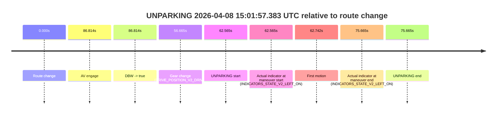

# Run Report: fme10005/2026-04-08--13-44-57--gen2-av-27a80da1-1bdd-4fd3-8f60-db0237213f7e

| Field | Value |
|---|---|
| Run ID | `fme10005/2026-04-08--13-44-57--gen2-av-27a80da1-1bdd-4fd3-8f60-db0237213f7e` |
| Date | `2026-04-08` |
| Model(s) | `lively-orange-horse` |
| Author | `guy.geva` |
| Event count | `1` |

## unparking 2026-04-08 15:01:57.383 UTC

| Field | Value |
|---|---|
| Model | `lively-orange-horse` |
| Author | `guy.geva` |
| Run ID | `fme10005/2026-04-08--13-44-57--gen2-av-27a80da1-1bdd-4fd3-8f60-db0237213f7e` |
| Date | `2026-04-08` |
| Time (UTC) | `15:01:57.383` |
| Event type | `unparking` |
| Disengagement type | `none observed` |
| Route change | `found` |
| Console | [run](https://console.sso.wayve.ai/run/fme10005/2026-04-08--13-44-57--gen2-av-27a80da1-1bdd-4fd3-8f60-db0237213f7e?id=&time-unixus=1775660517383315) |
| Foxglove | [segment](https://app.foxglove.dev/wayve-on-prem/p/prj_0dX18KZdVHg1fmmI/view?ds=foxglove-stream&ds.deviceName=fme10005&ds.start=2026-04-08T15%3A00%3A44.818270Z&ds.end=2026-04-08T15%3A02%3A20.483300Z&layoutId=lay_0e7VD4WIKDQGU73Y&time=2026-04-08T15%3A01%3A57.383315Z) |

### Event card: fail

- Fail: the credited unparking does not stay AV-owned. The event window starts with DBW false, and the maneuver outcome lands outside a clean AV-owned segment.

| Event | Time (UTC) | Delta from route change |
|---|---:|---:|
| Route change | 2026-04-08 15:00:54.818 | `0.000s` |
| AV engage | 2026-04-08 15:02:21.632 | `86.814s` |
| DBW -> true | 2026-04-08 15:02:21.632 | `86.814s` |
| Gear change (DRIVE_POSITION_V2_DRIVE) | 2026-04-08 15:01:51.483 | `56.665s` |
| UNPARKING start | 2026-04-08 15:01:57.383 | `62.565s` |
| Actual indicator at maneuver start (INDICATORS_STATE_V2_LEFT_ON) | 2026-04-08 15:01:57.383 | `62.565s` |
| First motion | 2026-04-08 15:01:57.559 | `62.742s` |
| Actual indicator at maneuver end (INDICATORS_STATE_V2_LEFT_ON) | 2026-04-08 15:02:10.483 | `75.665s` |
| UNPARKING end | 2026-04-08 15:02:10.483 | `75.665s` |

| Metric | Value |
|---|---|
| Outcome | `fail` |
| Effective failure type | `completed_outside_av` |
| Route change status | `found` |
| DBW at event start | `false` |
| DBW at event end | `false` |
| Predicted gear at AV start | `DRIVE_POSITION_V2_DRIVE` |
| Actual gear at AV start | `DRIVE_POSITION_V2_DRIVE` |
| Predicted gear at event start | `DRIVE_POSITION_V2_DRIVE` |
| Actual gear at event start | `DRIVE_POSITION_V2_DRIVE` |
| Planned indicator direction | `INDICATORS_STATE_V2_LEFT_ON` |
| Controller indicator direction | `INDICATORS_STATE_V2_LEFT_ON` |
| Actual indicator direction | `INDICATORS_STATE_V2_LEFT_ON` |
| Actual indicator at maneuver end | `INDICATORS_STATE_V2_LEFT_ON` |
| Driver accel help in AV | `false` |
| Driver accel help timestamp | `n/a` |
| Max accel pedal pct in AV | `0.0%` |
| Max brake pedal pct in AV | `0.0%` |
| Max speed mps in AV | `0.000` |
| Route -> AV | `86.814s` |
| AV -> event start | `-24.249s` |
| AV -> first motion | `-24.073s` |
| AV duration before disengagement | `n/a` |
| Trajectory waypoint count | `37` |
| Driving-plan step count | `11` |

The scored portion starts from the AV-owned window, not from the pre-AV setup. Route-change search in the stopped pre-event segment was `found`, with the baseline therefore set to route change. At the event anchor the model predicts `DRIVE_POSITION_V2_DRIVE` and the actual gear is `DRIVE_POSITION_V2_DRIVE`. The effective model outcome is `fail` because `completed_outside_av`.

### Resolution

| Field | Value |
|---|---|
| Final outcome | `fail` |
| Do we agree with this label? | `yes` |
| Source disengagement type | `none observed` |
| Resolved effective failure type | `completed_outside_av` |
| Confidence | `high` |
