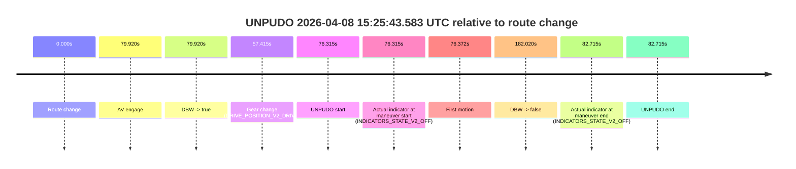
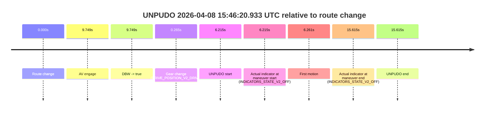

# Run Report: fme10005/2026-04-08--15-03-58--gen2-av-2bfe2dfa-1afb-45af-9b97-1d64380588a0

| Field | Value |
|---|---|
| Run ID | `fme10005/2026-04-08--15-03-58--gen2-av-2bfe2dfa-1afb-45af-9b97-1d64380588a0` |
| Date | `2026-04-08` |
| Model(s) | `lively-orange-horse` |
| Author | `guy.geva` |
| Event count | `3` |

## unpudo 2026-04-08 15:25:43.583 UTC

| Field | Value |
|---|---|
| Model | `lively-orange-horse` |
| Author | `guy.geva` |
| Run ID | `fme10005/2026-04-08--15-03-58--gen2-av-2bfe2dfa-1afb-45af-9b97-1d64380588a0` |
| Date | `2026-04-08` |
| Time (UTC) | `15:25:43.583` |
| Event type | `unpudo` |
| Disengagement type | `failed_to_unpudo` |
| Route change | `found` |
| Console | [run](https://console.sso.wayve.ai/run/fme10005/2026-04-08--15-03-58--gen2-av-2bfe2dfa-1afb-45af-9b97-1d64380588a0?id=&time-unixus=1775661943583316) |
| Foxglove | [segment](https://app.foxglove.dev/wayve-on-prem/p/prj_0dX18KZdVHg1fmmI/view?ds=foxglove-stream&ds.deviceName=fme10005&ds.start=2026-04-08T15%3A24%3A17.268249Z&ds.end=2026-04-08T15%3A27%3A39.288622Z&layoutId=lay_0e7VD4WIKDQGU73Y&time=2026-04-08T15%3A25%3A43.583316Z) |

### Event card: fail

- Fail: AV owns part of the segment, but the event still resolves as a model-performance failure under the AV-only scoring rule.

| Event | Time (UTC) | Delta from route change |
|---|---:|---:|
| Route change | 2026-04-08 15:24:27.268 | `0.000s` |
| AV engage | 2026-04-08 15:25:47.188 | `79.920s` |
| DBW -> true | 2026-04-08 15:25:47.188 | `79.920s` |
| Gear change (DRIVE_POSITION_V2_DRIVE) | 2026-04-08 15:25:24.683 | `57.415s` |
| UNPUDO start | 2026-04-08 15:25:43.583 | `76.315s` |
| Actual indicator at maneuver start (INDICATORS_STATE_V2_OFF) | 2026-04-08 15:25:43.583 | `76.315s` |
| First motion | 2026-04-08 15:25:43.640 | `76.372s` |
| DBW -> false | 2026-04-08 15:27:29.288 | `182.020s` |
| Actual indicator at maneuver end (INDICATORS_STATE_V2_OFF) | 2026-04-08 15:25:49.983 | `82.715s` |
| UNPUDO end | 2026-04-08 15:25:49.983 | `82.715s` |

| Metric | Value |
|---|---|
| Outcome | `fail` |
| Effective failure type | `failed_to_unpudo` |
| Route change status | `found` |
| DBW at event start | `false` |
| DBW at event end | `true` |
| Predicted gear at AV start | `DRIVE_POSITION_V2_DRIVE` |
| Actual gear at AV start | `DRIVE_POSITION_V2_DRIVE` |
| Predicted gear at event start | `DRIVE_POSITION_V2_DRIVE` |
| Actual gear at event start | `DRIVE_POSITION_V2_DRIVE` |
| Planned indicator direction | `INDICATORS_STATE_V2_RIGHT_ON` |
| Controller indicator direction | `INDICATORS_STATE_V2_RIGHT_ON` |
| Actual indicator direction | `INDICATORS_STATE_V2_OFF` |
| Actual indicator at maneuver end | `INDICATORS_STATE_V2_OFF` |
| Driver accel help in AV | `false` |
| Driver accel help timestamp | `n/a` |
| Max accel pedal pct in AV | `0.0%` |
| Max brake pedal pct in AV | `0.0%` |
| Max speed mps in AV | `4.711` |
| Route -> AV | `79.920s` |
| AV -> event start | `-3.605s` |
| AV -> first motion | `-3.548s` |
| AV duration before disengagement | `102.100s` |
| Trajectory waypoint count | `36` |
| Driving-plan step count | `11` |

The scored portion starts from the AV-owned window, not from the pre-AV setup. Route-change search in the stopped pre-event segment was `found`, with the baseline therefore set to route change. At the event anchor the model predicts `DRIVE_POSITION_V2_DRIVE` and the actual gear is `DRIVE_POSITION_V2_DRIVE`. The effective model outcome is `fail` because `failed_to_unpudo`.

### Resolution

| Field | Value |
|---|---|
| Final outcome | `fail` |
| Do we agree with this label? | `yes` |
| Source disengagement type | `failed_to_unpudo` |
| Resolved effective failure type | `failed_to_unpudo` |
| Confidence | `high` |

## unpudo 2026-04-08 15:37:37.633 UTC

| Field | Value |
|---|---|
| Model | `lively-orange-horse` |
| Author | `guy.geva` |
| Run ID | `fme10005/2026-04-08--15-03-58--gen2-av-2bfe2dfa-1afb-45af-9b97-1d64380588a0` |
| Date | `2026-04-08` |
| Time (UTC) | `15:37:37.633` |
| Event type | `unpudo` |
| Disengagement type | `none observed` |
| Route change | `found` |
| Console | [run](https://console.sso.wayve.ai/run/fme10005/2026-04-08--15-03-58--gen2-av-2bfe2dfa-1afb-45af-9b97-1d64380588a0?id=&time-unixus=1775662657633305) |
| Foxglove | [segment](https://app.foxglove.dev/wayve-on-prem/p/prj_0dX18KZdVHg1fmmI/view?ds=foxglove-stream&ds.deviceName=fme10005&ds.start=2026-04-08T15%3A37%3A22.819744Z&ds.end=2026-04-08T15%3A39%3A59.747451Z&layoutId=lay_0e7VD4WIKDQGU73Y&time=2026-04-08T15%3A37%3A37.633305Z) |

### Event card: fail

- Fail: the credited unpudo does not stay AV-owned. The event window starts with DBW false, and the maneuver outcome lands outside a clean AV-owned segment.

| Event | Time (UTC) | Delta from route change |
|---|---:|---:|
| Route change | 2026-04-08 15:37:32.819 | `0.000s` |
| AV engage | 2026-04-08 15:37:41.447 | `8.628s` |
| DBW -> true | 2026-04-08 15:37:41.447 | `8.628s` |
| Gear change (DRIVE_POSITION_V2_DRIVE) | 2026-04-08 15:37:35.283 | `2.464s` |
| UNPUDO start | 2026-04-08 15:37:37.633 | `4.814s` |
| Actual indicator at maneuver start (INDICATORS_STATE_V2_LEFT_ON) | 2026-04-08 15:37:37.633 | `4.814s` |
| First motion | 2026-04-08 15:37:37.679 | `4.860s` |
| DBW -> false | 2026-04-08 15:39:49.747 | `136.928s` |
| Actual indicator at maneuver end (INDICATORS_STATE_V2_OFF) | 2026-04-08 15:37:41.483 | `8.664s` |
| UNPUDO end | 2026-04-08 15:37:41.483 | `8.664s` |

| Metric | Value |
|---|---|
| Outcome | `fail` |
| Effective failure type | `completed_outside_av` |
| Route change status | `found` |
| DBW at event start | `false` |
| DBW at event end | `true` |
| Predicted gear at AV start | `DRIVE_POSITION_V2_DRIVE` |
| Actual gear at AV start | `DRIVE_POSITION_V2_DRIVE` |
| Predicted gear at event start | `DRIVE_POSITION_V2_DRIVE` |
| Actual gear at event start | `DRIVE_POSITION_V2_DRIVE` |
| Planned indicator direction | `INDICATORS_STATE_V2_LEFT_ON` |
| Controller indicator direction | `INDICATORS_STATE_V2_LEFT_ON` |
| Actual indicator direction | `INDICATORS_STATE_V2_LEFT_ON` |
| Actual indicator at maneuver end | `INDICATORS_STATE_V2_OFF` |
| Driver accel help in AV | `false` |
| Driver accel help timestamp | `n/a` |
| Max accel pedal pct in AV | `0.0%` |
| Max brake pedal pct in AV | `0.0%` |
| Max speed mps in AV | `6.464` |
| Route -> AV | `8.628s` |
| AV -> event start | `-3.814s` |
| AV -> first motion | `-3.768s` |
| AV duration before disengagement | `128.300s` |
| Trajectory waypoint count | `35` |
| Driving-plan step count | `11` |

The scored portion starts from the AV-owned window, not from the pre-AV setup. Route-change search in the stopped pre-event segment was `found`, with the baseline therefore set to route change. At the event anchor the model predicts `DRIVE_POSITION_V2_DRIVE` and the actual gear is `DRIVE_POSITION_V2_DRIVE`. The effective model outcome is `fail` because `completed_outside_av`.

### Resolution

| Field | Value |
|---|---|
| Final outcome | `fail` |
| Do we agree with this label? | `yes` |
| Source disengagement type | `none observed` |
| Resolved effective failure type | `completed_outside_av` |
| Confidence | `high` |

## unpudo 2026-04-08 15:46:20.933 UTC

| Field | Value |
|---|---|
| Model | `lively-orange-horse` |
| Author | `guy.geva` |
| Run ID | `fme10005/2026-04-08--15-03-58--gen2-av-2bfe2dfa-1afb-45af-9b97-1d64380588a0` |
| Date | `2026-04-08` |
| Time (UTC) | `15:46:20.933` |
| Event type | `unpudo` |
| Disengagement type | `failed_to_accelerate` |
| Route change | `found` |
| Console | [run](https://console.sso.wayve.ai/run/fme10005/2026-04-08--15-03-58--gen2-av-2bfe2dfa-1afb-45af-9b97-1d64380588a0?id=&time-unixus=1775663180933293) |
| Foxglove | [segment](https://app.foxglove.dev/wayve-on-prem/p/prj_0dX18KZdVHg1fmmI/view?ds=foxglove-stream&ds.deviceName=fme10005&ds.start=2026-04-08T15%3A46%3A04.718303Z&ds.end=2026-04-08T15%3A46%3A40.333293Z&layoutId=lay_0e7VD4WIKDQGU73Y&time=2026-04-08T15%3A46%3A20.933293Z) |

### Event card: fail

- Fail: AV owns part of the segment, but the event still resolves as a model-performance failure under the AV-only scoring rule.

| Event | Time (UTC) | Delta from route change |
|---|---:|---:|
| Route change | 2026-04-08 15:46:14.718 | `0.000s` |
| AV engage | 2026-04-08 15:46:24.467 | `9.749s` |
| DBW -> true | 2026-04-08 15:46:24.467 | `9.749s` |
| Gear change (DRIVE_POSITION_V2_DRIVE) | 2026-04-08 15:46:14.983 | `0.265s` |
| UNPUDO start | 2026-04-08 15:46:20.933 | `6.215s` |
| Actual indicator at maneuver start (INDICATORS_STATE_V2_OFF) | 2026-04-08 15:46:20.933 | `6.215s` |
| First motion | 2026-04-08 15:46:20.979 | `6.261s` |
| Actual indicator at maneuver end (INDICATORS_STATE_V2_OFF) | 2026-04-08 15:46:30.333 | `15.615s` |
| UNPUDO end | 2026-04-08 15:46:30.333 | `15.615s` |

| Metric | Value |
|---|---|
| Outcome | `fail` |
| Effective failure type | `failed_to_accelerate` |
| Route change status | `found` |
| DBW at event start | `false` |
| DBW at event end | `true` |
| Predicted gear at AV start | `DRIVE_POSITION_V2_DRIVE` |
| Actual gear at AV start | `DRIVE_POSITION_V2_DRIVE` |
| Predicted gear at event start | `DRIVE_POSITION_V2_DRIVE` |
| Actual gear at event start | `DRIVE_POSITION_V2_DRIVE` |
| Planned indicator direction | `INDICATORS_STATE_V2_OFF` |
| Controller indicator direction | `INDICATORS_STATE_V2_OFF` |
| Actual indicator direction | `INDICATORS_STATE_V2_OFF` |
| Actual indicator at maneuver end | `INDICATORS_STATE_V2_OFF` |
| Driver accel help in AV | `false` |
| Driver accel help timestamp | `n/a` |
| Max accel pedal pct in AV | `0.0%` |
| Max brake pedal pct in AV | `0.0%` |
| Max speed mps in AV | `2.239` |
| Route -> AV | `9.749s` |
| AV -> event start | `-3.534s` |
| AV -> first motion | `-3.488s` |
| AV duration before disengagement | `n/a` |
| Trajectory waypoint count | `35` |
| Driving-plan step count | `11` |

The scored portion starts from the AV-owned window, not from the pre-AV setup. Route-change search in the stopped pre-event segment was `found`, with the baseline therefore set to route change. At the event anchor the model predicts `DRIVE_POSITION_V2_DRIVE` and the actual gear is `DRIVE_POSITION_V2_DRIVE`. The effective model outcome is `fail` because `failed_to_accelerate`.

### Resolution

| Field | Value |
|---|---|
| Final outcome | `fail` |
| Do we agree with this label? | `yes` |
| Source disengagement type | `failed_to_accelerate` |
| Resolved effective failure type | `failed_to_accelerate` |
| Confidence | `high` |
