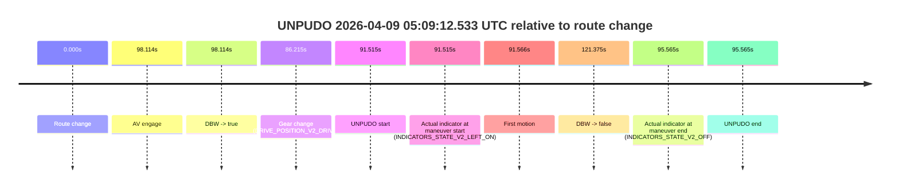
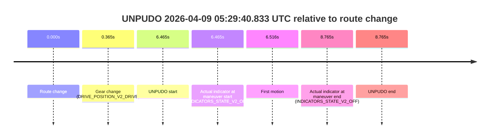

# Run Report: fme10005/2026-04-09--04-58-02--gen2-av-d61e5940-8606-4ed5-8a8f-13c48bd4390d

| Field | Value |
|---|---|
| Run ID | `fme10005/2026-04-09--04-58-02--gen2-av-d61e5940-8606-4ed5-8a8f-13c48bd4390d` |
| Date | `2026-04-09` |
| Model(s) | `lively-orange-horse` |
| Author | `guy.geva` |
| Event count | `6` |

## unpudo 2026-04-09 05:07:42.433 UTC

| Field | Value |
|---|---|
| Model | `lively-orange-horse` |
| Author | `guy.geva` |
| Run ID | `fme10005/2026-04-09--04-58-02--gen2-av-d61e5940-8606-4ed5-8a8f-13c48bd4390d` |
| Date | `2026-04-09` |
| Time (UTC) | `05:07:42.433` |
| Event type | `unpudo` |
| Disengagement type | `uncategorised` |
| Route change | `found` |
| Console | [run](https://console.sso.wayve.ai/run/fme10005/2026-04-09--04-58-02--gen2-av-d61e5940-8606-4ed5-8a8f-13c48bd4390d?id=&time-unixus=1775711262433304) |
| Foxglove | [segment](https://app.foxglove.dev/wayve-on-prem/p/prj_0dX18KZdVHg1fmmI/view?ds=foxglove-stream&ds.deviceName=fme10005&ds.start=2026-04-09T05%3A07%3A31.018284Z&ds.end=2026-04-09T05%3A09%3A05.491836Z&layoutId=lay_0e7VD4WIKDQGU73Y&time=2026-04-09T05%3A07%3A42.433304Z) |

### Event card: fail

- Fail: AV owns part of the segment, but the event still resolves as a model-performance failure under the AV-only scoring rule.

| Event | Time (UTC) | Delta from route change |
|---|---:|---:|
| Route change | 2026-04-09 05:07:41.018 | `0.000s` |
| AV engage | 2026-04-09 05:07:59.191 | `18.173s` |
| DBW -> true | 2026-04-09 05:07:59.191 | `18.173s` |
| Gear change (DRIVE_POSITION_V2_DRIVE) | 2026-04-09 05:07:41.333 | `0.315s` |
| UNPUDO start | 2026-04-09 05:07:42.433 | `1.415s` |
| Actual indicator at maneuver start (INDICATORS_STATE_V2_OFF) | 2026-04-09 05:07:42.433 | `1.415s` |
| First motion | 2026-04-09 05:07:42.484 | `1.466s` |
| DBW -> false | 2026-04-09 05:08:55.491 | `74.474s` |
| Actual indicator at maneuver end (INDICATORS_STATE_V2_OFF) | 2026-04-09 05:08:03.583 | `22.565s` |
| UNPUDO end | 2026-04-09 05:08:03.583 | `22.565s` |

| Metric | Value |
|---|---|
| Outcome | `fail` |
| Effective failure type | `uncategorised` |
| Route change status | `found` |
| DBW at event start | `false` |
| DBW at event end | `true` |
| Predicted gear at AV start | `DRIVE_POSITION_V2_DRIVE` |
| Actual gear at AV start | `DRIVE_POSITION_V2_DRIVE` |
| Predicted gear at event start | `DRIVE_POSITION_V2_DRIVE` |
| Actual gear at event start | `DRIVE_POSITION_V2_DRIVE` |
| Planned indicator direction | `INDICATORS_STATE_V2_OFF` |
| Controller indicator direction | `INDICATORS_STATE_V2_OFF` |
| Actual indicator direction | `INDICATORS_STATE_V2_OFF` |
| Actual indicator at maneuver end | `INDICATORS_STATE_V2_OFF` |
| Driver accel help in AV | `false` |
| Driver accel help timestamp | `n/a` |
| Max accel pedal pct in AV | `0.0%` |
| Max brake pedal pct in AV | `0.0%` |
| Max speed mps in AV | `2.236` |
| Route -> AV | `18.173s` |
| AV -> event start | `-16.758s` |
| AV -> first motion | `-16.708s` |
| AV duration before disengagement | `56.300s` |
| Trajectory waypoint count | `36` |
| Driving-plan step count | `11` |

The scored portion starts from the AV-owned window, not from the pre-AV setup. Route-change search in the stopped pre-event segment was `found`, with the baseline therefore set to route change. At the event anchor the model predicts `DRIVE_POSITION_V2_DRIVE` and the actual gear is `DRIVE_POSITION_V2_DRIVE`. The effective model outcome is `fail` because `uncategorised`.

### Resolution

| Field | Value |
|---|---|
| Final outcome | `fail` |
| Do we agree with this label? | `yes` |
| Source disengagement type | `uncategorised` |
| Resolved effective failure type | `uncategorised` |
| Confidence | `high` |

## unpudo 2026-04-09 05:09:12.533 UTC

| Field | Value |
|---|---|
| Model | `lively-orange-horse` |
| Author | `guy.geva` |
| Run ID | `fme10005/2026-04-09--04-58-02--gen2-av-d61e5940-8606-4ed5-8a8f-13c48bd4390d` |
| Date | `2026-04-09` |
| Time (UTC) | `05:09:12.533` |
| Event type | `unpudo` |
| Disengagement type | `failed_to_unpudo` |
| Route change | `found` |
| Console | [run](https://console.sso.wayve.ai/run/fme10005/2026-04-09--04-58-02--gen2-av-d61e5940-8606-4ed5-8a8f-13c48bd4390d?id=&time-unixus=1775711352533299) |
| Foxglove | [segment](https://app.foxglove.dev/wayve-on-prem/p/prj_0dX18KZdVHg1fmmI/view?ds=foxglove-stream&ds.deviceName=fme10005&ds.start=2026-04-09T05%3A07%3A31.018284Z&ds.end=2026-04-09T05%3A09%3A52.393127Z&layoutId=lay_0e7VD4WIKDQGU73Y&time=2026-04-09T05%3A09%3A12.533299Z) |

### Event card: fail

- Fail: AV owns part of the segment, but the event still resolves as a model-performance failure under the AV-only scoring rule.

| Event | Time (UTC) | Delta from route change |
|---|---:|---:|
| Route change | 2026-04-09 05:07:41.018 | `0.000s` |
| AV engage | 2026-04-09 05:09:19.131 | `98.114s` |
| DBW -> true | 2026-04-09 05:09:19.131 | `98.114s` |
| Gear change (DRIVE_POSITION_V2_DRIVE) | 2026-04-09 05:09:07.233 | `86.215s` |
| UNPUDO start | 2026-04-09 05:09:12.533 | `91.515s` |
| Actual indicator at maneuver start (INDICATORS_STATE_V2_LEFT_ON) | 2026-04-09 05:09:12.533 | `91.515s` |
| First motion | 2026-04-09 05:09:12.584 | `91.566s` |
| DBW -> false | 2026-04-09 05:09:42.393 | `121.375s` |
| Actual indicator at maneuver end (INDICATORS_STATE_V2_OFF) | 2026-04-09 05:09:16.583 | `95.565s` |
| UNPUDO end | 2026-04-09 05:09:16.583 | `95.565s` |

| Metric | Value |
|---|---|
| Outcome | `fail` |
| Effective failure type | `failed_to_unpudo` |
| Route change status | `found` |
| DBW at event start | `false` |
| DBW at event end | `false` |
| Predicted gear at AV start | `DRIVE_POSITION_V2_DRIVE` |
| Actual gear at AV start | `DRIVE_POSITION_V2_DRIVE` |
| Predicted gear at event start | `DRIVE_POSITION_V2_DRIVE` |
| Actual gear at event start | `DRIVE_POSITION_V2_DRIVE` |
| Planned indicator direction | `INDICATORS_STATE_V2_LEFT_ON` |
| Controller indicator direction | `INDICATORS_STATE_V2_LEFT_ON` |
| Actual indicator direction | `INDICATORS_STATE_V2_LEFT_ON` |
| Actual indicator at maneuver end | `INDICATORS_STATE_V2_OFF` |
| Driver accel help in AV | `false` |
| Driver accel help timestamp | `n/a` |
| Max accel pedal pct in AV | `0.0%` |
| Max brake pedal pct in AV | `0.0%` |
| Max speed mps in AV | `0.000` |
| Route -> AV | `98.114s` |
| AV -> event start | `-6.599s` |
| AV -> first motion | `-6.548s` |
| AV duration before disengagement | `23.261s` |
| Trajectory waypoint count | `36` |
| Driving-plan step count | `11` |

The scored portion starts from the AV-owned window, not from the pre-AV setup. Route-change search in the stopped pre-event segment was `found`, with the baseline therefore set to route change. At the event anchor the model predicts `DRIVE_POSITION_V2_DRIVE` and the actual gear is `DRIVE_POSITION_V2_DRIVE`. The effective model outcome is `fail` because `failed_to_unpudo`.

### Resolution

| Field | Value |
|---|---|
| Final outcome | `fail` |
| Do we agree with this label? | `yes` |
| Source disengagement type | `failed_to_unpudo` |
| Resolved effective failure type | `failed_to_unpudo` |
| Confidence | `high` |

## unpudo 2026-04-09 05:10:23.033 UTC

| Field | Value |
|---|---|
| Model | `lively-orange-horse` |
| Author | `guy.geva` |
| Run ID | `fme10005/2026-04-09--04-58-02--gen2-av-d61e5940-8606-4ed5-8a8f-13c48bd4390d` |
| Date | `2026-04-09` |
| Time (UTC) | `05:10:23.033` |
| Event type | `unpudo` |
| Disengagement type | `failed_to_pudo` |
| Route change | `found` |
| Console | [run](https://console.sso.wayve.ai/run/fme10005/2026-04-09--04-58-02--gen2-av-d61e5940-8606-4ed5-8a8f-13c48bd4390d?id=&time-unixus=1775711423033316) |
| Foxglove | [segment](https://app.foxglove.dev/wayve-on-prem/p/prj_0dX18KZdVHg1fmmI/view?ds=foxglove-stream&ds.deviceName=fme10005&ds.start=2026-04-09T05%3A08%3A56.968253Z&ds.end=2026-04-09T05%3A11%3A49.411927Z&layoutId=lay_0e7VD4WIKDQGU73Y&time=2026-04-09T05%3A10%3A23.033316Z) |

### Event card: fail

- Fail: AV owns part of the segment, but the event still resolves as a model-performance failure under the AV-only scoring rule.

| Event | Time (UTC) | Delta from route change |
|---|---:|---:|
| Route change | 2026-04-09 05:09:06.968 | `0.000s` |
| AV engage | 2026-04-09 05:10:27.133 | `80.165s` |
| DBW -> true | 2026-04-09 05:10:27.133 | `80.165s` |
| Gear change (DRIVE_POSITION_V2_DRIVE) | 2026-04-09 05:10:17.733 | `70.765s` |
| UNPUDO start | 2026-04-09 05:10:23.033 | `76.065s` |
| Actual indicator at maneuver start (INDICATORS_STATE_V2_LEFT_ON) | 2026-04-09 05:10:23.033 | `76.065s` |
| First motion | 2026-04-09 05:10:23.044 | `76.076s` |
| DBW -> false | 2026-04-09 05:11:39.411 | `152.444s` |
| Actual indicator at maneuver end (INDICATORS_STATE_V2_OFF) | 2026-04-09 05:10:25.833 | `78.865s` |
| UNPUDO end | 2026-04-09 05:10:25.833 | `78.865s` |

| Metric | Value |
|---|---|
| Outcome | `fail` |
| Effective failure type | `failed_to_pudo` |
| Route change status | `found` |
| DBW at event start | `false` |
| DBW at event end | `false` |
| Predicted gear at AV start | `DRIVE_POSITION_V2_DRIVE` |
| Actual gear at AV start | `DRIVE_POSITION_V2_DRIVE` |
| Predicted gear at event start | `DRIVE_POSITION_V2_DRIVE` |
| Actual gear at event start | `DRIVE_POSITION_V2_DRIVE` |
| Planned indicator direction | `INDICATORS_STATE_V2_LEFT_ON` |
| Controller indicator direction | `INDICATORS_STATE_V2_LEFT_ON` |
| Actual indicator direction | `INDICATORS_STATE_V2_LEFT_ON` |
| Actual indicator at maneuver end | `INDICATORS_STATE_V2_OFF` |
| Driver accel help in AV | `false` |
| Driver accel help timestamp | `n/a` |
| Max accel pedal pct in AV | `0.0%` |
| Max brake pedal pct in AV | `0.0%` |
| Max speed mps in AV | `0.000` |
| Route -> AV | `80.165s` |
| AV -> event start | `-4.100s` |
| AV -> first motion | `-4.089s` |
| AV duration before disengagement | `72.279s` |
| Trajectory waypoint count | `36` |
| Driving-plan step count | `11` |

The scored portion starts from the AV-owned window, not from the pre-AV setup. Route-change search in the stopped pre-event segment was `found`, with the baseline therefore set to route change. At the event anchor the model predicts `DRIVE_POSITION_V2_DRIVE` and the actual gear is `DRIVE_POSITION_V2_DRIVE`. The effective model outcome is `fail` because `failed_to_pudo`.

### Resolution

| Field | Value |
|---|---|
| Final outcome | `fail` |
| Do we agree with this label? | `yes` |
| Source disengagement type | `failed_to_pudo` |
| Resolved effective failure type | `failed_to_pudo` |
| Confidence | `high` |

## unpudo 2026-04-09 05:19:48.633 UTC

| Field | Value |
|---|---|
| Model | `lively-orange-horse` |
| Author | `guy.geva` |
| Run ID | `fme10005/2026-04-09--04-58-02--gen2-av-d61e5940-8606-4ed5-8a8f-13c48bd4390d` |
| Date | `2026-04-09` |
| Time (UTC) | `05:19:48.633` |
| Event type | `unpudo` |
| Disengagement type | `failed_to_unpudo` |
| Route change | `found` |
| Console | [run](https://console.sso.wayve.ai/run/fme10005/2026-04-09--04-58-02--gen2-av-d61e5940-8606-4ed5-8a8f-13c48bd4390d?id=&time-unixus=1775711988633297) |
| Foxglove | [segment](https://app.foxglove.dev/wayve-on-prem/p/prj_0dX18KZdVHg1fmmI/view?ds=foxglove-stream&ds.deviceName=fme10005&ds.start=2026-04-09T05%3A19%3A28.968291Z&ds.end=2026-04-09T05%3A20%3A20.083290Z&layoutId=lay_0e7VD4WIKDQGU73Y&time=2026-04-09T05%3A19%3A48.633297Z) |

### Event card: fail

- Fail: AV owns part of the segment, but the event still resolves as a model-performance failure under the AV-only scoring rule.

| Event | Time (UTC) | Delta from route change |
|---|---:|---:|
| Route change | 2026-04-09 05:19:38.968 | `0.000s` |
| AV engage | 2026-04-09 05:20:05.491 | `26.524s` |
| DBW -> true | 2026-04-09 05:20:05.491 | `26.524s` |
| Gear change (DRIVE_POSITION_V2_DRIVE) | 2026-04-09 05:19:42.233 | `3.265s` |
| UNPUDO start | 2026-04-09 05:19:48.633 | `9.665s` |
| Actual indicator at maneuver start (INDICATORS_STATE_V2_LEFT_ON) | 2026-04-09 05:19:48.633 | `9.665s` |
| First motion | 2026-04-09 05:19:48.684 | `9.716s` |
| DBW -> false | 2026-04-09 05:20:08.731 | `29.764s` |
| Actual indicator at maneuver end (INDICATORS_STATE_V2_OFF) | 2026-04-09 05:20:10.083 | `31.115s` |
| UNPUDO end | 2026-04-09 05:20:10.083 | `31.115s` |

| Metric | Value |
|---|---|
| Outcome | `fail` |
| Effective failure type | `failed_to_unpudo` |
| Route change status | `found` |
| DBW at event start | `false` |
| DBW at event end | `false` |
| Predicted gear at AV start | `DRIVE_POSITION_V2_PARK` |
| Actual gear at AV start | `DRIVE_POSITION_V2_PARK` |
| Predicted gear at event start | `DRIVE_POSITION_V2_DRIVE` |
| Actual gear at event start | `DRIVE_POSITION_V2_DRIVE` |
| Planned indicator direction | `INDICATORS_STATE_V2_LEFT_ON` |
| Controller indicator direction | `INDICATORS_STATE_V2_LEFT_ON` |
| Actual indicator direction | `INDICATORS_STATE_V2_LEFT_ON` |
| Actual indicator at maneuver end | `INDICATORS_STATE_V2_OFF` |
| Driver accel help in AV | `false` |
| Driver accel help timestamp | `n/a` |
| Max accel pedal pct in AV | `0.0%` |
| Max brake pedal pct in AV | `8.0%` |
| Max speed mps in AV | `0.000` |
| Route -> AV | `26.524s` |
| AV -> event start | `-16.859s` |
| AV -> first motion | `-16.808s` |
| AV duration before disengagement | `3.240s` |
| Trajectory waypoint count | `36` |
| Driving-plan step count | `11` |

The scored portion starts from the AV-owned window, not from the pre-AV setup. Route-change search in the stopped pre-event segment was `found`, with the baseline therefore set to route change. At the event anchor the model predicts `DRIVE_POSITION_V2_DRIVE` and the actual gear is `DRIVE_POSITION_V2_DRIVE`. The effective model outcome is `fail` because `failed_to_unpudo`.

### Resolution

| Field | Value |
|---|---|
| Final outcome | `fail` |
| Do we agree with this label? | `yes` |
| Source disengagement type | `failed_to_unpudo` |
| Resolved effective failure type | `failed_to_unpudo` |
| Confidence | `high` |

## unpudo 2026-04-09 05:28:02.733 UTC

| Field | Value |
|---|---|
| Model | `lively-orange-horse` |
| Author | `guy.geva` |
| Run ID | `fme10005/2026-04-09--04-58-02--gen2-av-d61e5940-8606-4ed5-8a8f-13c48bd4390d` |
| Date | `2026-04-09` |
| Time (UTC) | `05:28:02.733` |
| Event type | `unpudo` |
| Disengagement type | `none observed` |
| Route change | `found` |
| Console | [run](https://console.sso.wayve.ai/run/fme10005/2026-04-09--04-58-02--gen2-av-d61e5940-8606-4ed5-8a8f-13c48bd4390d?id=&time-unixus=1775712482733295) |
| Foxglove | [segment](https://app.foxglove.dev/wayve-on-prem/p/prj_0dX18KZdVHg1fmmI/view?ds=foxglove-stream&ds.deviceName=fme10005&ds.start=2026-04-09T05%3A27%3A05.418923Z&ds.end=2026-04-09T05%3A29%3A06.531859Z&layoutId=lay_0e7VD4WIKDQGU73Y&time=2026-04-09T05%3A28%3A02.733295Z) |

### Event card: fail

- Fail: the credited unpudo does not stay AV-owned. The event window starts with DBW false, and the maneuver outcome lands outside a clean AV-owned segment.

| Event | Time (UTC) | Delta from route change |
|---|---:|---:|
| Route change | 2026-04-09 05:27:15.418 | `0.000s` |
| AV engage | 2026-04-09 05:28:18.292 | `62.873s` |
| DBW -> true | 2026-04-09 05:28:18.292 | `62.873s` |
| Gear change (DRIVE_POSITION_V2_REVERSE) | 2026-04-09 05:27:58.133 | `42.714s` |
| UNPUDO start | 2026-04-09 05:28:02.733 | `47.314s` |
| Actual indicator at maneuver start (INDICATORS_STATE_V2_OFF) | 2026-04-09 05:28:02.733 | `47.314s` |
| First motion | 2026-04-09 05:28:04.584 | `49.165s` |
| DBW -> false | 2026-04-09 05:28:56.531 | `101.113s` |
| Actual indicator at maneuver end (INDICATORS_STATE_V2_LEFT_ON) | 2026-04-09 05:28:07.533 | `52.114s` |
| UNPUDO end | 2026-04-09 05:28:07.533 | `52.114s` |

| Metric | Value |
|---|---|
| Outcome | `fail` |
| Effective failure type | `completed_outside_av` |
| Route change status | `found` |
| DBW at event start | `false` |
| DBW at event end | `false` |
| Predicted gear at AV start | `DRIVE_POSITION_V2_DRIVE` |
| Actual gear at AV start | `DRIVE_POSITION_V2_PARK` |
| Predicted gear at event start | `DRIVE_POSITION_V2_DRIVE` |
| Actual gear at event start | `DRIVE_POSITION_V2_REVERSE` |
| Planned indicator direction | `INDICATORS_STATE_V2_OFF` |
| Controller indicator direction | `INDICATORS_STATE_V2_OFF` |
| Actual indicator direction | `INDICATORS_STATE_V2_OFF` |
| Actual indicator at maneuver end | `INDICATORS_STATE_V2_LEFT_ON` |
| Driver accel help in AV | `false` |
| Driver accel help timestamp | `n/a` |
| Max accel pedal pct in AV | `0.0%` |
| Max brake pedal pct in AV | `0.0%` |
| Max speed mps in AV | `0.000` |
| Route -> AV | `62.873s` |
| AV -> event start | `-15.559s` |
| AV -> first motion | `-13.708s` |
| AV duration before disengagement | `38.240s` |
| Trajectory waypoint count | `36` |
| Driving-plan step count | `11` |

The scored portion starts from the AV-owned window, not from the pre-AV setup. Route-change search in the stopped pre-event segment was `found`, with the baseline therefore set to route change. At the event anchor the model predicts `DRIVE_POSITION_V2_DRIVE` and the actual gear is `DRIVE_POSITION_V2_REVERSE`. The effective model outcome is `fail` because `completed_outside_av`.

### Resolution

| Field | Value |
|---|---|
| Final outcome | `fail` |
| Do we agree with this label? | `yes` |
| Source disengagement type | `none observed` |
| Resolved effective failure type | `completed_outside_av` |
| Confidence | `high` |

## unpudo 2026-04-09 05:29:40.833 UTC

| Field | Value |
|---|---|
| Model | `lively-orange-horse` |
| Author | `guy.geva` |
| Run ID | `fme10005/2026-04-09--04-58-02--gen2-av-d61e5940-8606-4ed5-8a8f-13c48bd4390d` |
| Date | `2026-04-09` |
| Time (UTC) | `05:29:40.833` |
| Event type | `unpudo` |
| Disengagement type | `failed_to_unpudo` |
| Route change | `found` |
| Console | [run](https://console.sso.wayve.ai/run/fme10005/2026-04-09--04-58-02--gen2-av-d61e5940-8606-4ed5-8a8f-13c48bd4390d?id=&time-unixus=1775712580833292) |
| Foxglove | [segment](https://app.foxglove.dev/wayve-on-prem/p/prj_0dX18KZdVHg1fmmI/view?ds=foxglove-stream&ds.deviceName=fme10005&ds.start=2026-04-09T05%3A29%3A24.368268Z&ds.end=2026-04-09T05%3A29%3A53.133291Z&layoutId=lay_0e7VD4WIKDQGU73Y&time=2026-04-09T05%3A29%3A40.833292Z) |

### Event card: fail

- Fail: AV owns part of the segment, but the event still resolves as a model-performance failure under the AV-only scoring rule.

| Event | Time (UTC) | Delta from route change |
|---|---:|---:|
| Route change | 2026-04-09 05:29:34.368 | `0.000s` |
| Gear change (DRIVE_POSITION_V2_DRIVE) | 2026-04-09 05:29:34.733 | `0.365s` |
| UNPUDO start | 2026-04-09 05:29:40.833 | `6.465s` |
| Actual indicator at maneuver start (INDICATORS_STATE_V2_OFF) | 2026-04-09 05:29:40.833 | `6.465s` |
| First motion | 2026-04-09 05:29:40.884 | `6.516s` |
| Actual indicator at maneuver end (INDICATORS_STATE_V2_OFF) | 2026-04-09 05:29:43.133 | `8.765s` |
| UNPUDO end | 2026-04-09 05:29:43.133 | `8.765s` |

| Metric | Value |
|---|---|
| Outcome | `fail` |
| Effective failure type | `failed_to_unpudo` |
| Route change status | `found` |
| DBW at event start | `false` |
| DBW at event end | `false` |
| Predicted gear at AV start | `n/a` |
| Actual gear at AV start | `n/a` |
| Predicted gear at event start | `DRIVE_POSITION_V2_DRIVE` |
| Actual gear at event start | `DRIVE_POSITION_V2_DRIVE` |
| Planned indicator direction | `INDICATORS_STATE_V2_LEFT_ON` |
| Controller indicator direction | `INDICATORS_STATE_V2_LEFT_ON` |
| Actual indicator direction | `INDICATORS_STATE_V2_OFF` |
| Actual indicator at maneuver end | `INDICATORS_STATE_V2_OFF` |
| Driver accel help in AV | `false` |
| Driver accel help timestamp | `n/a` |
| Max accel pedal pct in AV | `0.0%` |
| Max brake pedal pct in AV | `0.0%` |
| Max speed mps in AV | `0.000` |
| Route -> AV | `n/a` |
| AV -> event start | `n/a` |
| AV -> first motion | `n/a` |
| AV duration before disengagement | `n/a` |
| Trajectory waypoint count | `36` |
| Driving-plan step count | `11` |

The scored portion starts from the AV-owned window, not from the pre-AV setup. Route-change search in the stopped pre-event segment was `found`, with the baseline therefore set to route change. At the event anchor the model predicts `DRIVE_POSITION_V2_DRIVE` and the actual gear is `DRIVE_POSITION_V2_DRIVE`. The effective model outcome is `fail` because `failed_to_unpudo`.

### Resolution

| Field | Value |
|---|---|
| Final outcome | `fail` |
| Do we agree with this label? | `yes` |
| Source disengagement type | `failed_to_unpudo` |
| Resolved effective failure type | `failed_to_unpudo` |
| Confidence | `high` |
