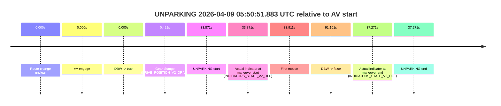
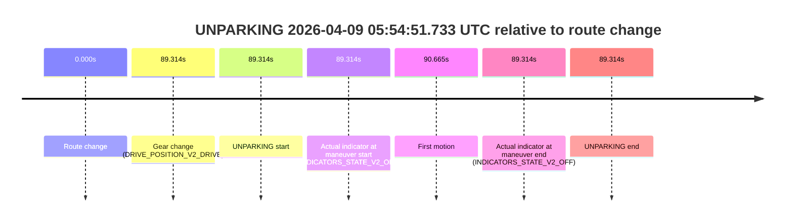

# Run Report: fme10005/2026-04-09--05-48-05--gen2-av-5c0e6b72-aa06-44ff-ba12-40f4d0c4f09c

| Field | Value |
|---|---|
| Run ID | `fme10005/2026-04-09--05-48-05--gen2-av-5c0e6b72-aa06-44ff-ba12-40f4d0c4f09c` |
| Date | `2026-04-09` |
| Model(s) | `lively-orange-horse` |
| Author | `guy.geva` |
| Event count | `2` |

## unparking 2026-04-09 05:50:51.883 UTC

| Field | Value |
|---|---|
| Model | `lively-orange-horse` |
| Author | `guy.geva` |
| Run ID | `fme10005/2026-04-09--05-48-05--gen2-av-5c0e6b72-aa06-44ff-ba12-40f4d0c4f09c` |
| Date | `2026-04-09` |
| Time (UTC) | `05:50:51.883` |
| Event type | `unparking` |
| Disengagement type | `none observed` |
| Route change | `unclear` |
| Console | [run](https://console.sso.wayve.ai/run/fme10005/2026-04-09--05-48-05--gen2-av-5c0e6b72-aa06-44ff-ba12-40f4d0c4f09c?id=&time-unixus=1775713851883314) |
| Foxglove | [segment](https://app.foxglove.dev/wayve-on-prem/p/prj_0dX18KZdVHg1fmmI/view?ds=foxglove-stream&ds.deviceName=fme10005&ds.start=2026-04-09T05%3A50%3A08.012690Z&ds.end=2026-04-09T05%3A51%3A59.113695Z&layoutId=lay_0e7VD4WIKDQGU73Y&time=2026-04-09T05%3A50%3A51.883314Z) |

### Event card: pass

- Pass: AV owns the credited unparking through the official event window, the gear state is aligned at the anchor, and the vehicle moves without driver accelerator help in AV.

| Event | Time (UTC) | Delta from AV start |
|---|---:|---:|
| Route change unclear | 2026-04-09 05:50:18.012 | `0.000s` |
| AV engage | 2026-04-09 05:50:18.012 | `0.000s` |
| DBW -> true | 2026-04-09 05:50:18.012 | `0.000s` |
| Gear change (DRIVE_POSITION_V2_DRIVE) | 2026-04-09 05:50:18.433 | `0.421s` |
| UNPARKING start | 2026-04-09 05:50:51.883 | `33.871s` |
| Actual indicator at maneuver start (INDICATORS_STATE_V2_OFF) | 2026-04-09 05:50:51.883 | `33.871s` |
| First motion | 2026-04-09 05:50:51.924 | `33.911s` |
| DBW -> false | 2026-04-09 05:51:49.113 | `91.101s` |
| Actual indicator at maneuver end (INDICATORS_STATE_V2_OFF) | 2026-04-09 05:50:55.283 | `37.271s` |
| UNPARKING end | 2026-04-09 05:50:55.283 | `37.271s` |

| Metric | Value |
|---|---|
| Outcome | `pass` |
| Effective failure type | `none` |
| Route change status | `unclear` |
| DBW at event start | `true` |
| DBW at event end | `true` |
| Predicted gear at AV start | `DRIVE_POSITION_V2_DRIVE` |
| Actual gear at AV start | `DRIVE_POSITION_V2_PARK` |
| Predicted gear at event start | `DRIVE_POSITION_V2_DRIVE` |
| Actual gear at event start | `DRIVE_POSITION_V2_DRIVE` |
| Planned indicator direction | `INDICATORS_STATE_V2_OFF` |
| Controller indicator direction | `INDICATORS_STATE_V2_OFF` |
| Actual indicator direction | `INDICATORS_STATE_V2_OFF` |
| Actual indicator at maneuver end | `INDICATORS_STATE_V2_OFF` |
| Driver accel help in AV | `false` |
| Driver accel help timestamp | `n/a` |
| Max accel pedal pct in AV | `0.0%` |
| Max brake pedal pct in AV | `8.0%` |
| Max speed mps in AV | `5.936` |
| Route -> AV | `n/a` |
| AV -> event start | `33.871s` |
| AV -> first motion | `33.911s` |
| AV duration before disengagement | `91.101s` |
| Trajectory waypoint count | `37` |
| Driving-plan step count | `11` |

The scored portion starts from the AV-owned window, not from the pre-AV setup. Route-change search in the stopped pre-event segment was `unclear`, with the baseline therefore set to AV start. At the event anchor the model predicts `DRIVE_POSITION_V2_DRIVE` and the actual gear is `DRIVE_POSITION_V2_DRIVE`. The effective model outcome is `pass` because `the credited maneuver stays AV-owned through the official event end`.

### Resolution

| Field | Value |
|---|---|
| Final outcome | `pass` |
| Do we agree with this label? | `yes` |
| Source disengagement type | `none observed` |
| Resolved effective failure type | `none` |
| Confidence | `medium` |

## unparking 2026-04-09 05:54:51.733 UTC

| Field | Value |
|---|---|
| Model | `lively-orange-horse` |
| Author | `guy.geva` |
| Run ID | `fme10005/2026-04-09--05-48-05--gen2-av-5c0e6b72-aa06-44ff-ba12-40f4d0c4f09c` |
| Date | `2026-04-09` |
| Time (UTC) | `05:54:51.733` |
| Event type | `unparking` |
| Disengagement type | `none observed` |
| Route change | `found` |
| Console | [run](https://console.sso.wayve.ai/run/fme10005/2026-04-09--05-48-05--gen2-av-5c0e6b72-aa06-44ff-ba12-40f4d0c4f09c?id=&time-unixus=1775714091733292) |
| Foxglove | [segment](https://app.foxglove.dev/wayve-on-prem/p/prj_0dX18KZdVHg1fmmI/view?ds=foxglove-stream&ds.deviceName=fme10005&ds.start=2026-04-09T05%3A53%3A12.419254Z&ds.end=2026-04-09T05%3A55%3A01.733292Z&layoutId=lay_0e7VD4WIKDQGU73Y&time=2026-04-09T05%3A54%3A51.733292Z) |

### Event card: fail

- Fail: the credited unparking does not stay AV-owned. The event window starts with DBW false, and the maneuver outcome lands outside a clean AV-owned segment.

| Event | Time (UTC) | Delta from route change |
|---|---:|---:|
| Route change | 2026-04-09 05:53:22.419 | `0.000s` |
| Gear change (DRIVE_POSITION_V2_DRIVE) | 2026-04-09 05:54:51.733 | `89.314s` |
| UNPARKING start | 2026-04-09 05:54:51.733 | `89.314s` |
| Actual indicator at maneuver start (INDICATORS_STATE_V2_OFF) | 2026-04-09 05:54:51.733 | `89.314s` |
| First motion | 2026-04-09 05:54:53.083 | `90.665s` |
| Actual indicator at maneuver end (INDICATORS_STATE_V2_OFF) | 2026-04-09 05:54:51.733 | `89.314s` |
| UNPARKING end | 2026-04-09 05:54:51.733 | `89.314s` |

| Metric | Value |
|---|---|
| Outcome | `fail` |
| Effective failure type | `not_av_owned` |
| Route change status | `found` |
| DBW at event start | `false` |
| DBW at event end | `false` |
| Predicted gear at AV start | `n/a` |
| Actual gear at AV start | `n/a` |
| Predicted gear at event start | `DRIVE_POSITION_V2_DRIVE` |
| Actual gear at event start | `DRIVE_POSITION_V2_DRIVE` |
| Planned indicator direction | `INDICATORS_STATE_V2_OFF` |
| Controller indicator direction | `INDICATORS_STATE_V2_OFF` |
| Actual indicator direction | `INDICATORS_STATE_V2_OFF` |
| Actual indicator at maneuver end | `INDICATORS_STATE_V2_OFF` |
| Driver accel help in AV | `false` |
| Driver accel help timestamp | `n/a` |
| Max accel pedal pct in AV | `0.0%` |
| Max brake pedal pct in AV | `0.0%` |
| Max speed mps in AV | `0.000` |
| Route -> AV | `n/a` |
| AV -> event start | `n/a` |
| AV -> first motion | `n/a` |
| AV duration before disengagement | `n/a` |
| Trajectory waypoint count | `38` |
| Driving-plan step count | `11` |

The scored portion starts from the AV-owned window, not from the pre-AV setup. Route-change search in the stopped pre-event segment was `found`, with the baseline therefore set to route change. At the event anchor the model predicts `DRIVE_POSITION_V2_DRIVE` and the actual gear is `DRIVE_POSITION_V2_DRIVE`. The effective model outcome is `fail` because `not_av_owned`.

### Resolution

| Field | Value |
|---|---|
| Final outcome | `fail` |
| Do we agree with this label? | `yes` |
| Source disengagement type | `none observed` |
| Resolved effective failure type | `not_av_owned` |
| Confidence | `high` |
