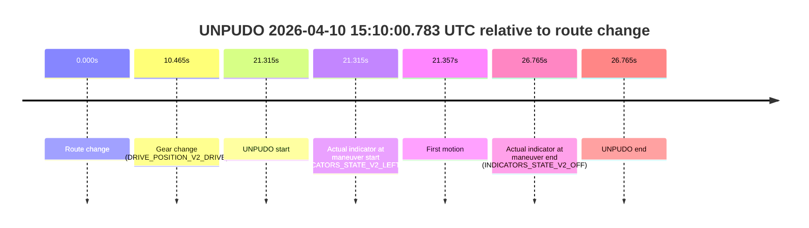
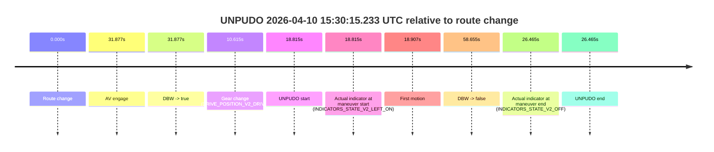
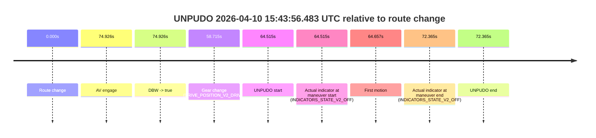

# Run Report: fme10005/2026-04-10--14-35-48--gen2-av-9a0cb1f7-bd86-40be-936b-a573babe3c16

| Field | Value |
|---|---|
| Run ID | `fme10005/2026-04-10--14-35-48--gen2-av-9a0cb1f7-bd86-40be-936b-a573babe3c16` |
| Date | `2026-04-10` |
| Model(s) | `lively-orange-horse` |
| Author | `guy.geva` |
| Event count | `12` |

## unpudo 2026-04-10 14:48:57.883 UTC

| Field | Value |
|---|---|
| Model | `lively-orange-horse` |
| Author | `guy.geva` |
| Run ID | `fme10005/2026-04-10--14-35-48--gen2-av-9a0cb1f7-bd86-40be-936b-a573babe3c16` |
| Date | `2026-04-10` |
| Time (UTC) | `14:48:57.883` |
| Event type | `unpudo` |
| Disengagement type | `failed_to_unpudo` |
| Route change | `found` |
| Console | [run](https://console.sso.wayve.ai/run/fme10005/2026-04-10--14-35-48--gen2-av-9a0cb1f7-bd86-40be-936b-a573babe3c16?id=&time-unixus=1775832537883314) |
| Foxglove | [segment](https://app.foxglove.dev/wayve-on-prem/p/prj_0dX18KZdVHg1fmmI/view?ds=foxglove-stream&ds.deviceName=fme10005&ds.start=2026-04-10T14%3A48%3A30.768249Z&ds.end=2026-04-10T14%3A49%3A38.674818Z&layoutId=lay_0e7VD4WIKDQGU73Y&time=2026-04-10T14%3A48%3A57.883314Z) |

### Event card: accidental

- Accidental: AV ownership is present for less than `2s`, so this is treated as an accidental brush with the maneuver rather than a meaningful model attempt.

| Event | Time (UTC) | Delta from route change |
|---|---:|---:|
| Route change | 2026-04-10 14:48:40.768 | `0.000s` |
| AV engage | 2026-04-10 14:49:16.855 | `36.087s` |
| DBW -> true | 2026-04-10 14:49:16.855 | `36.087s` |
| Gear change (DRIVE_POSITION_V2_DRIVE) | 2026-04-10 14:48:50.033 | `9.265s` |
| UNPUDO start | 2026-04-10 14:48:57.883 | `17.115s` |
| Actual indicator at maneuver start (INDICATORS_STATE_V2_LEFT_ON) | 2026-04-10 14:48:57.883 | `17.115s` |
| First motion | 2026-04-10 14:48:57.925 | `17.157s` |
| DBW -> false | 2026-04-10 14:49:28.674 | `47.907s` |
| Actual indicator at maneuver end (INDICATORS_STATE_V2_OFF) | 2026-04-10 14:49:04.883 | `24.115s` |
| UNPUDO end | 2026-04-10 14:49:04.883 | `24.115s` |

| Metric | Value |
|---|---|
| Outcome | `accidental` |
| Effective failure type | `none` |
| Route change status | `found` |
| DBW at event start | `false` |
| DBW at event end | `false` |
| Predicted gear at AV start | `DRIVE_POSITION_V2_DRIVE` |
| Actual gear at AV start | `DRIVE_POSITION_V2_DRIVE` |
| Predicted gear at event start | `DRIVE_POSITION_V2_DRIVE` |
| Actual gear at event start | `DRIVE_POSITION_V2_DRIVE` |
| Planned indicator direction | `INDICATORS_STATE_V2_LEFT_ON` |
| Controller indicator direction | `INDICATORS_STATE_V2_LEFT_ON` |
| Actual indicator direction | `INDICATORS_STATE_V2_LEFT_ON` |
| Actual indicator at maneuver end | `INDICATORS_STATE_V2_OFF` |
| Driver accel help in AV | `false` |
| Driver accel help timestamp | `n/a` |
| Max accel pedal pct in AV | `0.0%` |
| Max brake pedal pct in AV | `0.0%` |
| Max speed mps in AV | `0.000` |
| Route -> AV | `36.087s` |
| AV -> event start | `-18.972s` |
| AV -> first motion | `-18.930s` |
| AV duration before disengagement | `11.820s` |
| Trajectory waypoint count | `37` |
| Driving-plan step count | `11` |

The scored portion starts from the AV-owned window, not from the pre-AV setup. Route-change search in the stopped pre-event segment was `found`, with the baseline therefore set to route change. At the event anchor the model predicts `DRIVE_POSITION_V2_DRIVE` and the actual gear is `DRIVE_POSITION_V2_DRIVE`. The effective model outcome is `accidental` because `the AV-owned portion is shorter than 2s`.

### Resolution

| Field | Value |
|---|---|
| Final outcome | `accidental` |
| Do we agree with this label? | `yes` |
| Source disengagement type | `failed_to_unpudo` |
| Resolved effective failure type | `none` |
| Confidence | `high` |

## unpudo 2026-04-10 14:55:59.483 UTC

| Field | Value |
|---|---|
| Model | `lively-orange-horse` |
| Author | `guy.geva` |
| Run ID | `fme10005/2026-04-10--14-35-48--gen2-av-9a0cb1f7-bd86-40be-936b-a573babe3c16` |
| Date | `2026-04-10` |
| Time (UTC) | `14:55:59.483` |
| Event type | `unpudo` |
| Disengagement type | `failed_to_unpudo` |
| Route change | `found` |
| Console | [run](https://console.sso.wayve.ai/run/fme10005/2026-04-10--14-35-48--gen2-av-9a0cb1f7-bd86-40be-936b-a573babe3c16?id=&time-unixus=1775832959483292) |
| Foxglove | [segment](https://app.foxglove.dev/wayve-on-prem/p/prj_0dX18KZdVHg1fmmI/view?ds=foxglove-stream&ds.deviceName=fme10005&ds.start=2026-04-10T14%3A55%3A18.533289Z&ds.end=2026-04-10T14%3A57%3A03.355248Z&layoutId=lay_0e7VD4WIKDQGU73Y&time=2026-04-10T14%3A55%3A59.483292Z) |

### Event card: accidental

- Accidental: AV ownership is present for less than `2s`, so this is treated as an accidental brush with the maneuver rather than a meaningful model attempt.

| Event | Time (UTC) | Delta from route change |
|---|---:|---:|
| Route change | 2026-04-10 14:55:39.418 | `0.000s` |
| AV engage | 2026-04-10 14:56:16.014 | `36.597s` |
| DBW -> true | 2026-04-10 14:56:16.014 | `36.597s` |
| Gear change (DRIVE_POSITION_V2_DRIVE) | 2026-04-10 14:55:28.533 | `-10.885s` |
| UNPUDO start | 2026-04-10 14:55:59.483 | `20.065s` |
| Actual indicator at maneuver start (INDICATORS_STATE_V2_LEFT_ON) | 2026-04-10 14:55:59.483 | `20.065s` |
| First motion | 2026-04-10 14:55:59.604 | `20.187s` |
| DBW -> false | 2026-04-10 14:56:53.355 | `73.937s` |
| Actual indicator at maneuver end (INDICATORS_STATE_V2_LEFT_ON) | 2026-04-10 14:56:04.033 | `24.615s` |
| UNPUDO end | 2026-04-10 14:56:04.033 | `24.615s` |

| Metric | Value |
|---|---|
| Outcome | `accidental` |
| Effective failure type | `none` |
| Route change status | `found` |
| DBW at event start | `false` |
| DBW at event end | `false` |
| Predicted gear at AV start | `DRIVE_POSITION_V2_DRIVE` |
| Actual gear at AV start | `DRIVE_POSITION_V2_DRIVE` |
| Predicted gear at event start | `DRIVE_POSITION_V2_DRIVE` |
| Actual gear at event start | `DRIVE_POSITION_V2_DRIVE` |
| Planned indicator direction | `INDICATORS_STATE_V2_LEFT_ON` |
| Controller indicator direction | `INDICATORS_STATE_V2_LEFT_ON` |
| Actual indicator direction | `INDICATORS_STATE_V2_LEFT_ON` |
| Actual indicator at maneuver end | `INDICATORS_STATE_V2_LEFT_ON` |
| Driver accel help in AV | `false` |
| Driver accel help timestamp | `n/a` |
| Max accel pedal pct in AV | `0.0%` |
| Max brake pedal pct in AV | `0.0%` |
| Max speed mps in AV | `0.000` |
| Route -> AV | `36.597s` |
| AV -> event start | `-16.531s` |
| AV -> first motion | `-16.410s` |
| AV duration before disengagement | `37.340s` |
| Trajectory waypoint count | `37` |
| Driving-plan step count | `11` |

The scored portion starts from the AV-owned window, not from the pre-AV setup. Route-change search in the stopped pre-event segment was `found`, with the baseline therefore set to route change. At the event anchor the model predicts `DRIVE_POSITION_V2_DRIVE` and the actual gear is `DRIVE_POSITION_V2_DRIVE`. The effective model outcome is `accidental` because `the AV-owned portion is shorter than 2s`.

### Resolution

| Field | Value |
|---|---|
| Final outcome | `accidental` |
| Do we agree with this label? | `yes` |
| Source disengagement type | `failed_to_unpudo` |
| Resolved effective failure type | `none` |
| Confidence | `high` |

## unpudo 2026-04-10 15:05:05.533 UTC

| Field | Value |
|---|---|
| Model | `lively-orange-horse` |
| Author | `guy.geva` |
| Run ID | `fme10005/2026-04-10--14-35-48--gen2-av-9a0cb1f7-bd86-40be-936b-a573babe3c16` |
| Date | `2026-04-10` |
| Time (UTC) | `15:05:05.533` |
| Event type | `unpudo` |
| Disengagement type | `uncategorised` |
| Route change | `found` |
| Console | [run](https://console.sso.wayve.ai/run/fme10005/2026-04-10--14-35-48--gen2-av-9a0cb1f7-bd86-40be-936b-a573babe3c16?id=&time-unixus=1775833505533292) |
| Foxglove | [segment](https://app.foxglove.dev/wayve-on-prem/p/prj_0dX18KZdVHg1fmmI/view?ds=foxglove-stream&ds.deviceName=fme10005&ds.start=2026-04-10T15%3A04%3A32.968285Z&ds.end=2026-04-10T15%3A05%3A57.514457Z&layoutId=lay_0e7VD4WIKDQGU73Y&time=2026-04-10T15%3A05%3A05.533292Z) |

### Event card: accidental

- Accidental: AV ownership is present for less than `2s`, so this is treated as an accidental brush with the maneuver rather than a meaningful model attempt.

| Event | Time (UTC) | Delta from route change |
|---|---:|---:|
| Route change | 2026-04-10 15:04:42.968 | `0.000s` |
| AV engage | 2026-04-10 15:05:28.274 | `45.307s` |
| DBW -> true | 2026-04-10 15:05:28.274 | `45.307s` |
| Gear change (DRIVE_POSITION_V2_REVERSE) | 2026-04-10 15:04:56.833 | `13.865s` |
| UNPUDO start | 2026-04-10 15:05:05.533 | `22.565s` |
| Actual indicator at maneuver start (INDICATORS_STATE_V2_OFF) | 2026-04-10 15:05:05.533 | `22.565s` |
| First motion | 2026-04-10 15:05:13.204 | `30.237s` |
| DBW -> false | 2026-04-10 15:05:47.514 | `64.546s` |
| Actual indicator at maneuver end (INDICATORS_STATE_V2_OFF) | 2026-04-10 15:05:18.383 | `35.415s` |
| UNPUDO end | 2026-04-10 15:05:18.383 | `35.415s` |

| Metric | Value |
|---|---|
| Outcome | `accidental` |
| Effective failure type | `none` |
| Route change status | `found` |
| DBW at event start | `false` |
| DBW at event end | `false` |
| Predicted gear at AV start | `DRIVE_POSITION_V2_DRIVE` |
| Actual gear at AV start | `DRIVE_POSITION_V2_DRIVE` |
| Predicted gear at event start | `DRIVE_POSITION_V2_DRIVE` |
| Actual gear at event start | `DRIVE_POSITION_V2_REVERSE` |
| Planned indicator direction | `INDICATORS_STATE_V2_OFF` |
| Controller indicator direction | `INDICATORS_STATE_V2_OFF` |
| Actual indicator direction | `INDICATORS_STATE_V2_OFF` |
| Actual indicator at maneuver end | `INDICATORS_STATE_V2_OFF` |
| Driver accel help in AV | `false` |
| Driver accel help timestamp | `n/a` |
| Max accel pedal pct in AV | `0.0%` |
| Max brake pedal pct in AV | `0.0%` |
| Max speed mps in AV | `0.000` |
| Route -> AV | `45.307s` |
| AV -> event start | `-22.741s` |
| AV -> first motion | `-15.070s` |
| AV duration before disengagement | `19.240s` |
| Trajectory waypoint count | `36` |
| Driving-plan step count | `11` |

The scored portion starts from the AV-owned window, not from the pre-AV setup. Route-change search in the stopped pre-event segment was `found`, with the baseline therefore set to route change. At the event anchor the model predicts `DRIVE_POSITION_V2_DRIVE` and the actual gear is `DRIVE_POSITION_V2_REVERSE`. The effective model outcome is `accidental` because `the AV-owned portion is shorter than 2s`.

### Resolution

| Field | Value |
|---|---|
| Final outcome | `accidental` |
| Do we agree with this label? | `yes` |
| Source disengagement type | `uncategorised` |
| Resolved effective failure type | `none` |
| Confidence | `high` |

## unpudo 2026-04-10 15:08:11.383 UTC

| Field | Value |
|---|---|
| Model | `lively-orange-horse` |
| Author | `guy.geva` |
| Run ID | `fme10005/2026-04-10--14-35-48--gen2-av-9a0cb1f7-bd86-40be-936b-a573babe3c16` |
| Date | `2026-04-10` |
| Time (UTC) | `15:08:11.383` |
| Event type | `unpudo` |
| Disengagement type | `none observed` |
| Route change | `found` |
| Console | [run](https://console.sso.wayve.ai/run/fme10005/2026-04-10--14-35-48--gen2-av-9a0cb1f7-bd86-40be-936b-a573babe3c16?id=&time-unixus=1775833691383314) |
| Foxglove | [segment](https://app.foxglove.dev/wayve-on-prem/p/prj_0dX18KZdVHg1fmmI/view?ds=foxglove-stream&ds.deviceName=fme10005&ds.start=2026-04-10T15%3A07%3A19.668446Z&ds.end=2026-04-10T15%3A09%3A36.973340Z&layoutId=lay_0e7VD4WIKDQGU73Y&time=2026-04-10T15%3A08%3A11.383314Z) |

### Event card: accidental

- Accidental: AV ownership is present for less than `2s`, so this is treated as an accidental brush with the maneuver rather than a meaningful model attempt.

| Event | Time (UTC) | Delta from route change |
|---|---:|---:|
| Route change | 2026-04-10 15:07:29.668 | `0.000s` |
| AV engage | 2026-04-10 15:08:24.113 | `54.445s` |
| DBW -> true | 2026-04-10 15:08:24.113 | `54.445s` |
| Gear change (DRIVE_POSITION_V2_REVERSE) | 2026-04-10 15:08:07.883 | `38.215s` |
| UNPUDO start | 2026-04-10 15:08:11.383 | `41.715s` |
| Actual indicator at maneuver start (INDICATORS_STATE_V2_OFF) | 2026-04-10 15:08:11.383 | `41.715s` |
| First motion | 2026-04-10 15:08:15.545 | `45.877s` |
| DBW -> false | 2026-04-10 15:09:26.973 | `117.305s` |
| Actual indicator at maneuver end (INDICATORS_STATE_V2_OFF) | 2026-04-10 15:08:19.683 | `50.015s` |
| UNPUDO end | 2026-04-10 15:08:19.683 | `50.015s` |

| Metric | Value |
|---|---|
| Outcome | `accidental` |
| Effective failure type | `none` |
| Route change status | `found` |
| DBW at event start | `false` |
| DBW at event end | `false` |
| Predicted gear at AV start | `DRIVE_POSITION_V2_DRIVE` |
| Actual gear at AV start | `DRIVE_POSITION_V2_DRIVE` |
| Predicted gear at event start | `DRIVE_POSITION_V2_DRIVE` |
| Actual gear at event start | `DRIVE_POSITION_V2_REVERSE` |
| Planned indicator direction | `INDICATORS_STATE_V2_OFF` |
| Controller indicator direction | `INDICATORS_STATE_V2_OFF` |
| Actual indicator direction | `INDICATORS_STATE_V2_OFF` |
| Actual indicator at maneuver end | `INDICATORS_STATE_V2_OFF` |
| Driver accel help in AV | `false` |
| Driver accel help timestamp | `n/a` |
| Max accel pedal pct in AV | `0.0%` |
| Max brake pedal pct in AV | `0.0%` |
| Max speed mps in AV | `0.000` |
| Route -> AV | `54.445s` |
| AV -> event start | `-12.731s` |
| AV -> first motion | `-8.569s` |
| AV duration before disengagement | `62.859s` |
| Trajectory waypoint count | `37` |
| Driving-plan step count | `11` |

The scored portion starts from the AV-owned window, not from the pre-AV setup. Route-change search in the stopped pre-event segment was `found`, with the baseline therefore set to route change. At the event anchor the model predicts `DRIVE_POSITION_V2_DRIVE` and the actual gear is `DRIVE_POSITION_V2_REVERSE`. The effective model outcome is `accidental` because `the AV-owned portion is shorter than 2s`.

### Resolution

| Field | Value |
|---|---|
| Final outcome | `accidental` |
| Do we agree with this label? | `yes` |
| Source disengagement type | `none observed` |
| Resolved effective failure type | `none` |
| Confidence | `high` |

## unpudo 2026-04-10 15:10:00.783 UTC

| Field | Value |
|---|---|
| Model | `lively-orange-horse` |
| Author | `guy.geva` |
| Run ID | `fme10005/2026-04-10--14-35-48--gen2-av-9a0cb1f7-bd86-40be-936b-a573babe3c16` |
| Date | `2026-04-10` |
| Time (UTC) | `15:10:00.783` |
| Event type | `unpudo` |
| Disengagement type | `failed_to_unpudo` |
| Route change | `found` |
| Console | [run](https://console.sso.wayve.ai/run/fme10005/2026-04-10--14-35-48--gen2-av-9a0cb1f7-bd86-40be-936b-a573babe3c16?id=&time-unixus=1775833800783315) |
| Foxglove | [segment](https://app.foxglove.dev/wayve-on-prem/p/prj_0dX18KZdVHg1fmmI/view?ds=foxglove-stream&ds.deviceName=fme10005&ds.start=2026-04-10T15%3A09%3A29.468239Z&ds.end=2026-04-10T15%3A10%3A16.233320Z&layoutId=lay_0e7VD4WIKDQGU73Y&time=2026-04-10T15%3A10%3A00.783315Z) |

### Event card: non-av

- Non-AV: the detected unpudo starts outside AV ownership, so it is kept for coverage but excluded from model success / failure scoring.

| Event | Time (UTC) | Delta from route change |
|---|---:|---:|
| Route change | 2026-04-10 15:09:39.468 | `0.000s` |
| Gear change (DRIVE_POSITION_V2_DRIVE) | 2026-04-10 15:09:49.933 | `10.465s` |
| UNPUDO start | 2026-04-10 15:10:00.783 | `21.315s` |
| Actual indicator at maneuver start (INDICATORS_STATE_V2_LEFT_ON) | 2026-04-10 15:10:00.783 | `21.315s` |
| First motion | 2026-04-10 15:10:00.824 | `21.357s` |
| Actual indicator at maneuver end (INDICATORS_STATE_V2_OFF) | 2026-04-10 15:10:06.233 | `26.765s` |
| UNPUDO end | 2026-04-10 15:10:06.233 | `26.765s` |

| Metric | Value |
|---|---|
| Outcome | `non-av` |
| Effective failure type | `none` |
| Route change status | `found` |
| DBW at event start | `false` |
| DBW at event end | `false` |
| Predicted gear at AV start | `n/a` |
| Actual gear at AV start | `n/a` |
| Predicted gear at event start | `DRIVE_POSITION_V2_DRIVE` |
| Actual gear at event start | `DRIVE_POSITION_V2_DRIVE` |
| Planned indicator direction | `INDICATORS_STATE_V2_OFF` |
| Controller indicator direction | `INDICATORS_STATE_V2_OFF` |
| Actual indicator direction | `INDICATORS_STATE_V2_LEFT_ON` |
| Actual indicator at maneuver end | `INDICATORS_STATE_V2_OFF` |
| Driver accel help in AV | `false` |
| Driver accel help timestamp | `n/a` |
| Max accel pedal pct in AV | `0.0%` |
| Max brake pedal pct in AV | `0.0%` |
| Max speed mps in AV | `0.000` |
| Route -> AV | `n/a` |
| AV -> event start | `n/a` |
| AV -> first motion | `n/a` |
| AV duration before disengagement | `n/a` |
| Trajectory waypoint count | `37` |
| Driving-plan step count | `11` |

The scored portion starts from the AV-owned window, not from the pre-AV setup. Route-change search in the stopped pre-event segment was `found`, with the baseline therefore set to route change. At the event anchor the model predicts `DRIVE_POSITION_V2_DRIVE` and the actual gear is `DRIVE_POSITION_V2_DRIVE`. The effective model outcome is `non-av` because `the event does not begin in AV ownership`.

### Resolution

| Field | Value |
|---|---|
| Final outcome | `non-av` |
| Do we agree with this label? | `yes` |
| Source disengagement type | `failed_to_unpudo` |
| Resolved effective failure type | `none` |
| Confidence | `high` |

## unpudo 2026-04-10 15:14:36.383 UTC

| Field | Value |
|---|---|
| Model | `lively-orange-horse` |
| Author | `guy.geva` |
| Run ID | `fme10005/2026-04-10--14-35-48--gen2-av-9a0cb1f7-bd86-40be-936b-a573babe3c16` |
| Date | `2026-04-10` |
| Time (UTC) | `15:14:36.383` |
| Event type | `unpudo` |
| Disengagement type | `failed_to_unpudo` |
| Route change | `found` |
| Console | [run](https://console.sso.wayve.ai/run/fme10005/2026-04-10--14-35-48--gen2-av-9a0cb1f7-bd86-40be-936b-a573babe3c16?id=&time-unixus=1775834076383310) |
| Foxglove | [segment](https://app.foxglove.dev/wayve-on-prem/p/prj_0dX18KZdVHg1fmmI/view?ds=foxglove-stream&ds.deviceName=fme10005&ds.start=2026-04-10T15%3A14%3A15.468297Z&ds.end=2026-04-10T15%3A15%3A46.954576Z&layoutId=lay_0e7VD4WIKDQGU73Y&time=2026-04-10T15%3A14%3A36.383310Z) |

### Event card: accidental

- Accidental: AV ownership is present for less than `2s`, so this is treated as an accidental brush with the maneuver rather than a meaningful model attempt.

| Event | Time (UTC) | Delta from route change |
|---|---:|---:|
| Route change | 2026-04-10 15:14:25.468 | `0.000s` |
| AV engage | 2026-04-10 15:14:44.473 | `19.006s` |
| DBW -> true | 2026-04-10 15:14:44.473 | `19.006s` |
| Gear change (DRIVE_POSITION_V2_DRIVE) | 2026-04-10 15:14:25.733 | `0.265s` |
| UNPUDO start | 2026-04-10 15:14:36.383 | `10.915s` |
| Actual indicator at maneuver start (INDICATORS_STATE_V2_LEFT_ON) | 2026-04-10 15:14:36.383 | `10.915s` |
| First motion | 2026-04-10 15:14:36.425 | `10.957s` |
| DBW -> false | 2026-04-10 15:15:36.954 | `71.486s` |
| Actual indicator at maneuver end (INDICATORS_STATE_V2_OFF) | 2026-04-10 15:14:41.883 | `16.415s` |
| UNPUDO end | 2026-04-10 15:14:41.883 | `16.415s` |

| Metric | Value |
|---|---|
| Outcome | `accidental` |
| Effective failure type | `none` |
| Route change status | `found` |
| DBW at event start | `false` |
| DBW at event end | `false` |
| Predicted gear at AV start | `DRIVE_POSITION_V2_DRIVE` |
| Actual gear at AV start | `DRIVE_POSITION_V2_DRIVE` |
| Predicted gear at event start | `DRIVE_POSITION_V2_DRIVE` |
| Actual gear at event start | `DRIVE_POSITION_V2_DRIVE` |
| Planned indicator direction | `INDICATORS_STATE_V2_OFF` |
| Controller indicator direction | `INDICATORS_STATE_V2_OFF` |
| Actual indicator direction | `INDICATORS_STATE_V2_LEFT_ON` |
| Actual indicator at maneuver end | `INDICATORS_STATE_V2_OFF` |
| Driver accel help in AV | `false` |
| Driver accel help timestamp | `n/a` |
| Max accel pedal pct in AV | `0.0%` |
| Max brake pedal pct in AV | `0.0%` |
| Max speed mps in AV | `0.000` |
| Route -> AV | `19.006s` |
| AV -> event start | `-8.091s` |
| AV -> first motion | `-8.049s` |
| AV duration before disengagement | `52.481s` |
| Trajectory waypoint count | `37` |
| Driving-plan step count | `11` |

The scored portion starts from the AV-owned window, not from the pre-AV setup. Route-change search in the stopped pre-event segment was `found`, with the baseline therefore set to route change. At the event anchor the model predicts `DRIVE_POSITION_V2_DRIVE` and the actual gear is `DRIVE_POSITION_V2_DRIVE`. The effective model outcome is `accidental` because `the AV-owned portion is shorter than 2s`.

### Resolution

| Field | Value |
|---|---|
| Final outcome | `accidental` |
| Do we agree with this label? | `yes` |
| Source disengagement type | `failed_to_unpudo` |
| Resolved effective failure type | `none` |
| Confidence | `high` |

## unpudo 2026-04-10 15:22:07.983 UTC

| Field | Value |
|---|---|
| Model | `lively-orange-horse` |
| Author | `guy.geva` |
| Run ID | `fme10005/2026-04-10--14-35-48--gen2-av-9a0cb1f7-bd86-40be-936b-a573babe3c16` |
| Date | `2026-04-10` |
| Time (UTC) | `15:22:07.983` |
| Event type | `unpudo` |
| Disengagement type | `failed_to_unpudo` |
| Route change | `found` |
| Console | [run](https://console.sso.wayve.ai/run/fme10005/2026-04-10--14-35-48--gen2-av-9a0cb1f7-bd86-40be-936b-a573babe3c16?id=&time-unixus=1775834527983318) |
| Foxglove | [segment](https://app.foxglove.dev/wayve-on-prem/p/prj_0dX18KZdVHg1fmmI/view?ds=foxglove-stream&ds.deviceName=fme10005&ds.start=2026-04-10T15%3A21%3A40.468311Z&ds.end=2026-04-10T15%3A22%3A22.833312Z&layoutId=lay_0e7VD4WIKDQGU73Y&time=2026-04-10T15%3A22%3A07.983318Z) |

### Event card: non-av

- Non-AV: the detected unpudo starts outside AV ownership, so it is kept for coverage but excluded from model success / failure scoring.

| Event | Time (UTC) | Delta from route change |
|---|---:|---:|
| Route change | 2026-04-10 15:21:50.468 | `0.000s` |
| Gear change (DRIVE_POSITION_V2_DRIVE) | 2026-04-10 15:21:58.733 | `8.265s` |
| UNPUDO start | 2026-04-10 15:22:07.983 | `17.515s` |
| Actual indicator at maneuver start (INDICATORS_STATE_V2_LEFT_ON) | 2026-04-10 15:22:07.983 | `17.515s` |
| First motion | 2026-04-10 15:22:08.044 | `17.577s` |
| Actual indicator at maneuver end (INDICATORS_STATE_V2_OFF) | 2026-04-10 15:22:12.833 | `22.365s` |
| UNPUDO end | 2026-04-10 15:22:12.833 | `22.365s` |

| Metric | Value |
|---|---|
| Outcome | `non-av` |
| Effective failure type | `none` |
| Route change status | `found` |
| DBW at event start | `false` |
| DBW at event end | `false` |
| Predicted gear at AV start | `n/a` |
| Actual gear at AV start | `n/a` |
| Predicted gear at event start | `DRIVE_POSITION_V2_DRIVE` |
| Actual gear at event start | `DRIVE_POSITION_V2_DRIVE` |
| Planned indicator direction | `INDICATORS_STATE_V2_LEFT_ON` |
| Controller indicator direction | `INDICATORS_STATE_V2_LEFT_ON` |
| Actual indicator direction | `INDICATORS_STATE_V2_LEFT_ON` |
| Actual indicator at maneuver end | `INDICATORS_STATE_V2_OFF` |
| Driver accel help in AV | `false` |
| Driver accel help timestamp | `n/a` |
| Max accel pedal pct in AV | `0.0%` |
| Max brake pedal pct in AV | `0.0%` |
| Max speed mps in AV | `0.000` |
| Route -> AV | `n/a` |
| AV -> event start | `n/a` |
| AV -> first motion | `n/a` |
| AV duration before disengagement | `n/a` |
| Trajectory waypoint count | `37` |
| Driving-plan step count | `11` |

The scored portion starts from the AV-owned window, not from the pre-AV setup. Route-change search in the stopped pre-event segment was `found`, with the baseline therefore set to route change. At the event anchor the model predicts `DRIVE_POSITION_V2_DRIVE` and the actual gear is `DRIVE_POSITION_V2_DRIVE`. The effective model outcome is `non-av` because `the event does not begin in AV ownership`.

### Resolution

| Field | Value |
|---|---|
| Final outcome | `non-av` |
| Do we agree with this label? | `yes` |
| Source disengagement type | `failed_to_unpudo` |
| Resolved effective failure type | `none` |
| Confidence | `high` |

## unpudo 2026-04-10 15:30:15.233 UTC

| Field | Value |
|---|---|
| Model | `lively-orange-horse` |
| Author | `guy.geva` |
| Run ID | `fme10005/2026-04-10--14-35-48--gen2-av-9a0cb1f7-bd86-40be-936b-a573babe3c16` |
| Date | `2026-04-10` |
| Time (UTC) | `15:30:15.233` |
| Event type | `unpudo` |
| Disengagement type | `failed_to_unpudo` |
| Route change | `found` |
| Console | [run](https://console.sso.wayve.ai/run/fme10005/2026-04-10--14-35-48--gen2-av-9a0cb1f7-bd86-40be-936b-a573babe3c16?id=&time-unixus=1775835015233306) |
| Foxglove | [segment](https://app.foxglove.dev/wayve-on-prem/p/prj_0dX18KZdVHg1fmmI/view?ds=foxglove-stream&ds.deviceName=fme10005&ds.start=2026-04-10T15%3A29%3A46.418255Z&ds.end=2026-04-10T15%3A31%3A05.073310Z&layoutId=lay_0e7VD4WIKDQGU73Y&time=2026-04-10T15%3A30%3A15.233306Z) |

### Event card: accidental

- Accidental: AV ownership is present for less than `2s`, so this is treated as an accidental brush with the maneuver rather than a meaningful model attempt.

| Event | Time (UTC) | Delta from route change |
|---|---:|---:|
| Route change | 2026-04-10 15:29:56.418 | `0.000s` |
| AV engage | 2026-04-10 15:30:28.295 | `31.877s` |
| DBW -> true | 2026-04-10 15:30:28.295 | `31.877s` |
| Gear change (DRIVE_POSITION_V2_DRIVE) | 2026-04-10 15:30:07.033 | `10.615s` |
| UNPUDO start | 2026-04-10 15:30:15.233 | `18.815s` |
| Actual indicator at maneuver start (INDICATORS_STATE_V2_LEFT_ON) | 2026-04-10 15:30:15.233 | `18.815s` |
| First motion | 2026-04-10 15:30:15.325 | `18.907s` |
| DBW -> false | 2026-04-10 15:30:55.073 | `58.655s` |
| Actual indicator at maneuver end (INDICATORS_STATE_V2_OFF) | 2026-04-10 15:30:22.883 | `26.465s` |
| UNPUDO end | 2026-04-10 15:30:22.883 | `26.465s` |

| Metric | Value |
|---|---|
| Outcome | `accidental` |
| Effective failure type | `none` |
| Route change status | `found` |
| DBW at event start | `false` |
| DBW at event end | `false` |
| Predicted gear at AV start | `DRIVE_POSITION_V2_DRIVE` |
| Actual gear at AV start | `DRIVE_POSITION_V2_DRIVE` |
| Predicted gear at event start | `DRIVE_POSITION_V2_DRIVE` |
| Actual gear at event start | `DRIVE_POSITION_V2_DRIVE` |
| Planned indicator direction | `INDICATORS_STATE_V2_LEFT_ON` |
| Controller indicator direction | `INDICATORS_STATE_V2_LEFT_ON` |
| Actual indicator direction | `INDICATORS_STATE_V2_LEFT_ON` |
| Actual indicator at maneuver end | `INDICATORS_STATE_V2_OFF` |
| Driver accel help in AV | `false` |
| Driver accel help timestamp | `n/a` |
| Max accel pedal pct in AV | `0.0%` |
| Max brake pedal pct in AV | `0.0%` |
| Max speed mps in AV | `0.000` |
| Route -> AV | `31.877s` |
| AV -> event start | `-13.062s` |
| AV -> first motion | `-12.970s` |
| AV duration before disengagement | `26.778s` |
| Trajectory waypoint count | `36` |
| Driving-plan step count | `11` |

The scored portion starts from the AV-owned window, not from the pre-AV setup. Route-change search in the stopped pre-event segment was `found`, with the baseline therefore set to route change. At the event anchor the model predicts `DRIVE_POSITION_V2_DRIVE` and the actual gear is `DRIVE_POSITION_V2_DRIVE`. The effective model outcome is `accidental` because `the AV-owned portion is shorter than 2s`.

### Resolution

| Field | Value |
|---|---|
| Final outcome | `accidental` |
| Do we agree with this label? | `yes` |
| Source disengagement type | `failed_to_unpudo` |
| Resolved effective failure type | `none` |
| Confidence | `high` |

## unpudo 2026-04-10 15:31:05.083 UTC

| Field | Value |
|---|---|
| Model | `lively-orange-horse` |
| Author | `guy.geva` |
| Run ID | `fme10005/2026-04-10--14-35-48--gen2-av-9a0cb1f7-bd86-40be-936b-a573babe3c16` |
| Date | `2026-04-10` |
| Time (UTC) | `15:31:05.083` |
| Event type | `unpudo` |
| Disengagement type | `uncategorised` |
| Route change | `found` |
| Console | [run](https://console.sso.wayve.ai/run/fme10005/2026-04-10--14-35-48--gen2-av-9a0cb1f7-bd86-40be-936b-a573babe3c16?id=&time-unixus=1775835065083308) |
| Foxglove | [segment](https://app.foxglove.dev/wayve-on-prem/p/prj_0dX18KZdVHg1fmmI/view?ds=foxglove-stream&ds.deviceName=fme10005&ds.start=2026-04-10T15%3A29%3A46.418255Z&ds.end=2026-04-10T15%3A31%3A26.933317Z&layoutId=lay_0e7VD4WIKDQGU73Y&time=2026-04-10T15%3A31%3A05.083308Z) |

### Event card: non-av

- Non-AV: the detected unpudo starts outside AV ownership, so it is kept for coverage but excluded from model success / failure scoring.

| Event | Time (UTC) | Delta from route change |
|---|---:|---:|
| Route change | 2026-04-10 15:29:56.418 | `0.000s` |
| Gear change (DRIVE_POSITION_V2_REVERSE) | 2026-04-10 15:30:51.333 | `54.915s` |
| UNPUDO start | 2026-04-10 15:31:05.083 | `68.665s` |
| Actual indicator at maneuver start (INDICATORS_STATE_V2_OFF) | 2026-04-10 15:31:05.083 | `68.665s` |
| First motion | 2026-04-10 15:31:11.844 | `75.427s` |
| Actual indicator at maneuver end (INDICATORS_STATE_V2_OFF) | 2026-04-10 15:31:16.933 | `80.515s` |
| UNPUDO end | 2026-04-10 15:31:16.933 | `80.515s` |

| Metric | Value |
|---|---|
| Outcome | `non-av` |
| Effective failure type | `none` |
| Route change status | `found` |
| DBW at event start | `false` |
| DBW at event end | `false` |
| Predicted gear at AV start | `n/a` |
| Actual gear at AV start | `n/a` |
| Predicted gear at event start | `DRIVE_POSITION_V2_DRIVE` |
| Actual gear at event start | `DRIVE_POSITION_V2_REVERSE` |
| Planned indicator direction | `INDICATORS_STATE_V2_OFF` |
| Controller indicator direction | `INDICATORS_STATE_V2_OFF` |
| Actual indicator direction | `INDICATORS_STATE_V2_OFF` |
| Actual indicator at maneuver end | `INDICATORS_STATE_V2_OFF` |
| Driver accel help in AV | `false` |
| Driver accel help timestamp | `n/a` |
| Max accel pedal pct in AV | `0.0%` |
| Max brake pedal pct in AV | `0.0%` |
| Max speed mps in AV | `0.000` |
| Route -> AV | `n/a` |
| AV -> event start | `n/a` |
| AV -> first motion | `n/a` |
| AV duration before disengagement | `n/a` |
| Trajectory waypoint count | `37` |
| Driving-plan step count | `11` |

The scored portion starts from the AV-owned window, not from the pre-AV setup. Route-change search in the stopped pre-event segment was `found`, with the baseline therefore set to route change. At the event anchor the model predicts `DRIVE_POSITION_V2_DRIVE` and the actual gear is `DRIVE_POSITION_V2_REVERSE`. The effective model outcome is `non-av` because `the event does not begin in AV ownership`.

### Resolution

| Field | Value |
|---|---|
| Final outcome | `non-av` |
| Do we agree with this label? | `yes` |
| Source disengagement type | `uncategorised` |
| Resolved effective failure type | `none` |
| Confidence | `high` |

## unpudo 2026-04-10 15:36:42.583 UTC

| Field | Value |
|---|---|
| Model | `lively-orange-horse` |
| Author | `guy.geva` |
| Run ID | `fme10005/2026-04-10--14-35-48--gen2-av-9a0cb1f7-bd86-40be-936b-a573babe3c16` |
| Date | `2026-04-10` |
| Time (UTC) | `15:36:42.583` |
| Event type | `unpudo` |
| Disengagement type | `failed_to_unpudo` |
| Route change | `found` |
| Console | [run](https://console.sso.wayve.ai/run/fme10005/2026-04-10--14-35-48--gen2-av-9a0cb1f7-bd86-40be-936b-a573babe3c16?id=&time-unixus=1775835402583310) |
| Foxglove | [segment](https://app.foxglove.dev/wayve-on-prem/p/prj_0dX18KZdVHg1fmmI/view?ds=foxglove-stream&ds.deviceName=fme10005&ds.start=2026-04-10T15%3A36%3A15.018356Z&ds.end=2026-04-10T15%3A37%3A14.254021Z&layoutId=lay_0e7VD4WIKDQGU73Y&time=2026-04-10T15%3A36%3A42.583310Z) |

### Event card: accidental

- Accidental: AV ownership is present for less than `2s`, so this is treated as an accidental brush with the maneuver rather than a meaningful model attempt.

| Event | Time (UTC) | Delta from route change |
|---|---:|---:|
| Route change | 2026-04-10 15:36:25.018 | `0.000s` |
| AV engage | 2026-04-10 15:36:53.793 | `28.776s` |
| DBW -> true | 2026-04-10 15:36:53.793 | `28.776s` |
| Gear change (DRIVE_POSITION_V2_DRIVE) | 2026-04-10 15:36:34.733 | `9.715s` |
| UNPUDO start | 2026-04-10 15:36:42.583 | `17.565s` |
| Actual indicator at maneuver start (INDICATORS_STATE_V2_LEFT_ON) | 2026-04-10 15:36:42.583 | `17.565s` |
| First motion | 2026-04-10 15:36:42.645 | `17.627s` |
| DBW -> false | 2026-04-10 15:37:04.254 | `39.236s` |
| Actual indicator at maneuver end (INDICATORS_STATE_V2_OFF) | 2026-04-10 15:36:47.283 | `22.265s` |
| UNPUDO end | 2026-04-10 15:36:47.283 | `22.265s` |

| Metric | Value |
|---|---|
| Outcome | `accidental` |
| Effective failure type | `none` |
| Route change status | `found` |
| DBW at event start | `false` |
| DBW at event end | `false` |
| Predicted gear at AV start | `DRIVE_POSITION_V2_DRIVE` |
| Actual gear at AV start | `DRIVE_POSITION_V2_DRIVE` |
| Predicted gear at event start | `DRIVE_POSITION_V2_DRIVE` |
| Actual gear at event start | `DRIVE_POSITION_V2_DRIVE` |
| Planned indicator direction | `INDICATORS_STATE_V2_LEFT_ON` |
| Controller indicator direction | `INDICATORS_STATE_V2_LEFT_ON` |
| Actual indicator direction | `INDICATORS_STATE_V2_LEFT_ON` |
| Actual indicator at maneuver end | `INDICATORS_STATE_V2_OFF` |
| Driver accel help in AV | `false` |
| Driver accel help timestamp | `n/a` |
| Max accel pedal pct in AV | `0.0%` |
| Max brake pedal pct in AV | `0.0%` |
| Max speed mps in AV | `0.000` |
| Route -> AV | `28.776s` |
| AV -> event start | `-11.211s` |
| AV -> first motion | `-11.149s` |
| AV duration before disengagement | `10.460s` |
| Trajectory waypoint count | `37` |
| Driving-plan step count | `11` |

The scored portion starts from the AV-owned window, not from the pre-AV setup. Route-change search in the stopped pre-event segment was `found`, with the baseline therefore set to route change. At the event anchor the model predicts `DRIVE_POSITION_V2_DRIVE` and the actual gear is `DRIVE_POSITION_V2_DRIVE`. The effective model outcome is `accidental` because `the AV-owned portion is shorter than 2s`.

### Resolution

| Field | Value |
|---|---|
| Final outcome | `accidental` |
| Do we agree with this label? | `yes` |
| Source disengagement type | `failed_to_unpudo` |
| Resolved effective failure type | `none` |
| Confidence | `high` |

## unpudo 2026-04-10 15:43:10.733 UTC

| Field | Value |
|---|---|
| Model | `lively-orange-horse` |
| Author | `guy.geva` |
| Run ID | `fme10005/2026-04-10--14-35-48--gen2-av-9a0cb1f7-bd86-40be-936b-a573babe3c16` |
| Date | `2026-04-10` |
| Time (UTC) | `15:43:10.733` |
| Event type | `unpudo` |
| Disengagement type | `failed_to_unpudo` |
| Route change | `found` |
| Console | [run](https://console.sso.wayve.ai/run/fme10005/2026-04-10--14-35-48--gen2-av-9a0cb1f7-bd86-40be-936b-a573babe3c16?id=&time-unixus=1775835790733301) |
| Foxglove | [segment](https://app.foxglove.dev/wayve-on-prem/p/prj_0dX18KZdVHg1fmmI/view?ds=foxglove-stream&ds.deviceName=fme10005&ds.start=2026-04-10T15%3A42%3A41.968265Z&ds.end=2026-04-10T15%3A43%3A20.733301Z&layoutId=lay_0e7VD4WIKDQGU73Y&time=2026-04-10T15%3A43%3A10.733301Z) |

### Event card: non-av

- Non-AV: the detected unpudo starts outside AV ownership, so it is kept for coverage but excluded from model success / failure scoring.

| Event | Time (UTC) | Delta from route change |
|---|---:|---:|
| Route change | 2026-04-10 15:42:51.968 | `0.000s` |
| Gear change (DRIVE_POSITION_V2_DRIVE) | 2026-04-10 15:43:01.733 | `9.765s` |
| UNPUDO start | 2026-04-10 15:43:10.733 | `18.765s` |
| Actual indicator at maneuver start (INDICATORS_STATE_V2_LEFT_ON) | 2026-04-10 15:43:10.733 | `18.765s` |
| First motion | 2026-04-10 15:43:10.965 | `18.997s` |
| Actual indicator at maneuver end (INDICATORS_STATE_V2_LEFT_ON) | 2026-04-10 15:43:10.733 | `18.765s` |
| UNPUDO end | 2026-04-10 15:43:10.733 | `18.765s` |

| Metric | Value |
|---|---|
| Outcome | `non-av` |
| Effective failure type | `none` |
| Route change status | `found` |
| DBW at event start | `false` |
| DBW at event end | `false` |
| Predicted gear at AV start | `n/a` |
| Actual gear at AV start | `n/a` |
| Predicted gear at event start | `DRIVE_POSITION_V2_DRIVE` |
| Actual gear at event start | `DRIVE_POSITION_V2_DRIVE` |
| Planned indicator direction | `INDICATORS_STATE_V2_OFF` |
| Controller indicator direction | `INDICATORS_STATE_V2_OFF` |
| Actual indicator direction | `INDICATORS_STATE_V2_LEFT_ON` |
| Actual indicator at maneuver end | `INDICATORS_STATE_V2_LEFT_ON` |
| Driver accel help in AV | `false` |
| Driver accel help timestamp | `n/a` |
| Max accel pedal pct in AV | `0.0%` |
| Max brake pedal pct in AV | `0.0%` |
| Max speed mps in AV | `0.000` |
| Route -> AV | `n/a` |
| AV -> event start | `n/a` |
| AV -> first motion | `n/a` |
| AV duration before disengagement | `n/a` |
| Trajectory waypoint count | `36` |
| Driving-plan step count | `11` |

The scored portion starts from the AV-owned window, not from the pre-AV setup. Route-change search in the stopped pre-event segment was `found`, with the baseline therefore set to route change. At the event anchor the model predicts `DRIVE_POSITION_V2_DRIVE` and the actual gear is `DRIVE_POSITION_V2_DRIVE`. The effective model outcome is `non-av` because `the event does not begin in AV ownership`.

### Resolution

| Field | Value |
|---|---|
| Final outcome | `non-av` |
| Do we agree with this label? | `yes` |
| Source disengagement type | `failed_to_unpudo` |
| Resolved effective failure type | `none` |
| Confidence | `high` |

## unpudo 2026-04-10 15:43:56.483 UTC

| Field | Value |
|---|---|
| Model | `lively-orange-horse` |
| Author | `guy.geva` |
| Run ID | `fme10005/2026-04-10--14-35-48--gen2-av-9a0cb1f7-bd86-40be-936b-a573babe3c16` |
| Date | `2026-04-10` |
| Time (UTC) | `15:43:56.483` |
| Event type | `unpudo` |
| Disengagement type | `none observed` |
| Route change | `found` |
| Console | [run](https://console.sso.wayve.ai/run/fme10005/2026-04-10--14-35-48--gen2-av-9a0cb1f7-bd86-40be-936b-a573babe3c16?id=&time-unixus=1775835836483299) |
| Foxglove | [segment](https://app.foxglove.dev/wayve-on-prem/p/prj_0dX18KZdVHg1fmmI/view?ds=foxglove-stream&ds.deviceName=fme10005&ds.start=2026-04-10T15%3A42%3A41.968265Z&ds.end=2026-04-10T15%3A44%3A14.333292Z&layoutId=lay_0e7VD4WIKDQGU73Y&time=2026-04-10T15%3A43%3A56.483299Z) |

### Event card: accidental

- Accidental: AV ownership is present for less than `2s`, so this is treated as an accidental brush with the maneuver rather than a meaningful model attempt.

| Event | Time (UTC) | Delta from route change |
|---|---:|---:|
| Route change | 2026-04-10 15:42:51.968 | `0.000s` |
| AV engage | 2026-04-10 15:44:06.893 | `74.926s` |
| DBW -> true | 2026-04-10 15:44:06.893 | `74.926s` |
| Gear change (DRIVE_POSITION_V2_DRIVE) | 2026-04-10 15:43:50.683 | `58.715s` |
| UNPUDO start | 2026-04-10 15:43:56.483 | `64.515s` |
| Actual indicator at maneuver start (INDICATORS_STATE_V2_OFF) | 2026-04-10 15:43:56.483 | `64.515s` |
| First motion | 2026-04-10 15:43:56.624 | `64.657s` |
| Actual indicator at maneuver end (INDICATORS_STATE_V2_OFF) | 2026-04-10 15:44:04.333 | `72.365s` |
| UNPUDO end | 2026-04-10 15:44:04.333 | `72.365s` |

| Metric | Value |
|---|---|
| Outcome | `accidental` |
| Effective failure type | `none` |
| Route change status | `found` |
| DBW at event start | `false` |
| DBW at event end | `false` |
| Predicted gear at AV start | `DRIVE_POSITION_V2_DRIVE` |
| Actual gear at AV start | `DRIVE_POSITION_V2_DRIVE` |
| Predicted gear at event start | `DRIVE_POSITION_V2_DRIVE` |
| Actual gear at event start | `DRIVE_POSITION_V2_DRIVE` |
| Planned indicator direction | `INDICATORS_STATE_V2_OFF` |
| Controller indicator direction | `INDICATORS_STATE_V2_OFF` |
| Actual indicator direction | `INDICATORS_STATE_V2_OFF` |
| Actual indicator at maneuver end | `INDICATORS_STATE_V2_OFF` |
| Driver accel help in AV | `false` |
| Driver accel help timestamp | `n/a` |
| Max accel pedal pct in AV | `0.0%` |
| Max brake pedal pct in AV | `0.0%` |
| Max speed mps in AV | `0.000` |
| Route -> AV | `74.926s` |
| AV -> event start | `-10.411s` |
| AV -> first motion | `-10.269s` |
| AV duration before disengagement | `n/a` |
| Trajectory waypoint count | `37` |
| Driving-plan step count | `11` |

The scored portion starts from the AV-owned window, not from the pre-AV setup. Route-change search in the stopped pre-event segment was `found`, with the baseline therefore set to route change. At the event anchor the model predicts `DRIVE_POSITION_V2_DRIVE` and the actual gear is `DRIVE_POSITION_V2_DRIVE`. The effective model outcome is `accidental` because `the AV-owned portion is shorter than 2s`.

### Resolution

| Field | Value |
|---|---|
| Final outcome | `accidental` |
| Do we agree with this label? | `yes` |
| Source disengagement type | `none observed` |
| Resolved effective failure type | `none` |
| Confidence | `high` |
