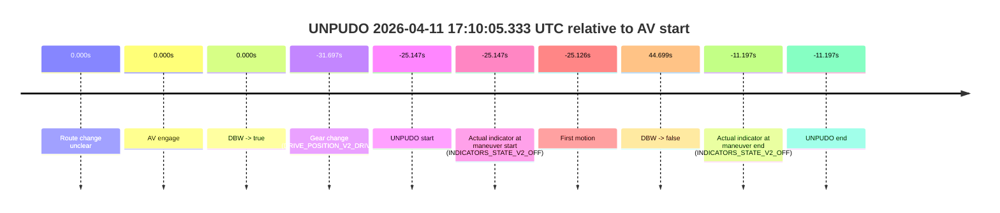
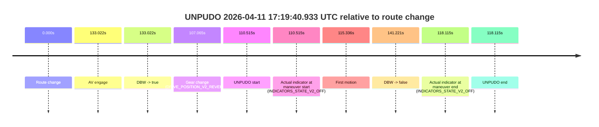
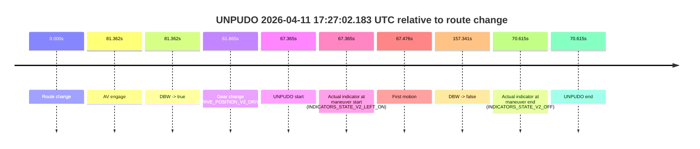
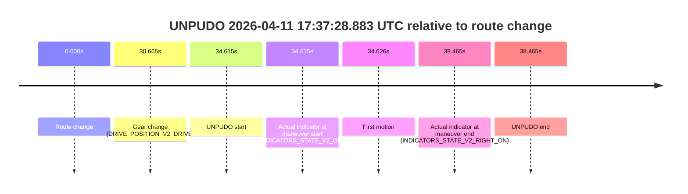

# Run Report: fme10005/2026-04-11--17-05-02--gen2-av-b0923faf-f517-490f-b0a2-df88eb4307bb

| Field | Value |
|---|---|
| Run ID | `fme10005/2026-04-11--17-05-02--gen2-av-b0923faf-f517-490f-b0a2-df88eb4307bb` |
| Date | `2026-04-11` |
| Model(s) | `lively-orange-horse` |
| Author | `guy.geva` |
| Event count | `8` |

## unpudo 2026-04-11 17:10:05.333 UTC

| Field | Value |
|---|---|
| Model | `lively-orange-horse` |
| Author | `guy.geva` |
| Run ID | `fme10005/2026-04-11--17-05-02--gen2-av-b0923faf-f517-490f-b0a2-df88eb4307bb` |
| Date | `2026-04-11` |
| Time (UTC) | `17:10:05.333` |
| Event type | `unpudo` |
| Disengagement type | `none observed` |
| Route change | `unclear` |
| Console | [run](https://console.sso.wayve.ai/run/fme10005/2026-04-11--17-05-02--gen2-av-b0923faf-f517-490f-b0a2-df88eb4307bb?id=&time-unixus=1775927405333317) |
| Foxglove | [segment](https://app.foxglove.dev/wayve-on-prem/p/prj_0dX18KZdVHg1fmmI/view?ds=foxglove-stream&ds.deviceName=fme10005&ds.start=2026-04-11T17%3A09%3A48.783311Z&ds.end=2026-04-11T17%3A11%3A25.179137Z&layoutId=lay_0e7VD4WIKDQGU73Y&time=2026-04-11T17%3A10%3A05.333317Z) |

### Event card: accidental

- Accidental: AV ownership is present for less than `2s`, so this is treated as an accidental brush with the maneuver rather than a meaningful model attempt.

| Event | Time (UTC) | Delta from AV start |
|---|---:|---:|
| Route change unclear | 2026-04-11 17:10:30.480 | `0.000s` |
| AV engage | 2026-04-11 17:10:30.480 | `0.000s` |
| DBW -> true | 2026-04-11 17:10:30.480 | `0.000s` |
| Gear change (DRIVE_POSITION_V2_DRIVE) | 2026-04-11 17:09:58.783 | `-31.697s` |
| UNPUDO start | 2026-04-11 17:10:05.333 | `-25.147s` |
| Actual indicator at maneuver start (INDICATORS_STATE_V2_OFF) | 2026-04-11 17:10:05.333 | `-25.147s` |
| First motion | 2026-04-11 17:10:05.354 | `-25.126s` |
| DBW -> false | 2026-04-11 17:11:15.179 | `44.699s` |
| Actual indicator at maneuver end (INDICATORS_STATE_V2_OFF) | 2026-04-11 17:10:19.283 | `-11.197s` |
| UNPUDO end | 2026-04-11 17:10:19.283 | `-11.197s` |

| Metric | Value |
|---|---|
| Outcome | `accidental` |
| Effective failure type | `none` |
| Route change status | `unclear` |
| DBW at event start | `false` |
| DBW at event end | `false` |
| Predicted gear at AV start | `DRIVE_POSITION_V2_DRIVE` |
| Actual gear at AV start | `DRIVE_POSITION_V2_DRIVE` |
| Predicted gear at event start | `DRIVE_POSITION_V2_DRIVE` |
| Actual gear at event start | `DRIVE_POSITION_V2_DRIVE` |
| Planned indicator direction | `INDICATORS_STATE_V2_OFF` |
| Controller indicator direction | `INDICATORS_STATE_V2_OFF` |
| Actual indicator direction | `INDICATORS_STATE_V2_OFF` |
| Actual indicator at maneuver end | `INDICATORS_STATE_V2_OFF` |
| Driver accel help in AV | `false` |
| Driver accel help timestamp | `n/a` |
| Max accel pedal pct in AV | `0.0%` |
| Max brake pedal pct in AV | `0.0%` |
| Max speed mps in AV | `0.000` |
| Route -> AV | `n/a` |
| AV -> event start | `-25.147s` |
| AV -> first motion | `-25.126s` |
| AV duration before disengagement | `44.699s` |
| Trajectory waypoint count | `36` |
| Driving-plan step count | `11` |

The scored portion starts from the AV-owned window, not from the pre-AV setup. Route-change search in the stopped pre-event segment was `unclear`, with the baseline therefore set to AV start. At the event anchor the model predicts `DRIVE_POSITION_V2_DRIVE` and the actual gear is `DRIVE_POSITION_V2_DRIVE`. The effective model outcome is `accidental` because `the AV-owned portion is shorter than 2s`.

### Resolution

| Field | Value |
|---|---|
| Final outcome | `accidental` |
| Do we agree with this label? | `yes` |
| Source disengagement type | `none observed` |
| Resolved effective failure type | `none` |
| Confidence | `medium` |

## unpudo 2026-04-11 17:19:40.933 UTC

| Field | Value |
|---|---|
| Model | `lively-orange-horse` |
| Author | `guy.geva` |
| Run ID | `fme10005/2026-04-11--17-05-02--gen2-av-b0923faf-f517-490f-b0a2-df88eb4307bb` |
| Date | `2026-04-11` |
| Time (UTC) | `17:19:40.933` |
| Event type | `unpudo` |
| Disengagement type | `none observed` |
| Route change | `found` |
| Console | [run](https://console.sso.wayve.ai/run/fme10005/2026-04-11--17-05-02--gen2-av-b0923faf-f517-490f-b0a2-df88eb4307bb?id=&time-unixus=1775927980933296) |
| Foxglove | [segment](https://app.foxglove.dev/wayve-on-prem/p/prj_0dX18KZdVHg1fmmI/view?ds=foxglove-stream&ds.deviceName=fme10005&ds.start=2026-04-11T17%3A17%3A40.418241Z&ds.end=2026-04-11T17%3A20%3A21.639177Z&layoutId=lay_0e7VD4WIKDQGU73Y&time=2026-04-11T17%3A19%3A40.933296Z) |

### Event card: accidental

- Accidental: AV ownership is present for less than `2s`, so this is treated as an accidental brush with the maneuver rather than a meaningful model attempt.

| Event | Time (UTC) | Delta from route change |
|---|---:|---:|
| Route change | 2026-04-11 17:17:50.418 | `0.000s` |
| AV engage | 2026-04-11 17:20:03.440 | `133.022s` |
| DBW -> true | 2026-04-11 17:20:03.440 | `133.022s` |
| Gear change (DRIVE_POSITION_V2_REVERSE) | 2026-04-11 17:19:37.483 | `107.065s` |
| UNPUDO start | 2026-04-11 17:19:40.933 | `110.515s` |
| Actual indicator at maneuver start (INDICATORS_STATE_V2_OFF) | 2026-04-11 17:19:40.933 | `110.515s` |
| First motion | 2026-04-11 17:19:45.754 | `115.336s` |
| DBW -> false | 2026-04-11 17:20:11.639 | `141.221s` |
| Actual indicator at maneuver end (INDICATORS_STATE_V2_OFF) | 2026-04-11 17:19:48.533 | `118.115s` |
| UNPUDO end | 2026-04-11 17:19:48.533 | `118.115s` |

| Metric | Value |
|---|---|
| Outcome | `accidental` |
| Effective failure type | `none` |
| Route change status | `found` |
| DBW at event start | `false` |
| DBW at event end | `false` |
| Predicted gear at AV start | `DRIVE_POSITION_V2_DRIVE` |
| Actual gear at AV start | `DRIVE_POSITION_V2_DRIVE` |
| Predicted gear at event start | `DRIVE_POSITION_V2_REVERSE` |
| Actual gear at event start | `DRIVE_POSITION_V2_REVERSE` |
| Planned indicator direction | `INDICATORS_STATE_V2_OFF` |
| Controller indicator direction | `INDICATORS_STATE_V2_OFF` |
| Actual indicator direction | `INDICATORS_STATE_V2_OFF` |
| Actual indicator at maneuver end | `INDICATORS_STATE_V2_OFF` |
| Driver accel help in AV | `false` |
| Driver accel help timestamp | `n/a` |
| Max accel pedal pct in AV | `0.0%` |
| Max brake pedal pct in AV | `0.0%` |
| Max speed mps in AV | `0.000` |
| Route -> AV | `133.022s` |
| AV -> event start | `-22.507s` |
| AV -> first motion | `-17.686s` |
| AV duration before disengagement | `8.199s` |
| Trajectory waypoint count | `36` |
| Driving-plan step count | `11` |

The scored portion starts from the AV-owned window, not from the pre-AV setup. Route-change search in the stopped pre-event segment was `found`, with the baseline therefore set to route change. At the event anchor the model predicts `DRIVE_POSITION_V2_REVERSE` and the actual gear is `DRIVE_POSITION_V2_REVERSE`. The effective model outcome is `accidental` because `the AV-owned portion is shorter than 2s`.

### Resolution

| Field | Value |
|---|---|
| Final outcome | `accidental` |
| Do we agree with this label? | `yes` |
| Source disengagement type | `none observed` |
| Resolved effective failure type | `none` |
| Confidence | `high` |

## unpudo 2026-04-11 17:20:51.633 UTC

| Field | Value |
|---|---|
| Model | `lively-orange-horse` |
| Author | `guy.geva` |
| Run ID | `fme10005/2026-04-11--17-05-02--gen2-av-b0923faf-f517-490f-b0a2-df88eb4307bb` |
| Date | `2026-04-11` |
| Time (UTC) | `17:20:51.633` |
| Event type | `unpudo` |
| Disengagement type | `none observed` |
| Route change | `found` |
| Console | [run](https://console.sso.wayve.ai/run/fme10005/2026-04-11--17-05-02--gen2-av-b0923faf-f517-490f-b0a2-df88eb4307bb?id=&time-unixus=1775928051633305) |
| Foxglove | [segment](https://app.foxglove.dev/wayve-on-prem/p/prj_0dX18KZdVHg1fmmI/view?ds=foxglove-stream&ds.deviceName=fme10005&ds.start=2026-04-11T17%3A19%3A16.868343Z&ds.end=2026-04-11T17%3A22%3A26.579181Z&layoutId=lay_0e7VD4WIKDQGU73Y&time=2026-04-11T17%3A20%3A51.633305Z) |

### Event card: pass

- Pass: AV owns the credited unpudo through the official event window, the gear state is aligned at the anchor, and the vehicle moves without driver accelerator help in AV.

| Event | Time (UTC) | Delta from route change |
|---|---:|---:|
| Route change | 2026-04-11 17:19:26.868 | `0.000s` |
| AV engage | 2026-04-11 17:20:24.300 | `57.432s` |
| DBW -> true | 2026-04-11 17:20:24.300 | `57.432s` |
| Gear change (DRIVE_POSITION_V2_DRIVE) | 2026-04-11 17:20:47.983 | `81.115s` |
| UNPUDO start | 2026-04-11 17:20:51.633 | `84.765s` |
| Actual indicator at maneuver start (INDICATORS_STATE_V2_OFF) | 2026-04-11 17:20:51.633 | `84.765s` |
| First motion | 2026-04-11 17:20:51.674 | `84.806s` |
| DBW -> false | 2026-04-11 17:22:16.579 | `169.711s` |
| Actual indicator at maneuver end (INDICATORS_STATE_V2_OFF) | 2026-04-11 17:20:55.233 | `88.365s` |
| UNPUDO end | 2026-04-11 17:20:55.233 | `88.365s` |

| Metric | Value |
|---|---|
| Outcome | `pass` |
| Effective failure type | `none` |
| Route change status | `found` |
| DBW at event start | `true` |
| DBW at event end | `true` |
| Predicted gear at AV start | `DRIVE_POSITION_V2_DRIVE` |
| Actual gear at AV start | `DRIVE_POSITION_V2_DRIVE` |
| Predicted gear at event start | `DRIVE_POSITION_V2_DRIVE` |
| Actual gear at event start | `DRIVE_POSITION_V2_DRIVE` |
| Planned indicator direction | `INDICATORS_STATE_V2_RIGHT_ON` |
| Controller indicator direction | `INDICATORS_STATE_V2_RIGHT_ON` |
| Actual indicator direction | `INDICATORS_STATE_V2_OFF` |
| Actual indicator at maneuver end | `INDICATORS_STATE_V2_OFF` |
| Driver accel help in AV | `false` |
| Driver accel help timestamp | `n/a` |
| Max accel pedal pct in AV | `0.0%` |
| Max brake pedal pct in AV | `17.0%` |
| Max speed mps in AV | `13.769` |
| Route -> AV | `57.432s` |
| AV -> event start | `27.333s` |
| AV -> first motion | `27.374s` |
| AV duration before disengagement | `112.279s` |
| Trajectory waypoint count | `36` |
| Driving-plan step count | `11` |

The scored portion starts from the AV-owned window, not from the pre-AV setup. Route-change search in the stopped pre-event segment was `found`, with the baseline therefore set to route change. At the event anchor the model predicts `DRIVE_POSITION_V2_DRIVE` and the actual gear is `DRIVE_POSITION_V2_DRIVE`. The effective model outcome is `pass` because `the credited maneuver stays AV-owned through the official event end`.

### Resolution

| Field | Value |
|---|---|
| Final outcome | `pass` |
| Do we agree with this label? | `yes` |
| Source disengagement type | `none observed` |
| Resolved effective failure type | `none` |
| Confidence | `high` |

## unpudo 2026-04-11 17:26:00.483 UTC

| Field | Value |
|---|---|
| Model | `lively-orange-horse` |
| Author | `guy.geva` |
| Run ID | `fme10005/2026-04-11--17-05-02--gen2-av-b0923faf-f517-490f-b0a2-df88eb4307bb` |
| Date | `2026-04-11` |
| Time (UTC) | `17:26:00.483` |
| Event type | `unpudo` |
| Disengagement type | `none observed` |
| Route change | `found` |
| Console | [run](https://console.sso.wayve.ai/run/fme10005/2026-04-11--17-05-02--gen2-av-b0923faf-f517-490f-b0a2-df88eb4307bb?id=&time-unixus=1775928360483316) |
| Foxglove | [segment](https://app.foxglove.dev/wayve-on-prem/p/prj_0dX18KZdVHg1fmmI/view?ds=foxglove-stream&ds.deviceName=fme10005&ds.start=2026-04-11T17%3A25%3A44.183299Z&ds.end=2026-04-11T17%3A26%3A49.259065Z&layoutId=lay_0e7VD4WIKDQGU73Y&time=2026-04-11T17%3A26%3A00.483316Z) |

### Event card: accidental

- Accidental: AV ownership is present for less than `2s`, so this is treated as an accidental brush with the maneuver rather than a meaningful model attempt.

| Event | Time (UTC) | Delta from route change |
|---|---:|---:|
| Route change | 2026-04-11 17:25:54.818 | `0.000s` |
| AV engage | 2026-04-11 17:26:07.359 | `12.541s` |
| DBW -> true | 2026-04-11 17:26:07.359 | `12.541s` |
| Gear change (DRIVE_POSITION_V2_DRIVE) | 2026-04-11 17:25:54.183 | `-0.635s` |
| UNPUDO start | 2026-04-11 17:26:00.483 | `5.665s` |
| Actual indicator at maneuver start (INDICATORS_STATE_V2_OFF) | 2026-04-11 17:26:00.483 | `5.665s` |
| First motion | 2026-04-11 17:26:00.514 | `5.696s` |
| DBW -> false | 2026-04-11 17:26:39.259 | `44.441s` |
| Actual indicator at maneuver end (INDICATORS_STATE_V2_OFF) | 2026-04-11 17:26:03.083 | `8.265s` |
| UNPUDO end | 2026-04-11 17:26:03.083 | `8.265s` |

| Metric | Value |
|---|---|
| Outcome | `accidental` |
| Effective failure type | `none` |
| Route change status | `found` |
| DBW at event start | `false` |
| DBW at event end | `false` |
| Predicted gear at AV start | `DRIVE_POSITION_V2_DRIVE` |
| Actual gear at AV start | `DRIVE_POSITION_V2_DRIVE` |
| Predicted gear at event start | `DRIVE_POSITION_V2_DRIVE` |
| Actual gear at event start | `DRIVE_POSITION_V2_DRIVE` |
| Planned indicator direction | `INDICATORS_STATE_V2_LEFT_ON` |
| Controller indicator direction | `INDICATORS_STATE_V2_LEFT_ON` |
| Actual indicator direction | `INDICATORS_STATE_V2_OFF` |
| Actual indicator at maneuver end | `INDICATORS_STATE_V2_OFF` |
| Driver accel help in AV | `false` |
| Driver accel help timestamp | `n/a` |
| Max accel pedal pct in AV | `0.0%` |
| Max brake pedal pct in AV | `0.0%` |
| Max speed mps in AV | `0.000` |
| Route -> AV | `12.541s` |
| AV -> event start | `-6.876s` |
| AV -> first motion | `-6.845s` |
| AV duration before disengagement | `31.900s` |
| Trajectory waypoint count | `37` |
| Driving-plan step count | `11` |

The scored portion starts from the AV-owned window, not from the pre-AV setup. Route-change search in the stopped pre-event segment was `found`, with the baseline therefore set to route change. At the event anchor the model predicts `DRIVE_POSITION_V2_DRIVE` and the actual gear is `DRIVE_POSITION_V2_DRIVE`. The effective model outcome is `accidental` because `the AV-owned portion is shorter than 2s`.

### Resolution

| Field | Value |
|---|---|
| Final outcome | `accidental` |
| Do we agree with this label? | `yes` |
| Source disengagement type | `none observed` |
| Resolved effective failure type | `none` |
| Confidence | `high` |

## unpudo 2026-04-11 17:27:02.183 UTC

| Field | Value |
|---|---|
| Model | `lively-orange-horse` |
| Author | `guy.geva` |
| Run ID | `fme10005/2026-04-11--17-05-02--gen2-av-b0923faf-f517-490f-b0a2-df88eb4307bb` |
| Date | `2026-04-11` |
| Time (UTC) | `17:27:02.183` |
| Event type | `unpudo` |
| Disengagement type | `none observed` |
| Route change | `found` |
| Console | [run](https://console.sso.wayve.ai/run/fme10005/2026-04-11--17-05-02--gen2-av-b0923faf-f517-490f-b0a2-df88eb4307bb?id=&time-unixus=1775928422183300) |
| Foxglove | [segment](https://app.foxglove.dev/wayve-on-prem/p/prj_0dX18KZdVHg1fmmI/view?ds=foxglove-stream&ds.deviceName=fme10005&ds.start=2026-04-11T17%3A25%3A44.818236Z&ds.end=2026-04-11T17%3A28%3A42.159607Z&layoutId=lay_0e7VD4WIKDQGU73Y&time=2026-04-11T17%3A27%3A02.183300Z) |

### Event card: accidental

- Accidental: AV ownership is present for less than `2s`, so this is treated as an accidental brush with the maneuver rather than a meaningful model attempt.

| Event | Time (UTC) | Delta from route change |
|---|---:|---:|
| Route change | 2026-04-11 17:25:54.818 | `0.000s` |
| AV engage | 2026-04-11 17:27:16.179 | `81.362s` |
| DBW -> true | 2026-04-11 17:27:16.179 | `81.362s` |
| Gear change (DRIVE_POSITION_V2_DRIVE) | 2026-04-11 17:26:56.683 | `61.865s` |
| UNPUDO start | 2026-04-11 17:27:02.183 | `67.365s` |
| Actual indicator at maneuver start (INDICATORS_STATE_V2_LEFT_ON) | 2026-04-11 17:27:02.183 | `67.365s` |
| First motion | 2026-04-11 17:27:02.294 | `67.476s` |
| DBW -> false | 2026-04-11 17:28:32.159 | `157.341s` |
| Actual indicator at maneuver end (INDICATORS_STATE_V2_OFF) | 2026-04-11 17:27:05.433 | `70.615s` |
| UNPUDO end | 2026-04-11 17:27:05.433 | `70.615s` |

| Metric | Value |
|---|---|
| Outcome | `accidental` |
| Effective failure type | `none` |
| Route change status | `found` |
| DBW at event start | `false` |
| DBW at event end | `false` |
| Predicted gear at AV start | `DRIVE_POSITION_V2_DRIVE` |
| Actual gear at AV start | `DRIVE_POSITION_V2_DRIVE` |
| Predicted gear at event start | `DRIVE_POSITION_V2_DRIVE` |
| Actual gear at event start | `DRIVE_POSITION_V2_DRIVE` |
| Planned indicator direction | `INDICATORS_STATE_V2_LEFT_ON` |
| Controller indicator direction | `INDICATORS_STATE_V2_LEFT_ON` |
| Actual indicator direction | `INDICATORS_STATE_V2_LEFT_ON` |
| Actual indicator at maneuver end | `INDICATORS_STATE_V2_OFF` |
| Driver accel help in AV | `false` |
| Driver accel help timestamp | `n/a` |
| Max accel pedal pct in AV | `0.0%` |
| Max brake pedal pct in AV | `0.0%` |
| Max speed mps in AV | `0.000` |
| Route -> AV | `81.362s` |
| AV -> event start | `-13.996s` |
| AV -> first motion | `-13.886s` |
| AV duration before disengagement | `75.980s` |
| Trajectory waypoint count | `37` |
| Driving-plan step count | `11` |

The scored portion starts from the AV-owned window, not from the pre-AV setup. Route-change search in the stopped pre-event segment was `found`, with the baseline therefore set to route change. At the event anchor the model predicts `DRIVE_POSITION_V2_DRIVE` and the actual gear is `DRIVE_POSITION_V2_DRIVE`. The effective model outcome is `accidental` because `the AV-owned portion is shorter than 2s`.

### Resolution

| Field | Value |
|---|---|
| Final outcome | `accidental` |
| Do we agree with this label? | `yes` |
| Source disengagement type | `none observed` |
| Resolved effective failure type | `none` |
| Confidence | `high` |

## unpudo 2026-04-11 17:30:26.183 UTC

| Field | Value |
|---|---|
| Model | `lively-orange-horse` |
| Author | `guy.geva` |
| Run ID | `fme10005/2026-04-11--17-05-02--gen2-av-b0923faf-f517-490f-b0a2-df88eb4307bb` |
| Date | `2026-04-11` |
| Time (UTC) | `17:30:26.183` |
| Event type | `unpudo` |
| Disengagement type | `none observed` |
| Route change | `found` |
| Console | [run](https://console.sso.wayve.ai/run/fme10005/2026-04-11--17-05-02--gen2-av-b0923faf-f517-490f-b0a2-df88eb4307bb?id=&time-unixus=1775928626183317) |
| Foxglove | [segment](https://app.foxglove.dev/wayve-on-prem/p/prj_0dX18KZdVHg1fmmI/view?ds=foxglove-stream&ds.deviceName=fme10005&ds.start=2026-04-11T17%3A29%3A00.268248Z&ds.end=2026-04-11T17%3A33%3A51.499308Z&layoutId=lay_0e7VD4WIKDQGU73Y&time=2026-04-11T17%3A30%3A26.183317Z) |

### Event card: accidental

- Accidental: AV ownership is present for less than `2s`, so this is treated as an accidental brush with the maneuver rather than a meaningful model attempt.

| Event | Time (UTC) | Delta from route change |
|---|---:|---:|
| Route change | 2026-04-11 17:29:10.268 | `0.000s` |
| AV engage | 2026-04-11 17:30:48.999 | `98.731s` |
| DBW -> true | 2026-04-11 17:30:48.999 | `98.731s` |
| Gear change (DRIVE_POSITION_V2_DRIVE) | 2026-04-11 17:30:20.783 | `70.515s` |
| UNPUDO start | 2026-04-11 17:30:26.183 | `75.915s` |
| Actual indicator at maneuver start (INDICATORS_STATE_V2_LEFT_ON) | 2026-04-11 17:30:26.183 | `75.915s` |
| First motion | 2026-04-11 17:30:26.254 | `75.986s` |
| DBW -> false | 2026-04-11 17:33:41.499 | `271.231s` |
| Actual indicator at maneuver end (INDICATORS_STATE_V2_OFF) | 2026-04-11 17:30:30.583 | `80.315s` |
| UNPUDO end | 2026-04-11 17:30:30.583 | `80.315s` |

| Metric | Value |
|---|---|
| Outcome | `accidental` |
| Effective failure type | `none` |
| Route change status | `found` |
| DBW at event start | `false` |
| DBW at event end | `false` |
| Predicted gear at AV start | `DRIVE_POSITION_V2_DRIVE` |
| Actual gear at AV start | `DRIVE_POSITION_V2_DRIVE` |
| Predicted gear at event start | `DRIVE_POSITION_V2_DRIVE` |
| Actual gear at event start | `DRIVE_POSITION_V2_DRIVE` |
| Planned indicator direction | `INDICATORS_STATE_V2_RIGHT_ON` |
| Controller indicator direction | `INDICATORS_STATE_V2_RIGHT_ON` |
| Actual indicator direction | `INDICATORS_STATE_V2_LEFT_ON` |
| Actual indicator at maneuver end | `INDICATORS_STATE_V2_OFF` |
| Driver accel help in AV | `false` |
| Driver accel help timestamp | `n/a` |
| Max accel pedal pct in AV | `0.0%` |
| Max brake pedal pct in AV | `0.0%` |
| Max speed mps in AV | `0.000` |
| Route -> AV | `98.731s` |
| AV -> event start | `-22.816s` |
| AV -> first motion | `-22.745s` |
| AV duration before disengagement | `172.500s` |
| Trajectory waypoint count | `37` |
| Driving-plan step count | `11` |

The scored portion starts from the AV-owned window, not from the pre-AV setup. Route-change search in the stopped pre-event segment was `found`, with the baseline therefore set to route change. At the event anchor the model predicts `DRIVE_POSITION_V2_DRIVE` and the actual gear is `DRIVE_POSITION_V2_DRIVE`. The effective model outcome is `accidental` because `the AV-owned portion is shorter than 2s`.

### Resolution

| Field | Value |
|---|---|
| Final outcome | `accidental` |
| Do we agree with this label? | `yes` |
| Source disengagement type | `none observed` |
| Resolved effective failure type | `none` |
| Confidence | `high` |

## unpudo 2026-04-11 17:33:45.633 UTC

| Field | Value |
|---|---|
| Model | `lively-orange-horse` |
| Author | `guy.geva` |
| Run ID | `fme10005/2026-04-11--17-05-02--gen2-av-b0923faf-f517-490f-b0a2-df88eb4307bb` |
| Date | `2026-04-11` |
| Time (UTC) | `17:33:45.633` |
| Event type | `unpudo` |
| Disengagement type | `none observed` |
| Route change | `unclear` |
| Console | [run](https://console.sso.wayve.ai/run/fme10005/2026-04-11--17-05-02--gen2-av-b0923faf-f517-490f-b0a2-df88eb4307bb?id=&time-unixus=1775928825633296) |
| Foxglove | [segment](https://app.foxglove.dev/wayve-on-prem/p/prj_0dX18KZdVHg1fmmI/view?ds=foxglove-stream&ds.deviceName=fme10005&ds.start=2026-04-11T17%3A33%3A30.383298Z&ds.end=2026-04-11T17%3A34%3A32.133312Z&layoutId=lay_0e7VD4WIKDQGU73Y&time=2026-04-11T17%3A33%3A45.633296Z) |

### Event card: non-av

- Non-AV: the detected unpudo starts outside AV ownership, so it is kept for coverage but excluded from model success / failure scoring.

| Event | Time (UTC) | Delta from AV start |
|---|---:|---:|
| Route change unclear | 2026-04-11 17:33:58.799 | `0.000s` |
| AV engage | 2026-04-11 17:33:58.799 | `0.000s` |
| DBW -> true | 2026-04-11 17:33:58.799 | `0.000s` |
| Gear change (DRIVE_POSITION_V2_REVERSE) | 2026-04-11 17:33:40.383 | `-18.416s` |
| UNPUDO start | 2026-04-11 17:33:45.633 | `-13.166s` |
| Actual indicator at maneuver start (INDICATORS_STATE_V2_OFF) | 2026-04-11 17:33:45.633 | `-13.166s` |
| First motion | 2026-04-11 17:34:18.594 | `19.795s` |
| DBW -> false | 2026-04-11 17:34:17.840 | `19.041s` |
| Actual indicator at maneuver end (INDICATORS_STATE_V2_OFF) | 2026-04-11 17:34:22.133 | `23.334s` |
| UNPUDO end | 2026-04-11 17:34:22.133 | `23.334s` |

| Metric | Value |
|---|---|
| Outcome | `non-av` |
| Effective failure type | `none` |
| Route change status | `unclear` |
| DBW at event start | `false` |
| DBW at event end | `false` |
| Predicted gear at AV start | `DRIVE_POSITION_V2_PARK` |
| Actual gear at AV start | `DRIVE_POSITION_V2_PARK` |
| Predicted gear at event start | `DRIVE_POSITION_V2_REVERSE` |
| Actual gear at event start | `DRIVE_POSITION_V2_REVERSE` |
| Planned indicator direction | `INDICATORS_STATE_V2_OFF` |
| Controller indicator direction | `INDICATORS_STATE_V2_OFF` |
| Actual indicator direction | `INDICATORS_STATE_V2_OFF` |
| Actual indicator at maneuver end | `INDICATORS_STATE_V2_OFF` |
| Driver accel help in AV | `false` |
| Driver accel help timestamp | `n/a` |
| Max accel pedal pct in AV | `0.0%` |
| Max brake pedal pct in AV | `8.0%` |
| Max speed mps in AV | `0.000` |
| Route -> AV | `n/a` |
| AV -> event start | `-13.166s` |
| AV -> first motion | `19.795s` |
| AV duration before disengagement | `19.041s` |
| Trajectory waypoint count | `36` |
| Driving-plan step count | `11` |

The scored portion starts from the AV-owned window, not from the pre-AV setup. Route-change search in the stopped pre-event segment was `unclear`, with the baseline therefore set to AV start. At the event anchor the model predicts `DRIVE_POSITION_V2_REVERSE` and the actual gear is `DRIVE_POSITION_V2_REVERSE`. The effective model outcome is `non-av` because `the event does not begin in AV ownership`.

### Resolution

| Field | Value |
|---|---|
| Final outcome | `non-av` |
| Do we agree with this label? | `yes` |
| Source disengagement type | `none observed` |
| Resolved effective failure type | `none` |
| Confidence | `medium` |

## unpudo 2026-04-11 17:37:28.883 UTC

| Field | Value |
|---|---|
| Model | `lively-orange-horse` |
| Author | `guy.geva` |
| Run ID | `fme10005/2026-04-11--17-05-02--gen2-av-b0923faf-f517-490f-b0a2-df88eb4307bb` |
| Date | `2026-04-11` |
| Time (UTC) | `17:37:28.883` |
| Event type | `unpudo` |
| Disengagement type | `none observed` |
| Route change | `found` |
| Console | [run](https://console.sso.wayve.ai/run/fme10005/2026-04-11--17-05-02--gen2-av-b0923faf-f517-490f-b0a2-df88eb4307bb?id=&time-unixus=1775929048883295) |
| Foxglove | [segment](https://app.foxglove.dev/wayve-on-prem/p/prj_0dX18KZdVHg1fmmI/view?ds=foxglove-stream&ds.deviceName=fme10005&ds.start=2026-04-11T17%3A36%3A44.268266Z&ds.end=2026-04-11T17%3A37%3A42.733308Z&layoutId=lay_0e7VD4WIKDQGU73Y&time=2026-04-11T17%3A37%3A28.883295Z) |

### Event card: non-av

- Non-AV: the detected unpudo starts outside AV ownership, so it is kept for coverage but excluded from model success / failure scoring.

| Event | Time (UTC) | Delta from route change |
|---|---:|---:|
| Route change | 2026-04-11 17:36:54.268 | `0.000s` |
| Gear change (DRIVE_POSITION_V2_DRIVE) | 2026-04-11 17:37:24.933 | `30.665s` |
| UNPUDO start | 2026-04-11 17:37:28.883 | `34.615s` |
| Actual indicator at maneuver start (INDICATORS_STATE_V2_OFF) | 2026-04-11 17:37:28.883 | `34.615s` |
| First motion | 2026-04-11 17:37:28.894 | `34.626s` |
| Actual indicator at maneuver end (INDICATORS_STATE_V2_RIGHT_ON) | 2026-04-11 17:37:32.733 | `38.465s` |
| UNPUDO end | 2026-04-11 17:37:32.733 | `38.465s` |

| Metric | Value |
|---|---|
| Outcome | `non-av` |
| Effective failure type | `none` |
| Route change status | `found` |
| DBW at event start | `false` |
| DBW at event end | `false` |
| Predicted gear at AV start | `n/a` |
| Actual gear at AV start | `n/a` |
| Predicted gear at event start | `DRIVE_POSITION_V2_DRIVE` |
| Actual gear at event start | `DRIVE_POSITION_V2_DRIVE` |
| Planned indicator direction | `INDICATORS_STATE_V2_LEFT_ON` |
| Controller indicator direction | `INDICATORS_STATE_V2_LEFT_ON` |
| Actual indicator direction | `INDICATORS_STATE_V2_OFF` |
| Actual indicator at maneuver end | `INDICATORS_STATE_V2_RIGHT_ON` |
| Driver accel help in AV | `false` |
| Driver accel help timestamp | `n/a` |
| Max accel pedal pct in AV | `0.0%` |
| Max brake pedal pct in AV | `0.0%` |
| Max speed mps in AV | `0.000` |
| Route -> AV | `n/a` |
| AV -> event start | `n/a` |
| AV -> first motion | `n/a` |
| AV duration before disengagement | `n/a` |
| Trajectory waypoint count | `37` |
| Driving-plan step count | `11` |

The scored portion starts from the AV-owned window, not from the pre-AV setup. Route-change search in the stopped pre-event segment was `found`, with the baseline therefore set to route change. At the event anchor the model predicts `DRIVE_POSITION_V2_DRIVE` and the actual gear is `DRIVE_POSITION_V2_DRIVE`. The effective model outcome is `non-av` because `the event does not begin in AV ownership`.

### Resolution

| Field | Value |
|---|---|
| Final outcome | `non-av` |
| Do we agree with this label? | `yes` |
| Source disengagement type | `none observed` |
| Resolved effective failure type | `none` |
| Confidence | `high` |
