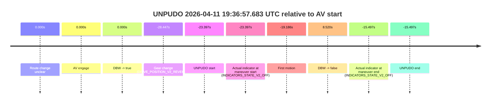
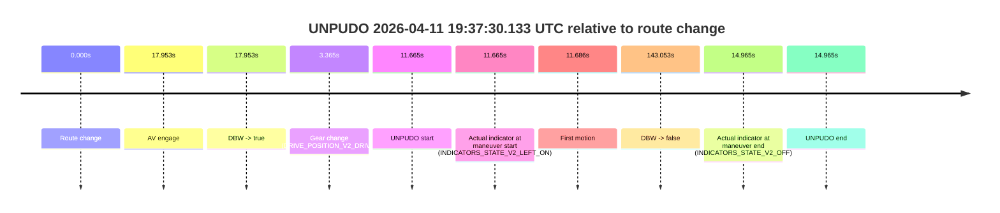
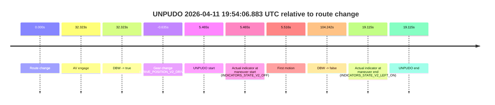
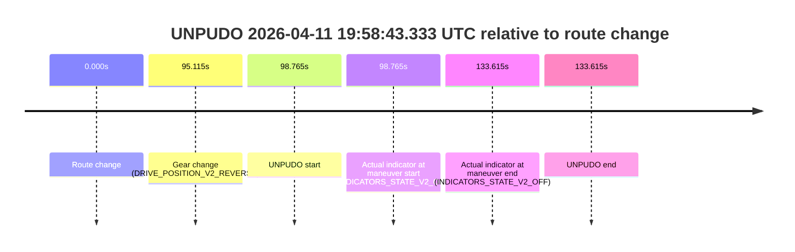

# Run Report: fme10005/2026-04-11--19-15-17--gen2-av-45e94fd0-ad4b-4257-b685-0ff28fa8bcd1

| Field | Value |
|---|---|
| Run ID | `fme10005/2026-04-11--19-15-17--gen2-av-45e94fd0-ad4b-4257-b685-0ff28fa8bcd1` |
| Date | `2026-04-11` |
| Model(s) | `lively-orange-horse` |
| Author | `guy.geva` |
| Event count | `5` |

## unpudo 2026-04-11 19:36:57.683 UTC

| Field | Value |
|---|---|
| Model | `lively-orange-horse` |
| Author | `guy.geva` |
| Run ID | `fme10005/2026-04-11--19-15-17--gen2-av-45e94fd0-ad4b-4257-b685-0ff28fa8bcd1` |
| Date | `2026-04-11` |
| Time (UTC) | `19:36:57.683` |
| Event type | `unpudo` |
| Disengagement type | `failed_to_pudo` |
| Route change | `unclear` |
| Console | [run](https://console.sso.wayve.ai/run/fme10005/2026-04-11--19-15-17--gen2-av-45e94fd0-ad4b-4257-b685-0ff28fa8bcd1?id=&time-unixus=1775936217683311) |
| Foxglove | [segment](https://app.foxglove.dev/wayve-on-prem/p/prj_0dX18KZdVHg1fmmI/view?ds=foxglove-stream&ds.deviceName=fme10005&ds.start=2026-04-11T19%3A36%3A42.633304Z&ds.end=2026-04-11T19%3A37%3A39.599831Z&layoutId=lay_0e7VD4WIKDQGU73Y&time=2026-04-11T19%3A36%3A57.683311Z) |

### Event card: accidental

- Accidental: AV ownership is present for less than `2s`, so this is treated as an accidental brush with the maneuver rather than a meaningful model attempt.

| Event | Time (UTC) | Delta from AV start |
|---|---:|---:|
| Route change unclear | 2026-04-11 19:37:21.079 | `0.000s` |
| AV engage | 2026-04-11 19:37:21.079 | `0.000s` |
| DBW -> true | 2026-04-11 19:37:21.079 | `0.000s` |
| Gear change (DRIVE_POSITION_V2_REVERSE) | 2026-04-11 19:36:52.633 | `-28.447s` |
| UNPUDO start | 2026-04-11 19:36:57.683 | `-23.397s` |
| Actual indicator at maneuver start (INDICATORS_STATE_V2_OFF) | 2026-04-11 19:36:57.683 | `-23.397s` |
| First motion | 2026-04-11 19:37:01.894 | `-19.186s` |
| DBW -> false | 2026-04-11 19:37:29.599 | `8.520s` |
| Actual indicator at maneuver end (INDICATORS_STATE_V2_OFF) | 2026-04-11 19:37:05.583 | `-15.497s` |
| UNPUDO end | 2026-04-11 19:37:05.583 | `-15.497s` |

| Metric | Value |
|---|---|
| Outcome | `accidental` |
| Effective failure type | `none` |
| Route change status | `unclear` |
| DBW at event start | `false` |
| DBW at event end | `false` |
| Predicted gear at AV start | `DRIVE_POSITION_V2_PARK` |
| Actual gear at AV start | `DRIVE_POSITION_V2_PARK` |
| Predicted gear at event start | `DRIVE_POSITION_V2_REVERSE` |
| Actual gear at event start | `DRIVE_POSITION_V2_REVERSE` |
| Planned indicator direction | `INDICATORS_STATE_V2_OFF` |
| Controller indicator direction | `INDICATORS_STATE_V2_OFF` |
| Actual indicator direction | `INDICATORS_STATE_V2_OFF` |
| Actual indicator at maneuver end | `INDICATORS_STATE_V2_OFF` |
| Driver accel help in AV | `false` |
| Driver accel help timestamp | `n/a` |
| Max accel pedal pct in AV | `0.0%` |
| Max brake pedal pct in AV | `0.0%` |
| Max speed mps in AV | `0.000` |
| Route -> AV | `n/a` |
| AV -> event start | `-23.397s` |
| AV -> first motion | `-19.186s` |
| AV duration before disengagement | `8.520s` |
| Trajectory waypoint count | `37` |
| Driving-plan step count | `11` |

The scored portion starts from the AV-owned window, not from the pre-AV setup. Route-change search in the stopped pre-event segment was `unclear`, with the baseline therefore set to AV start. At the event anchor the model predicts `DRIVE_POSITION_V2_REVERSE` and the actual gear is `DRIVE_POSITION_V2_REVERSE`. The effective model outcome is `accidental` because `the AV-owned portion is shorter than 2s`.

### Resolution

| Field | Value |
|---|---|
| Final outcome | `accidental` |
| Do we agree with this label? | `yes` |
| Source disengagement type | `failed_to_pudo` |
| Resolved effective failure type | `none` |
| Confidence | `medium` |

## unpudo 2026-04-11 19:37:30.133 UTC

| Field | Value |
|---|---|
| Model | `lively-orange-horse` |
| Author | `guy.geva` |
| Run ID | `fme10005/2026-04-11--19-15-17--gen2-av-45e94fd0-ad4b-4257-b685-0ff28fa8bcd1` |
| Date | `2026-04-11` |
| Time (UTC) | `19:37:30.133` |
| Event type | `unpudo` |
| Disengagement type | `failed_to_unpudo` |
| Route change | `found` |
| Console | [run](https://console.sso.wayve.ai/run/fme10005/2026-04-11--19-15-17--gen2-av-45e94fd0-ad4b-4257-b685-0ff28fa8bcd1?id=&time-unixus=1775936250133307) |
| Foxglove | [segment](https://app.foxglove.dev/wayve-on-prem/p/prj_0dX18KZdVHg1fmmI/view?ds=foxglove-stream&ds.deviceName=fme10005&ds.start=2026-04-11T19%3A37%3A08.468284Z&ds.end=2026-04-11T19%3A39%3A51.520947Z&layoutId=lay_0e7VD4WIKDQGU73Y&time=2026-04-11T19%3A37%3A30.133307Z) |

### Event card: accidental

- Accidental: AV ownership is present for less than `2s`, so this is treated as an accidental brush with the maneuver rather than a meaningful model attempt.

| Event | Time (UTC) | Delta from route change |
|---|---:|---:|
| Route change | 2026-04-11 19:37:18.468 | `0.000s` |
| AV engage | 2026-04-11 19:37:36.420 | `17.953s` |
| DBW -> true | 2026-04-11 19:37:36.420 | `17.953s` |
| Gear change (DRIVE_POSITION_V2_DRIVE) | 2026-04-11 19:37:21.833 | `3.365s` |
| UNPUDO start | 2026-04-11 19:37:30.133 | `11.665s` |
| Actual indicator at maneuver start (INDICATORS_STATE_V2_LEFT_ON) | 2026-04-11 19:37:30.133 | `11.665s` |
| First motion | 2026-04-11 19:37:30.153 | `11.686s` |
| DBW -> false | 2026-04-11 19:39:41.520 | `143.053s` |
| Actual indicator at maneuver end (INDICATORS_STATE_V2_OFF) | 2026-04-11 19:37:33.433 | `14.965s` |
| UNPUDO end | 2026-04-11 19:37:33.433 | `14.965s` |

| Metric | Value |
|---|---|
| Outcome | `accidental` |
| Effective failure type | `none` |
| Route change status | `found` |
| DBW at event start | `false` |
| DBW at event end | `false` |
| Predicted gear at AV start | `DRIVE_POSITION_V2_DRIVE` |
| Actual gear at AV start | `DRIVE_POSITION_V2_DRIVE` |
| Predicted gear at event start | `DRIVE_POSITION_V2_DRIVE` |
| Actual gear at event start | `DRIVE_POSITION_V2_DRIVE` |
| Planned indicator direction | `INDICATORS_STATE_V2_LEFT_ON` |
| Controller indicator direction | `INDICATORS_STATE_V2_LEFT_ON` |
| Actual indicator direction | `INDICATORS_STATE_V2_LEFT_ON` |
| Actual indicator at maneuver end | `INDICATORS_STATE_V2_OFF` |
| Driver accel help in AV | `false` |
| Driver accel help timestamp | `n/a` |
| Max accel pedal pct in AV | `0.0%` |
| Max brake pedal pct in AV | `0.0%` |
| Max speed mps in AV | `0.000` |
| Route -> AV | `17.953s` |
| AV -> event start | `-6.287s` |
| AV -> first motion | `-6.267s` |
| AV duration before disengagement | `125.100s` |
| Trajectory waypoint count | `36` |
| Driving-plan step count | `11` |

The scored portion starts from the AV-owned window, not from the pre-AV setup. Route-change search in the stopped pre-event segment was `found`, with the baseline therefore set to route change. At the event anchor the model predicts `DRIVE_POSITION_V2_DRIVE` and the actual gear is `DRIVE_POSITION_V2_DRIVE`. The effective model outcome is `accidental` because `the AV-owned portion is shorter than 2s`.

### Resolution

| Field | Value |
|---|---|
| Final outcome | `accidental` |
| Do we agree with this label? | `yes` |
| Source disengagement type | `failed_to_unpudo` |
| Resolved effective failure type | `none` |
| Confidence | `high` |

## unpudo 2026-04-11 19:39:42.183 UTC

| Field | Value |
|---|---|
| Model | `lively-orange-horse` |
| Author | `guy.geva` |
| Run ID | `fme10005/2026-04-11--19-15-17--gen2-av-45e94fd0-ad4b-4257-b685-0ff28fa8bcd1` |
| Date | `2026-04-11` |
| Time (UTC) | `19:39:42.183` |
| Event type | `unpudo` |
| Disengagement type | `failed_to_unpudo` |
| Route change | `found` |
| Console | [run](https://console.sso.wayve.ai/run/fme10005/2026-04-11--19-15-17--gen2-av-45e94fd0-ad4b-4257-b685-0ff28fa8bcd1?id=&time-unixus=1775936382183297) |
| Foxglove | [segment](https://app.foxglove.dev/wayve-on-prem/p/prj_0dX18KZdVHg1fmmI/view?ds=foxglove-stream&ds.deviceName=fme10005&ds.start=2026-04-11T19%3A39%3A25.583302Z&ds.end=2026-04-11T19%3A40%3A43.819729Z&layoutId=lay_0e7VD4WIKDQGU73Y&time=2026-04-11T19%3A39%3A42.183297Z) |

### Event card: accidental

- Accidental: AV ownership is present for less than `2s`, so this is treated as an accidental brush with the maneuver rather than a meaningful model attempt.

| Event | Time (UTC) | Delta from route change |
|---|---:|---:|
| Route change | 2026-04-11 19:39:35.918 | `0.000s` |
| AV engage | 2026-04-11 19:40:00.780 | `24.863s` |
| DBW -> true | 2026-04-11 19:40:00.780 | `24.863s` |
| Gear change (DRIVE_POSITION_V2_DRIVE) | 2026-04-11 19:39:35.583 | `-0.335s` |
| UNPUDO start | 2026-04-11 19:39:42.183 | `6.265s` |
| Actual indicator at maneuver start (INDICATORS_STATE_V2_OFF) | 2026-04-11 19:39:42.183 | `6.265s` |
| First motion | 2026-04-11 19:39:42.194 | `6.276s` |
| DBW -> false | 2026-04-11 19:40:33.819 | `57.901s` |
| Actual indicator at maneuver end (INDICATORS_STATE_V2_OFF) | 2026-04-11 19:39:46.883 | `10.965s` |
| UNPUDO end | 2026-04-11 19:39:46.883 | `10.965s` |

| Metric | Value |
|---|---|
| Outcome | `accidental` |
| Effective failure type | `none` |
| Route change status | `found` |
| DBW at event start | `false` |
| DBW at event end | `false` |
| Predicted gear at AV start | `DRIVE_POSITION_V2_DRIVE` |
| Actual gear at AV start | `DRIVE_POSITION_V2_DRIVE` |
| Predicted gear at event start | `DRIVE_POSITION_V2_DRIVE` |
| Actual gear at event start | `DRIVE_POSITION_V2_DRIVE` |
| Planned indicator direction | `INDICATORS_STATE_V2_RIGHT_ON` |
| Controller indicator direction | `INDICATORS_STATE_V2_RIGHT_ON` |
| Actual indicator direction | `INDICATORS_STATE_V2_OFF` |
| Actual indicator at maneuver end | `INDICATORS_STATE_V2_OFF` |
| Driver accel help in AV | `false` |
| Driver accel help timestamp | `n/a` |
| Max accel pedal pct in AV | `0.0%` |
| Max brake pedal pct in AV | `0.0%` |
| Max speed mps in AV | `0.000` |
| Route -> AV | `24.863s` |
| AV -> event start | `-18.598s` |
| AV -> first motion | `-18.587s` |
| AV duration before disengagement | `33.039s` |
| Trajectory waypoint count | `37` |
| Driving-plan step count | `11` |

The scored portion starts from the AV-owned window, not from the pre-AV setup. Route-change search in the stopped pre-event segment was `found`, with the baseline therefore set to route change. At the event anchor the model predicts `DRIVE_POSITION_V2_DRIVE` and the actual gear is `DRIVE_POSITION_V2_DRIVE`. The effective model outcome is `accidental` because `the AV-owned portion is shorter than 2s`.

### Resolution

| Field | Value |
|---|---|
| Final outcome | `accidental` |
| Do we agree with this label? | `yes` |
| Source disengagement type | `failed_to_unpudo` |
| Resolved effective failure type | `none` |
| Confidence | `high` |

## unpudo 2026-04-11 19:54:06.883 UTC

| Field | Value |
|---|---|
| Model | `lively-orange-horse` |
| Author | `guy.geva` |
| Run ID | `fme10005/2026-04-11--19-15-17--gen2-av-45e94fd0-ad4b-4257-b685-0ff28fa8bcd1` |
| Date | `2026-04-11` |
| Time (UTC) | `19:54:06.883` |
| Event type | `unpudo` |
| Disengagement type | `failed_to_unpudo` |
| Route change | `found` |
| Console | [run](https://console.sso.wayve.ai/run/fme10005/2026-04-11--19-15-17--gen2-av-45e94fd0-ad4b-4257-b685-0ff28fa8bcd1?id=&time-unixus=1775937246883321) |
| Foxglove | [segment](https://app.foxglove.dev/wayve-on-prem/p/prj_0dX18KZdVHg1fmmI/view?ds=foxglove-stream&ds.deviceName=fme10005&ds.start=2026-04-11T19%3A53%3A50.783310Z&ds.end=2026-04-11T19%3A55%3A55.660523Z&layoutId=lay_0e7VD4WIKDQGU73Y&time=2026-04-11T19%3A54%3A06.883321Z) |

### Event card: accidental

- Accidental: AV ownership is present for less than `2s`, so this is treated as an accidental brush with the maneuver rather than a meaningful model attempt.

| Event | Time (UTC) | Delta from route change |
|---|---:|---:|
| Route change | 2026-04-11 19:54:01.418 | `0.000s` |
| AV engage | 2026-04-11 19:54:33.741 | `32.323s` |
| DBW -> true | 2026-04-11 19:54:33.741 | `32.323s` |
| Gear change (DRIVE_POSITION_V2_DRIVE) | 2026-04-11 19:54:00.783 | `-0.635s` |
| UNPUDO start | 2026-04-11 19:54:06.883 | `5.465s` |
| Actual indicator at maneuver start (INDICATORS_STATE_V2_OFF) | 2026-04-11 19:54:06.883 | `5.465s` |
| First motion | 2026-04-11 19:54:06.933 | `5.516s` |
| DBW -> false | 2026-04-11 19:55:45.660 | `104.242s` |
| Actual indicator at maneuver end (INDICATORS_STATE_V2_LEFT_ON) | 2026-04-11 19:54:20.533 | `19.115s` |
| UNPUDO end | 2026-04-11 19:54:20.533 | `19.115s` |

| Metric | Value |
|---|---|
| Outcome | `accidental` |
| Effective failure type | `none` |
| Route change status | `found` |
| DBW at event start | `false` |
| DBW at event end | `false` |
| Predicted gear at AV start | `DRIVE_POSITION_V2_DRIVE` |
| Actual gear at AV start | `DRIVE_POSITION_V2_DRIVE` |
| Predicted gear at event start | `DRIVE_POSITION_V2_DRIVE` |
| Actual gear at event start | `DRIVE_POSITION_V2_DRIVE` |
| Planned indicator direction | `INDICATORS_STATE_V2_OFF` |
| Controller indicator direction | `INDICATORS_STATE_V2_OFF` |
| Actual indicator direction | `INDICATORS_STATE_V2_OFF` |
| Actual indicator at maneuver end | `INDICATORS_STATE_V2_LEFT_ON` |
| Driver accel help in AV | `false` |
| Driver accel help timestamp | `n/a` |
| Max accel pedal pct in AV | `0.0%` |
| Max brake pedal pct in AV | `0.0%` |
| Max speed mps in AV | `0.000` |
| Route -> AV | `32.323s` |
| AV -> event start | `-26.858s` |
| AV -> first motion | `-26.807s` |
| AV duration before disengagement | `71.919s` |
| Trajectory waypoint count | `37` |
| Driving-plan step count | `11` |

The scored portion starts from the AV-owned window, not from the pre-AV setup. Route-change search in the stopped pre-event segment was `found`, with the baseline therefore set to route change. At the event anchor the model predicts `DRIVE_POSITION_V2_DRIVE` and the actual gear is `DRIVE_POSITION_V2_DRIVE`. The effective model outcome is `accidental` because `the AV-owned portion is shorter than 2s`.

### Resolution

| Field | Value |
|---|---|
| Final outcome | `accidental` |
| Do we agree with this label? | `yes` |
| Source disengagement type | `failed_to_unpudo` |
| Resolved effective failure type | `none` |
| Confidence | `high` |

## unpudo 2026-04-11 19:58:43.333 UTC

| Field | Value |
|---|---|
| Model | `lively-orange-horse` |
| Author | `guy.geva` |
| Run ID | `fme10005/2026-04-11--19-15-17--gen2-av-45e94fd0-ad4b-4257-b685-0ff28fa8bcd1` |
| Date | `2026-04-11` |
| Time (UTC) | `19:58:43.333` |
| Event type | `unpudo` |
| Disengagement type | `failed_to_unpudo` |
| Route change | `found` |
| Console | [run](https://console.sso.wayve.ai/run/fme10005/2026-04-11--19-15-17--gen2-av-45e94fd0-ad4b-4257-b685-0ff28fa8bcd1?id=&time-unixus=1775937523333305) |
| Foxglove | [segment](https://app.foxglove.dev/wayve-on-prem/p/prj_0dX18KZdVHg1fmmI/view?ds=foxglove-stream&ds.deviceName=fme10005&ds.start=2026-04-11T19%3A56%3A54.568284Z&ds.end=2026-04-11T19%3A59%3A28.183308Z&layoutId=lay_0e7VD4WIKDQGU73Y&time=2026-04-11T19%3A58%3A43.333305Z) |

### Event card: non-av

- Non-AV: the detected unpudo starts outside AV ownership, so it is kept for coverage but excluded from model success / failure scoring.

| Event | Time (UTC) | Delta from route change |
|---|---:|---:|
| Route change | 2026-04-11 19:57:04.568 | `0.000s` |
| Gear change (DRIVE_POSITION_V2_REVERSE) | 2026-04-11 19:58:39.683 | `95.115s` |
| UNPUDO start | 2026-04-11 19:58:43.333 | `98.765s` |
| Actual indicator at maneuver start (INDICATORS_STATE_V2_OFF) | 2026-04-11 19:58:43.333 | `98.765s` |
| Actual indicator at maneuver end (INDICATORS_STATE_V2_OFF) | 2026-04-11 19:59:18.183 | `133.615s` |
| UNPUDO end | 2026-04-11 19:59:18.183 | `133.615s` |

| Metric | Value |
|---|---|
| Outcome | `non-av` |
| Effective failure type | `none` |
| Route change status | `found` |
| DBW at event start | `false` |
| DBW at event end | `false` |
| Predicted gear at AV start | `n/a` |
| Actual gear at AV start | `n/a` |
| Predicted gear at event start | `DRIVE_POSITION_V2_REVERSE` |
| Actual gear at event start | `DRIVE_POSITION_V2_REVERSE` |
| Planned indicator direction | `INDICATORS_STATE_V2_OFF` |
| Controller indicator direction | `INDICATORS_STATE_V2_OFF` |
| Actual indicator direction | `INDICATORS_STATE_V2_OFF` |
| Actual indicator at maneuver end | `INDICATORS_STATE_V2_OFF` |
| Driver accel help in AV | `false` |
| Driver accel help timestamp | `n/a` |
| Max accel pedal pct in AV | `0.0%` |
| Max brake pedal pct in AV | `0.0%` |
| Max speed mps in AV | `0.000` |
| Route -> AV | `n/a` |
| AV -> event start | `n/a` |
| AV -> first motion | `n/a` |
| AV duration before disengagement | `n/a` |
| Trajectory waypoint count | `36` |
| Driving-plan step count | `11` |

The scored portion starts from the AV-owned window, not from the pre-AV setup. Route-change search in the stopped pre-event segment was `found`, with the baseline therefore set to route change. At the event anchor the model predicts `DRIVE_POSITION_V2_REVERSE` and the actual gear is `DRIVE_POSITION_V2_REVERSE`. The effective model outcome is `non-av` because `the event does not begin in AV ownership`.

### Resolution

| Field | Value |
|---|---|
| Final outcome | `non-av` |
| Do we agree with this label? | `yes` |
| Source disengagement type | `failed_to_unpudo` |
| Resolved effective failure type | `none` |
| Confidence | `high` |
