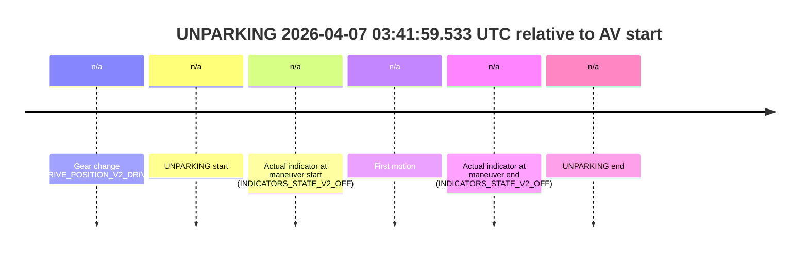

# Run Report: fme10010/2026-04-07--03-32-58--gen2-av-58c6ea29-9fb5-4a08-b928-4fc6373a261b

| Field | Value |
|---|---|
| Run ID | `fme10010/2026-04-07--03-32-58--gen2-av-58c6ea29-9fb5-4a08-b928-4fc6373a261b` |
| Date | `2026-04-07` |
| Model(s) | `lively-orange-horse` |
| Author | `guy.geva` |
| Event count | `1` |

## unparking 2026-04-07 03:41:59.533 UTC

| Field | Value |
|---|---|
| Model | `lively-orange-horse` |
| Author | `guy.geva` |
| Run ID | `fme10010/2026-04-07--03-32-58--gen2-av-58c6ea29-9fb5-4a08-b928-4fc6373a261b` |
| Date | `2026-04-07` |
| Time (UTC) | `03:41:59.533` |
| Event type | `unparking` |
| Disengagement type | `failed_to_pudo` |
| Route change | `unclear` |
| Console | [run](https://console.sso.wayve.ai/run/fme10010/2026-04-07--03-32-58--gen2-av-58c6ea29-9fb5-4a08-b928-4fc6373a261b?id=&time-unixus=1775533319533292) |
| Foxglove | [segment](https://app.foxglove.dev/wayve-on-prem/p/prj_0dX18KZdVHg1fmmI/view?ds=foxglove-stream&ds.deviceName=fme10010&ds.start=2026-04-07T03%3A41%3A48.383311Z&ds.end=2026-04-07T03%3A42%3A27.033327Z&layoutId=lay_0e7VD4WIKDQGU73Y&time=2026-04-07T03%3A41%3A59.533292Z) |

### Event card: fail

- Fail: AV owns part of the segment, but the event still resolves as a model-performance failure under the AV-only scoring rule.

| Event | Time (UTC) | Delta from AV start |
|---|---:|---:|
| Gear change (DRIVE_POSITION_V2_DRIVE) | 2026-04-07 03:41:58.383 | `n/a` |
| UNPARKING start | 2026-04-07 03:41:59.533 | `n/a` |
| Actual indicator at maneuver start (INDICATORS_STATE_V2_OFF) | 2026-04-07 03:41:59.533 | `n/a` |
| First motion | 2026-04-07 03:41:59.587 | `n/a` |
| Actual indicator at maneuver end (INDICATORS_STATE_V2_OFF) | 2026-04-07 03:42:17.033 | `n/a` |
| UNPARKING end | 2026-04-07 03:42:17.033 | `n/a` |

| Metric | Value |
|---|---|
| Outcome | `fail` |
| Effective failure type | `failed_to_pudo` |
| Route change status | `unclear` |
| DBW at event start | `false` |
| DBW at event end | `false` |
| Predicted gear at AV start | `n/a` |
| Actual gear at AV start | `n/a` |
| Predicted gear at event start | `DRIVE_POSITION_V2_DRIVE` |
| Actual gear at event start | `DRIVE_POSITION_V2_DRIVE` |
| Planned indicator direction | `INDICATORS_STATE_V2_OFF` |
| Controller indicator direction | `INDICATORS_STATE_V2_OFF` |
| Actual indicator direction | `INDICATORS_STATE_V2_OFF` |
| Actual indicator at maneuver end | `INDICATORS_STATE_V2_OFF` |
| Driver accel help in AV | `false` |
| Driver accel help timestamp | `n/a` |
| Max accel pedal pct in AV | `0.0%` |
| Max brake pedal pct in AV | `0.0%` |
| Max speed mps in AV | `0.000` |
| Route -> AV | `n/a` |
| AV -> event start | `n/a` |
| AV -> first motion | `n/a` |
| AV duration before disengagement | `n/a` |
| Trajectory waypoint count | `37` |
| Driving-plan step count | `11` |

The scored portion starts from the AV-owned window, not from the pre-AV setup. Route-change search in the stopped pre-event segment was `unclear`, with the baseline therefore set to AV start. At the event anchor the model predicts `DRIVE_POSITION_V2_DRIVE` and the actual gear is `DRIVE_POSITION_V2_DRIVE`. The effective model outcome is `fail` because `failed_to_pudo`.

### Resolution

| Field | Value |
|---|---|
| Final outcome | `fail` |
| Do we agree with this label? | `yes` |
| Source disengagement type | `failed_to_pudo` |
| Resolved effective failure type | `failed_to_pudo` |
| Confidence | `medium` |
