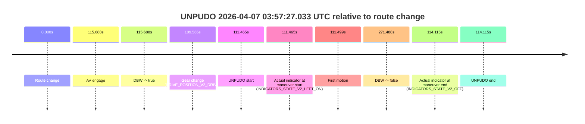
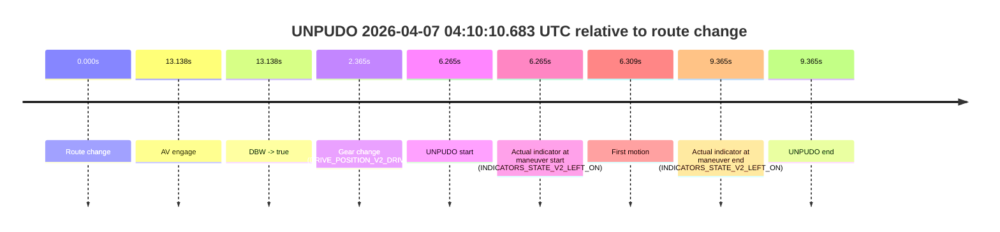

# Run Report: fme10010/2026-04-07--03-42-41--gen2-av-2c32fb82-ee14-45a8-89a7-25e492bd4608

| Field | Value |
|---|---|
| Run ID | `fme10010/2026-04-07--03-42-41--gen2-av-2c32fb82-ee14-45a8-89a7-25e492bd4608` |
| Date | `2026-04-07` |
| Model(s) | `lively-orange-horse` |
| Author | `guy.geva` |
| Event count | `3` |

## unpudo 2026-04-07 03:53:18.533 UTC

| Field | Value |
|---|---|
| Model | `lively-orange-horse` |
| Author | `guy.geva` |
| Run ID | `fme10010/2026-04-07--03-42-41--gen2-av-2c32fb82-ee14-45a8-89a7-25e492bd4608` |
| Date | `2026-04-07` |
| Time (UTC) | `03:53:18.533` |
| Event type | `unpudo` |
| Disengagement type | `none observed` |
| Route change | `found` |
| Console | [run](https://console.sso.wayve.ai/run/fme10010/2026-04-07--03-42-41--gen2-av-2c32fb82-ee14-45a8-89a7-25e492bd4608?id=&time-unixus=1775533998533316) |
| Foxglove | [segment](https://app.foxglove.dev/wayve-on-prem/p/prj_0dX18KZdVHg1fmmI/view?ds=foxglove-stream&ds.deviceName=fme10010&ds.start=2026-04-07T03%3A52%3A55.718554Z&ds.end=2026-04-07T03%3A55%3A38.056785Z&layoutId=lay_0e7VD4WIKDQGU73Y&time=2026-04-07T03%3A53%3A18.533316Z) |

### Event card: accidental

- Accidental: AV ownership is present for less than `2s`, so this is treated as an accidental brush with the maneuver rather than a meaningful model attempt.

| Event | Time (UTC) | Delta from route change |
|---|---:|---:|
| Route change | 2026-04-07 03:53:05.718 | `0.000s` |
| AV engage | 2026-04-07 03:53:30.456 | `24.738s` |
| DBW -> true | 2026-04-07 03:53:30.456 | `24.738s` |
| Gear change (DRIVE_POSITION_V2_REVERSE) | 2026-04-07 03:53:13.933 | `8.215s` |
| UNPUDO start | 2026-04-07 03:53:18.533 | `12.815s` |
| Actual indicator at maneuver start (INDICATORS_STATE_V2_OFF) | 2026-04-07 03:53:18.533 | `12.815s` |
| First motion | 2026-04-07 03:53:21.426 | `15.708s` |
| DBW -> false | 2026-04-07 03:55:28.056 | `142.338s` |
| Actual indicator at maneuver end (INDICATORS_STATE_V2_OFF) | 2026-04-07 03:53:24.733 | `19.015s` |
| UNPUDO end | 2026-04-07 03:53:24.733 | `19.015s` |

| Metric | Value |
|---|---|
| Outcome | `accidental` |
| Effective failure type | `none` |
| Route change status | `found` |
| DBW at event start | `false` |
| DBW at event end | `false` |
| Predicted gear at AV start | `DRIVE_POSITION_V2_DRIVE` |
| Actual gear at AV start | `DRIVE_POSITION_V2_DRIVE` |
| Predicted gear at event start | `DRIVE_POSITION_V2_DRIVE` |
| Actual gear at event start | `DRIVE_POSITION_V2_REVERSE` |
| Planned indicator direction | `INDICATORS_STATE_V2_LEFT_ON` |
| Controller indicator direction | `INDICATORS_STATE_V2_LEFT_ON` |
| Actual indicator direction | `INDICATORS_STATE_V2_OFF` |
| Actual indicator at maneuver end | `INDICATORS_STATE_V2_OFF` |
| Driver accel help in AV | `false` |
| Driver accel help timestamp | `n/a` |
| Max accel pedal pct in AV | `0.0%` |
| Max brake pedal pct in AV | `0.0%` |
| Max speed mps in AV | `0.000` |
| Route -> AV | `24.738s` |
| AV -> event start | `-11.924s` |
| AV -> first motion | `-9.030s` |
| AV duration before disengagement | `117.600s` |
| Trajectory waypoint count | `37` |
| Driving-plan step count | `11` |

The scored portion starts from the AV-owned window, not from the pre-AV setup. Route-change search in the stopped pre-event segment was `found`, with the baseline therefore set to route change. At the event anchor the model predicts `DRIVE_POSITION_V2_DRIVE` and the actual gear is `DRIVE_POSITION_V2_REVERSE`. The effective model outcome is `accidental` because `the AV-owned portion is shorter than 2s`.

### Resolution

| Field | Value |
|---|---|
| Final outcome | `accidental` |
| Do we agree with this label? | `yes` |
| Source disengagement type | `none observed` |
| Resolved effective failure type | `none` |
| Confidence | `high` |

## unpudo 2026-04-07 03:57:27.033 UTC

| Field | Value |
|---|---|
| Model | `lively-orange-horse` |
| Author | `guy.geva` |
| Run ID | `fme10010/2026-04-07--03-42-41--gen2-av-2c32fb82-ee14-45a8-89a7-25e492bd4608` |
| Date | `2026-04-07` |
| Time (UTC) | `03:57:27.033` |
| Event type | `unpudo` |
| Disengagement type | `none observed` |
| Route change | `found` |
| Console | [run](https://console.sso.wayve.ai/run/fme10010/2026-04-07--03-42-41--gen2-av-2c32fb82-ee14-45a8-89a7-25e492bd4608?id=&time-unixus=1775534247033318) |
| Foxglove | [segment](https://app.foxglove.dev/wayve-on-prem/p/prj_0dX18KZdVHg1fmmI/view?ds=foxglove-stream&ds.deviceName=fme10010&ds.start=2026-04-07T03%3A55%3A25.568229Z&ds.end=2026-04-07T04%3A00%3A17.056576Z&layoutId=lay_0e7VD4WIKDQGU73Y&time=2026-04-07T03%3A57%3A27.033318Z) |

### Event card: accidental

- Accidental: AV ownership is present for less than `2s`, so this is treated as an accidental brush with the maneuver rather than a meaningful model attempt.

| Event | Time (UTC) | Delta from route change |
|---|---:|---:|
| Route change | 2026-04-07 03:55:35.568 | `0.000s` |
| AV engage | 2026-04-07 03:57:31.256 | `115.688s` |
| DBW -> true | 2026-04-07 03:57:31.256 | `115.688s` |
| Gear change (DRIVE_POSITION_V2_DRIVE) | 2026-04-07 03:57:25.133 | `109.565s` |
| UNPUDO start | 2026-04-07 03:57:27.033 | `111.465s` |
| Actual indicator at maneuver start (INDICATORS_STATE_V2_LEFT_ON) | 2026-04-07 03:57:27.033 | `111.465s` |
| First motion | 2026-04-07 03:57:27.066 | `111.499s` |
| DBW -> false | 2026-04-07 04:00:07.056 | `271.488s` |
| Actual indicator at maneuver end (INDICATORS_STATE_V2_OFF) | 2026-04-07 03:57:29.683 | `114.115s` |
| UNPUDO end | 2026-04-07 03:57:29.683 | `114.115s` |

| Metric | Value |
|---|---|
| Outcome | `accidental` |
| Effective failure type | `none` |
| Route change status | `found` |
| DBW at event start | `false` |
| DBW at event end | `false` |
| Predicted gear at AV start | `DRIVE_POSITION_V2_DRIVE` |
| Actual gear at AV start | `DRIVE_POSITION_V2_DRIVE` |
| Predicted gear at event start | `DRIVE_POSITION_V2_DRIVE` |
| Actual gear at event start | `DRIVE_POSITION_V2_DRIVE` |
| Planned indicator direction | `INDICATORS_STATE_V2_LEFT_ON` |
| Controller indicator direction | `INDICATORS_STATE_V2_LEFT_ON` |
| Actual indicator direction | `INDICATORS_STATE_V2_LEFT_ON` |
| Actual indicator at maneuver end | `INDICATORS_STATE_V2_OFF` |
| Driver accel help in AV | `false` |
| Driver accel help timestamp | `n/a` |
| Max accel pedal pct in AV | `0.0%` |
| Max brake pedal pct in AV | `0.0%` |
| Max speed mps in AV | `0.000` |
| Route -> AV | `115.688s` |
| AV -> event start | `-4.223s` |
| AV -> first motion | `-4.190s` |
| AV duration before disengagement | `155.800s` |
| Trajectory waypoint count | `35` |
| Driving-plan step count | `11` |

The scored portion starts from the AV-owned window, not from the pre-AV setup. Route-change search in the stopped pre-event segment was `found`, with the baseline therefore set to route change. At the event anchor the model predicts `DRIVE_POSITION_V2_DRIVE` and the actual gear is `DRIVE_POSITION_V2_DRIVE`. The effective model outcome is `accidental` because `the AV-owned portion is shorter than 2s`.

### Resolution

| Field | Value |
|---|---|
| Final outcome | `accidental` |
| Do we agree with this label? | `yes` |
| Source disengagement type | `none observed` |
| Resolved effective failure type | `none` |
| Confidence | `high` |

## unpudo 2026-04-07 04:10:10.683 UTC

| Field | Value |
|---|---|
| Model | `lively-orange-horse` |
| Author | `guy.geva` |
| Run ID | `fme10010/2026-04-07--03-42-41--gen2-av-2c32fb82-ee14-45a8-89a7-25e492bd4608` |
| Date | `2026-04-07` |
| Time (UTC) | `04:10:10.683` |
| Event type | `unpudo` |
| Disengagement type | `none observed` |
| Route change | `found` |
| Console | [run](https://console.sso.wayve.ai/run/fme10010/2026-04-07--03-42-41--gen2-av-2c32fb82-ee14-45a8-89a7-25e492bd4608?id=&time-unixus=1775535010683321) |
| Foxglove | [segment](https://app.foxglove.dev/wayve-on-prem/p/prj_0dX18KZdVHg1fmmI/view?ds=foxglove-stream&ds.deviceName=fme10010&ds.start=2026-04-07T04%3A09%3A54.418348Z&ds.end=2026-04-07T04%3A10%3A23.783301Z&layoutId=lay_0e7VD4WIKDQGU73Y&time=2026-04-07T04%3A10%3A10.683321Z) |

### Event card: accidental

- Accidental: AV ownership is present for less than `2s`, so this is treated as an accidental brush with the maneuver rather than a meaningful model attempt.

| Event | Time (UTC) | Delta from route change |
|---|---:|---:|
| Route change | 2026-04-07 04:10:04.418 | `0.000s` |
| AV engage | 2026-04-07 04:10:17.556 | `13.138s` |
| DBW -> true | 2026-04-07 04:10:17.556 | `13.138s` |
| Gear change (DRIVE_POSITION_V2_DRIVE) | 2026-04-07 04:10:06.783 | `2.365s` |
| UNPUDO start | 2026-04-07 04:10:10.683 | `6.265s` |
| Actual indicator at maneuver start (INDICATORS_STATE_V2_LEFT_ON) | 2026-04-07 04:10:10.683 | `6.265s` |
| First motion | 2026-04-07 04:10:10.726 | `6.309s` |
| Actual indicator at maneuver end (INDICATORS_STATE_V2_LEFT_ON) | 2026-04-07 04:10:13.783 | `9.365s` |
| UNPUDO end | 2026-04-07 04:10:13.783 | `9.365s` |

| Metric | Value |
|---|---|
| Outcome | `accidental` |
| Effective failure type | `none` |
| Route change status | `found` |
| DBW at event start | `false` |
| DBW at event end | `false` |
| Predicted gear at AV start | `DRIVE_POSITION_V2_DRIVE` |
| Actual gear at AV start | `DRIVE_POSITION_V2_DRIVE` |
| Predicted gear at event start | `DRIVE_POSITION_V2_DRIVE` |
| Actual gear at event start | `DRIVE_POSITION_V2_DRIVE` |
| Planned indicator direction | `INDICATORS_STATE_V2_RIGHT_ON` |
| Controller indicator direction | `INDICATORS_STATE_V2_RIGHT_ON` |
| Actual indicator direction | `INDICATORS_STATE_V2_LEFT_ON` |
| Actual indicator at maneuver end | `INDICATORS_STATE_V2_LEFT_ON` |
| Driver accel help in AV | `false` |
| Driver accel help timestamp | `n/a` |
| Max accel pedal pct in AV | `0.0%` |
| Max brake pedal pct in AV | `0.0%` |
| Max speed mps in AV | `0.000` |
| Route -> AV | `13.138s` |
| AV -> event start | `-6.873s` |
| AV -> first motion | `-6.830s` |
| AV duration before disengagement | `n/a` |
| Trajectory waypoint count | `36` |
| Driving-plan step count | `11` |

The scored portion starts from the AV-owned window, not from the pre-AV setup. Route-change search in the stopped pre-event segment was `found`, with the baseline therefore set to route change. At the event anchor the model predicts `DRIVE_POSITION_V2_DRIVE` and the actual gear is `DRIVE_POSITION_V2_DRIVE`. The effective model outcome is `accidental` because `the AV-owned portion is shorter than 2s`.

### Resolution

| Field | Value |
|---|---|
| Final outcome | `accidental` |
| Do we agree with this label? | `yes` |
| Source disengagement type | `none observed` |
| Resolved effective failure type | `none` |
| Confidence | `high` |
