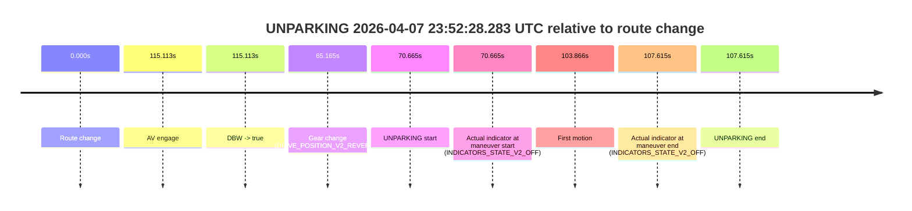

# Run Report: fme10010/2026-04-07--22-16-08--gen2-av-07322a7a-6617-45d1-aa78-4773495cf2da

| Field | Value |
|---|---|
| Run ID | `fme10010/2026-04-07--22-16-08--gen2-av-07322a7a-6617-45d1-aa78-4773495cf2da` |
| Date | `2026-04-07` |
| Model(s) | `lively-orange-horse` |
| Author | `guy.geva` |
| Event count | `1` |

## unparking 2026-04-07 23:52:28.283 UTC

| Field | Value |
|---|---|
| Model | `lively-orange-horse` |
| Author | `guy.geva` |
| Run ID | `fme10010/2026-04-07--22-16-08--gen2-av-07322a7a-6617-45d1-aa78-4773495cf2da` |
| Date | `2026-04-07` |
| Time (UTC) | `23:52:28.283` |
| Event type | `unparking` |
| Disengagement type | `none observed` |
| Route change | `found` |
| Console | [run](https://console.sso.wayve.ai/run/fme10010/2026-04-07--22-16-08--gen2-av-07322a7a-6617-45d1-aa78-4773495cf2da?id=&time-unixus=1775605948283319) |
| Foxglove | [segment](https://app.foxglove.dev/wayve-on-prem/p/prj_0dX18KZdVHg1fmmI/view?ds=foxglove-stream&ds.deviceName=fme10010&ds.start=2026-04-07T23%3A51%3A07.618311Z&ds.end=2026-04-07T23%3A53%3A15.233294Z&layoutId=lay_0e7VD4WIKDQGU73Y&time=2026-04-07T23%3A52%3A28.283319Z) |

### Event card: accidental

- Accidental: AV ownership is present for less than `2s`, so this is treated as an accidental brush with the maneuver rather than a meaningful model attempt.

| Event | Time (UTC) | Delta from route change |
|---|---:|---:|
| Route change | 2026-04-07 23:51:17.618 | `0.000s` |
| AV engage | 2026-04-07 23:53:12.731 | `115.113s` |
| DBW -> true | 2026-04-07 23:53:12.731 | `115.113s` |
| Gear change (DRIVE_POSITION_V2_REVERSE) | 2026-04-07 23:52:22.783 | `65.165s` |
| UNPARKING start | 2026-04-07 23:52:28.283 | `70.665s` |
| Actual indicator at maneuver start (INDICATORS_STATE_V2_OFF) | 2026-04-07 23:52:28.283 | `70.665s` |
| First motion | 2026-04-07 23:53:01.484 | `103.866s` |
| Actual indicator at maneuver end (INDICATORS_STATE_V2_OFF) | 2026-04-07 23:53:05.233 | `107.615s` |
| UNPARKING end | 2026-04-07 23:53:05.233 | `107.615s` |

| Metric | Value |
|---|---|
| Outcome | `accidental` |
| Effective failure type | `none` |
| Route change status | `found` |
| DBW at event start | `false` |
| DBW at event end | `false` |
| Predicted gear at AV start | `DRIVE_POSITION_V2_DRIVE` |
| Actual gear at AV start | `DRIVE_POSITION_V2_DRIVE` |
| Predicted gear at event start | `DRIVE_POSITION_V2_DRIVE` |
| Actual gear at event start | `DRIVE_POSITION_V2_REVERSE` |
| Planned indicator direction | `INDICATORS_STATE_V2_OFF` |
| Controller indicator direction | `INDICATORS_STATE_V2_OFF` |
| Actual indicator direction | `INDICATORS_STATE_V2_OFF` |
| Actual indicator at maneuver end | `INDICATORS_STATE_V2_OFF` |
| Driver accel help in AV | `false` |
| Driver accel help timestamp | `n/a` |
| Max accel pedal pct in AV | `0.0%` |
| Max brake pedal pct in AV | `0.0%` |
| Max speed mps in AV | `0.000` |
| Route -> AV | `115.113s` |
| AV -> event start | `-44.448s` |
| AV -> first motion | `-11.247s` |
| AV duration before disengagement | `n/a` |
| Trajectory waypoint count | `37` |
| Driving-plan step count | `11` |

The scored portion starts from the AV-owned window, not from the pre-AV setup. Route-change search in the stopped pre-event segment was `found`, with the baseline therefore set to route change. At the event anchor the model predicts `DRIVE_POSITION_V2_DRIVE` and the actual gear is `DRIVE_POSITION_V2_REVERSE`. The effective model outcome is `accidental` because `the AV-owned portion is shorter than 2s`.

### Resolution

| Field | Value |
|---|---|
| Final outcome | `accidental` |
| Do we agree with this label? | `yes` |
| Source disengagement type | `none observed` |
| Resolved effective failure type | `none` |
| Confidence | `high` |
