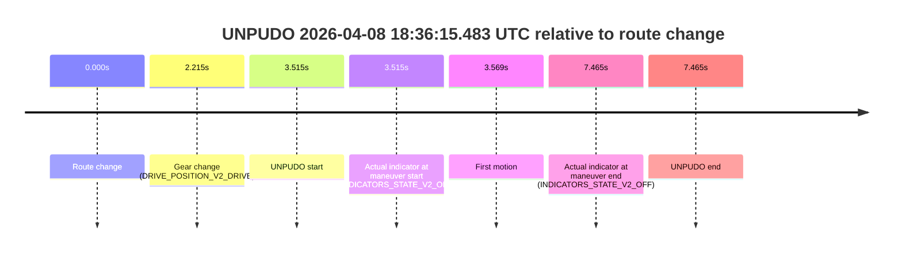
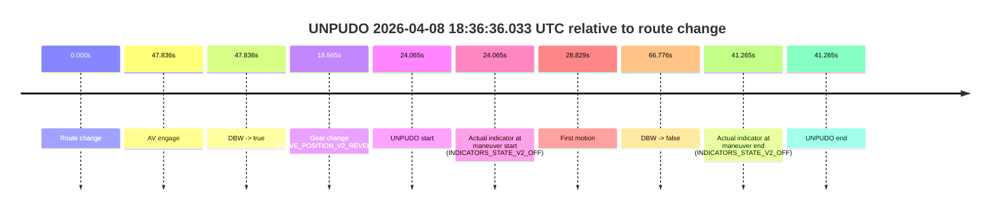
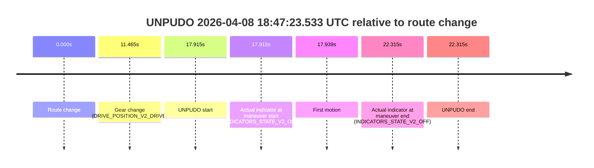

# Run Report: fme10010/2026-04-08--18-10-00--gen2-av-23714bd0-c756-4286-80d1-a5da8c6d5a54

| Field | Value |
|---|---|
| Run ID | `fme10010/2026-04-08--18-10-00--gen2-av-23714bd0-c756-4286-80d1-a5da8c6d5a54` |
| Date | `2026-04-08` |
| Model(s) | `lively-orange-horse` |
| Author | `guy.geva` |
| Event count | `7` |

## unpudo 2026-04-08 18:17:22.933 UTC

| Field | Value |
|---|---|
| Model | `lively-orange-horse` |
| Author | `guy.geva` |
| Run ID | `fme10010/2026-04-08--18-10-00--gen2-av-23714bd0-c756-4286-80d1-a5da8c6d5a54` |
| Date | `2026-04-08` |
| Time (UTC) | `18:17:22.933` |
| Event type | `unpudo` |
| Disengagement type | `failed_to_pudo` |
| Route change | `found` |
| Console | [run](https://console.sso.wayve.ai/run/fme10010/2026-04-08--18-10-00--gen2-av-23714bd0-c756-4286-80d1-a5da8c6d5a54?id=&time-unixus=1775672242933306) |
| Foxglove | [segment](https://app.foxglove.dev/wayve-on-prem/p/prj_0dX18KZdVHg1fmmI/view?ds=foxglove-stream&ds.deviceName=fme10010&ds.start=2026-04-08T18%3A17%3A05.418299Z&ds.end=2026-04-08T18%3A18%3A00.083909Z&layoutId=lay_0e7VD4WIKDQGU73Y&time=2026-04-08T18%3A17%3A22.933306Z) |

### Event card: fail

- Fail: AV owns part of the segment, but the event still resolves as a model-performance failure under the AV-only scoring rule.

| Event | Time (UTC) | Delta from route change |
|---|---:|---:|
| Route change | 2026-04-08 18:17:15.418 | `0.000s` |
| AV engage | 2026-04-08 18:17:37.863 | `22.445s` |
| DBW -> true | 2026-04-08 18:17:37.863 | `22.445s` |
| Gear change (DRIVE_POSITION_V2_DRIVE) | 2026-04-08 18:17:15.783 | `0.365s` |
| UNPUDO start | 2026-04-08 18:17:22.933 | `7.515s` |
| Actual indicator at maneuver start (INDICATORS_STATE_V2_OFF) | 2026-04-08 18:17:22.933 | `7.515s` |
| First motion | 2026-04-08 18:17:23.037 | `7.619s` |
| DBW -> false | 2026-04-08 18:17:50.083 | `34.666s` |
| Actual indicator at maneuver end (INDICATORS_STATE_V2_OFF) | 2026-04-08 18:17:31.333 | `15.915s` |
| UNPUDO end | 2026-04-08 18:17:31.333 | `15.915s` |

| Metric | Value |
|---|---|
| Outcome | `fail` |
| Effective failure type | `failed_to_pudo` |
| Route change status | `found` |
| DBW at event start | `false` |
| DBW at event end | `false` |
| Predicted gear at AV start | `DRIVE_POSITION_V2_DRIVE` |
| Actual gear at AV start | `DRIVE_POSITION_V2_DRIVE` |
| Predicted gear at event start | `DRIVE_POSITION_V2_DRIVE` |
| Actual gear at event start | `DRIVE_POSITION_V2_DRIVE` |
| Planned indicator direction | `INDICATORS_STATE_V2_OFF` |
| Controller indicator direction | `INDICATORS_STATE_V2_OFF` |
| Actual indicator direction | `INDICATORS_STATE_V2_OFF` |
| Actual indicator at maneuver end | `INDICATORS_STATE_V2_OFF` |
| Driver accel help in AV | `false` |
| Driver accel help timestamp | `n/a` |
| Max accel pedal pct in AV | `0.0%` |
| Max brake pedal pct in AV | `0.0%` |
| Max speed mps in AV | `0.000` |
| Route -> AV | `22.445s` |
| AV -> event start | `-14.930s` |
| AV -> first motion | `-14.826s` |
| AV duration before disengagement | `12.220s` |
| Trajectory waypoint count | `38` |
| Driving-plan step count | `11` |

The scored portion starts from the AV-owned window, not from the pre-AV setup. Route-change search in the stopped pre-event segment was `found`, with the baseline therefore set to route change. At the event anchor the model predicts `DRIVE_POSITION_V2_DRIVE` and the actual gear is `DRIVE_POSITION_V2_DRIVE`. The effective model outcome is `fail` because `failed_to_pudo`.

### Resolution

| Field | Value |
|---|---|
| Final outcome | `fail` |
| Do we agree with this label? | `yes` |
| Source disengagement type | `failed_to_pudo` |
| Resolved effective failure type | `failed_to_pudo` |
| Confidence | `high` |

## unpudo 2026-04-08 18:20:41.033 UTC

| Field | Value |
|---|---|
| Model | `lively-orange-horse` |
| Author | `guy.geva` |
| Run ID | `fme10010/2026-04-08--18-10-00--gen2-av-23714bd0-c756-4286-80d1-a5da8c6d5a54` |
| Date | `2026-04-08` |
| Time (UTC) | `18:20:41.033` |
| Event type | `unpudo` |
| Disengagement type | `none observed` |
| Route change | `found` |
| Console | [run](https://console.sso.wayve.ai/run/fme10010/2026-04-08--18-10-00--gen2-av-23714bd0-c756-4286-80d1-a5da8c6d5a54?id=&time-unixus=1775672441033322) |
| Foxglove | [segment](https://app.foxglove.dev/wayve-on-prem/p/prj_0dX18KZdVHg1fmmI/view?ds=foxglove-stream&ds.deviceName=fme10010&ds.start=2026-04-08T18%3A20%3A26.368252Z&ds.end=2026-04-08T18%3A22%3A04.364614Z&layoutId=lay_0e7VD4WIKDQGU73Y&time=2026-04-08T18%3A20%3A41.033322Z) |

### Event card: fail

- Fail: the credited unpudo does not stay AV-owned. The event window starts with DBW false, and the maneuver outcome lands outside a clean AV-owned segment.

| Event | Time (UTC) | Delta from route change |
|---|---:|---:|
| Route change | 2026-04-08 18:20:36.368 | `0.000s` |
| AV engage | 2026-04-08 18:21:15.563 | `39.196s` |
| DBW -> true | 2026-04-08 18:21:15.563 | `39.196s` |
| Gear change (DRIVE_POSITION_V2_DRIVE) | 2026-04-08 18:20:38.483 | `2.115s` |
| UNPUDO start | 2026-04-08 18:20:41.033 | `4.665s` |
| Actual indicator at maneuver start (INDICATORS_STATE_V2_OFF) | 2026-04-08 18:20:41.033 | `4.665s` |
| First motion | 2026-04-08 18:20:41.077 | `4.709s` |
| DBW -> false | 2026-04-08 18:21:54.364 | `77.996s` |
| Actual indicator at maneuver end (INDICATORS_STATE_V2_OFF) | 2026-04-08 18:20:59.983 | `23.615s` |
| UNPUDO end | 2026-04-08 18:20:59.983 | `23.615s` |

| Metric | Value |
|---|---|
| Outcome | `fail` |
| Effective failure type | `completed_outside_av` |
| Route change status | `found` |
| DBW at event start | `false` |
| DBW at event end | `false` |
| Predicted gear at AV start | `DRIVE_POSITION_V2_DRIVE` |
| Actual gear at AV start | `DRIVE_POSITION_V2_DRIVE` |
| Predicted gear at event start | `DRIVE_POSITION_V2_DRIVE` |
| Actual gear at event start | `DRIVE_POSITION_V2_DRIVE` |
| Planned indicator direction | `INDICATORS_STATE_V2_OFF` |
| Controller indicator direction | `INDICATORS_STATE_V2_OFF` |
| Actual indicator direction | `INDICATORS_STATE_V2_OFF` |
| Actual indicator at maneuver end | `INDICATORS_STATE_V2_OFF` |
| Driver accel help in AV | `false` |
| Driver accel help timestamp | `n/a` |
| Max accel pedal pct in AV | `0.0%` |
| Max brake pedal pct in AV | `0.0%` |
| Max speed mps in AV | `0.000` |
| Route -> AV | `39.196s` |
| AV -> event start | `-34.530s` |
| AV -> first motion | `-34.487s` |
| AV duration before disengagement | `38.801s` |
| Trajectory waypoint count | `36` |
| Driving-plan step count | `11` |

The scored portion starts from the AV-owned window, not from the pre-AV setup. Route-change search in the stopped pre-event segment was `found`, with the baseline therefore set to route change. At the event anchor the model predicts `DRIVE_POSITION_V2_DRIVE` and the actual gear is `DRIVE_POSITION_V2_DRIVE`. The effective model outcome is `fail` because `completed_outside_av`.

### Resolution

| Field | Value |
|---|---|
| Final outcome | `fail` |
| Do we agree with this label? | `yes` |
| Source disengagement type | `none observed` |
| Resolved effective failure type | `completed_outside_av` |
| Confidence | `high` |

## unpudo 2026-04-08 18:36:15.483 UTC

| Field | Value |
|---|---|
| Model | `lively-orange-horse` |
| Author | `guy.geva` |
| Run ID | `fme10010/2026-04-08--18-10-00--gen2-av-23714bd0-c756-4286-80d1-a5da8c6d5a54` |
| Date | `2026-04-08` |
| Time (UTC) | `18:36:15.483` |
| Event type | `unpudo` |
| Disengagement type | `none observed` |
| Route change | `found` |
| Console | [run](https://console.sso.wayve.ai/run/fme10010/2026-04-08--18-10-00--gen2-av-23714bd0-c756-4286-80d1-a5da8c6d5a54?id=&time-unixus=1775673375483307) |
| Foxglove | [segment](https://app.foxglove.dev/wayve-on-prem/p/prj_0dX18KZdVHg1fmmI/view?ds=foxglove-stream&ds.deviceName=fme10010&ds.start=2026-04-08T18%3A36%3A01.968263Z&ds.end=2026-04-08T18%3A36%3A29.433316Z&layoutId=lay_0e7VD4WIKDQGU73Y&time=2026-04-08T18%3A36%3A15.483307Z) |

### Event card: fail

- Fail: the credited unpudo does not stay AV-owned. The event window starts with DBW false, and the maneuver outcome lands outside a clean AV-owned segment.

| Event | Time (UTC) | Delta from route change |
|---|---:|---:|
| Route change | 2026-04-08 18:36:11.968 | `0.000s` |
| Gear change (DRIVE_POSITION_V2_DRIVE) | 2026-04-08 18:36:14.183 | `2.215s` |
| UNPUDO start | 2026-04-08 18:36:15.483 | `3.515s` |
| Actual indicator at maneuver start (INDICATORS_STATE_V2_OFF) | 2026-04-08 18:36:15.483 | `3.515s` |
| First motion | 2026-04-08 18:36:15.536 | `3.569s` |
| Actual indicator at maneuver end (INDICATORS_STATE_V2_OFF) | 2026-04-08 18:36:19.433 | `7.465s` |
| UNPUDO end | 2026-04-08 18:36:19.433 | `7.465s` |

| Metric | Value |
|---|---|
| Outcome | `fail` |
| Effective failure type | `not_av_owned` |
| Route change status | `found` |
| DBW at event start | `false` |
| DBW at event end | `false` |
| Predicted gear at AV start | `n/a` |
| Actual gear at AV start | `n/a` |
| Predicted gear at event start | `DRIVE_POSITION_V2_DRIVE` |
| Actual gear at event start | `DRIVE_POSITION_V2_DRIVE` |
| Planned indicator direction | `INDICATORS_STATE_V2_OFF` |
| Controller indicator direction | `INDICATORS_STATE_V2_OFF` |
| Actual indicator direction | `INDICATORS_STATE_V2_OFF` |
| Actual indicator at maneuver end | `INDICATORS_STATE_V2_OFF` |
| Driver accel help in AV | `false` |
| Driver accel help timestamp | `n/a` |
| Max accel pedal pct in AV | `0.0%` |
| Max brake pedal pct in AV | `0.0%` |
| Max speed mps in AV | `0.000` |
| Route -> AV | `n/a` |
| AV -> event start | `n/a` |
| AV -> first motion | `n/a` |
| AV duration before disengagement | `n/a` |
| Trajectory waypoint count | `37` |
| Driving-plan step count | `11` |

The scored portion starts from the AV-owned window, not from the pre-AV setup. Route-change search in the stopped pre-event segment was `found`, with the baseline therefore set to route change. At the event anchor the model predicts `DRIVE_POSITION_V2_DRIVE` and the actual gear is `DRIVE_POSITION_V2_DRIVE`. The effective model outcome is `fail` because `not_av_owned`.

### Resolution

| Field | Value |
|---|---|
| Final outcome | `fail` |
| Do we agree with this label? | `yes` |
| Source disengagement type | `none observed` |
| Resolved effective failure type | `not_av_owned` |
| Confidence | `high` |

## unpudo 2026-04-08 18:36:36.033 UTC

| Field | Value |
|---|---|
| Model | `lively-orange-horse` |
| Author | `guy.geva` |
| Run ID | `fme10010/2026-04-08--18-10-00--gen2-av-23714bd0-c756-4286-80d1-a5da8c6d5a54` |
| Date | `2026-04-08` |
| Time (UTC) | `18:36:36.033` |
| Event type | `unpudo` |
| Disengagement type | `none observed` |
| Route change | `found` |
| Console | [run](https://console.sso.wayve.ai/run/fme10010/2026-04-08--18-10-00--gen2-av-23714bd0-c756-4286-80d1-a5da8c6d5a54?id=&time-unixus=1775673396033321) |
| Foxglove | [segment](https://app.foxglove.dev/wayve-on-prem/p/prj_0dX18KZdVHg1fmmI/view?ds=foxglove-stream&ds.deviceName=fme10010&ds.start=2026-04-08T18%3A36%3A01.968263Z&ds.end=2026-04-08T18%3A37%3A28.743951Z&layoutId=lay_0e7VD4WIKDQGU73Y&time=2026-04-08T18%3A36%3A36.033321Z) |

### Event card: fail

- Fail: the credited unpudo does not stay AV-owned. The event window starts with DBW false, and the maneuver outcome lands outside a clean AV-owned segment.

| Event | Time (UTC) | Delta from route change |
|---|---:|---:|
| Route change | 2026-04-08 18:36:11.968 | `0.000s` |
| AV engage | 2026-04-08 18:36:59.803 | `47.836s` |
| DBW -> true | 2026-04-08 18:36:59.803 | `47.836s` |
| Gear change (DRIVE_POSITION_V2_REVERSE) | 2026-04-08 18:36:30.533 | `18.565s` |
| UNPUDO start | 2026-04-08 18:36:36.033 | `24.065s` |
| Actual indicator at maneuver start (INDICATORS_STATE_V2_OFF) | 2026-04-08 18:36:36.033 | `24.065s` |
| First motion | 2026-04-08 18:36:40.796 | `28.829s` |
| DBW -> false | 2026-04-08 18:37:18.743 | `66.776s` |
| Actual indicator at maneuver end (INDICATORS_STATE_V2_OFF) | 2026-04-08 18:36:53.233 | `41.265s` |
| UNPUDO end | 2026-04-08 18:36:53.233 | `41.265s` |

| Metric | Value |
|---|---|
| Outcome | `fail` |
| Effective failure type | `completed_outside_av` |
| Route change status | `found` |
| DBW at event start | `false` |
| DBW at event end | `false` |
| Predicted gear at AV start | `DRIVE_POSITION_V2_DRIVE` |
| Actual gear at AV start | `DRIVE_POSITION_V2_DRIVE` |
| Predicted gear at event start | `DRIVE_POSITION_V2_DRIVE` |
| Actual gear at event start | `DRIVE_POSITION_V2_REVERSE` |
| Planned indicator direction | `INDICATORS_STATE_V2_OFF` |
| Controller indicator direction | `INDICATORS_STATE_V2_OFF` |
| Actual indicator direction | `INDICATORS_STATE_V2_OFF` |
| Actual indicator at maneuver end | `INDICATORS_STATE_V2_OFF` |
| Driver accel help in AV | `false` |
| Driver accel help timestamp | `n/a` |
| Max accel pedal pct in AV | `0.0%` |
| Max brake pedal pct in AV | `0.0%` |
| Max speed mps in AV | `0.000` |
| Route -> AV | `47.836s` |
| AV -> event start | `-23.770s` |
| AV -> first motion | `-19.007s` |
| AV duration before disengagement | `18.940s` |
| Trajectory waypoint count | `38` |
| Driving-plan step count | `11` |

The scored portion starts from the AV-owned window, not from the pre-AV setup. Route-change search in the stopped pre-event segment was `found`, with the baseline therefore set to route change. At the event anchor the model predicts `DRIVE_POSITION_V2_DRIVE` and the actual gear is `DRIVE_POSITION_V2_REVERSE`. The effective model outcome is `fail` because `completed_outside_av`.

### Resolution

| Field | Value |
|---|---|
| Final outcome | `fail` |
| Do we agree with this label? | `yes` |
| Source disengagement type | `none observed` |
| Resolved effective failure type | `completed_outside_av` |
| Confidence | `high` |

## unpudo 2026-04-08 18:40:41.233 UTC

| Field | Value |
|---|---|
| Model | `lively-orange-horse` |
| Author | `guy.geva` |
| Run ID | `fme10010/2026-04-08--18-10-00--gen2-av-23714bd0-c756-4286-80d1-a5da8c6d5a54` |
| Date | `2026-04-08` |
| Time (UTC) | `18:40:41.233` |
| Event type | `unpudo` |
| Disengagement type | `none observed` |
| Route change | `found` |
| Console | [run](https://console.sso.wayve.ai/run/fme10010/2026-04-08--18-10-00--gen2-av-23714bd0-c756-4286-80d1-a5da8c6d5a54?id=&time-unixus=1775673641233294) |
| Foxglove | [segment](https://app.foxglove.dev/wayve-on-prem/p/prj_0dX18KZdVHg1fmmI/view?ds=foxglove-stream&ds.deviceName=fme10010&ds.start=2026-04-08T18%3A40%3A26.169595Z&ds.end=2026-04-08T18%3A42%3A34.784052Z&layoutId=lay_0e7VD4WIKDQGU73Y&time=2026-04-08T18%3A40%3A41.233294Z) |

### Event card: fail

- Fail: the credited unpudo does not stay AV-owned. The event window starts with DBW false, and the maneuver outcome lands outside a clean AV-owned segment.

| Event | Time (UTC) | Delta from route change |
|---|---:|---:|
| Route change | 2026-04-08 18:40:36.169 | `0.000s` |
| AV engage | 2026-04-08 18:41:17.584 | `41.415s` |
| DBW -> true | 2026-04-08 18:41:17.584 | `41.415s` |
| Gear change (DRIVE_POSITION_V2_DRIVE) | 2026-04-08 18:40:38.483 | `2.314s` |
| UNPUDO start | 2026-04-08 18:40:41.233 | `5.064s` |
| Actual indicator at maneuver start (INDICATORS_STATE_V2_OFF) | 2026-04-08 18:40:41.233 | `5.064s` |
| First motion | 2026-04-08 18:40:41.256 | `5.087s` |
| DBW -> false | 2026-04-08 18:42:24.784 | `108.614s` |
| Actual indicator at maneuver end (INDICATORS_STATE_V2_OFF) | 2026-04-08 18:40:58.083 | `21.914s` |
| UNPUDO end | 2026-04-08 18:40:58.083 | `21.914s` |

| Metric | Value |
|---|---|
| Outcome | `fail` |
| Effective failure type | `completed_outside_av` |
| Route change status | `found` |
| DBW at event start | `false` |
| DBW at event end | `false` |
| Predicted gear at AV start | `DRIVE_POSITION_V2_DRIVE` |
| Actual gear at AV start | `DRIVE_POSITION_V2_DRIVE` |
| Predicted gear at event start | `DRIVE_POSITION_V2_DRIVE` |
| Actual gear at event start | `DRIVE_POSITION_V2_DRIVE` |
| Planned indicator direction | `INDICATORS_STATE_V2_OFF` |
| Controller indicator direction | `INDICATORS_STATE_V2_OFF` |
| Actual indicator direction | `INDICATORS_STATE_V2_OFF` |
| Actual indicator at maneuver end | `INDICATORS_STATE_V2_OFF` |
| Driver accel help in AV | `false` |
| Driver accel help timestamp | `n/a` |
| Max accel pedal pct in AV | `0.0%` |
| Max brake pedal pct in AV | `0.0%` |
| Max speed mps in AV | `0.000` |
| Route -> AV | `41.415s` |
| AV -> event start | `-36.352s` |
| AV -> first motion | `-36.328s` |
| AV duration before disengagement | `67.199s` |
| Trajectory waypoint count | `36` |
| Driving-plan step count | `11` |

The scored portion starts from the AV-owned window, not from the pre-AV setup. Route-change search in the stopped pre-event segment was `found`, with the baseline therefore set to route change. At the event anchor the model predicts `DRIVE_POSITION_V2_DRIVE` and the actual gear is `DRIVE_POSITION_V2_DRIVE`. The effective model outcome is `fail` because `completed_outside_av`.

### Resolution

| Field | Value |
|---|---|
| Final outcome | `fail` |
| Do we agree with this label? | `yes` |
| Source disengagement type | `none observed` |
| Resolved effective failure type | `completed_outside_av` |
| Confidence | `high` |

## unpudo 2026-04-08 18:42:45.733 UTC

| Field | Value |
|---|---|
| Model | `lively-orange-horse` |
| Author | `guy.geva` |
| Run ID | `fme10010/2026-04-08--18-10-00--gen2-av-23714bd0-c756-4286-80d1-a5da8c6d5a54` |
| Date | `2026-04-08` |
| Time (UTC) | `18:42:45.733` |
| Event type | `unpudo` |
| Disengagement type | `failed_to_unpudo` |
| Route change | `found` |
| Console | [run](https://console.sso.wayve.ai/run/fme10010/2026-04-08--18-10-00--gen2-av-23714bd0-c756-4286-80d1-a5da8c6d5a54?id=&time-unixus=1775673765733300) |
| Foxglove | [segment](https://app.foxglove.dev/wayve-on-prem/p/prj_0dX18KZdVHg1fmmI/view?ds=foxglove-stream&ds.deviceName=fme10010&ds.start=2026-04-08T18%3A42%3A23.718235Z&ds.end=2026-04-08T18%3A45%3A15.744009Z&layoutId=lay_0e7VD4WIKDQGU73Y&time=2026-04-08T18%3A42%3A45.733300Z) |

### Event card: fail

- Fail: AV owns part of the segment, but the event still resolves as a model-performance failure under the AV-only scoring rule.

| Event | Time (UTC) | Delta from route change |
|---|---:|---:|
| Route change | 2026-04-08 18:42:33.718 | `0.000s` |
| AV engage | 2026-04-08 18:43:00.745 | `27.027s` |
| DBW -> true | 2026-04-08 18:43:00.745 | `27.027s` |
| Gear change (DRIVE_POSITION_V2_DRIVE) | 2026-04-08 18:42:38.183 | `4.465s` |
| UNPUDO start | 2026-04-08 18:42:45.733 | `12.015s` |
| Actual indicator at maneuver start (INDICATORS_STATE_V2_OFF) | 2026-04-08 18:42:45.733 | `12.015s` |
| First motion | 2026-04-08 18:42:45.777 | `12.059s` |
| DBW -> false | 2026-04-08 18:45:05.744 | `152.026s` |
| Actual indicator at maneuver end (INDICATORS_STATE_V2_LEFT_ON) | 2026-04-08 18:42:48.983 | `15.265s` |
| UNPUDO end | 2026-04-08 18:42:48.983 | `15.265s` |

| Metric | Value |
|---|---|
| Outcome | `fail` |
| Effective failure type | `failed_to_unpudo` |
| Route change status | `found` |
| DBW at event start | `false` |
| DBW at event end | `false` |
| Predicted gear at AV start | `DRIVE_POSITION_V2_DRIVE` |
| Actual gear at AV start | `DRIVE_POSITION_V2_DRIVE` |
| Predicted gear at event start | `DRIVE_POSITION_V2_DRIVE` |
| Actual gear at event start | `DRIVE_POSITION_V2_DRIVE` |
| Planned indicator direction | `INDICATORS_STATE_V2_LEFT_ON` |
| Controller indicator direction | `INDICATORS_STATE_V2_LEFT_ON` |
| Actual indicator direction | `INDICATORS_STATE_V2_OFF` |
| Actual indicator at maneuver end | `INDICATORS_STATE_V2_LEFT_ON` |
| Driver accel help in AV | `false` |
| Driver accel help timestamp | `n/a` |
| Max accel pedal pct in AV | `0.0%` |
| Max brake pedal pct in AV | `0.0%` |
| Max speed mps in AV | `0.000` |
| Route -> AV | `27.027s` |
| AV -> event start | `-15.012s` |
| AV -> first motion | `-14.968s` |
| AV duration before disengagement | `124.999s` |
| Trajectory waypoint count | `36` |
| Driving-plan step count | `11` |

The scored portion starts from the AV-owned window, not from the pre-AV setup. Route-change search in the stopped pre-event segment was `found`, with the baseline therefore set to route change. At the event anchor the model predicts `DRIVE_POSITION_V2_DRIVE` and the actual gear is `DRIVE_POSITION_V2_DRIVE`. The effective model outcome is `fail` because `failed_to_unpudo`.

### Resolution

| Field | Value |
|---|---|
| Final outcome | `fail` |
| Do we agree with this label? | `yes` |
| Source disengagement type | `failed_to_unpudo` |
| Resolved effective failure type | `failed_to_unpudo` |
| Confidence | `high` |

## unpudo 2026-04-08 18:47:23.533 UTC

| Field | Value |
|---|---|
| Model | `lively-orange-horse` |
| Author | `guy.geva` |
| Run ID | `fme10010/2026-04-08--18-10-00--gen2-av-23714bd0-c756-4286-80d1-a5da8c6d5a54` |
| Date | `2026-04-08` |
| Time (UTC) | `18:47:23.533` |
| Event type | `unpudo` |
| Disengagement type | `failed_to_unpudo` |
| Route change | `found` |
| Console | [run](https://console.sso.wayve.ai/run/fme10010/2026-04-08--18-10-00--gen2-av-23714bd0-c756-4286-80d1-a5da8c6d5a54?id=&time-unixus=1775674043533306) |
| Foxglove | [segment](https://app.foxglove.dev/wayve-on-prem/p/prj_0dX18KZdVHg1fmmI/view?ds=foxglove-stream&ds.deviceName=fme10010&ds.start=2026-04-08T18%3A46%3A55.618262Z&ds.end=2026-04-08T18%3A47%3A37.933318Z&layoutId=lay_0e7VD4WIKDQGU73Y&time=2026-04-08T18%3A47%3A23.533306Z) |

### Event card: fail

- Fail: AV owns part of the segment, but the event still resolves as a model-performance failure under the AV-only scoring rule.

| Event | Time (UTC) | Delta from route change |
|---|---:|---:|
| Route change | 2026-04-08 18:47:05.618 | `0.000s` |
| Gear change (DRIVE_POSITION_V2_DRIVE) | 2026-04-08 18:47:17.083 | `11.465s` |
| UNPUDO start | 2026-04-08 18:47:23.533 | `17.915s` |
| Actual indicator at maneuver start (INDICATORS_STATE_V2_OFF) | 2026-04-08 18:47:23.533 | `17.915s` |
| First motion | 2026-04-08 18:47:23.557 | `17.939s` |
| Actual indicator at maneuver end (INDICATORS_STATE_V2_OFF) | 2026-04-08 18:47:27.933 | `22.315s` |
| UNPUDO end | 2026-04-08 18:47:27.933 | `22.315s` |

| Metric | Value |
|---|---|
| Outcome | `fail` |
| Effective failure type | `failed_to_unpudo` |
| Route change status | `found` |
| DBW at event start | `false` |
| DBW at event end | `false` |
| Predicted gear at AV start | `n/a` |
| Actual gear at AV start | `n/a` |
| Predicted gear at event start | `DRIVE_POSITION_V2_DRIVE` |
| Actual gear at event start | `DRIVE_POSITION_V2_DRIVE` |
| Planned indicator direction | `INDICATORS_STATE_V2_LEFT_ON` |
| Controller indicator direction | `INDICATORS_STATE_V2_LEFT_ON` |
| Actual indicator direction | `INDICATORS_STATE_V2_OFF` |
| Actual indicator at maneuver end | `INDICATORS_STATE_V2_OFF` |
| Driver accel help in AV | `false` |
| Driver accel help timestamp | `n/a` |
| Max accel pedal pct in AV | `0.0%` |
| Max brake pedal pct in AV | `0.0%` |
| Max speed mps in AV | `0.000` |
| Route -> AV | `n/a` |
| AV -> event start | `n/a` |
| AV -> first motion | `n/a` |
| AV duration before disengagement | `n/a` |
| Trajectory waypoint count | `36` |
| Driving-plan step count | `11` |

The scored portion starts from the AV-owned window, not from the pre-AV setup. Route-change search in the stopped pre-event segment was `found`, with the baseline therefore set to route change. At the event anchor the model predicts `DRIVE_POSITION_V2_DRIVE` and the actual gear is `DRIVE_POSITION_V2_DRIVE`. The effective model outcome is `fail` because `failed_to_unpudo`.

### Resolution

| Field | Value |
|---|---|
| Final outcome | `fail` |
| Do we agree with this label? | `yes` |
| Source disengagement type | `failed_to_unpudo` |
| Resolved effective failure type | `failed_to_unpudo` |
| Confidence | `high` |
