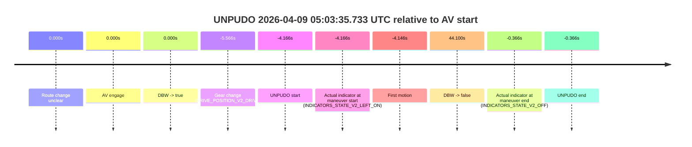
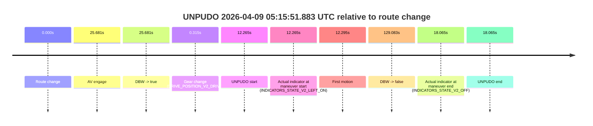
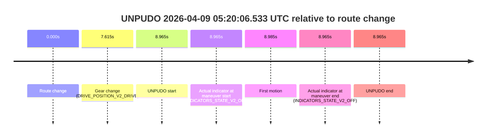

# Run Report: fme10010/2026-04-09--04-53-53--gen2-av-2334bd66-ccb8-4859-8e66-65253f2e90bd

| Field | Value |
|---|---|
| Run ID | `fme10010/2026-04-09--04-53-53--gen2-av-2334bd66-ccb8-4859-8e66-65253f2e90bd` |
| Date | `2026-04-09` |
| Model(s) | `lively-orange-horse` |
| Author | `guy.geva` |
| Event count | `3` |

## unpudo 2026-04-09 05:03:35.733 UTC

| Field | Value |
|---|---|
| Model | `lively-orange-horse` |
| Author | `guy.geva` |
| Run ID | `fme10010/2026-04-09--04-53-53--gen2-av-2334bd66-ccb8-4859-8e66-65253f2e90bd` |
| Date | `2026-04-09` |
| Time (UTC) | `05:03:35.733` |
| Event type | `unpudo` |
| Disengagement type | `none observed` |
| Route change | `unclear` |
| Console | [run](https://console.sso.wayve.ai/run/fme10010/2026-04-09--04-53-53--gen2-av-2334bd66-ccb8-4859-8e66-65253f2e90bd?id=&time-unixus=1775711015733318) |
| Foxglove | [segment](https://app.foxglove.dev/wayve-on-prem/p/prj_0dX18KZdVHg1fmmI/view?ds=foxglove-stream&ds.deviceName=fme10010&ds.start=2026-04-09T05%3A03%3A24.333306Z&ds.end=2026-04-09T05%3A04%3A33.999559Z&layoutId=lay_0e7VD4WIKDQGU73Y&time=2026-04-09T05%3A03%3A35.733318Z) |

### Event card: fail

- Fail: the credited unpudo does not stay AV-owned. The event window starts with DBW false, and the maneuver outcome lands outside a clean AV-owned segment.

| Event | Time (UTC) | Delta from AV start |
|---|---:|---:|
| Route change unclear | 2026-04-09 05:03:39.899 | `0.000s` |
| AV engage | 2026-04-09 05:03:39.899 | `0.000s` |
| DBW -> true | 2026-04-09 05:03:39.899 | `0.000s` |
| Gear change (DRIVE_POSITION_V2_DRIVE) | 2026-04-09 05:03:34.333 | `-5.566s` |
| UNPUDO start | 2026-04-09 05:03:35.733 | `-4.166s` |
| Actual indicator at maneuver start (INDICATORS_STATE_V2_LEFT_ON) | 2026-04-09 05:03:35.733 | `-4.166s` |
| First motion | 2026-04-09 05:03:35.753 | `-4.146s` |
| DBW -> false | 2026-04-09 05:04:23.999 | `44.100s` |
| Actual indicator at maneuver end (INDICATORS_STATE_V2_OFF) | 2026-04-09 05:03:39.533 | `-0.366s` |
| UNPUDO end | 2026-04-09 05:03:39.533 | `-0.366s` |

| Metric | Value |
|---|---|
| Outcome | `fail` |
| Effective failure type | `completed_outside_av` |
| Route change status | `unclear` |
| DBW at event start | `false` |
| DBW at event end | `false` |
| Predicted gear at AV start | `DRIVE_POSITION_V2_DRIVE` |
| Actual gear at AV start | `DRIVE_POSITION_V2_DRIVE` |
| Predicted gear at event start | `DRIVE_POSITION_V2_DRIVE` |
| Actual gear at event start | `DRIVE_POSITION_V2_DRIVE` |
| Planned indicator direction | `INDICATORS_STATE_V2_LEFT_ON` |
| Controller indicator direction | `INDICATORS_STATE_V2_LEFT_ON` |
| Actual indicator direction | `INDICATORS_STATE_V2_LEFT_ON` |
| Actual indicator at maneuver end | `INDICATORS_STATE_V2_OFF` |
| Driver accel help in AV | `false` |
| Driver accel help timestamp | `n/a` |
| Max accel pedal pct in AV | `0.0%` |
| Max brake pedal pct in AV | `0.0%` |
| Max speed mps in AV | `0.000` |
| Route -> AV | `n/a` |
| AV -> event start | `-4.166s` |
| AV -> first motion | `-4.146s` |
| AV duration before disengagement | `44.100s` |
| Trajectory waypoint count | `36` |
| Driving-plan step count | `11` |

The scored portion starts from the AV-owned window, not from the pre-AV setup. Route-change search in the stopped pre-event segment was `unclear`, with the baseline therefore set to AV start. At the event anchor the model predicts `DRIVE_POSITION_V2_DRIVE` and the actual gear is `DRIVE_POSITION_V2_DRIVE`. The effective model outcome is `fail` because `completed_outside_av`.

### Resolution

| Field | Value |
|---|---|
| Final outcome | `fail` |
| Do we agree with this label? | `yes` |
| Source disengagement type | `none observed` |
| Resolved effective failure type | `completed_outside_av` |
| Confidence | `medium` |

## unpudo 2026-04-09 05:15:51.883 UTC

| Field | Value |
|---|---|
| Model | `lively-orange-horse` |
| Author | `guy.geva` |
| Run ID | `fme10010/2026-04-09--04-53-53--gen2-av-2334bd66-ccb8-4859-8e66-65253f2e90bd` |
| Date | `2026-04-09` |
| Time (UTC) | `05:15:51.883` |
| Event type | `unpudo` |
| Disengagement type | `failed_to_unpudo` |
| Route change | `found` |
| Console | [run](https://console.sso.wayve.ai/run/fme10010/2026-04-09--04-53-53--gen2-av-2334bd66-ccb8-4859-8e66-65253f2e90bd?id=&time-unixus=1775711751883319) |
| Foxglove | [segment](https://app.foxglove.dev/wayve-on-prem/p/prj_0dX18KZdVHg1fmmI/view?ds=foxglove-stream&ds.deviceName=fme10010&ds.start=2026-04-09T05%3A15%3A29.618236Z&ds.end=2026-04-09T05%3A17%3A58.700894Z&layoutId=lay_0e7VD4WIKDQGU73Y&time=2026-04-09T05%3A15%3A51.883319Z) |

### Event card: fail

- Fail: AV owns part of the segment, but the event still resolves as a model-performance failure under the AV-only scoring rule.

| Event | Time (UTC) | Delta from route change |
|---|---:|---:|
| Route change | 2026-04-09 05:15:39.618 | `0.000s` |
| AV engage | 2026-04-09 05:16:05.299 | `25.681s` |
| DBW -> true | 2026-04-09 05:16:05.299 | `25.681s` |
| Gear change (DRIVE_POSITION_V2_DRIVE) | 2026-04-09 05:15:39.933 | `0.315s` |
| UNPUDO start | 2026-04-09 05:15:51.883 | `12.265s` |
| Actual indicator at maneuver start (INDICATORS_STATE_V2_LEFT_ON) | 2026-04-09 05:15:51.883 | `12.265s` |
| First motion | 2026-04-09 05:15:51.913 | `12.295s` |
| DBW -> false | 2026-04-09 05:17:48.700 | `129.083s` |
| Actual indicator at maneuver end (INDICATORS_STATE_V2_OFF) | 2026-04-09 05:15:57.683 | `18.065s` |
| UNPUDO end | 2026-04-09 05:15:57.683 | `18.065s` |

| Metric | Value |
|---|---|
| Outcome | `fail` |
| Effective failure type | `failed_to_unpudo` |
| Route change status | `found` |
| DBW at event start | `false` |
| DBW at event end | `false` |
| Predicted gear at AV start | `DRIVE_POSITION_V2_DRIVE` |
| Actual gear at AV start | `DRIVE_POSITION_V2_DRIVE` |
| Predicted gear at event start | `DRIVE_POSITION_V2_DRIVE` |
| Actual gear at event start | `DRIVE_POSITION_V2_DRIVE` |
| Planned indicator direction | `INDICATORS_STATE_V2_RIGHT_ON` |
| Controller indicator direction | `INDICATORS_STATE_V2_RIGHT_ON` |
| Actual indicator direction | `INDICATORS_STATE_V2_LEFT_ON` |
| Actual indicator at maneuver end | `INDICATORS_STATE_V2_OFF` |
| Driver accel help in AV | `false` |
| Driver accel help timestamp | `n/a` |
| Max accel pedal pct in AV | `0.0%` |
| Max brake pedal pct in AV | `0.0%` |
| Max speed mps in AV | `0.000` |
| Route -> AV | `25.681s` |
| AV -> event start | `-13.416s` |
| AV -> first motion | `-13.387s` |
| AV duration before disengagement | `103.401s` |
| Trajectory waypoint count | `37` |
| Driving-plan step count | `11` |

The scored portion starts from the AV-owned window, not from the pre-AV setup. Route-change search in the stopped pre-event segment was `found`, with the baseline therefore set to route change. At the event anchor the model predicts `DRIVE_POSITION_V2_DRIVE` and the actual gear is `DRIVE_POSITION_V2_DRIVE`. The effective model outcome is `fail` because `failed_to_unpudo`.

### Resolution

| Field | Value |
|---|---|
| Final outcome | `fail` |
| Do we agree with this label? | `yes` |
| Source disengagement type | `failed_to_unpudo` |
| Resolved effective failure type | `failed_to_unpudo` |
| Confidence | `high` |

## unpudo 2026-04-09 05:20:06.533 UTC

| Field | Value |
|---|---|
| Model | `lively-orange-horse` |
| Author | `guy.geva` |
| Run ID | `fme10010/2026-04-09--04-53-53--gen2-av-2334bd66-ccb8-4859-8e66-65253f2e90bd` |
| Date | `2026-04-09` |
| Time (UTC) | `05:20:06.533` |
| Event type | `unpudo` |
| Disengagement type | `none observed` |
| Route change | `found` |
| Console | [run](https://console.sso.wayve.ai/run/fme10010/2026-04-09--04-53-53--gen2-av-2334bd66-ccb8-4859-8e66-65253f2e90bd?id=&time-unixus=1775712006533304) |
| Foxglove | [segment](https://app.foxglove.dev/wayve-on-prem/p/prj_0dX18KZdVHg1fmmI/view?ds=foxglove-stream&ds.deviceName=fme10010&ds.start=2026-04-09T05%3A19%3A47.568292Z&ds.end=2026-04-09T05%3A20%3A16.533304Z&layoutId=lay_0e7VD4WIKDQGU73Y&time=2026-04-09T05%3A20%3A06.533304Z) |

### Event card: fail

- Fail: the credited unpudo does not stay AV-owned. The event window starts with DBW false, and the maneuver outcome lands outside a clean AV-owned segment.

| Event | Time (UTC) | Delta from route change |
|---|---:|---:|
| Route change | 2026-04-09 05:19:57.568 | `0.000s` |
| Gear change (DRIVE_POSITION_V2_DRIVE) | 2026-04-09 05:20:05.183 | `7.615s` |
| UNPUDO start | 2026-04-09 05:20:06.533 | `8.965s` |
| Actual indicator at maneuver start (INDICATORS_STATE_V2_OFF) | 2026-04-09 05:20:06.533 | `8.965s` |
| First motion | 2026-04-09 05:20:06.553 | `8.985s` |
| Actual indicator at maneuver end (INDICATORS_STATE_V2_OFF) | 2026-04-09 05:20:06.533 | `8.965s` |
| UNPUDO end | 2026-04-09 05:20:06.533 | `8.965s` |

| Metric | Value |
|---|---|
| Outcome | `fail` |
| Effective failure type | `not_av_owned` |
| Route change status | `found` |
| DBW at event start | `false` |
| DBW at event end | `false` |
| Predicted gear at AV start | `n/a` |
| Actual gear at AV start | `n/a` |
| Predicted gear at event start | `DRIVE_POSITION_V2_DRIVE` |
| Actual gear at event start | `DRIVE_POSITION_V2_DRIVE` |
| Planned indicator direction | `INDICATORS_STATE_V2_LEFT_ON` |
| Controller indicator direction | `INDICATORS_STATE_V2_LEFT_ON` |
| Actual indicator direction | `INDICATORS_STATE_V2_OFF` |
| Actual indicator at maneuver end | `INDICATORS_STATE_V2_OFF` |
| Driver accel help in AV | `false` |
| Driver accel help timestamp | `n/a` |
| Max accel pedal pct in AV | `0.0%` |
| Max brake pedal pct in AV | `0.0%` |
| Max speed mps in AV | `0.000` |
| Route -> AV | `n/a` |
| AV -> event start | `n/a` |
| AV -> first motion | `n/a` |
| AV duration before disengagement | `n/a` |
| Trajectory waypoint count | `36` |
| Driving-plan step count | `11` |

The scored portion starts from the AV-owned window, not from the pre-AV setup. Route-change search in the stopped pre-event segment was `found`, with the baseline therefore set to route change. At the event anchor the model predicts `DRIVE_POSITION_V2_DRIVE` and the actual gear is `DRIVE_POSITION_V2_DRIVE`. The effective model outcome is `fail` because `not_av_owned`.

### Resolution

| Field | Value |
|---|---|
| Final outcome | `fail` |
| Do we agree with this label? | `yes` |
| Source disengagement type | `none observed` |
| Resolved effective failure type | `not_av_owned` |
| Confidence | `high` |
