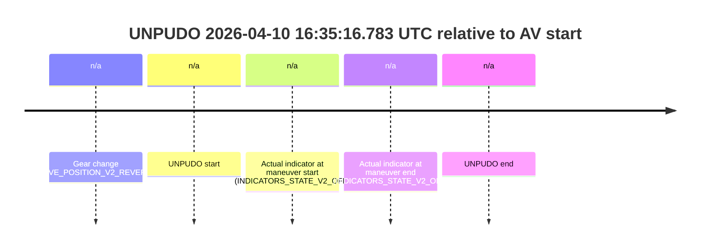
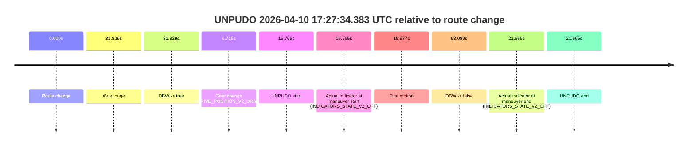
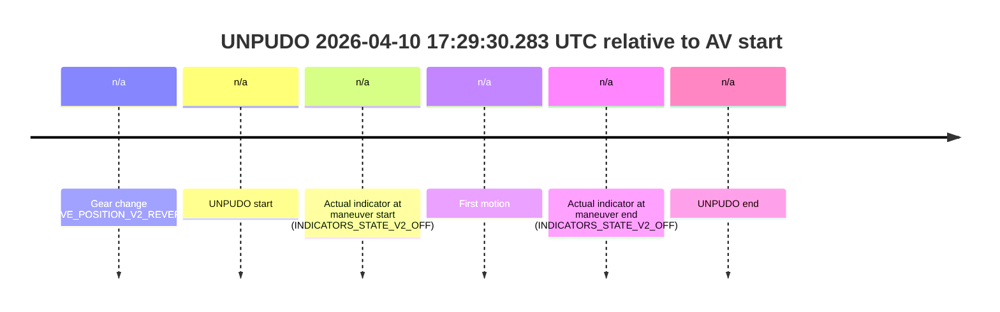
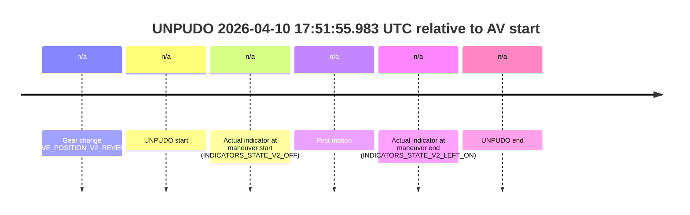
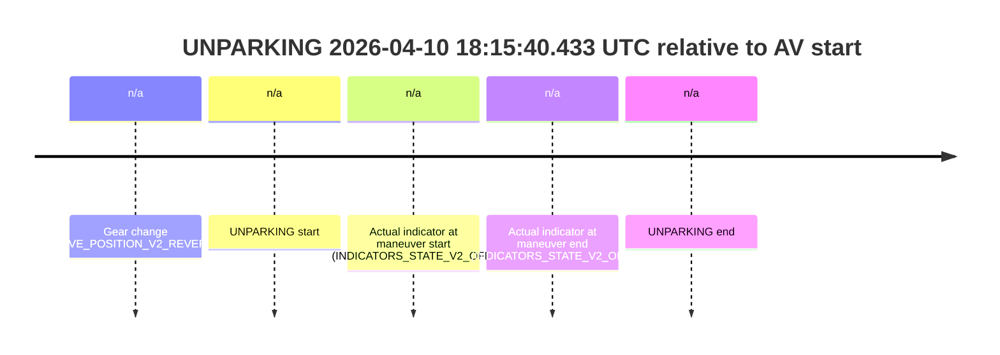

# Run Report: fme10010/2026-04-10--16-12-38--gen2-av-aee2ba31-de3f-40aa-8fbe-67911849f209

| Field | Value |
|---|---|
| Run ID | `fme10010/2026-04-10--16-12-38--gen2-av-aee2ba31-de3f-40aa-8fbe-67911849f209` |
| Date | `2026-04-10` |
| Model(s) | `lively-orange-horse` |
| Author | `guy.geva` |
| Event count | `12` |

## unpudo 2026-04-10 16:25:11.433 UTC

| Field | Value |
|---|---|
| Model | `lively-orange-horse` |
| Author | `guy.geva` |
| Run ID | `fme10010/2026-04-10--16-12-38--gen2-av-aee2ba31-de3f-40aa-8fbe-67911849f209` |
| Date | `2026-04-10` |
| Time (UTC) | `16:25:11.433` |
| Event type | `unpudo` |
| Disengagement type | `failed_to_unpudo` |
| Route change | `found` |
| Console | [run](https://console.sso.wayve.ai/run/fme10010/2026-04-10--16-12-38--gen2-av-aee2ba31-de3f-40aa-8fbe-67911849f209?id=&time-unixus=1775838311433306) |
| Foxglove | [segment](https://app.foxglove.dev/wayve-on-prem/p/prj_0dX18KZdVHg1fmmI/view?ds=foxglove-stream&ds.deviceName=fme10010&ds.start=2026-04-10T16%3A24%3A41.968342Z&ds.end=2026-04-10T16%3A29%3A33.626492Z&layoutId=lay_0e7VD4WIKDQGU73Y&time=2026-04-10T16%3A25%3A11.433306Z) |

### Event card: accidental

- Accidental: AV ownership is present for less than `2s`, so this is treated as an accidental brush with the maneuver rather than a meaningful model attempt.

| Event | Time (UTC) | Delta from route change |
|---|---:|---:|
| Route change | 2026-04-10 16:24:51.968 | `0.000s` |
| AV engage | 2026-04-10 16:25:32.946 | `40.978s` |
| DBW -> true | 2026-04-10 16:25:32.946 | `40.978s` |
| Gear change (DRIVE_POSITION_V2_DRIVE) | 2026-04-10 16:24:57.883 | `5.915s` |
| UNPUDO start | 2026-04-10 16:25:11.433 | `19.465s` |
| Actual indicator at maneuver start (INDICATORS_STATE_V2_OFF) | 2026-04-10 16:25:11.433 | `19.465s` |
| First motion | 2026-04-10 16:25:11.474 | `19.507s` |
| DBW -> false | 2026-04-10 16:29:23.626 | `271.658s` |
| Actual indicator at maneuver end (INDICATORS_STATE_V2_OFF) | 2026-04-10 16:25:16.083 | `24.115s` |
| UNPUDO end | 2026-04-10 16:25:16.083 | `24.115s` |

| Metric | Value |
|---|---|
| Outcome | `accidental` |
| Effective failure type | `none` |
| Route change status | `found` |
| DBW at event start | `false` |
| DBW at event end | `false` |
| Predicted gear at AV start | `DRIVE_POSITION_V2_DRIVE` |
| Actual gear at AV start | `DRIVE_POSITION_V2_DRIVE` |
| Predicted gear at event start | `DRIVE_POSITION_V2_DRIVE` |
| Actual gear at event start | `DRIVE_POSITION_V2_DRIVE` |
| Planned indicator direction | `INDICATORS_STATE_V2_LEFT_ON` |
| Controller indicator direction | `INDICATORS_STATE_V2_LEFT_ON` |
| Actual indicator direction | `INDICATORS_STATE_V2_OFF` |
| Actual indicator at maneuver end | `INDICATORS_STATE_V2_OFF` |
| Driver accel help in AV | `false` |
| Driver accel help timestamp | `n/a` |
| Max accel pedal pct in AV | `0.0%` |
| Max brake pedal pct in AV | `0.0%` |
| Max speed mps in AV | `0.000` |
| Route -> AV | `40.978s` |
| AV -> event start | `-21.513s` |
| AV -> first motion | `-21.471s` |
| AV duration before disengagement | `230.680s` |
| Trajectory waypoint count | `37` |
| Driving-plan step count | `11` |

The scored portion starts from the AV-owned window, not from the pre-AV setup. Route-change search in the stopped pre-event segment was `found`, with the baseline therefore set to route change. At the event anchor the model predicts `DRIVE_POSITION_V2_DRIVE` and the actual gear is `DRIVE_POSITION_V2_DRIVE`. The effective model outcome is `accidental` because `the AV-owned portion is shorter than 2s`.

### Resolution

| Field | Value |
|---|---|
| Final outcome | `accidental` |
| Do we agree with this label? | `yes` |
| Source disengagement type | `failed_to_unpudo` |
| Resolved effective failure type | `none` |
| Confidence | `high` |

## unpudo 2026-04-10 16:29:25.333 UTC

| Field | Value |
|---|---|
| Model | `lively-orange-horse` |
| Author | `guy.geva` |
| Run ID | `fme10010/2026-04-10--16-12-38--gen2-av-aee2ba31-de3f-40aa-8fbe-67911849f209` |
| Date | `2026-04-10` |
| Time (UTC) | `16:29:25.333` |
| Event type | `unpudo` |
| Disengagement type | `failed_to_unpudo` |
| Route change | `found` |
| Console | [run](https://console.sso.wayve.ai/run/fme10010/2026-04-10--16-12-38--gen2-av-aee2ba31-de3f-40aa-8fbe-67911849f209?id=&time-unixus=1775838565333316) |
| Foxglove | [segment](https://app.foxglove.dev/wayve-on-prem/p/prj_0dX18KZdVHg1fmmI/view?ds=foxglove-stream&ds.deviceName=fme10010&ds.start=2026-04-10T16%3A28%3A58.318325Z&ds.end=2026-04-10T16%3A35%3A09.627608Z&layoutId=lay_0e7VD4WIKDQGU73Y&time=2026-04-10T16%3A29%3A25.333316Z) |

### Event card: accidental

- Accidental: AV ownership is present for less than `2s`, so this is treated as an accidental brush with the maneuver rather than a meaningful model attempt.

| Event | Time (UTC) | Delta from route change |
|---|---:|---:|
| Route change | 2026-04-10 16:29:08.318 | `0.000s` |
| AV engage | 2026-04-10 16:29:54.507 | `46.189s` |
| DBW -> true | 2026-04-10 16:29:54.507 | `46.189s` |
| Gear change (DRIVE_POSITION_V2_REVERSE) | 2026-04-10 16:29:10.783 | `2.465s` |
| UNPUDO start | 2026-04-10 16:29:25.333 | `17.015s` |
| Actual indicator at maneuver start (INDICATORS_STATE_V2_OFF) | 2026-04-10 16:29:25.333 | `17.015s` |
| First motion | 2026-04-10 16:29:39.875 | `31.558s` |
| DBW -> false | 2026-04-10 16:34:59.627 | `351.309s` |
| Actual indicator at maneuver end (INDICATORS_STATE_V2_LEFT_ON) | 2026-04-10 16:29:45.533 | `37.215s` |
| UNPUDO end | 2026-04-10 16:29:45.533 | `37.215s` |

| Metric | Value |
|---|---|
| Outcome | `accidental` |
| Effective failure type | `none` |
| Route change status | `found` |
| DBW at event start | `false` |
| DBW at event end | `false` |
| Predicted gear at AV start | `DRIVE_POSITION_V2_DRIVE` |
| Actual gear at AV start | `DRIVE_POSITION_V2_DRIVE` |
| Predicted gear at event start | `DRIVE_POSITION_V2_REVERSE` |
| Actual gear at event start | `DRIVE_POSITION_V2_REVERSE` |
| Planned indicator direction | `INDICATORS_STATE_V2_OFF` |
| Controller indicator direction | `INDICATORS_STATE_V2_OFF` |
| Actual indicator direction | `INDICATORS_STATE_V2_OFF` |
| Actual indicator at maneuver end | `INDICATORS_STATE_V2_LEFT_ON` |
| Driver accel help in AV | `false` |
| Driver accel help timestamp | `n/a` |
| Max accel pedal pct in AV | `0.0%` |
| Max brake pedal pct in AV | `0.0%` |
| Max speed mps in AV | `0.000` |
| Route -> AV | `46.189s` |
| AV -> event start | `-29.174s` |
| AV -> first motion | `-14.631s` |
| AV duration before disengagement | `305.120s` |
| Trajectory waypoint count | `37` |
| Driving-plan step count | `11` |

The scored portion starts from the AV-owned window, not from the pre-AV setup. Route-change search in the stopped pre-event segment was `found`, with the baseline therefore set to route change. At the event anchor the model predicts `DRIVE_POSITION_V2_REVERSE` and the actual gear is `DRIVE_POSITION_V2_REVERSE`. The effective model outcome is `accidental` because `the AV-owned portion is shorter than 2s`.

### Resolution

| Field | Value |
|---|---|
| Final outcome | `accidental` |
| Do we agree with this label? | `yes` |
| Source disengagement type | `failed_to_unpudo` |
| Resolved effective failure type | `none` |
| Confidence | `high` |

## unpudo 2026-04-10 16:35:16.783 UTC

| Field | Value |
|---|---|
| Model | `lively-orange-horse` |
| Author | `guy.geva` |
| Run ID | `fme10010/2026-04-10--16-12-38--gen2-av-aee2ba31-de3f-40aa-8fbe-67911849f209` |
| Date | `2026-04-10` |
| Time (UTC) | `16:35:16.783` |
| Event type | `unpudo` |
| Disengagement type | `none observed` |
| Route change | `unclear` |
| Console | [run](https://console.sso.wayve.ai/run/fme10010/2026-04-10--16-12-38--gen2-av-aee2ba31-de3f-40aa-8fbe-67911849f209?id=&time-unixus=1775838916783301) |
| Foxglove | [segment](https://app.foxglove.dev/wayve-on-prem/p/prj_0dX18KZdVHg1fmmI/view?ds=foxglove-stream&ds.deviceName=fme10010&ds.start=2026-04-10T16%3A35%3A02.883319Z&ds.end=2026-04-10T16%3A35%3A26.783301Z&layoutId=lay_0e7VD4WIKDQGU73Y&time=2026-04-10T16%3A35%3A16.783301Z) |

### Event card: non-av

- Non-AV: the detected unpudo starts outside AV ownership, so it is kept for coverage but excluded from model success / failure scoring.

| Event | Time (UTC) | Delta from AV start |
|---|---:|---:|
| Gear change (DRIVE_POSITION_V2_REVERSE) | 2026-04-10 16:35:12.883 | `n/a` |
| UNPUDO start | 2026-04-10 16:35:16.783 | `n/a` |
| Actual indicator at maneuver start (INDICATORS_STATE_V2_OFF) | 2026-04-10 16:35:16.783 | `n/a` |
| Actual indicator at maneuver end (INDICATORS_STATE_V2_OFF) | 2026-04-10 16:35:16.783 | `n/a` |
| UNPUDO end | 2026-04-10 16:35:16.783 | `n/a` |

| Metric | Value |
|---|---|
| Outcome | `non-av` |
| Effective failure type | `none` |
| Route change status | `unclear` |
| DBW at event start | `false` |
| DBW at event end | `false` |
| Predicted gear at AV start | `n/a` |
| Actual gear at AV start | `n/a` |
| Predicted gear at event start | `DRIVE_POSITION_V2_REVERSE` |
| Actual gear at event start | `DRIVE_POSITION_V2_REVERSE` |
| Planned indicator direction | `INDICATORS_STATE_V2_OFF` |
| Controller indicator direction | `INDICATORS_STATE_V2_OFF` |
| Actual indicator direction | `INDICATORS_STATE_V2_OFF` |
| Actual indicator at maneuver end | `INDICATORS_STATE_V2_OFF` |
| Driver accel help in AV | `false` |
| Driver accel help timestamp | `n/a` |
| Max accel pedal pct in AV | `0.0%` |
| Max brake pedal pct in AV | `0.0%` |
| Max speed mps in AV | `0.000` |
| Route -> AV | `n/a` |
| AV -> event start | `n/a` |
| AV -> first motion | `n/a` |
| AV duration before disengagement | `n/a` |
| Trajectory waypoint count | `36` |
| Driving-plan step count | `11` |

The scored portion starts from the AV-owned window, not from the pre-AV setup. Route-change search in the stopped pre-event segment was `unclear`, with the baseline therefore set to AV start. At the event anchor the model predicts `DRIVE_POSITION_V2_REVERSE` and the actual gear is `DRIVE_POSITION_V2_REVERSE`. The effective model outcome is `non-av` because `the event does not begin in AV ownership`.

### Resolution

| Field | Value |
|---|---|
| Final outcome | `non-av` |
| Do we agree with this label? | `yes` |
| Source disengagement type | `none observed` |
| Resolved effective failure type | `none` |
| Confidence | `medium` |

## unpudo 2026-04-10 16:46:35.083 UTC

| Field | Value |
|---|---|
| Model | `lively-orange-horse` |
| Author | `guy.geva` |
| Run ID | `fme10010/2026-04-10--16-12-38--gen2-av-aee2ba31-de3f-40aa-8fbe-67911849f209` |
| Date | `2026-04-10` |
| Time (UTC) | `16:46:35.083` |
| Event type | `unpudo` |
| Disengagement type | `failed_to_unpudo` |
| Route change | `found` |
| Console | [run](https://console.sso.wayve.ai/run/fme10010/2026-04-10--16-12-38--gen2-av-aee2ba31-de3f-40aa-8fbe-67911849f209?id=&time-unixus=1775839595083295) |
| Foxglove | [segment](https://app.foxglove.dev/wayve-on-prem/p/prj_0dX18KZdVHg1fmmI/view?ds=foxglove-stream&ds.deviceName=fme10010&ds.start=2026-04-10T16%3A46%3A04.118461Z&ds.end=2026-04-10T16%3A52%3A01.267597Z&layoutId=lay_0e7VD4WIKDQGU73Y&time=2026-04-10T16%3A46%3A35.083295Z) |

### Event card: accidental

- Accidental: AV ownership is present for less than `2s`, so this is treated as an accidental brush with the maneuver rather than a meaningful model attempt.

| Event | Time (UTC) | Delta from route change |
|---|---:|---:|
| Route change | 2026-04-10 16:46:14.118 | `0.000s` |
| AV engage | 2026-04-10 16:46:51.967 | `37.849s` |
| DBW -> true | 2026-04-10 16:46:51.967 | `37.849s` |
| Gear change (DRIVE_POSITION_V2_DRIVE) | 2026-04-10 16:46:20.983 | `6.865s` |
| UNPUDO start | 2026-04-10 16:46:35.083 | `20.965s` |
| Actual indicator at maneuver start (INDICATORS_STATE_V2_OFF) | 2026-04-10 16:46:35.083 | `20.965s` |
| First motion | 2026-04-10 16:46:35.155 | `21.037s` |
| DBW -> false | 2026-04-10 16:51:51.267 | `337.149s` |
| Actual indicator at maneuver end (INDICATORS_STATE_V2_OFF) | 2026-04-10 16:46:42.783 | `28.665s` |
| UNPUDO end | 2026-04-10 16:46:42.783 | `28.665s` |

| Metric | Value |
|---|---|
| Outcome | `accidental` |
| Effective failure type | `none` |
| Route change status | `found` |
| DBW at event start | `false` |
| DBW at event end | `false` |
| Predicted gear at AV start | `DRIVE_POSITION_V2_DRIVE` |
| Actual gear at AV start | `DRIVE_POSITION_V2_DRIVE` |
| Predicted gear at event start | `DRIVE_POSITION_V2_DRIVE` |
| Actual gear at event start | `DRIVE_POSITION_V2_DRIVE` |
| Planned indicator direction | `INDICATORS_STATE_V2_LEFT_ON` |
| Controller indicator direction | `INDICATORS_STATE_V2_LEFT_ON` |
| Actual indicator direction | `INDICATORS_STATE_V2_OFF` |
| Actual indicator at maneuver end | `INDICATORS_STATE_V2_OFF` |
| Driver accel help in AV | `false` |
| Driver accel help timestamp | `n/a` |
| Max accel pedal pct in AV | `0.0%` |
| Max brake pedal pct in AV | `0.0%` |
| Max speed mps in AV | `0.000` |
| Route -> AV | `37.849s` |
| AV -> event start | `-16.884s` |
| AV -> first motion | `-16.812s` |
| AV duration before disengagement | `299.300s` |
| Trajectory waypoint count | `36` |
| Driving-plan step count | `11` |

The scored portion starts from the AV-owned window, not from the pre-AV setup. Route-change search in the stopped pre-event segment was `found`, with the baseline therefore set to route change. At the event anchor the model predicts `DRIVE_POSITION_V2_DRIVE` and the actual gear is `DRIVE_POSITION_V2_DRIVE`. The effective model outcome is `accidental` because `the AV-owned portion is shorter than 2s`.

### Resolution

| Field | Value |
|---|---|
| Final outcome | `accidental` |
| Do we agree with this label? | `yes` |
| Source disengagement type | `failed_to_unpudo` |
| Resolved effective failure type | `none` |
| Confidence | `high` |

## unpudo 2026-04-10 17:25:35.883 UTC

| Field | Value |
|---|---|
| Model | `lively-orange-horse` |
| Author | `guy.geva` |
| Run ID | `fme10010/2026-04-10--16-12-38--gen2-av-aee2ba31-de3f-40aa-8fbe-67911849f209` |
| Date | `2026-04-10` |
| Time (UTC) | `17:25:35.883` |
| Event type | `unpudo` |
| Disengagement type | `none observed` |
| Route change | `found` |
| Console | [run](https://console.sso.wayve.ai/run/fme10010/2026-04-10--16-12-38--gen2-av-aee2ba31-de3f-40aa-8fbe-67911849f209?id=&time-unixus=1775841935883301) |
| Foxglove | [segment](https://app.foxglove.dev/wayve-on-prem/p/prj_0dX18KZdVHg1fmmI/view?ds=foxglove-stream&ds.deviceName=fme10010&ds.start=2026-04-10T17%3A15%3A19.347653Z&ds.end=2026-04-10T17%3A27%3A43.607723Z&layoutId=lay_0e7VD4WIKDQGU73Y&time=2026-04-10T17%3A25%3A35.883301Z) |

### Event card: pass

- Pass: AV owns the credited unpudo through the official event window, the gear state is aligned at the anchor, and the vehicle moves without driver accelerator help in AV.

| Event | Time (UTC) | Delta from route change |
|---|---:|---:|
| Route change | 2026-04-10 17:25:19.018 | `0.000s` |
| AV engage | 2026-04-10 17:15:29.347 | `-589.671s` |
| DBW -> true | 2026-04-10 17:15:29.347 | `-589.671s` |
| Gear change (DRIVE_POSITION_V2_DRIVE) | 2026-04-10 17:25:25.683 | `6.665s` |
| UNPUDO start | 2026-04-10 17:25:35.883 | `16.865s` |
| Actual indicator at maneuver start (INDICATORS_STATE_V2_OFF) | 2026-04-10 17:25:35.883 | `16.865s` |
| First motion | 2026-04-10 17:25:45.034 | `26.017s` |
| DBW -> false | 2026-04-10 17:27:33.607 | `134.589s` |
| Actual indicator at maneuver end (INDICATORS_STATE_V2_OFF) | 2026-04-10 17:25:50.783 | `31.765s` |
| UNPUDO end | 2026-04-10 17:25:50.783 | `31.765s` |

| Metric | Value |
|---|---|
| Outcome | `pass` |
| Effective failure type | `none` |
| Route change status | `found` |
| DBW at event start | `true` |
| DBW at event end | `true` |
| Predicted gear at AV start | `DRIVE_POSITION_V2_DRIVE` |
| Actual gear at AV start | `DRIVE_POSITION_V2_DRIVE` |
| Predicted gear at event start | `DRIVE_POSITION_V2_DRIVE` |
| Actual gear at event start | `DRIVE_POSITION_V2_DRIVE` |
| Planned indicator direction | `INDICATORS_STATE_V2_LEFT_ON` |
| Controller indicator direction | `INDICATORS_STATE_V2_LEFT_ON` |
| Actual indicator direction | `INDICATORS_STATE_V2_OFF` |
| Actual indicator at maneuver end | `INDICATORS_STATE_V2_OFF` |
| Driver accel help in AV | `false` |
| Driver accel help timestamp | `n/a` |
| Max accel pedal pct in AV | `0.0%` |
| Max brake pedal pct in AV | `28.3%` |
| Max speed mps in AV | `10.347` |
| Route -> AV | `-589.671s` |
| AV -> event start | `606.536s` |
| AV -> first motion | `615.687s` |
| AV duration before disengagement | `724.260s` |
| Trajectory waypoint count | `36` |
| Driving-plan step count | `11` |

The scored portion starts from the AV-owned window, not from the pre-AV setup. Route-change search in the stopped pre-event segment was `found`, with the baseline therefore set to route change. At the event anchor the model predicts `DRIVE_POSITION_V2_DRIVE` and the actual gear is `DRIVE_POSITION_V2_DRIVE`. The effective model outcome is `pass` because `the credited maneuver stays AV-owned through the official event end`.

### Resolution

| Field | Value |
|---|---|
| Final outcome | `pass` |
| Do we agree with this label? | `yes` |
| Source disengagement type | `none observed` |
| Resolved effective failure type | `none` |
| Confidence | `high` |

## unpudo 2026-04-10 17:27:34.383 UTC

| Field | Value |
|---|---|
| Model | `lively-orange-horse` |
| Author | `guy.geva` |
| Run ID | `fme10010/2026-04-10--16-12-38--gen2-av-aee2ba31-de3f-40aa-8fbe-67911849f209` |
| Date | `2026-04-10` |
| Time (UTC) | `17:27:34.383` |
| Event type | `unpudo` |
| Disengagement type | `failed_to_unpudo` |
| Route change | `found` |
| Console | [run](https://console.sso.wayve.ai/run/fme10010/2026-04-10--16-12-38--gen2-av-aee2ba31-de3f-40aa-8fbe-67911849f209?id=&time-unixus=1775842054383295) |
| Foxglove | [segment](https://app.foxglove.dev/wayve-on-prem/p/prj_0dX18KZdVHg1fmmI/view?ds=foxglove-stream&ds.deviceName=fme10010&ds.start=2026-04-10T17%3A27%3A08.618325Z&ds.end=2026-04-10T17%3A29%3A01.707039Z&layoutId=lay_0e7VD4WIKDQGU73Y&time=2026-04-10T17%3A27%3A34.383295Z) |

### Event card: accidental

- Accidental: AV ownership is present for less than `2s`, so this is treated as an accidental brush with the maneuver rather than a meaningful model attempt.

| Event | Time (UTC) | Delta from route change |
|---|---:|---:|
| Route change | 2026-04-10 17:27:18.618 | `0.000s` |
| AV engage | 2026-04-10 17:27:50.447 | `31.829s` |
| DBW -> true | 2026-04-10 17:27:50.447 | `31.829s` |
| Gear change (DRIVE_POSITION_V2_DRIVE) | 2026-04-10 17:27:25.333 | `6.715s` |
| UNPUDO start | 2026-04-10 17:27:34.383 | `15.765s` |
| Actual indicator at maneuver start (INDICATORS_STATE_V2_OFF) | 2026-04-10 17:27:34.383 | `15.765s` |
| First motion | 2026-04-10 17:27:34.594 | `15.977s` |
| DBW -> false | 2026-04-10 17:28:51.707 | `93.089s` |
| Actual indicator at maneuver end (INDICATORS_STATE_V2_OFF) | 2026-04-10 17:27:40.283 | `21.665s` |
| UNPUDO end | 2026-04-10 17:27:40.283 | `21.665s` |

| Metric | Value |
|---|---|
| Outcome | `accidental` |
| Effective failure type | `none` |
| Route change status | `found` |
| DBW at event start | `false` |
| DBW at event end | `false` |
| Predicted gear at AV start | `DRIVE_POSITION_V2_DRIVE` |
| Actual gear at AV start | `DRIVE_POSITION_V2_DRIVE` |
| Predicted gear at event start | `DRIVE_POSITION_V2_DRIVE` |
| Actual gear at event start | `DRIVE_POSITION_V2_DRIVE` |
| Planned indicator direction | `INDICATORS_STATE_V2_LEFT_ON` |
| Controller indicator direction | `INDICATORS_STATE_V2_LEFT_ON` |
| Actual indicator direction | `INDICATORS_STATE_V2_OFF` |
| Actual indicator at maneuver end | `INDICATORS_STATE_V2_OFF` |
| Driver accel help in AV | `false` |
| Driver accel help timestamp | `n/a` |
| Max accel pedal pct in AV | `0.0%` |
| Max brake pedal pct in AV | `0.0%` |
| Max speed mps in AV | `0.000` |
| Route -> AV | `31.829s` |
| AV -> event start | `-16.064s` |
| AV -> first motion | `-15.853s` |
| AV duration before disengagement | `61.259s` |
| Trajectory waypoint count | `36` |
| Driving-plan step count | `11` |

The scored portion starts from the AV-owned window, not from the pre-AV setup. Route-change search in the stopped pre-event segment was `found`, with the baseline therefore set to route change. At the event anchor the model predicts `DRIVE_POSITION_V2_DRIVE` and the actual gear is `DRIVE_POSITION_V2_DRIVE`. The effective model outcome is `accidental` because `the AV-owned portion is shorter than 2s`.

### Resolution

| Field | Value |
|---|---|
| Final outcome | `accidental` |
| Do we agree with this label? | `yes` |
| Source disengagement type | `failed_to_unpudo` |
| Resolved effective failure type | `none` |
| Confidence | `high` |

## unpudo 2026-04-10 17:29:30.283 UTC

| Field | Value |
|---|---|
| Model | `lively-orange-horse` |
| Author | `guy.geva` |
| Run ID | `fme10010/2026-04-10--16-12-38--gen2-av-aee2ba31-de3f-40aa-8fbe-67911849f209` |
| Date | `2026-04-10` |
| Time (UTC) | `17:29:30.283` |
| Event type | `unpudo` |
| Disengagement type | `none observed` |
| Route change | `unclear` |
| Console | [run](https://console.sso.wayve.ai/run/fme10010/2026-04-10--16-12-38--gen2-av-aee2ba31-de3f-40aa-8fbe-67911849f209?id=&time-unixus=1775842170283292) |
| Foxglove | [segment](https://app.foxglove.dev/wayve-on-prem/p/prj_0dX18KZdVHg1fmmI/view?ds=foxglove-stream&ds.deviceName=fme10010&ds.start=2026-04-10T17%3A28%3A53.633317Z&ds.end=2026-04-10T17%3A29%3A56.733295Z&layoutId=lay_0e7VD4WIKDQGU73Y&time=2026-04-10T17%3A29%3A30.283292Z) |

### Event card: non-av

- Non-AV: the detected unpudo starts outside AV ownership, so it is kept for coverage but excluded from model success / failure scoring.

| Event | Time (UTC) | Delta from AV start |
|---|---:|---:|
| Gear change (DRIVE_POSITION_V2_REVERSE) | 2026-04-10 17:29:03.633 | `n/a` |
| UNPUDO start | 2026-04-10 17:29:30.283 | `n/a` |
| Actual indicator at maneuver start (INDICATORS_STATE_V2_OFF) | 2026-04-10 17:29:30.283 | `n/a` |
| First motion | 2026-04-10 17:29:41.674 | `n/a` |
| Actual indicator at maneuver end (INDICATORS_STATE_V2_OFF) | 2026-04-10 17:29:46.733 | `n/a` |
| UNPUDO end | 2026-04-10 17:29:46.733 | `n/a` |

| Metric | Value |
|---|---|
| Outcome | `non-av` |
| Effective failure type | `none` |
| Route change status | `unclear` |
| DBW at event start | `false` |
| DBW at event end | `false` |
| Predicted gear at AV start | `n/a` |
| Actual gear at AV start | `n/a` |
| Predicted gear at event start | `DRIVE_POSITION_V2_REVERSE` |
| Actual gear at event start | `DRIVE_POSITION_V2_REVERSE` |
| Planned indicator direction | `INDICATORS_STATE_V2_RIGHT_ON` |
| Controller indicator direction | `INDICATORS_STATE_V2_RIGHT_ON` |
| Actual indicator direction | `INDICATORS_STATE_V2_OFF` |
| Actual indicator at maneuver end | `INDICATORS_STATE_V2_OFF` |
| Driver accel help in AV | `false` |
| Driver accel help timestamp | `n/a` |
| Max accel pedal pct in AV | `0.0%` |
| Max brake pedal pct in AV | `0.0%` |
| Max speed mps in AV | `0.000` |
| Route -> AV | `n/a` |
| AV -> event start | `n/a` |
| AV -> first motion | `n/a` |
| AV duration before disengagement | `n/a` |
| Trajectory waypoint count | `36` |
| Driving-plan step count | `11` |

The scored portion starts from the AV-owned window, not from the pre-AV setup. Route-change search in the stopped pre-event segment was `unclear`, with the baseline therefore set to AV start. At the event anchor the model predicts `DRIVE_POSITION_V2_REVERSE` and the actual gear is `DRIVE_POSITION_V2_REVERSE`. The effective model outcome is `non-av` because `the event does not begin in AV ownership`.

### Resolution

| Field | Value |
|---|---|
| Final outcome | `non-av` |
| Do we agree with this label? | `yes` |
| Source disengagement type | `none observed` |
| Resolved effective failure type | `none` |
| Confidence | `medium` |

## unpudo 2026-04-10 17:31:09.483 UTC

| Field | Value |
|---|---|
| Model | `lively-orange-horse` |
| Author | `guy.geva` |
| Run ID | `fme10010/2026-04-10--16-12-38--gen2-av-aee2ba31-de3f-40aa-8fbe-67911849f209` |
| Date | `2026-04-10` |
| Time (UTC) | `17:31:09.483` |
| Event type | `unpudo` |
| Disengagement type | `failed_to_unpudo` |
| Route change | `found` |
| Console | [run](https://console.sso.wayve.ai/run/fme10010/2026-04-10--16-12-38--gen2-av-aee2ba31-de3f-40aa-8fbe-67911849f209?id=&time-unixus=1775842269483312) |
| Foxglove | [segment](https://app.foxglove.dev/wayve-on-prem/p/prj_0dX18KZdVHg1fmmI/view?ds=foxglove-stream&ds.deviceName=fme10010&ds.start=2026-04-10T17%3A30%3A40.318273Z&ds.end=2026-04-10T17%3A31%3A31.533305Z&layoutId=lay_0e7VD4WIKDQGU73Y&time=2026-04-10T17%3A31%3A09.483312Z) |

### Event card: fail

- Fail: AV owns part of the segment, but the event still resolves as a model-performance failure under the AV-only scoring rule.

| Event | Time (UTC) | Delta from route change |
|---|---:|---:|
| Route change | 2026-04-10 17:30:50.318 | `0.000s` |
| AV engage | 2026-04-10 17:30:59.966 | `9.648s` |
| DBW -> true | 2026-04-10 17:30:59.966 | `9.648s` |
| Gear change (DRIVE_POSITION_V2_DRIVE) | 2026-04-10 17:31:02.133 | `11.815s` |
| UNPUDO start | 2026-04-10 17:31:09.483 | `19.165s` |
| Actual indicator at maneuver start (INDICATORS_STATE_V2_OFF) | 2026-04-10 17:31:09.483 | `19.165s` |
| First motion | 2026-04-10 17:31:10.455 | `20.137s` |
| DBW -> false | 2026-04-10 17:31:13.847 | `23.529s` |
| Actual indicator at maneuver end (INDICATORS_STATE_V2_LEFT_ON) | 2026-04-10 17:31:21.533 | `31.215s` |
| UNPUDO end | 2026-04-10 17:31:21.533 | `31.215s` |

| Metric | Value |
|---|---|
| Outcome | `fail` |
| Effective failure type | `failed_to_unpudo` |
| Route change status | `found` |
| DBW at event start | `true` |
| DBW at event end | `false` |
| Predicted gear at AV start | `DRIVE_POSITION_V2_PARK` |
| Actual gear at AV start | `DRIVE_POSITION_V2_PARK` |
| Predicted gear at event start | `DRIVE_POSITION_V2_DRIVE` |
| Actual gear at event start | `DRIVE_POSITION_V2_DRIVE` |
| Planned indicator direction | `INDICATORS_STATE_V2_LEFT_ON` |
| Controller indicator direction | `INDICATORS_STATE_V2_LEFT_ON` |
| Actual indicator direction | `INDICATORS_STATE_V2_OFF` |
| Actual indicator at maneuver end | `INDICATORS_STATE_V2_LEFT_ON` |
| Driver accel help in AV | `false` |
| Driver accel help timestamp | `n/a` |
| Max accel pedal pct in AV | `0.0%` |
| Max brake pedal pct in AV | `8.0%` |
| Max speed mps in AV | `0.194` |
| Route -> AV | `9.648s` |
| AV -> event start | `9.517s` |
| AV -> first motion | `10.489s` |
| AV duration before disengagement | `13.881s` |
| Trajectory waypoint count | `36` |
| Driving-plan step count | `11` |

The scored portion starts from the AV-owned window, not from the pre-AV setup. Route-change search in the stopped pre-event segment was `found`, with the baseline therefore set to route change. At the event anchor the model predicts `DRIVE_POSITION_V2_DRIVE` and the actual gear is `DRIVE_POSITION_V2_DRIVE`. The effective model outcome is `fail` because `failed_to_unpudo`.

### Resolution

| Field | Value |
|---|---|
| Final outcome | `fail` |
| Do we agree with this label? | `yes` |
| Source disengagement type | `failed_to_unpudo` |
| Resolved effective failure type | `failed_to_unpudo` |
| Confidence | `high` |

## unpudo 2026-04-10 17:51:55.983 UTC

| Field | Value |
|---|---|
| Model | `lively-orange-horse` |
| Author | `guy.geva` |
| Run ID | `fme10010/2026-04-10--16-12-38--gen2-av-aee2ba31-de3f-40aa-8fbe-67911849f209` |
| Date | `2026-04-10` |
| Time (UTC) | `17:51:55.983` |
| Event type | `unpudo` |
| Disengagement type | `none observed` |
| Route change | `unclear` |
| Console | [run](https://console.sso.wayve.ai/run/fme10010/2026-04-10--16-12-38--gen2-av-aee2ba31-de3f-40aa-8fbe-67911849f209?id=&time-unixus=1775843515983304) |
| Foxglove | [segment](https://app.foxglove.dev/wayve-on-prem/p/prj_0dX18KZdVHg1fmmI/view?ds=foxglove-stream&ds.deviceName=fme10010&ds.start=2026-04-10T17%3A51%3A42.083302Z&ds.end=2026-04-10T17%3A52%3A31.833320Z&layoutId=lay_0e7VD4WIKDQGU73Y&time=2026-04-10T17%3A51%3A55.983304Z) |

### Event card: non-av

- Non-AV: the detected unpudo starts outside AV ownership, so it is kept for coverage but excluded from model success / failure scoring.

| Event | Time (UTC) | Delta from AV start |
|---|---:|---:|
| Gear change (DRIVE_POSITION_V2_REVERSE) | 2026-04-10 17:51:52.083 | `n/a` |
| UNPUDO start | 2026-04-10 17:51:55.983 | `n/a` |
| Actual indicator at maneuver start (INDICATORS_STATE_V2_OFF) | 2026-04-10 17:51:55.983 | `n/a` |
| First motion | 2026-04-10 17:51:59.815 | `n/a` |
| Actual indicator at maneuver end (INDICATORS_STATE_V2_LEFT_ON) | 2026-04-10 17:52:21.833 | `n/a` |
| UNPUDO end | 2026-04-10 17:52:21.833 | `n/a` |

| Metric | Value |
|---|---|
| Outcome | `non-av` |
| Effective failure type | `none` |
| Route change status | `unclear` |
| DBW at event start | `false` |
| DBW at event end | `false` |
| Predicted gear at AV start | `n/a` |
| Actual gear at AV start | `n/a` |
| Predicted gear at event start | `DRIVE_POSITION_V2_REVERSE` |
| Actual gear at event start | `DRIVE_POSITION_V2_REVERSE` |
| Planned indicator direction | `INDICATORS_STATE_V2_OFF` |
| Controller indicator direction | `INDICATORS_STATE_V2_OFF` |
| Actual indicator direction | `INDICATORS_STATE_V2_OFF` |
| Actual indicator at maneuver end | `INDICATORS_STATE_V2_LEFT_ON` |
| Driver accel help in AV | `false` |
| Driver accel help timestamp | `n/a` |
| Max accel pedal pct in AV | `0.0%` |
| Max brake pedal pct in AV | `0.0%` |
| Max speed mps in AV | `0.000` |
| Route -> AV | `n/a` |
| AV -> event start | `n/a` |
| AV -> first motion | `n/a` |
| AV duration before disengagement | `n/a` |
| Trajectory waypoint count | `36` |
| Driving-plan step count | `11` |

The scored portion starts from the AV-owned window, not from the pre-AV setup. Route-change search in the stopped pre-event segment was `unclear`, with the baseline therefore set to AV start. At the event anchor the model predicts `DRIVE_POSITION_V2_REVERSE` and the actual gear is `DRIVE_POSITION_V2_REVERSE`. The effective model outcome is `non-av` because `the event does not begin in AV ownership`.

### Resolution

| Field | Value |
|---|---|
| Final outcome | `non-av` |
| Do we agree with this label? | `yes` |
| Source disengagement type | `none observed` |
| Resolved effective failure type | `none` |
| Confidence | `medium` |

## unpudo 2026-04-10 17:53:04.583 UTC

| Field | Value |
|---|---|
| Model | `lively-orange-horse` |
| Author | `guy.geva` |
| Run ID | `fme10010/2026-04-10--16-12-38--gen2-av-aee2ba31-de3f-40aa-8fbe-67911849f209` |
| Date | `2026-04-10` |
| Time (UTC) | `17:53:04.583` |
| Event type | `unpudo` |
| Disengagement type | `failed_to_unpudo` |
| Route change | `found` |
| Console | [run](https://console.sso.wayve.ai/run/fme10010/2026-04-10--16-12-38--gen2-av-aee2ba31-de3f-40aa-8fbe-67911849f209?id=&time-unixus=1775843584583301) |
| Foxglove | [segment](https://app.foxglove.dev/wayve-on-prem/p/prj_0dX18KZdVHg1fmmI/view?ds=foxglove-stream&ds.deviceName=fme10010&ds.start=2026-04-10T17%3A52%3A27.618275Z&ds.end=2026-04-10T17%3A55%3A48.287671Z&layoutId=lay_0e7VD4WIKDQGU73Y&time=2026-04-10T17%3A53%3A04.583301Z) |

### Event card: accidental

- Accidental: AV ownership is present for less than `2s`, so this is treated as an accidental brush with the maneuver rather than a meaningful model attempt.

| Event | Time (UTC) | Delta from route change |
|---|---:|---:|
| Route change | 2026-04-10 17:52:37.618 | `0.000s` |
| AV engage | 2026-04-10 17:53:12.927 | `35.309s` |
| DBW -> true | 2026-04-10 17:53:12.927 | `35.309s` |
| Gear change (DRIVE_POSITION_V2_DRIVE) | 2026-04-10 17:52:52.983 | `15.365s` |
| UNPUDO start | 2026-04-10 17:53:04.583 | `26.965s` |
| Actual indicator at maneuver start (INDICATORS_STATE_V2_LEFT_ON) | 2026-04-10 17:53:04.583 | `26.965s` |
| First motion | 2026-04-10 17:53:04.675 | `27.057s` |
| DBW -> false | 2026-04-10 17:55:38.287 | `180.669s` |
| Actual indicator at maneuver end (INDICATORS_STATE_V2_OFF) | 2026-04-10 17:53:09.183 | `31.565s` |
| UNPUDO end | 2026-04-10 17:53:09.183 | `31.565s` |

| Metric | Value |
|---|---|
| Outcome | `accidental` |
| Effective failure type | `none` |
| Route change status | `found` |
| DBW at event start | `false` |
| DBW at event end | `false` |
| Predicted gear at AV start | `DRIVE_POSITION_V2_DRIVE` |
| Actual gear at AV start | `DRIVE_POSITION_V2_DRIVE` |
| Predicted gear at event start | `DRIVE_POSITION_V2_DRIVE` |
| Actual gear at event start | `DRIVE_POSITION_V2_DRIVE` |
| Planned indicator direction | `INDICATORS_STATE_V2_LEFT_ON` |
| Controller indicator direction | `INDICATORS_STATE_V2_LEFT_ON` |
| Actual indicator direction | `INDICATORS_STATE_V2_LEFT_ON` |
| Actual indicator at maneuver end | `INDICATORS_STATE_V2_OFF` |
| Driver accel help in AV | `false` |
| Driver accel help timestamp | `n/a` |
| Max accel pedal pct in AV | `0.0%` |
| Max brake pedal pct in AV | `0.0%` |
| Max speed mps in AV | `0.000` |
| Route -> AV | `35.309s` |
| AV -> event start | `-8.344s` |
| AV -> first motion | `-8.253s` |
| AV duration before disengagement | `145.360s` |
| Trajectory waypoint count | `36` |
| Driving-plan step count | `11` |

The scored portion starts from the AV-owned window, not from the pre-AV setup. Route-change search in the stopped pre-event segment was `found`, with the baseline therefore set to route change. At the event anchor the model predicts `DRIVE_POSITION_V2_DRIVE` and the actual gear is `DRIVE_POSITION_V2_DRIVE`. The effective model outcome is `accidental` because `the AV-owned portion is shorter than 2s`.

### Resolution

| Field | Value |
|---|---|
| Final outcome | `accidental` |
| Do we agree with this label? | `yes` |
| Source disengagement type | `failed_to_unpudo` |
| Resolved effective failure type | `none` |
| Confidence | `high` |

## unpudo 2026-04-10 17:57:30.883 UTC

| Field | Value |
|---|---|
| Model | `lively-orange-horse` |
| Author | `guy.geva` |
| Run ID | `fme10010/2026-04-10--16-12-38--gen2-av-aee2ba31-de3f-40aa-8fbe-67911849f209` |
| Date | `2026-04-10` |
| Time (UTC) | `17:57:30.883` |
| Event type | `unpudo` |
| Disengagement type | `failed_to_unpudo` |
| Route change | `found` |
| Console | [run](https://console.sso.wayve.ai/run/fme10010/2026-04-10--16-12-38--gen2-av-aee2ba31-de3f-40aa-8fbe-67911849f209?id=&time-unixus=1775843850883324) |
| Foxglove | [segment](https://app.foxglove.dev/wayve-on-prem/p/prj_0dX18KZdVHg1fmmI/view?ds=foxglove-stream&ds.deviceName=fme10010&ds.start=2026-04-10T17%3A55%3A53.118283Z&ds.end=2026-04-10T18%3A06%3A29.306538Z&layoutId=lay_0e7VD4WIKDQGU73Y&time=2026-04-10T17%3A57%3A30.883324Z) |

### Event card: non-av

- Non-AV: the detected unpudo starts outside AV ownership, so it is kept for coverage but excluded from model success / failure scoring.

| Event | Time (UTC) | Delta from route change |
|---|---:|---:|
| Route change | 2026-04-10 17:56:03.118 | `0.000s` |
| AV engage | 2026-04-10 17:57:53.227 | `110.109s` |
| DBW -> true | 2026-04-10 17:57:53.227 | `110.109s` |
| Gear change (DRIVE_POSITION_V2_DRIVE) | 2026-04-10 17:57:21.833 | `78.715s` |
| UNPUDO start | 2026-04-10 17:57:30.883 | `87.765s` |
| Actual indicator at maneuver start (INDICATORS_STATE_V2_OFF) | 2026-04-10 17:57:30.883 | `87.765s` |
| First motion | 2026-04-10 17:57:31.114 | `87.997s` |
| DBW -> false | 2026-04-10 18:06:19.306 | `616.188s` |
| Actual indicator at maneuver end (INDICATORS_STATE_V2_OFF) | 2026-04-10 17:58:40.183 | `157.065s` |
| UNPUDO end | 2026-04-10 17:58:40.183 | `157.065s` |

| Metric | Value |
|---|---|
| Outcome | `non-av` |
| Effective failure type | `none` |
| Route change status | `found` |
| DBW at event start | `false` |
| DBW at event end | `true` |
| Predicted gear at AV start | `DRIVE_POSITION_V2_DRIVE` |
| Actual gear at AV start | `DRIVE_POSITION_V2_DRIVE` |
| Predicted gear at event start | `DRIVE_POSITION_V2_DRIVE` |
| Actual gear at event start | `DRIVE_POSITION_V2_DRIVE` |
| Planned indicator direction | `INDICATORS_STATE_V2_LEFT_ON` |
| Controller indicator direction | `INDICATORS_STATE_V2_LEFT_ON` |
| Actual indicator direction | `INDICATORS_STATE_V2_OFF` |
| Actual indicator at maneuver end | `INDICATORS_STATE_V2_OFF` |
| Driver accel help in AV | `false` |
| Driver accel help timestamp | `n/a` |
| Max accel pedal pct in AV | `0.0%` |
| Max brake pedal pct in AV | `8.0%` |
| Max speed mps in AV | `2.283` |
| Route -> AV | `110.109s` |
| AV -> event start | `-22.344s` |
| AV -> first motion | `-22.113s` |
| AV duration before disengagement | `506.079s` |
| Trajectory waypoint count | `36` |
| Driving-plan step count | `11` |

The scored portion starts from the AV-owned window, not from the pre-AV setup. Route-change search in the stopped pre-event segment was `found`, with the baseline therefore set to route change. At the event anchor the model predicts `DRIVE_POSITION_V2_DRIVE` and the actual gear is `DRIVE_POSITION_V2_DRIVE`. The effective model outcome is `non-av` because `the event does not begin in AV ownership`.

### Resolution

| Field | Value |
|---|---|
| Final outcome | `non-av` |
| Do we agree with this label? | `yes` |
| Source disengagement type | `failed_to_unpudo` |
| Resolved effective failure type | `none` |
| Confidence | `high` |

## unparking 2026-04-10 18:15:40.433 UTC

| Field | Value |
|---|---|
| Model | `lively-orange-horse` |
| Author | `guy.geva` |
| Run ID | `fme10010/2026-04-10--16-12-38--gen2-av-aee2ba31-de3f-40aa-8fbe-67911849f209` |
| Date | `2026-04-10` |
| Time (UTC) | `18:15:40.433` |
| Event type | `unparking` |
| Disengagement type | `none observed` |
| Route change | `unclear` |
| Console | [run](https://console.sso.wayve.ai/run/fme10010/2026-04-10--16-12-38--gen2-av-aee2ba31-de3f-40aa-8fbe-67911849f209?id=&time-unixus=1775844940433292) |
| Foxglove | [segment](https://app.foxglove.dev/wayve-on-prem/p/prj_0dX18KZdVHg1fmmI/view?ds=foxglove-stream&ds.deviceName=fme10010&ds.start=2026-04-10T18%3A15%3A23.883310Z&ds.end=2026-04-10T18%3A15%3A50.433292Z&layoutId=lay_0e7VD4WIKDQGU73Y&time=2026-04-10T18%3A15%3A40.433292Z) |

### Event card: non-av

- Non-AV: the detected unparking starts outside AV ownership, so it is kept for coverage but excluded from model success / failure scoring.

| Event | Time (UTC) | Delta from AV start |
|---|---:|---:|
| Gear change (DRIVE_POSITION_V2_REVERSE) | 2026-04-10 18:15:33.883 | `n/a` |
| UNPARKING start | 2026-04-10 18:15:40.433 | `n/a` |
| Actual indicator at maneuver start (INDICATORS_STATE_V2_OFF) | 2026-04-10 18:15:40.433 | `n/a` |
| Actual indicator at maneuver end (INDICATORS_STATE_V2_OFF) | 2026-04-10 18:15:40.433 | `n/a` |
| UNPARKING end | 2026-04-10 18:15:40.433 | `n/a` |

| Metric | Value |
|---|---|
| Outcome | `non-av` |
| Effective failure type | `none` |
| Route change status | `unclear` |
| DBW at event start | `false` |
| DBW at event end | `false` |
| Predicted gear at AV start | `n/a` |
| Actual gear at AV start | `n/a` |
| Predicted gear at event start | `DRIVE_POSITION_V2_REVERSE` |
| Actual gear at event start | `DRIVE_POSITION_V2_REVERSE` |
| Planned indicator direction | `INDICATORS_STATE_V2_OFF` |
| Controller indicator direction | `INDICATORS_STATE_V2_OFF` |
| Actual indicator direction | `INDICATORS_STATE_V2_OFF` |
| Actual indicator at maneuver end | `INDICATORS_STATE_V2_OFF` |
| Driver accel help in AV | `false` |
| Driver accel help timestamp | `n/a` |
| Max accel pedal pct in AV | `0.0%` |
| Max brake pedal pct in AV | `0.0%` |
| Max speed mps in AV | `0.000` |
| Route -> AV | `n/a` |
| AV -> event start | `n/a` |
| AV -> first motion | `n/a` |
| AV duration before disengagement | `n/a` |
| Trajectory waypoint count | `37` |
| Driving-plan step count | `11` |

The scored portion starts from the AV-owned window, not from the pre-AV setup. Route-change search in the stopped pre-event segment was `unclear`, with the baseline therefore set to AV start. At the event anchor the model predicts `DRIVE_POSITION_V2_REVERSE` and the actual gear is `DRIVE_POSITION_V2_REVERSE`. The effective model outcome is `non-av` because `the event does not begin in AV ownership`.

### Resolution

| Field | Value |
|---|---|
| Final outcome | `non-av` |
| Do we agree with this label? | `yes` |
| Source disengagement type | `none observed` |
| Resolved effective failure type | `none` |
| Confidence | `medium` |
