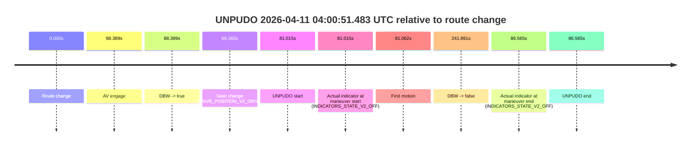
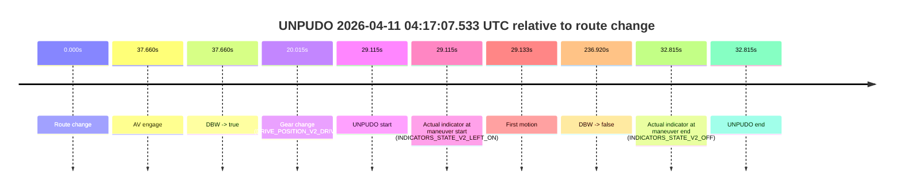
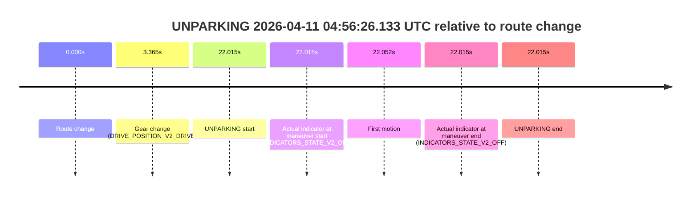

# Run Report: fme10010/2026-04-11--03-21-44--gen2-av-e52191e0-aea7-48f2-875b-104d728abec1

| Field | Value |
|---|---|
| Run ID | `fme10010/2026-04-11--03-21-44--gen2-av-e52191e0-aea7-48f2-875b-104d728abec1` |
| Date | `2026-04-11` |
| Model(s) | `lively-orange-horse` |
| Author | `guy.geva` |
| Event count | `8` |

## unpudo 2026-04-11 03:49:01.733 UTC

| Field | Value |
|---|---|
| Model | `lively-orange-horse` |
| Author | `guy.geva` |
| Run ID | `fme10010/2026-04-11--03-21-44--gen2-av-e52191e0-aea7-48f2-875b-104d728abec1` |
| Date | `2026-04-11` |
| Time (UTC) | `03:49:01.733` |
| Event type | `unpudo` |
| Disengagement type | `failed_to_unpudo` |
| Route change | `found` |
| Console | [run](https://console.sso.wayve.ai/run/fme10010/2026-04-11--03-21-44--gen2-av-e52191e0-aea7-48f2-875b-104d728abec1?id=&time-unixus=1775879341733306) |
| Foxglove | [segment](https://app.foxglove.dev/wayve-on-prem/p/prj_0dX18KZdVHg1fmmI/view?ds=foxglove-stream&ds.deviceName=fme10010&ds.start=2026-04-11T03%3A48%3A25.368289Z&ds.end=2026-04-11T03%3A56%3A59.798569Z&layoutId=lay_0e7VD4WIKDQGU73Y&time=2026-04-11T03%3A49%3A01.733306Z) |

### Event card: fail

- Fail: AV owns part of the segment, but the event still resolves as a model-performance failure under the AV-only scoring rule.

| Event | Time (UTC) | Delta from route change |
|---|---:|---:|
| Route change | 2026-04-11 03:48:35.368 | `0.000s` |
| AV engage | 2026-04-11 03:49:17.357 | `41.990s` |
| DBW -> true | 2026-04-11 03:49:17.357 | `41.990s` |
| Gear change (DRIVE_POSITION_V2_DRIVE) | 2026-04-11 03:48:40.383 | `5.015s` |
| UNPUDO start | 2026-04-11 03:49:01.733 | `26.365s` |
| Actual indicator at maneuver start (INDICATORS_STATE_V2_OFF) | 2026-04-11 03:49:01.733 | `26.365s` |
| First motion | 2026-04-11 03:49:01.911 | `26.543s` |
| DBW -> false | 2026-04-11 03:56:49.798 | `494.430s` |
| Actual indicator at maneuver end (INDICATORS_STATE_V2_OFF) | 2026-04-11 03:49:08.383 | `33.015s` |
| UNPUDO end | 2026-04-11 03:49:08.383 | `33.015s` |

| Metric | Value |
|---|---|
| Outcome | `fail` |
| Effective failure type | `failed_to_unpudo` |
| Route change status | `found` |
| DBW at event start | `false` |
| DBW at event end | `false` |
| Predicted gear at AV start | `DRIVE_POSITION_V2_DRIVE` |
| Actual gear at AV start | `DRIVE_POSITION_V2_DRIVE` |
| Predicted gear at event start | `DRIVE_POSITION_V2_DRIVE` |
| Actual gear at event start | `DRIVE_POSITION_V2_DRIVE` |
| Planned indicator direction | `INDICATORS_STATE_V2_LEFT_ON` |
| Controller indicator direction | `INDICATORS_STATE_V2_LEFT_ON` |
| Actual indicator direction | `INDICATORS_STATE_V2_OFF` |
| Actual indicator at maneuver end | `INDICATORS_STATE_V2_OFF` |
| Driver accel help in AV | `false` |
| Driver accel help timestamp | `n/a` |
| Max accel pedal pct in AV | `0.0%` |
| Max brake pedal pct in AV | `0.0%` |
| Max speed mps in AV | `0.000` |
| Route -> AV | `41.990s` |
| AV -> event start | `-15.625s` |
| AV -> first motion | `-15.447s` |
| AV duration before disengagement | `452.441s` |
| Trajectory waypoint count | `36` |
| Driving-plan step count | `11` |

The scored portion starts from the AV-owned window, not from the pre-AV setup. Route-change search in the stopped pre-event segment was `found`, with the baseline therefore set to route change. At the event anchor the model predicts `DRIVE_POSITION_V2_DRIVE` and the actual gear is `DRIVE_POSITION_V2_DRIVE`. The effective model outcome is `fail` because `failed_to_unpudo`.

### Resolution

| Field | Value |
|---|---|
| Final outcome | `fail` |
| Do we agree with this label? | `yes` |
| Source disengagement type | `failed_to_unpudo` |
| Resolved effective failure type | `failed_to_unpudo` |
| Confidence | `high` |

## unpudo 2026-04-11 03:56:51.283 UTC

| Field | Value |
|---|---|
| Model | `lively-orange-horse` |
| Author | `guy.geva` |
| Run ID | `fme10010/2026-04-11--03-21-44--gen2-av-e52191e0-aea7-48f2-875b-104d728abec1` |
| Date | `2026-04-11` |
| Time (UTC) | `03:56:51.283` |
| Event type | `unpudo` |
| Disengagement type | `failed_to_unpudo` |
| Route change | `found` |
| Console | [run](https://console.sso.wayve.ai/run/fme10010/2026-04-11--03-21-44--gen2-av-e52191e0-aea7-48f2-875b-104d728abec1?id=&time-unixus=1775879811283305) |
| Foxglove | [segment](https://app.foxglove.dev/wayve-on-prem/p/prj_0dX18KZdVHg1fmmI/view?ds=foxglove-stream&ds.deviceName=fme10010&ds.start=2026-04-11T03%3A56%3A11.668257Z&ds.end=2026-04-11T04%3A01%3A00.019734Z&layoutId=lay_0e7VD4WIKDQGU73Y&time=2026-04-11T03%3A56%3A51.283305Z) |

### Event card: fail

- Fail: AV owns part of the segment, but the event still resolves as a model-performance failure under the AV-only scoring rule.

| Event | Time (UTC) | Delta from route change |
|---|---:|---:|
| Route change | 2026-04-11 03:56:21.668 | `0.000s` |
| AV engage | 2026-04-11 03:56:59.698 | `38.031s` |
| DBW -> true | 2026-04-11 03:56:59.698 | `38.031s` |
| Gear change (DRIVE_POSITION_V2_DRIVE) | 2026-04-11 03:56:29.883 | `8.215s` |
| UNPUDO start | 2026-04-11 03:56:51.283 | `29.615s` |
| Actual indicator at maneuver start (INDICATORS_STATE_V2_OFF) | 2026-04-11 03:56:51.283 | `29.615s` |
| First motion | 2026-04-11 03:56:51.310 | `29.643s` |
| DBW -> false | 2026-04-11 04:00:50.019 | `268.351s` |
| Actual indicator at maneuver end (INDICATORS_STATE_V2_OFF) | 2026-04-11 03:56:56.533 | `34.865s` |
| UNPUDO end | 2026-04-11 03:56:56.533 | `34.865s` |

| Metric | Value |
|---|---|
| Outcome | `fail` |
| Effective failure type | `failed_to_unpudo` |
| Route change status | `found` |
| DBW at event start | `false` |
| DBW at event end | `false` |
| Predicted gear at AV start | `DRIVE_POSITION_V2_DRIVE` |
| Actual gear at AV start | `DRIVE_POSITION_V2_DRIVE` |
| Predicted gear at event start | `DRIVE_POSITION_V2_DRIVE` |
| Actual gear at event start | `DRIVE_POSITION_V2_DRIVE` |
| Planned indicator direction | `INDICATORS_STATE_V2_LEFT_ON` |
| Controller indicator direction | `INDICATORS_STATE_V2_LEFT_ON` |
| Actual indicator direction | `INDICATORS_STATE_V2_OFF` |
| Actual indicator at maneuver end | `INDICATORS_STATE_V2_OFF` |
| Driver accel help in AV | `false` |
| Driver accel help timestamp | `n/a` |
| Max accel pedal pct in AV | `0.0%` |
| Max brake pedal pct in AV | `0.0%` |
| Max speed mps in AV | `0.000` |
| Route -> AV | `38.031s` |
| AV -> event start | `-8.416s` |
| AV -> first motion | `-8.388s` |
| AV duration before disengagement | `230.321s` |
| Trajectory waypoint count | `36` |
| Driving-plan step count | `11` |

The scored portion starts from the AV-owned window, not from the pre-AV setup. Route-change search in the stopped pre-event segment was `found`, with the baseline therefore set to route change. At the event anchor the model predicts `DRIVE_POSITION_V2_DRIVE` and the actual gear is `DRIVE_POSITION_V2_DRIVE`. The effective model outcome is `fail` because `failed_to_unpudo`.

### Resolution

| Field | Value |
|---|---|
| Final outcome | `fail` |
| Do we agree with this label? | `yes` |
| Source disengagement type | `failed_to_unpudo` |
| Resolved effective failure type | `failed_to_unpudo` |
| Confidence | `high` |

## unpudo 2026-04-11 04:00:51.483 UTC

| Field | Value |
|---|---|
| Model | `lively-orange-horse` |
| Author | `guy.geva` |
| Run ID | `fme10010/2026-04-11--03-21-44--gen2-av-e52191e0-aea7-48f2-875b-104d728abec1` |
| Date | `2026-04-11` |
| Time (UTC) | `04:00:51.483` |
| Event type | `unpudo` |
| Disengagement type | `failed_to_unpudo` |
| Route change | `found` |
| Console | [run](https://console.sso.wayve.ai/run/fme10010/2026-04-11--03-21-44--gen2-av-e52191e0-aea7-48f2-875b-104d728abec1?id=&time-unixus=1775880051483305) |
| Foxglove | [segment](https://app.foxglove.dev/wayve-on-prem/p/prj_0dX18KZdVHg1fmmI/view?ds=foxglove-stream&ds.deviceName=fme10010&ds.start=2026-04-11T03%3A59%3A20.468342Z&ds.end=2026-04-11T04%3A03%3A42.359132Z&layoutId=lay_0e7VD4WIKDQGU73Y&time=2026-04-11T04%3A00%3A51.483305Z) |

### Event card: fail

- Fail: AV owns part of the segment, but the event still resolves as a model-performance failure under the AV-only scoring rule.

| Event | Time (UTC) | Delta from route change |
|---|---:|---:|
| Route change | 2026-04-11 03:59:30.468 | `0.000s` |
| AV engage | 2026-04-11 04:00:58.857 | `88.389s` |
| DBW -> true | 2026-04-11 04:00:58.857 | `88.389s` |
| Gear change (DRIVE_POSITION_V2_DRIVE) | 2026-04-11 04:00:39.833 | `69.365s` |
| UNPUDO start | 2026-04-11 04:00:51.483 | `81.015s` |
| Actual indicator at maneuver start (INDICATORS_STATE_V2_OFF) | 2026-04-11 04:00:51.483 | `81.015s` |
| First motion | 2026-04-11 04:00:51.530 | `81.062s` |
| DBW -> false | 2026-04-11 04:03:32.359 | `241.891s` |
| Actual indicator at maneuver end (INDICATORS_STATE_V2_OFF) | 2026-04-11 04:00:57.033 | `86.565s` |
| UNPUDO end | 2026-04-11 04:00:57.033 | `86.565s` |

| Metric | Value |
|---|---|
| Outcome | `fail` |
| Effective failure type | `failed_to_unpudo` |
| Route change status | `found` |
| DBW at event start | `false` |
| DBW at event end | `false` |
| Predicted gear at AV start | `DRIVE_POSITION_V2_DRIVE` |
| Actual gear at AV start | `DRIVE_POSITION_V2_DRIVE` |
| Predicted gear at event start | `DRIVE_POSITION_V2_DRIVE` |
| Actual gear at event start | `DRIVE_POSITION_V2_DRIVE` |
| Planned indicator direction | `INDICATORS_STATE_V2_LEFT_ON` |
| Controller indicator direction | `INDICATORS_STATE_V2_LEFT_ON` |
| Actual indicator direction | `INDICATORS_STATE_V2_OFF` |
| Actual indicator at maneuver end | `INDICATORS_STATE_V2_OFF` |
| Driver accel help in AV | `false` |
| Driver accel help timestamp | `n/a` |
| Max accel pedal pct in AV | `0.0%` |
| Max brake pedal pct in AV | `0.0%` |
| Max speed mps in AV | `0.000` |
| Route -> AV | `88.389s` |
| AV -> event start | `-7.374s` |
| AV -> first motion | `-7.327s` |
| AV duration before disengagement | `153.501s` |
| Trajectory waypoint count | `36` |
| Driving-plan step count | `11` |

The scored portion starts from the AV-owned window, not from the pre-AV setup. Route-change search in the stopped pre-event segment was `found`, with the baseline therefore set to route change. At the event anchor the model predicts `DRIVE_POSITION_V2_DRIVE` and the actual gear is `DRIVE_POSITION_V2_DRIVE`. The effective model outcome is `fail` because `failed_to_unpudo`.

### Resolution

| Field | Value |
|---|---|
| Final outcome | `fail` |
| Do we agree with this label? | `yes` |
| Source disengagement type | `failed_to_unpudo` |
| Resolved effective failure type | `failed_to_unpudo` |
| Confidence | `high` |

## unpudo 2026-04-11 04:17:07.533 UTC

| Field | Value |
|---|---|
| Model | `lively-orange-horse` |
| Author | `guy.geva` |
| Run ID | `fme10010/2026-04-11--03-21-44--gen2-av-e52191e0-aea7-48f2-875b-104d728abec1` |
| Date | `2026-04-11` |
| Time (UTC) | `04:17:07.533` |
| Event type | `unpudo` |
| Disengagement type | `none observed` |
| Route change | `found` |
| Console | [run](https://console.sso.wayve.ai/run/fme10010/2026-04-11--03-21-44--gen2-av-e52191e0-aea7-48f2-875b-104d728abec1?id=&time-unixus=1775881027533301) |
| Foxglove | [segment](https://app.foxglove.dev/wayve-on-prem/p/prj_0dX18KZdVHg1fmmI/view?ds=foxglove-stream&ds.deviceName=fme10010&ds.start=2026-04-11T04%3A16%3A28.418244Z&ds.end=2026-04-11T04%3A20%3A45.338333Z&layoutId=lay_0e7VD4WIKDQGU73Y&time=2026-04-11T04%3A17%3A07.533301Z) |

### Event card: fail

- Fail: the credited unpudo does not stay AV-owned. The event window starts with DBW false, and the maneuver outcome lands outside a clean AV-owned segment.

| Event | Time (UTC) | Delta from route change |
|---|---:|---:|
| Route change | 2026-04-11 04:16:38.418 | `0.000s` |
| AV engage | 2026-04-11 04:17:16.077 | `37.660s` |
| DBW -> true | 2026-04-11 04:17:16.077 | `37.660s` |
| Gear change (DRIVE_POSITION_V2_DRIVE) | 2026-04-11 04:16:58.433 | `20.015s` |
| UNPUDO start | 2026-04-11 04:17:07.533 | `29.115s` |
| Actual indicator at maneuver start (INDICATORS_STATE_V2_LEFT_ON) | 2026-04-11 04:17:07.533 | `29.115s` |
| First motion | 2026-04-11 04:17:07.550 | `29.133s` |
| DBW -> false | 2026-04-11 04:20:35.338 | `236.920s` |
| Actual indicator at maneuver end (INDICATORS_STATE_V2_OFF) | 2026-04-11 04:17:11.233 | `32.815s` |
| UNPUDO end | 2026-04-11 04:17:11.233 | `32.815s` |

| Metric | Value |
|---|---|
| Outcome | `fail` |
| Effective failure type | `completed_outside_av` |
| Route change status | `found` |
| DBW at event start | `false` |
| DBW at event end | `false` |
| Predicted gear at AV start | `DRIVE_POSITION_V2_DRIVE` |
| Actual gear at AV start | `DRIVE_POSITION_V2_DRIVE` |
| Predicted gear at event start | `DRIVE_POSITION_V2_DRIVE` |
| Actual gear at event start | `DRIVE_POSITION_V2_DRIVE` |
| Planned indicator direction | `INDICATORS_STATE_V2_LEFT_ON` |
| Controller indicator direction | `INDICATORS_STATE_V2_LEFT_ON` |
| Actual indicator direction | `INDICATORS_STATE_V2_LEFT_ON` |
| Actual indicator at maneuver end | `INDICATORS_STATE_V2_OFF` |
| Driver accel help in AV | `false` |
| Driver accel help timestamp | `n/a` |
| Max accel pedal pct in AV | `0.0%` |
| Max brake pedal pct in AV | `0.0%` |
| Max speed mps in AV | `0.000` |
| Route -> AV | `37.660s` |
| AV -> event start | `-8.545s` |
| AV -> first motion | `-8.527s` |
| AV duration before disengagement | `199.261s` |
| Trajectory waypoint count | `37` |
| Driving-plan step count | `11` |

The scored portion starts from the AV-owned window, not from the pre-AV setup. Route-change search in the stopped pre-event segment was `found`, with the baseline therefore set to route change. At the event anchor the model predicts `DRIVE_POSITION_V2_DRIVE` and the actual gear is `DRIVE_POSITION_V2_DRIVE`. The effective model outcome is `fail` because `completed_outside_av`.

### Resolution

| Field | Value |
|---|---|
| Final outcome | `fail` |
| Do we agree with this label? | `yes` |
| Source disengagement type | `none observed` |
| Resolved effective failure type | `completed_outside_av` |
| Confidence | `high` |

## unpudo 2026-04-11 04:20:37.233 UTC

| Field | Value |
|---|---|
| Model | `lively-orange-horse` |
| Author | `guy.geva` |
| Run ID | `fme10010/2026-04-11--03-21-44--gen2-av-e52191e0-aea7-48f2-875b-104d728abec1` |
| Date | `2026-04-11` |
| Time (UTC) | `04:20:37.233` |
| Event type | `unpudo` |
| Disengagement type | `failed_to_unpudo` |
| Route change | `found` |
| Console | [run](https://console.sso.wayve.ai/run/fme10010/2026-04-11--03-21-44--gen2-av-e52191e0-aea7-48f2-875b-104d728abec1?id=&time-unixus=1775881237233314) |
| Foxglove | [segment](https://app.foxglove.dev/wayve-on-prem/p/prj_0dX18KZdVHg1fmmI/view?ds=foxglove-stream&ds.deviceName=fme10010&ds.start=2026-04-11T04%3A20%3A02.468299Z&ds.end=2026-04-11T04%3A25%3A04.177913Z&layoutId=lay_0e7VD4WIKDQGU73Y&time=2026-04-11T04%3A20%3A37.233314Z) |

### Event card: fail

- Fail: AV owns part of the segment, but the event still resolves as a model-performance failure under the AV-only scoring rule.

| Event | Time (UTC) | Delta from route change |
|---|---:|---:|
| Route change | 2026-04-11 04:20:12.468 | `0.000s` |
| AV engage | 2026-04-11 04:20:44.937 | `32.469s` |
| DBW -> true | 2026-04-11 04:20:44.937 | `32.469s` |
| Gear change (DRIVE_POSITION_V2_DRIVE) | 2026-04-11 04:20:26.133 | `13.665s` |
| UNPUDO start | 2026-04-11 04:20:37.233 | `24.765s` |
| Actual indicator at maneuver start (INDICATORS_STATE_V2_LEFT_ON) | 2026-04-11 04:20:37.233 | `24.765s` |
| First motion | 2026-04-11 04:20:37.270 | `24.802s` |
| DBW -> false | 2026-04-11 04:24:54.177 | `281.710s` |
| Actual indicator at maneuver end (INDICATORS_STATE_V2_OFF) | 2026-04-11 04:20:42.333 | `29.865s` |
| UNPUDO end | 2026-04-11 04:20:42.333 | `29.865s` |

| Metric | Value |
|---|---|
| Outcome | `fail` |
| Effective failure type | `failed_to_unpudo` |
| Route change status | `found` |
| DBW at event start | `false` |
| DBW at event end | `false` |
| Predicted gear at AV start | `DRIVE_POSITION_V2_DRIVE` |
| Actual gear at AV start | `DRIVE_POSITION_V2_DRIVE` |
| Predicted gear at event start | `DRIVE_POSITION_V2_DRIVE` |
| Actual gear at event start | `DRIVE_POSITION_V2_DRIVE` |
| Planned indicator direction | `INDICATORS_STATE_V2_LEFT_ON` |
| Controller indicator direction | `INDICATORS_STATE_V2_LEFT_ON` |
| Actual indicator direction | `INDICATORS_STATE_V2_LEFT_ON` |
| Actual indicator at maneuver end | `INDICATORS_STATE_V2_OFF` |
| Driver accel help in AV | `false` |
| Driver accel help timestamp | `n/a` |
| Max accel pedal pct in AV | `0.0%` |
| Max brake pedal pct in AV | `0.0%` |
| Max speed mps in AV | `0.000` |
| Route -> AV | `32.469s` |
| AV -> event start | `-7.704s` |
| AV -> first motion | `-7.667s` |
| AV duration before disengagement | `249.240s` |
| Trajectory waypoint count | `37` |
| Driving-plan step count | `11` |

The scored portion starts from the AV-owned window, not from the pre-AV setup. Route-change search in the stopped pre-event segment was `found`, with the baseline therefore set to route change. At the event anchor the model predicts `DRIVE_POSITION_V2_DRIVE` and the actual gear is `DRIVE_POSITION_V2_DRIVE`. The effective model outcome is `fail` because `failed_to_unpudo`.

### Resolution

| Field | Value |
|---|---|
| Final outcome | `fail` |
| Do we agree with this label? | `yes` |
| Source disengagement type | `failed_to_unpudo` |
| Resolved effective failure type | `failed_to_unpudo` |
| Confidence | `high` |

## unpudo 2026-04-11 04:29:33.333 UTC

| Field | Value |
|---|---|
| Model | `lively-orange-horse` |
| Author | `guy.geva` |
| Run ID | `fme10010/2026-04-11--03-21-44--gen2-av-e52191e0-aea7-48f2-875b-104d728abec1` |
| Date | `2026-04-11` |
| Time (UTC) | `04:29:33.333` |
| Event type | `unpudo` |
| Disengagement type | `failed_to_unpudo` |
| Route change | `found` |
| Console | [run](https://console.sso.wayve.ai/run/fme10010/2026-04-11--03-21-44--gen2-av-e52191e0-aea7-48f2-875b-104d728abec1?id=&time-unixus=1775881773333307) |
| Foxglove | [segment](https://app.foxglove.dev/wayve-on-prem/p/prj_0dX18KZdVHg1fmmI/view?ds=foxglove-stream&ds.deviceName=fme10010&ds.start=2026-04-11T04%3A29%3A03.818257Z&ds.end=2026-04-11T04%3A30%3A08.017746Z&layoutId=lay_0e7VD4WIKDQGU73Y&time=2026-04-11T04%3A29%3A33.333307Z) |

### Event card: fail

- Fail: AV owns part of the segment, but the event still resolves as a model-performance failure under the AV-only scoring rule.

| Event | Time (UTC) | Delta from route change |
|---|---:|---:|
| Route change | 2026-04-11 04:29:13.818 | `0.000s` |
| AV engage | 2026-04-11 04:29:41.077 | `27.259s` |
| DBW -> true | 2026-04-11 04:29:41.077 | `27.259s` |
| Gear change (DRIVE_POSITION_V2_DRIVE) | 2026-04-11 04:29:20.183 | `6.365s` |
| UNPUDO start | 2026-04-11 04:29:33.333 | `19.515s` |
| Actual indicator at maneuver start (INDICATORS_STATE_V2_OFF) | 2026-04-11 04:29:33.333 | `19.515s` |
| First motion | 2026-04-11 04:29:33.430 | `19.612s` |
| DBW -> false | 2026-04-11 04:29:58.017 | `44.199s` |
| Actual indicator at maneuver end (INDICATORS_STATE_V2_OFF) | 2026-04-11 04:29:38.583 | `24.765s` |
| UNPUDO end | 2026-04-11 04:29:38.583 | `24.765s` |

| Metric | Value |
|---|---|
| Outcome | `fail` |
| Effective failure type | `failed_to_unpudo` |
| Route change status | `found` |
| DBW at event start | `false` |
| DBW at event end | `false` |
| Predicted gear at AV start | `DRIVE_POSITION_V2_DRIVE` |
| Actual gear at AV start | `DRIVE_POSITION_V2_DRIVE` |
| Predicted gear at event start | `DRIVE_POSITION_V2_DRIVE` |
| Actual gear at event start | `DRIVE_POSITION_V2_DRIVE` |
| Planned indicator direction | `INDICATORS_STATE_V2_RIGHT_ON` |
| Controller indicator direction | `INDICATORS_STATE_V2_RIGHT_ON` |
| Actual indicator direction | `INDICATORS_STATE_V2_OFF` |
| Actual indicator at maneuver end | `INDICATORS_STATE_V2_OFF` |
| Driver accel help in AV | `false` |
| Driver accel help timestamp | `n/a` |
| Max accel pedal pct in AV | `0.0%` |
| Max brake pedal pct in AV | `0.0%` |
| Max speed mps in AV | `0.000` |
| Route -> AV | `27.259s` |
| AV -> event start | `-7.744s` |
| AV -> first motion | `-7.647s` |
| AV duration before disengagement | `16.940s` |
| Trajectory waypoint count | `37` |
| Driving-plan step count | `11` |

The scored portion starts from the AV-owned window, not from the pre-AV setup. Route-change search in the stopped pre-event segment was `found`, with the baseline therefore set to route change. At the event anchor the model predicts `DRIVE_POSITION_V2_DRIVE` and the actual gear is `DRIVE_POSITION_V2_DRIVE`. The effective model outcome is `fail` because `failed_to_unpudo`.

### Resolution

| Field | Value |
|---|---|
| Final outcome | `fail` |
| Do we agree with this label? | `yes` |
| Source disengagement type | `failed_to_unpudo` |
| Resolved effective failure type | `failed_to_unpudo` |
| Confidence | `high` |

## unpudo 2026-04-11 04:36:08.433 UTC

| Field | Value |
|---|---|
| Model | `lively-orange-horse` |
| Author | `guy.geva` |
| Run ID | `fme10010/2026-04-11--03-21-44--gen2-av-e52191e0-aea7-48f2-875b-104d728abec1` |
| Date | `2026-04-11` |
| Time (UTC) | `04:36:08.433` |
| Event type | `unpudo` |
| Disengagement type | `failed_to_unpudo` |
| Route change | `found` |
| Console | [run](https://console.sso.wayve.ai/run/fme10010/2026-04-11--03-21-44--gen2-av-e52191e0-aea7-48f2-875b-104d728abec1?id=&time-unixus=1775882168433312) |
| Foxglove | [segment](https://app.foxglove.dev/wayve-on-prem/p/prj_0dX18KZdVHg1fmmI/view?ds=foxglove-stream&ds.deviceName=fme10010&ds.start=2026-04-11T04%3A35%3A07.718264Z&ds.end=2026-04-11T04%3A44%3A57.298869Z&layoutId=lay_0e7VD4WIKDQGU73Y&time=2026-04-11T04%3A36%3A08.433312Z) |

### Event card: fail

- Fail: AV owns part of the segment, but the event still resolves as a model-performance failure under the AV-only scoring rule.

| Event | Time (UTC) | Delta from route change |
|---|---:|---:|
| Route change | 2026-04-11 04:35:17.718 | `0.000s` |
| AV engage | 2026-04-11 04:36:12.298 | `54.581s` |
| DBW -> true | 2026-04-11 04:36:12.298 | `54.581s` |
| Gear change (DRIVE_POSITION_V2_DRIVE) | 2026-04-11 04:36:07.083 | `49.365s` |
| UNPUDO start | 2026-04-11 04:36:08.433 | `50.715s` |
| Actual indicator at maneuver start (INDICATORS_STATE_V2_OFF) | 2026-04-11 04:36:08.433 | `50.715s` |
| First motion | 2026-04-11 04:36:08.490 | `50.772s` |
| DBW -> false | 2026-04-11 04:44:47.298 | `569.581s` |
| Actual indicator at maneuver end (INDICATORS_STATE_V2_OFF) | 2026-04-11 04:36:12.683 | `54.965s` |
| UNPUDO end | 2026-04-11 04:36:12.683 | `54.965s` |

| Metric | Value |
|---|---|
| Outcome | `fail` |
| Effective failure type | `failed_to_unpudo` |
| Route change status | `found` |
| DBW at event start | `false` |
| DBW at event end | `true` |
| Predicted gear at AV start | `DRIVE_POSITION_V2_DRIVE` |
| Actual gear at AV start | `DRIVE_POSITION_V2_DRIVE` |
| Predicted gear at event start | `DRIVE_POSITION_V2_DRIVE` |
| Actual gear at event start | `DRIVE_POSITION_V2_DRIVE` |
| Planned indicator direction | `INDICATORS_STATE_V2_LEFT_ON` |
| Controller indicator direction | `INDICATORS_STATE_V2_LEFT_ON` |
| Actual indicator direction | `INDICATORS_STATE_V2_OFF` |
| Actual indicator at maneuver end | `INDICATORS_STATE_V2_OFF` |
| Driver accel help in AV | `false` |
| Driver accel help timestamp | `n/a` |
| Max accel pedal pct in AV | `0.0%` |
| Max brake pedal pct in AV | `0.0%` |
| Max speed mps in AV | `3.511` |
| Route -> AV | `54.581s` |
| AV -> event start | `-3.866s` |
| AV -> first motion | `-3.808s` |
| AV duration before disengagement | `515.000s` |
| Trajectory waypoint count | `37` |
| Driving-plan step count | `11` |

The scored portion starts from the AV-owned window, not from the pre-AV setup. Route-change search in the stopped pre-event segment was `found`, with the baseline therefore set to route change. At the event anchor the model predicts `DRIVE_POSITION_V2_DRIVE` and the actual gear is `DRIVE_POSITION_V2_DRIVE`. The effective model outcome is `fail` because `failed_to_unpudo`.

### Resolution

| Field | Value |
|---|---|
| Final outcome | `fail` |
| Do we agree with this label? | `yes` |
| Source disengagement type | `failed_to_unpudo` |
| Resolved effective failure type | `failed_to_unpudo` |
| Confidence | `high` |

## unparking 2026-04-11 04:56:26.133 UTC

| Field | Value |
|---|---|
| Model | `lively-orange-horse` |
| Author | `guy.geva` |
| Run ID | `fme10010/2026-04-11--03-21-44--gen2-av-e52191e0-aea7-48f2-875b-104d728abec1` |
| Date | `2026-04-11` |
| Time (UTC) | `04:56:26.133` |
| Event type | `unparking` |
| Disengagement type | `end_of_run` |
| Route change | `found` |
| Console | [run](https://console.sso.wayve.ai/run/fme10010/2026-04-11--03-21-44--gen2-av-e52191e0-aea7-48f2-875b-104d728abec1?id=&time-unixus=1775883386133309) |
| Foxglove | [segment](https://app.foxglove.dev/wayve-on-prem/p/prj_0dX18KZdVHg1fmmI/view?ds=foxglove-stream&ds.deviceName=fme10010&ds.start=2026-04-11T04%3A55%3A54.118312Z&ds.end=2026-04-11T04%3A56%3A36.133309Z&layoutId=lay_0e7VD4WIKDQGU73Y&time=2026-04-11T04%3A56%3A26.133309Z) |

### Event card: fail

- Fail: AV owns part of the segment, but the event still resolves as a model-performance failure under the AV-only scoring rule.

| Event | Time (UTC) | Delta from route change |
|---|---:|---:|
| Route change | 2026-04-11 04:56:04.118 | `0.000s` |
| Gear change (DRIVE_POSITION_V2_DRIVE) | 2026-04-11 04:56:07.483 | `3.365s` |
| UNPARKING start | 2026-04-11 04:56:26.133 | `22.015s` |
| Actual indicator at maneuver start (INDICATORS_STATE_V2_OFF) | 2026-04-11 04:56:26.133 | `22.015s` |
| First motion | 2026-04-11 04:56:26.170 | `22.052s` |
| Actual indicator at maneuver end (INDICATORS_STATE_V2_OFF) | 2026-04-11 04:56:26.133 | `22.015s` |
| UNPARKING end | 2026-04-11 04:56:26.133 | `22.015s` |

| Metric | Value |
|---|---|
| Outcome | `fail` |
| Effective failure type | `end_of_run` |
| Route change status | `found` |
| DBW at event start | `false` |
| DBW at event end | `false` |
| Predicted gear at AV start | `n/a` |
| Actual gear at AV start | `n/a` |
| Predicted gear at event start | `DRIVE_POSITION_V2_DRIVE` |
| Actual gear at event start | `DRIVE_POSITION_V2_DRIVE` |
| Planned indicator direction | `INDICATORS_STATE_V2_LEFT_ON` |
| Controller indicator direction | `INDICATORS_STATE_V2_LEFT_ON` |
| Actual indicator direction | `INDICATORS_STATE_V2_OFF` |
| Actual indicator at maneuver end | `INDICATORS_STATE_V2_OFF` |
| Driver accel help in AV | `false` |
| Driver accel help timestamp | `n/a` |
| Max accel pedal pct in AV | `0.0%` |
| Max brake pedal pct in AV | `0.0%` |
| Max speed mps in AV | `0.000` |
| Route -> AV | `n/a` |
| AV -> event start | `n/a` |
| AV -> first motion | `n/a` |
| AV duration before disengagement | `n/a` |
| Trajectory waypoint count | `35` |
| Driving-plan step count | `11` |

The scored portion starts from the AV-owned window, not from the pre-AV setup. Route-change search in the stopped pre-event segment was `found`, with the baseline therefore set to route change. At the event anchor the model predicts `DRIVE_POSITION_V2_DRIVE` and the actual gear is `DRIVE_POSITION_V2_DRIVE`. The effective model outcome is `fail` because `end_of_run`.

### Resolution

| Field | Value |
|---|---|
| Final outcome | `fail` |
| Do we agree with this label? | `yes` |
| Source disengagement type | `end_of_run` |
| Resolved effective failure type | `end_of_run` |
| Confidence | `high` |
