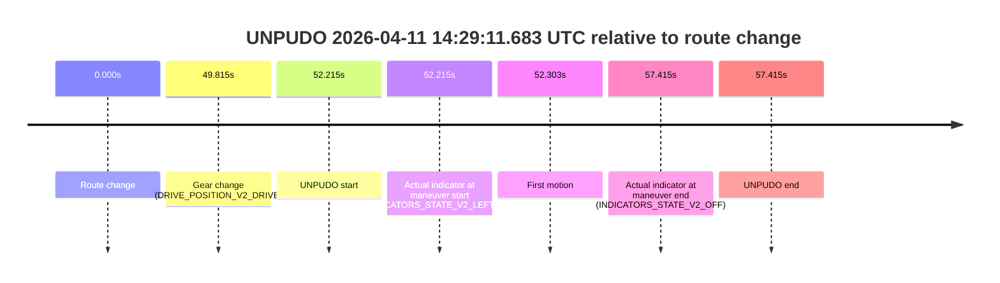
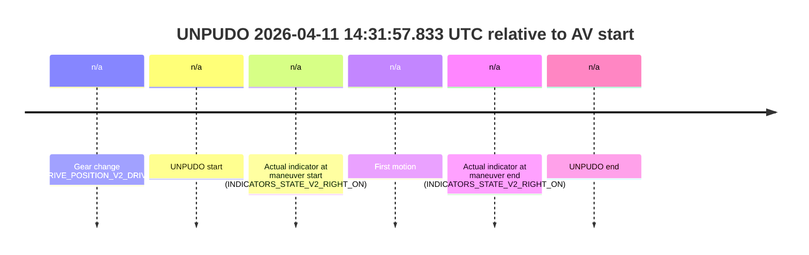
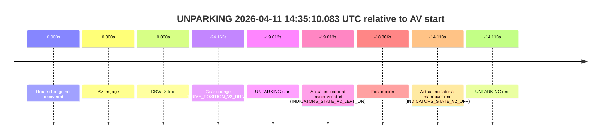

# Run Report: fme10010/2026-04-11--13-38-23--gen2-av-841ebe42-78d7-433a-a690-760480a93cb7

| Field | Value |
|---|---|
| Run ID | `fme10010/2026-04-11--13-38-23--gen2-av-841ebe42-78d7-433a-a690-760480a93cb7` |
| Date | `2026-04-11` |
| Model(s) | `lively-orange-horse` |
| Author | `guy.geva` |
| Event count | `3` |

## unpudo 2026-04-11 14:29:11.683 UTC

| Field | Value |
|---|---|
| Model | `lively-orange-horse` |
| Author | `guy.geva` |
| Run ID | `fme10010/2026-04-11--13-38-23--gen2-av-841ebe42-78d7-433a-a690-760480a93cb7` |
| Date | `2026-04-11` |
| Time (UTC) | `14:29:11.683` |
| Event type | `unpudo` |
| Disengagement type | `failed_to_unpudo` |
| Route change | `found` |
| Console | [run](https://console.sso.wayve.ai/run/fme10010/2026-04-11--13-38-23--gen2-av-841ebe42-78d7-433a-a690-760480a93cb7?id=&time-unixus=1775917751683304) |
| Foxglove | [segment](https://app.foxglove.dev/wayve-on-prem/p/prj_0dX18KZdVHg1fmmI/view?ds=foxglove-stream&ds.deviceName=fme10010&ds.start=2026-04-11T14%3A28%3A09.468295Z&ds.end=2026-04-11T14%3A29%3A26.883310Z&layoutId=lay_0e7VD4WIKDQGU73Y&time=2026-04-11T14%3A29%3A11.683304Z) |

### Event card: non-av

- Non-AV: the detected unpudo starts outside AV ownership, so it is kept for coverage but excluded from model success / failure scoring.

| Event | Time (UTC) | Delta from route change |
|---|---:|---:|
| Route change | 2026-04-11 14:28:19.468 | `0.000s` |
| Gear change (DRIVE_POSITION_V2_DRIVE) | 2026-04-11 14:29:09.283 | `49.815s` |
| UNPUDO start | 2026-04-11 14:29:11.683 | `52.215s` |
| Actual indicator at maneuver start (INDICATORS_STATE_V2_LEFT_ON) | 2026-04-11 14:29:11.683 | `52.215s` |
| First motion | 2026-04-11 14:29:11.770 | `52.303s` |
| Actual indicator at maneuver end (INDICATORS_STATE_V2_OFF) | 2026-04-11 14:29:16.883 | `57.415s` |
| UNPUDO end | 2026-04-11 14:29:16.883 | `57.415s` |

| Metric | Value |
|---|---|
| Outcome | `non-av` |
| Effective failure type | `none` |
| Route change status | `found` |
| DBW at event start | `false` |
| DBW at event end | `false` |
| Predicted gear at AV start | `n/a` |
| Actual gear at AV start | `n/a` |
| Predicted gear at event start | `DRIVE_POSITION_V2_DRIVE` |
| Actual gear at event start | `DRIVE_POSITION_V2_DRIVE` |
| Planned indicator direction | `INDICATORS_STATE_V2_LEFT_ON` |
| Controller indicator direction | `INDICATORS_STATE_V2_LEFT_ON` |
| Actual indicator direction | `INDICATORS_STATE_V2_LEFT_ON` |
| Actual indicator at maneuver end | `INDICATORS_STATE_V2_OFF` |
| Driver accel help in AV | `false` |
| Driver accel help timestamp | `n/a` |
| Max accel pedal pct in AV | `0.0%` |
| Max brake pedal pct in AV | `0.0%` |
| Max speed mps in AV | `0.000` |
| Route -> AV | `n/a` |
| AV -> event start | `n/a` |
| AV -> first motion | `n/a` |
| AV duration before disengagement | `n/a` |
| Trajectory waypoint count | `36` |
| Driving-plan step count | `11` |

The scored portion starts from the AV-owned window, not from the pre-AV setup. Route-change search in the stopped pre-event segment was `found`, with the baseline therefore set to route change. At the event anchor the model predicts `DRIVE_POSITION_V2_DRIVE` and the actual gear is `DRIVE_POSITION_V2_DRIVE`. The effective model outcome is `non-av` because `the event does not begin in AV ownership`.

### Resolution

| Field | Value |
|---|---|
| Final outcome | `non-av` |
| Do we agree with this label? | `yes` |
| Source disengagement type | `failed_to_unpudo` |
| Resolved effective failure type | `none` |
| Confidence | `high` |

## unpudo 2026-04-11 14:31:57.833 UTC

| Field | Value |
|---|---|
| Model | `lively-orange-horse` |
| Author | `guy.geva` |
| Run ID | `fme10010/2026-04-11--13-38-23--gen2-av-841ebe42-78d7-433a-a690-760480a93cb7` |
| Date | `2026-04-11` |
| Time (UTC) | `14:31:57.833` |
| Event type | `unpudo` |
| Disengagement type | `none observed` |
| Route change | `unclear` |
| Console | [run](https://console.sso.wayve.ai/run/fme10010/2026-04-11--13-38-23--gen2-av-841ebe42-78d7-433a-a690-760480a93cb7?id=&time-unixus=1775917917833307) |
| Foxglove | [segment](https://app.foxglove.dev/wayve-on-prem/p/prj_0dX18KZdVHg1fmmI/view?ds=foxglove-stream&ds.deviceName=fme10010&ds.start=2026-04-11T14%3A31%3A35.933309Z&ds.end=2026-04-11T14%3A32%3A11.633325Z&layoutId=lay_0e7VD4WIKDQGU73Y&time=2026-04-11T14%3A31%3A57.833307Z) |

### Event card: non-av

- Non-AV: the detected unpudo starts outside AV ownership, so it is kept for coverage but excluded from model success / failure scoring.

| Event | Time (UTC) | Delta from AV start |
|---|---:|---:|
| Gear change (DRIVE_POSITION_V2_DRIVE) | 2026-04-11 14:31:45.933 | `n/a` |
| UNPUDO start | 2026-04-11 14:31:57.833 | `n/a` |
| Actual indicator at maneuver start (INDICATORS_STATE_V2_RIGHT_ON) | 2026-04-11 14:31:57.833 | `n/a` |
| First motion | 2026-04-11 14:31:57.890 | `n/a` |
| Actual indicator at maneuver end (INDICATORS_STATE_V2_RIGHT_ON) | 2026-04-11 14:32:01.633 | `n/a` |
| UNPUDO end | 2026-04-11 14:32:01.633 | `n/a` |

| Metric | Value |
|---|---|
| Outcome | `non-av` |
| Effective failure type | `none` |
| Route change status | `unclear` |
| DBW at event start | `false` |
| DBW at event end | `false` |
| Predicted gear at AV start | `n/a` |
| Actual gear at AV start | `n/a` |
| Predicted gear at event start | `DRIVE_POSITION_V2_DRIVE` |
| Actual gear at event start | `DRIVE_POSITION_V2_DRIVE` |
| Planned indicator direction | `INDICATORS_STATE_V2_OFF` |
| Controller indicator direction | `INDICATORS_STATE_V2_OFF` |
| Actual indicator direction | `INDICATORS_STATE_V2_RIGHT_ON` |
| Actual indicator at maneuver end | `INDICATORS_STATE_V2_RIGHT_ON` |
| Driver accel help in AV | `false` |
| Driver accel help timestamp | `n/a` |
| Max accel pedal pct in AV | `0.0%` |
| Max brake pedal pct in AV | `0.0%` |
| Max speed mps in AV | `0.000` |
| Route -> AV | `n/a` |
| AV -> event start | `n/a` |
| AV -> first motion | `n/a` |
| AV duration before disengagement | `n/a` |
| Trajectory waypoint count | `35` |
| Driving-plan step count | `11` |

The scored portion starts from the AV-owned window, not from the pre-AV setup. Route-change search in the stopped pre-event segment was `unclear`, with the baseline therefore set to AV start. At the event anchor the model predicts `DRIVE_POSITION_V2_DRIVE` and the actual gear is `DRIVE_POSITION_V2_DRIVE`. The effective model outcome is `non-av` because `the event does not begin in AV ownership`.

### Resolution

| Field | Value |
|---|---|
| Final outcome | `non-av` |
| Do we agree with this label? | `yes` |
| Source disengagement type | `none observed` |
| Resolved effective failure type | `none` |
| Confidence | `medium` |

## unparking 2026-04-11 14:35:10.083 UTC

| Field | Value |
|---|---|
| Model | `lively-orange-horse` |
| Author | `guy.geva` |
| Run ID | `fme10010/2026-04-11--13-38-23--gen2-av-841ebe42-78d7-433a-a690-760480a93cb7` |
| Date | `2026-04-11` |
| Time (UTC) | `14:35:10.083` |
| Event type | `unparking` |
| Disengagement type | `none observed` |
| Route change | `not found` |
| Console | [run](https://console.sso.wayve.ai/run/fme10010/2026-04-11--13-38-23--gen2-av-841ebe42-78d7-433a-a690-760480a93cb7?id=&time-unixus=1775918110083312) |
| Foxglove | [segment](https://app.foxglove.dev/wayve-on-prem/p/prj_0dX18KZdVHg1fmmI/view?ds=foxglove-stream&ds.deviceName=fme10010&ds.start=2026-04-11T14%3A34%3A54.933304Z&ds.end=2026-04-11T14%3A35%3A24.983313Z&layoutId=lay_0e7VD4WIKDQGU73Y&time=2026-04-11T14%3A35%3A10.083312Z) |

### Event card: accidental

- Accidental: AV ownership is present for less than `2s`, so this is treated as an accidental brush with the maneuver rather than a meaningful model attempt.

| Event | Time (UTC) | Delta from AV start |
|---|---:|---:|
| Route change not recovered | 2026-04-11 14:35:29.096 | `0.000s` |
| AV engage | 2026-04-11 14:35:29.096 | `0.000s` |
| DBW -> true | 2026-04-11 14:35:29.096 | `0.000s` |
| Gear change (DRIVE_POSITION_V2_DRIVE) | 2026-04-11 14:35:04.933 | `-24.163s` |
| UNPARKING start | 2026-04-11 14:35:10.083 | `-19.013s` |
| Actual indicator at maneuver start (INDICATORS_STATE_V2_LEFT_ON) | 2026-04-11 14:35:10.083 | `-19.013s` |
| First motion | 2026-04-11 14:35:10.230 | `-18.866s` |
| Actual indicator at maneuver end (INDICATORS_STATE_V2_OFF) | 2026-04-11 14:35:14.983 | `-14.113s` |
| UNPARKING end | 2026-04-11 14:35:14.983 | `-14.113s` |

| Metric | Value |
|---|---|
| Outcome | `accidental` |
| Effective failure type | `none` |
| Route change status | `not found` |
| DBW at event start | `false` |
| DBW at event end | `false` |
| Predicted gear at AV start | `DRIVE_POSITION_V2_DRIVE` |
| Actual gear at AV start | `DRIVE_POSITION_V2_DRIVE` |
| Predicted gear at event start | `DRIVE_POSITION_V2_DRIVE` |
| Actual gear at event start | `DRIVE_POSITION_V2_DRIVE` |
| Planned indicator direction | `INDICATORS_STATE_V2_LEFT_ON` |
| Controller indicator direction | `INDICATORS_STATE_V2_LEFT_ON` |
| Actual indicator direction | `INDICATORS_STATE_V2_LEFT_ON` |
| Actual indicator at maneuver end | `INDICATORS_STATE_V2_OFF` |
| Driver accel help in AV | `false` |
| Driver accel help timestamp | `n/a` |
| Max accel pedal pct in AV | `0.0%` |
| Max brake pedal pct in AV | `0.0%` |
| Max speed mps in AV | `0.000` |
| Route -> AV | `n/a` |
| AV -> event start | `-19.013s` |
| AV -> first motion | `-18.866s` |
| AV duration before disengagement | `n/a` |
| Trajectory waypoint count | `36` |
| Driving-plan step count | `11` |

The scored portion starts from the AV-owned window, not from the pre-AV setup. Route-change search in the stopped pre-event segment was `not found`, with the baseline therefore set to AV start. At the event anchor the model predicts `DRIVE_POSITION_V2_DRIVE` and the actual gear is `DRIVE_POSITION_V2_DRIVE`. The effective model outcome is `accidental` because `the AV-owned portion is shorter than 2s`.

### Resolution

| Field | Value |
|---|---|
| Final outcome | `accidental` |
| Do we agree with this label? | `yes` |
| Source disengagement type | `none observed` |
| Resolved effective failure type | `none` |
| Confidence | `high` |
