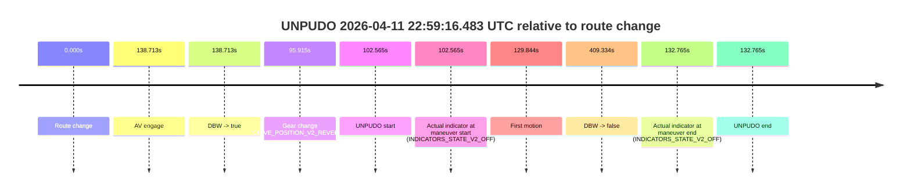
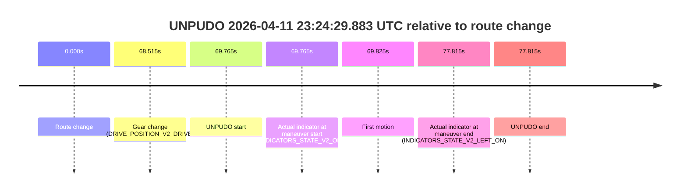
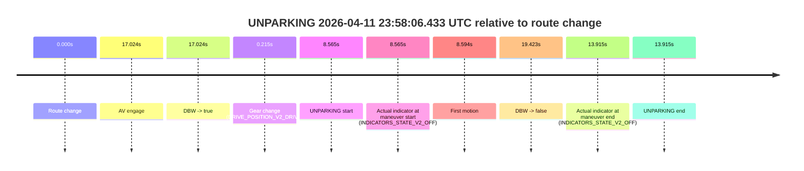

# Run Report: fme10010/2026-04-11--22-09-44--gen2-av-23247c84-ba7a-4d14-aa74-feb224a95b78

| Field | Value |
|---|---|
| Run ID | `fme10010/2026-04-11--22-09-44--gen2-av-23247c84-ba7a-4d14-aa74-feb224a95b78` |
| Date | `2026-04-11` |
| Model(s) | `lively-orange-horse` |
| Author | `guy.geva` |
| Event count | `10` |

## unpudo 2026-04-11 22:59:16.483 UTC

| Field | Value |
|---|---|
| Model | `lively-orange-horse` |
| Author | `guy.geva` |
| Run ID | `fme10010/2026-04-11--22-09-44--gen2-av-23247c84-ba7a-4d14-aa74-feb224a95b78` |
| Date | `2026-04-11` |
| Time (UTC) | `22:59:16.483` |
| Event type | `unpudo` |
| Disengagement type | `none observed` |
| Route change | `found` |
| Console | [run](https://console.sso.wayve.ai/run/fme10010/2026-04-11--22-09-44--gen2-av-23247c84-ba7a-4d14-aa74-feb224a95b78?id=&time-unixus=1775948356483314) |
| Foxglove | [segment](https://app.foxglove.dev/wayve-on-prem/p/prj_0dX18KZdVHg1fmmI/view?ds=foxglove-stream&ds.deviceName=fme10010&ds.start=2026-04-11T22%3A57%3A23.918271Z&ds.end=2026-04-11T23%3A04%3A33.252048Z&layoutId=lay_0e7VD4WIKDQGU73Y&time=2026-04-11T22%3A59%3A16.483314Z) |

### Event card: accidental

- Accidental: AV ownership is present for less than `2s`, so this is treated as an accidental brush with the maneuver rather than a meaningful model attempt.

| Event | Time (UTC) | Delta from route change |
|---|---:|---:|
| Route change | 2026-04-11 22:57:33.918 | `0.000s` |
| AV engage | 2026-04-11 22:59:52.631 | `138.713s` |
| DBW -> true | 2026-04-11 22:59:52.631 | `138.713s` |
| Gear change (DRIVE_POSITION_V2_REVERSE) | 2026-04-11 22:59:09.833 | `95.915s` |
| UNPUDO start | 2026-04-11 22:59:16.483 | `102.565s` |
| Actual indicator at maneuver start (INDICATORS_STATE_V2_OFF) | 2026-04-11 22:59:16.483 | `102.565s` |
| First motion | 2026-04-11 22:59:43.762 | `129.844s` |
| DBW -> false | 2026-04-11 23:04:23.252 | `409.334s` |
| Actual indicator at maneuver end (INDICATORS_STATE_V2_OFF) | 2026-04-11 22:59:46.683 | `132.765s` |
| UNPUDO end | 2026-04-11 22:59:46.683 | `132.765s` |

| Metric | Value |
|---|---|
| Outcome | `accidental` |
| Effective failure type | `none` |
| Route change status | `found` |
| DBW at event start | `false` |
| DBW at event end | `false` |
| Predicted gear at AV start | `DRIVE_POSITION_V2_DRIVE` |
| Actual gear at AV start | `DRIVE_POSITION_V2_DRIVE` |
| Predicted gear at event start | `DRIVE_POSITION_V2_DRIVE` |
| Actual gear at event start | `DRIVE_POSITION_V2_REVERSE` |
| Planned indicator direction | `INDICATORS_STATE_V2_OFF` |
| Controller indicator direction | `INDICATORS_STATE_V2_OFF` |
| Actual indicator direction | `INDICATORS_STATE_V2_OFF` |
| Actual indicator at maneuver end | `INDICATORS_STATE_V2_OFF` |
| Driver accel help in AV | `false` |
| Driver accel help timestamp | `n/a` |
| Max accel pedal pct in AV | `0.0%` |
| Max brake pedal pct in AV | `0.0%` |
| Max speed mps in AV | `0.000` |
| Route -> AV | `138.713s` |
| AV -> event start | `-36.148s` |
| AV -> first motion | `-8.869s` |
| AV duration before disengagement | `270.621s` |
| Trajectory waypoint count | `37` |
| Driving-plan step count | `11` |

The scored portion starts from the AV-owned window, not from the pre-AV setup. Route-change search in the stopped pre-event segment was `found`, with the baseline therefore set to route change. At the event anchor the model predicts `DRIVE_POSITION_V2_DRIVE` and the actual gear is `DRIVE_POSITION_V2_REVERSE`. The effective model outcome is `accidental` because `the AV-owned portion is shorter than 2s`.

### Resolution

| Field | Value |
|---|---|
| Final outcome | `accidental` |
| Do we agree with this label? | `yes` |
| Source disengagement type | `none observed` |
| Resolved effective failure type | `none` |
| Confidence | `high` |

## unpudo 2026-04-11 23:04:24.483 UTC

| Field | Value |
|---|---|
| Model | `lively-orange-horse` |
| Author | `guy.geva` |
| Run ID | `fme10010/2026-04-11--22-09-44--gen2-av-23247c84-ba7a-4d14-aa74-feb224a95b78` |
| Date | `2026-04-11` |
| Time (UTC) | `23:04:24.483` |
| Event type | `unpudo` |
| Disengagement type | `uncommanded_disengagement` |
| Route change | `found` |
| Console | [run](https://console.sso.wayve.ai/run/fme10010/2026-04-11--22-09-44--gen2-av-23247c84-ba7a-4d14-aa74-feb224a95b78?id=&time-unixus=1775948664483316) |
| Foxglove | [segment](https://app.foxglove.dev/wayve-on-prem/p/prj_0dX18KZdVHg1fmmI/view?ds=foxglove-stream&ds.deviceName=fme10010&ds.start=2026-04-11T23%3A04%3A06.818272Z&ds.end=2026-04-11T23%3A09%3A00.930869Z&layoutId=lay_0e7VD4WIKDQGU73Y&time=2026-04-11T23%3A04%3A24.483316Z) |

### Event card: accidental

- Accidental: AV ownership is present for less than `2s`, so this is treated as an accidental brush with the maneuver rather than a meaningful model attempt.

| Event | Time (UTC) | Delta from route change |
|---|---:|---:|
| Route change | 2026-04-11 23:04:16.818 | `0.000s` |
| AV engage | 2026-04-11 23:04:34.492 | `17.674s` |
| DBW -> true | 2026-04-11 23:04:34.492 | `17.674s` |
| Gear change (DRIVE_POSITION_V2_DRIVE) | 2026-04-11 23:04:18.683 | `1.865s` |
| UNPUDO start | 2026-04-11 23:04:24.483 | `7.665s` |
| Actual indicator at maneuver start (INDICATORS_STATE_V2_OFF) | 2026-04-11 23:04:24.483 | `7.665s` |
| First motion | 2026-04-11 23:04:24.502 | `7.684s` |
| DBW -> false | 2026-04-11 23:08:50.930 | `274.113s` |
| Actual indicator at maneuver end (INDICATORS_STATE_V2_OFF) | 2026-04-11 23:04:28.333 | `11.515s` |
| UNPUDO end | 2026-04-11 23:04:28.333 | `11.515s` |

| Metric | Value |
|---|---|
| Outcome | `accidental` |
| Effective failure type | `none` |
| Route change status | `found` |
| DBW at event start | `false` |
| DBW at event end | `false` |
| Predicted gear at AV start | `DRIVE_POSITION_V2_DRIVE` |
| Actual gear at AV start | `DRIVE_POSITION_V2_DRIVE` |
| Predicted gear at event start | `DRIVE_POSITION_V2_DRIVE` |
| Actual gear at event start | `DRIVE_POSITION_V2_DRIVE` |
| Planned indicator direction | `INDICATORS_STATE_V2_LEFT_ON` |
| Controller indicator direction | `INDICATORS_STATE_V2_LEFT_ON` |
| Actual indicator direction | `INDICATORS_STATE_V2_OFF` |
| Actual indicator at maneuver end | `INDICATORS_STATE_V2_OFF` |
| Driver accel help in AV | `false` |
| Driver accel help timestamp | `n/a` |
| Max accel pedal pct in AV | `0.0%` |
| Max brake pedal pct in AV | `0.0%` |
| Max speed mps in AV | `0.000` |
| Route -> AV | `17.674s` |
| AV -> event start | `-10.009s` |
| AV -> first motion | `-9.990s` |
| AV duration before disengagement | `256.438s` |
| Trajectory waypoint count | `37` |
| Driving-plan step count | `11` |

The scored portion starts from the AV-owned window, not from the pre-AV setup. Route-change search in the stopped pre-event segment was `found`, with the baseline therefore set to route change. At the event anchor the model predicts `DRIVE_POSITION_V2_DRIVE` and the actual gear is `DRIVE_POSITION_V2_DRIVE`. The effective model outcome is `accidental` because `the AV-owned portion is shorter than 2s`.

### Resolution

| Field | Value |
|---|---|
| Final outcome | `accidental` |
| Do we agree with this label? | `yes` |
| Source disengagement type | `uncommanded_disengagement` |
| Resolved effective failure type | `none` |
| Confidence | `high` |

## unpudo 2026-04-11 23:08:51.783 UTC

| Field | Value |
|---|---|
| Model | `lively-orange-horse` |
| Author | `guy.geva` |
| Run ID | `fme10010/2026-04-11--22-09-44--gen2-av-23247c84-ba7a-4d14-aa74-feb224a95b78` |
| Date | `2026-04-11` |
| Time (UTC) | `23:08:51.783` |
| Event type | `unpudo` |
| Disengagement type | `none observed` |
| Route change | `found` |
| Console | [run](https://console.sso.wayve.ai/run/fme10010/2026-04-11--22-09-44--gen2-av-23247c84-ba7a-4d14-aa74-feb224a95b78?id=&time-unixus=1775948931783293) |
| Foxglove | [segment](https://app.foxglove.dev/wayve-on-prem/p/prj_0dX18KZdVHg1fmmI/view?ds=foxglove-stream&ds.deviceName=fme10010&ds.start=2026-04-11T23%3A08%3A36.168270Z&ds.end=2026-04-11T23%3A13%3A37.851444Z&layoutId=lay_0e7VD4WIKDQGU73Y&time=2026-04-11T23%3A08%3A51.783293Z) |

### Event card: accidental

- Accidental: AV ownership is present for less than `2s`, so this is treated as an accidental brush with the maneuver rather than a meaningful model attempt.

| Event | Time (UTC) | Delta from route change |
|---|---:|---:|
| Route change | 2026-04-11 23:08:46.168 | `0.000s` |
| AV engage | 2026-04-11 23:09:14.730 | `28.563s` |
| DBW -> true | 2026-04-11 23:09:14.730 | `28.563s` |
| Gear change (DRIVE_POSITION_V2_DRIVE) | 2026-04-11 23:08:46.483 | `0.315s` |
| UNPUDO start | 2026-04-11 23:08:51.783 | `5.615s` |
| Actual indicator at maneuver start (INDICATORS_STATE_V2_OFF) | 2026-04-11 23:08:51.783 | `5.615s` |
| First motion | 2026-04-11 23:08:51.922 | `5.754s` |
| DBW -> false | 2026-04-11 23:13:27.851 | `281.683s` |
| Actual indicator at maneuver end (INDICATORS_STATE_V2_OFF) | 2026-04-11 23:09:05.133 | `18.965s` |
| UNPUDO end | 2026-04-11 23:09:05.133 | `18.965s` |

| Metric | Value |
|---|---|
| Outcome | `accidental` |
| Effective failure type | `none` |
| Route change status | `found` |
| DBW at event start | `false` |
| DBW at event end | `false` |
| Predicted gear at AV start | `DRIVE_POSITION_V2_DRIVE` |
| Actual gear at AV start | `DRIVE_POSITION_V2_DRIVE` |
| Predicted gear at event start | `DRIVE_POSITION_V2_DRIVE` |
| Actual gear at event start | `DRIVE_POSITION_V2_DRIVE` |
| Planned indicator direction | `INDICATORS_STATE_V2_LEFT_ON` |
| Controller indicator direction | `INDICATORS_STATE_V2_LEFT_ON` |
| Actual indicator direction | `INDICATORS_STATE_V2_OFF` |
| Actual indicator at maneuver end | `INDICATORS_STATE_V2_OFF` |
| Driver accel help in AV | `false` |
| Driver accel help timestamp | `n/a` |
| Max accel pedal pct in AV | `0.0%` |
| Max brake pedal pct in AV | `0.0%` |
| Max speed mps in AV | `0.000` |
| Route -> AV | `28.563s` |
| AV -> event start | `-22.948s` |
| AV -> first motion | `-22.808s` |
| AV duration before disengagement | `253.121s` |
| Trajectory waypoint count | `37` |
| Driving-plan step count | `11` |

The scored portion starts from the AV-owned window, not from the pre-AV setup. Route-change search in the stopped pre-event segment was `found`, with the baseline therefore set to route change. At the event anchor the model predicts `DRIVE_POSITION_V2_DRIVE` and the actual gear is `DRIVE_POSITION_V2_DRIVE`. The effective model outcome is `accidental` because `the AV-owned portion is shorter than 2s`.

### Resolution

| Field | Value |
|---|---|
| Final outcome | `accidental` |
| Do we agree with this label? | `yes` |
| Source disengagement type | `none observed` |
| Resolved effective failure type | `none` |
| Confidence | `high` |

## unpudo 2026-04-11 23:20:28.483 UTC

| Field | Value |
|---|---|
| Model | `lively-orange-horse` |
| Author | `guy.geva` |
| Run ID | `fme10010/2026-04-11--22-09-44--gen2-av-23247c84-ba7a-4d14-aa74-feb224a95b78` |
| Date | `2026-04-11` |
| Time (UTC) | `23:20:28.483` |
| Event type | `unpudo` |
| Disengagement type | `failed_to_pudo` |
| Route change | `found` |
| Console | [run](https://console.sso.wayve.ai/run/fme10010/2026-04-11--22-09-44--gen2-av-23247c84-ba7a-4d14-aa74-feb224a95b78?id=&time-unixus=1775949628483299) |
| Foxglove | [segment](https://app.foxglove.dev/wayve-on-prem/p/prj_0dX18KZdVHg1fmmI/view?ds=foxglove-stream&ds.deviceName=fme10010&ds.start=2026-04-11T23%3A20%3A07.518311Z&ds.end=2026-04-11T23%3A22%3A59.672660Z&layoutId=lay_0e7VD4WIKDQGU73Y&time=2026-04-11T23%3A20%3A28.483299Z) |

### Event card: accidental

- Accidental: AV ownership is present for less than `2s`, so this is treated as an accidental brush with the maneuver rather than a meaningful model attempt.

| Event | Time (UTC) | Delta from route change |
|---|---:|---:|
| Route change | 2026-04-11 23:20:17.518 | `0.000s` |
| AV engage | 2026-04-11 23:20:35.851 | `18.333s` |
| DBW -> true | 2026-04-11 23:20:35.851 | `18.333s` |
| Gear change (DRIVE_POSITION_V2_DRIVE) | 2026-04-11 23:20:21.583 | `4.065s` |
| UNPUDO start | 2026-04-11 23:20:28.483 | `10.965s` |
| Actual indicator at maneuver start (INDICATORS_STATE_V2_OFF) | 2026-04-11 23:20:28.483 | `10.965s` |
| First motion | 2026-04-11 23:20:28.502 | `10.984s` |
| DBW -> false | 2026-04-11 23:22:49.672 | `152.154s` |
| Actual indicator at maneuver end (INDICATORS_STATE_V2_OFF) | 2026-04-11 23:20:33.933 | `16.415s` |
| UNPUDO end | 2026-04-11 23:20:33.933 | `16.415s` |

| Metric | Value |
|---|---|
| Outcome | `accidental` |
| Effective failure type | `none` |
| Route change status | `found` |
| DBW at event start | `false` |
| DBW at event end | `false` |
| Predicted gear at AV start | `DRIVE_POSITION_V2_DRIVE` |
| Actual gear at AV start | `DRIVE_POSITION_V2_DRIVE` |
| Predicted gear at event start | `DRIVE_POSITION_V2_DRIVE` |
| Actual gear at event start | `DRIVE_POSITION_V2_DRIVE` |
| Planned indicator direction | `INDICATORS_STATE_V2_LEFT_ON` |
| Controller indicator direction | `INDICATORS_STATE_V2_LEFT_ON` |
| Actual indicator direction | `INDICATORS_STATE_V2_OFF` |
| Actual indicator at maneuver end | `INDICATORS_STATE_V2_OFF` |
| Driver accel help in AV | `false` |
| Driver accel help timestamp | `n/a` |
| Max accel pedal pct in AV | `0.0%` |
| Max brake pedal pct in AV | `0.0%` |
| Max speed mps in AV | `0.000` |
| Route -> AV | `18.333s` |
| AV -> event start | `-7.368s` |
| AV -> first motion | `-7.349s` |
| AV duration before disengagement | `133.821s` |
| Trajectory waypoint count | `37` |
| Driving-plan step count | `11` |

The scored portion starts from the AV-owned window, not from the pre-AV setup. Route-change search in the stopped pre-event segment was `found`, with the baseline therefore set to route change. At the event anchor the model predicts `DRIVE_POSITION_V2_DRIVE` and the actual gear is `DRIVE_POSITION_V2_DRIVE`. The effective model outcome is `accidental` because `the AV-owned portion is shorter than 2s`.

### Resolution

| Field | Value |
|---|---|
| Final outcome | `accidental` |
| Do we agree with this label? | `yes` |
| Source disengagement type | `failed_to_pudo` |
| Resolved effective failure type | `none` |
| Confidence | `high` |

## unpudo 2026-04-11 23:23:58.433 UTC

| Field | Value |
|---|---|
| Model | `lively-orange-horse` |
| Author | `guy.geva` |
| Run ID | `fme10010/2026-04-11--22-09-44--gen2-av-23247c84-ba7a-4d14-aa74-feb224a95b78` |
| Date | `2026-04-11` |
| Time (UTC) | `23:23:58.433` |
| Event type | `unpudo` |
| Disengagement type | `failed_to_unpudo` |
| Route change | `found` |
| Console | [run](https://console.sso.wayve.ai/run/fme10010/2026-04-11--22-09-44--gen2-av-23247c84-ba7a-4d14-aa74-feb224a95b78?id=&time-unixus=1775949838433296) |
| Foxglove | [segment](https://app.foxglove.dev/wayve-on-prem/p/prj_0dX18KZdVHg1fmmI/view?ds=foxglove-stream&ds.deviceName=fme10010&ds.start=2026-04-11T23%3A21%3A58.970417Z&ds.end=2026-04-11T23%3A24%3A21.771498Z&layoutId=lay_0e7VD4WIKDQGU73Y&time=2026-04-11T23%3A23%3A58.433296Z) |

### Event card: accidental

- Accidental: AV ownership is present for less than `2s`, so this is treated as an accidental brush with the maneuver rather than a meaningful model attempt.

| Event | Time (UTC) | Delta from route change |
|---|---:|---:|
| Route change | 2026-04-11 23:22:08.970 | `0.000s` |
| AV engage | 2026-04-11 23:24:06.011 | `117.041s` |
| DBW -> true | 2026-04-11 23:24:06.011 | `117.041s` |
| Gear change (DRIVE_POSITION_V2_DRIVE) | 2026-04-11 23:23:27.483 | `78.513s` |
| UNPUDO start | 2026-04-11 23:23:58.433 | `109.463s` |
| Actual indicator at maneuver start (INDICATORS_STATE_V2_OFF) | 2026-04-11 23:23:58.433 | `109.463s` |
| First motion | 2026-04-11 23:23:58.462 | `109.492s` |
| DBW -> false | 2026-04-11 23:24:11.771 | `122.801s` |
| Actual indicator at maneuver end (INDICATORS_STATE_V2_OFF) | 2026-04-11 23:24:03.183 | `114.213s` |
| UNPUDO end | 2026-04-11 23:24:03.183 | `114.213s` |

| Metric | Value |
|---|---|
| Outcome | `accidental` |
| Effective failure type | `none` |
| Route change status | `found` |
| DBW at event start | `false` |
| DBW at event end | `false` |
| Predicted gear at AV start | `DRIVE_POSITION_V2_DRIVE` |
| Actual gear at AV start | `DRIVE_POSITION_V2_DRIVE` |
| Predicted gear at event start | `DRIVE_POSITION_V2_DRIVE` |
| Actual gear at event start | `DRIVE_POSITION_V2_DRIVE` |
| Planned indicator direction | `INDICATORS_STATE_V2_LEFT_ON` |
| Controller indicator direction | `INDICATORS_STATE_V2_LEFT_ON` |
| Actual indicator direction | `INDICATORS_STATE_V2_OFF` |
| Actual indicator at maneuver end | `INDICATORS_STATE_V2_OFF` |
| Driver accel help in AV | `false` |
| Driver accel help timestamp | `n/a` |
| Max accel pedal pct in AV | `0.0%` |
| Max brake pedal pct in AV | `0.0%` |
| Max speed mps in AV | `0.000` |
| Route -> AV | `117.041s` |
| AV -> event start | `-7.578s` |
| AV -> first motion | `-7.549s` |
| AV duration before disengagement | `5.760s` |
| Trajectory waypoint count | `36` |
| Driving-plan step count | `11` |

The scored portion starts from the AV-owned window, not from the pre-AV setup. Route-change search in the stopped pre-event segment was `found`, with the baseline therefore set to route change. At the event anchor the model predicts `DRIVE_POSITION_V2_DRIVE` and the actual gear is `DRIVE_POSITION_V2_DRIVE`. The effective model outcome is `accidental` because `the AV-owned portion is shorter than 2s`.

### Resolution

| Field | Value |
|---|---|
| Final outcome | `accidental` |
| Do we agree with this label? | `yes` |
| Source disengagement type | `failed_to_unpudo` |
| Resolved effective failure type | `none` |
| Confidence | `high` |

## unpudo 2026-04-11 23:24:29.883 UTC

| Field | Value |
|---|---|
| Model | `lively-orange-horse` |
| Author | `guy.geva` |
| Run ID | `fme10010/2026-04-11--22-09-44--gen2-av-23247c84-ba7a-4d14-aa74-feb224a95b78` |
| Date | `2026-04-11` |
| Time (UTC) | `23:24:29.883` |
| Event type | `unpudo` |
| Disengagement type | `failed_to_unpudo` |
| Route change | `found` |
| Console | [run](https://console.sso.wayve.ai/run/fme10010/2026-04-11--22-09-44--gen2-av-23247c84-ba7a-4d14-aa74-feb224a95b78?id=&time-unixus=1775949869883302) |
| Foxglove | [segment](https://app.foxglove.dev/wayve-on-prem/p/prj_0dX18KZdVHg1fmmI/view?ds=foxglove-stream&ds.deviceName=fme10010&ds.start=2026-04-11T23%3A23%3A10.118233Z&ds.end=2026-04-11T23%3A24%3A47.933299Z&layoutId=lay_0e7VD4WIKDQGU73Y&time=2026-04-11T23%3A24%3A29.883302Z) |

### Event card: non-av

- Non-AV: the detected unpudo starts outside AV ownership, so it is kept for coverage but excluded from model success / failure scoring.

| Event | Time (UTC) | Delta from route change |
|---|---:|---:|
| Route change | 2026-04-11 23:23:20.118 | `0.000s` |
| Gear change (DRIVE_POSITION_V2_DRIVE) | 2026-04-11 23:24:28.633 | `68.515s` |
| UNPUDO start | 2026-04-11 23:24:29.883 | `69.765s` |
| Actual indicator at maneuver start (INDICATORS_STATE_V2_OFF) | 2026-04-11 23:24:29.883 | `69.765s` |
| First motion | 2026-04-11 23:24:29.942 | `69.825s` |
| Actual indicator at maneuver end (INDICATORS_STATE_V2_LEFT_ON) | 2026-04-11 23:24:37.933 | `77.815s` |
| UNPUDO end | 2026-04-11 23:24:37.933 | `77.815s` |

| Metric | Value |
|---|---|
| Outcome | `non-av` |
| Effective failure type | `none` |
| Route change status | `found` |
| DBW at event start | `false` |
| DBW at event end | `false` |
| Predicted gear at AV start | `n/a` |
| Actual gear at AV start | `n/a` |
| Predicted gear at event start | `DRIVE_POSITION_V2_DRIVE` |
| Actual gear at event start | `DRIVE_POSITION_V2_DRIVE` |
| Planned indicator direction | `INDICATORS_STATE_V2_OFF` |
| Controller indicator direction | `INDICATORS_STATE_V2_OFF` |
| Actual indicator direction | `INDICATORS_STATE_V2_OFF` |
| Actual indicator at maneuver end | `INDICATORS_STATE_V2_LEFT_ON` |
| Driver accel help in AV | `false` |
| Driver accel help timestamp | `n/a` |
| Max accel pedal pct in AV | `0.0%` |
| Max brake pedal pct in AV | `0.0%` |
| Max speed mps in AV | `0.000` |
| Route -> AV | `n/a` |
| AV -> event start | `n/a` |
| AV -> first motion | `n/a` |
| AV duration before disengagement | `n/a` |
| Trajectory waypoint count | `37` |
| Driving-plan step count | `11` |

The scored portion starts from the AV-owned window, not from the pre-AV setup. Route-change search in the stopped pre-event segment was `found`, with the baseline therefore set to route change. At the event anchor the model predicts `DRIVE_POSITION_V2_DRIVE` and the actual gear is `DRIVE_POSITION_V2_DRIVE`. The effective model outcome is `non-av` because `the event does not begin in AV ownership`.

### Resolution

| Field | Value |
|---|---|
| Final outcome | `non-av` |
| Do we agree with this label? | `yes` |
| Source disengagement type | `failed_to_unpudo` |
| Resolved effective failure type | `none` |
| Confidence | `high` |

## unpudo 2026-04-11 23:25:22.533 UTC

| Field | Value |
|---|---|
| Model | `lively-orange-horse` |
| Author | `guy.geva` |
| Run ID | `fme10010/2026-04-11--22-09-44--gen2-av-23247c84-ba7a-4d14-aa74-feb224a95b78` |
| Date | `2026-04-11` |
| Time (UTC) | `23:25:22.533` |
| Event type | `unpudo` |
| Disengagement type | `failed_to_unpudo` |
| Route change | `found` |
| Console | [run](https://console.sso.wayve.ai/run/fme10010/2026-04-11--22-09-44--gen2-av-23247c84-ba7a-4d14-aa74-feb224a95b78?id=&time-unixus=1775949922533319) |
| Foxglove | [segment](https://app.foxglove.dev/wayve-on-prem/p/prj_0dX18KZdVHg1fmmI/view?ds=foxglove-stream&ds.deviceName=fme10010&ds.start=2026-04-11T23%3A24%3A38.918518Z&ds.end=2026-04-11T23%3A27%3A58.212538Z&layoutId=lay_0e7VD4WIKDQGU73Y&time=2026-04-11T23%3A25%3A22.533319Z) |

### Event card: accidental

- Accidental: AV ownership is present for less than `2s`, so this is treated as an accidental brush with the maneuver rather than a meaningful model attempt.

| Event | Time (UTC) | Delta from route change |
|---|---:|---:|
| Route change | 2026-04-11 23:24:48.918 | `0.000s` |
| AV engage | 2026-04-11 23:25:27.852 | `38.934s` |
| DBW -> true | 2026-04-11 23:25:27.852 | `38.934s` |
| Gear change (DRIVE_POSITION_V2_DRIVE) | 2026-04-11 23:25:12.583 | `23.665s` |
| UNPUDO start | 2026-04-11 23:25:22.533 | `33.615s` |
| Actual indicator at maneuver start (INDICATORS_STATE_V2_OFF) | 2026-04-11 23:25:22.533 | `33.615s` |
| First motion | 2026-04-11 23:25:22.582 | `33.664s` |
| DBW -> false | 2026-04-11 23:27:48.212 | `179.294s` |
| Actual indicator at maneuver end (INDICATORS_STATE_V2_OFF) | 2026-04-11 23:25:27.283 | `38.365s` |
| UNPUDO end | 2026-04-11 23:25:27.283 | `38.365s` |

| Metric | Value |
|---|---|
| Outcome | `accidental` |
| Effective failure type | `none` |
| Route change status | `found` |
| DBW at event start | `false` |
| DBW at event end | `false` |
| Predicted gear at AV start | `DRIVE_POSITION_V2_DRIVE` |
| Actual gear at AV start | `DRIVE_POSITION_V2_DRIVE` |
| Predicted gear at event start | `DRIVE_POSITION_V2_DRIVE` |
| Actual gear at event start | `DRIVE_POSITION_V2_DRIVE` |
| Planned indicator direction | `INDICATORS_STATE_V2_LEFT_ON` |
| Controller indicator direction | `INDICATORS_STATE_V2_LEFT_ON` |
| Actual indicator direction | `INDICATORS_STATE_V2_OFF` |
| Actual indicator at maneuver end | `INDICATORS_STATE_V2_OFF` |
| Driver accel help in AV | `false` |
| Driver accel help timestamp | `n/a` |
| Max accel pedal pct in AV | `0.0%` |
| Max brake pedal pct in AV | `0.0%` |
| Max speed mps in AV | `0.000` |
| Route -> AV | `38.934s` |
| AV -> event start | `-5.319s` |
| AV -> first motion | `-5.270s` |
| AV duration before disengagement | `140.360s` |
| Trajectory waypoint count | `36` |
| Driving-plan step count | `11` |

The scored portion starts from the AV-owned window, not from the pre-AV setup. Route-change search in the stopped pre-event segment was `found`, with the baseline therefore set to route change. At the event anchor the model predicts `DRIVE_POSITION_V2_DRIVE` and the actual gear is `DRIVE_POSITION_V2_DRIVE`. The effective model outcome is `accidental` because `the AV-owned portion is shorter than 2s`.

### Resolution

| Field | Value |
|---|---|
| Final outcome | `accidental` |
| Do we agree with this label? | `yes` |
| Source disengagement type | `failed_to_unpudo` |
| Resolved effective failure type | `none` |
| Confidence | `high` |

## unpudo 2026-04-11 23:38:45.583 UTC

| Field | Value |
|---|---|
| Model | `lively-orange-horse` |
| Author | `guy.geva` |
| Run ID | `fme10010/2026-04-11--22-09-44--gen2-av-23247c84-ba7a-4d14-aa74-feb224a95b78` |
| Date | `2026-04-11` |
| Time (UTC) | `23:38:45.583` |
| Event type | `unpudo` |
| Disengagement type | `failed_to_unpudo` |
| Route change | `found` |
| Console | [run](https://console.sso.wayve.ai/run/fme10010/2026-04-11--22-09-44--gen2-av-23247c84-ba7a-4d14-aa74-feb224a95b78?id=&time-unixus=1775950725583294) |
| Foxglove | [segment](https://app.foxglove.dev/wayve-on-prem/p/prj_0dX18KZdVHg1fmmI/view?ds=foxglove-stream&ds.deviceName=fme10010&ds.start=2026-04-11T23%3A38%3A26.968237Z&ds.end=2026-04-11T23%3A39%3A21.391455Z&layoutId=lay_0e7VD4WIKDQGU73Y&time=2026-04-11T23%3A38%3A45.583294Z) |

### Event card: non-av

- Non-AV: the detected unpudo starts outside AV ownership, so it is kept for coverage but excluded from model success / failure scoring.

| Event | Time (UTC) | Delta from route change |
|---|---:|---:|
| Route change | 2026-04-11 23:38:36.968 | `0.000s` |
| AV engage | 2026-04-11 23:38:56.571 | `19.603s` |
| DBW -> true | 2026-04-11 23:38:56.571 | `19.603s` |
| Gear change (DRIVE_POSITION_V2_DRIVE) | 2026-04-11 23:38:37.283 | `0.315s` |
| UNPUDO start | 2026-04-11 23:38:45.583 | `8.615s` |
| Actual indicator at maneuver start (INDICATORS_STATE_V2_OFF) | 2026-04-11 23:38:45.583 | `8.615s` |
| First motion | 2026-04-11 23:38:45.682 | `8.714s` |
| DBW -> false | 2026-04-11 23:39:11.391 | `34.423s` |
| Actual indicator at maneuver end (INDICATORS_STATE_V2_OFF) | 2026-04-11 23:38:58.633 | `21.665s` |
| UNPUDO end | 2026-04-11 23:38:58.633 | `21.665s` |

| Metric | Value |
|---|---|
| Outcome | `non-av` |
| Effective failure type | `none` |
| Route change status | `found` |
| DBW at event start | `false` |
| DBW at event end | `true` |
| Predicted gear at AV start | `DRIVE_POSITION_V2_DRIVE` |
| Actual gear at AV start | `DRIVE_POSITION_V2_DRIVE` |
| Predicted gear at event start | `DRIVE_POSITION_V2_DRIVE` |
| Actual gear at event start | `DRIVE_POSITION_V2_DRIVE` |
| Planned indicator direction | `INDICATORS_STATE_V2_OFF` |
| Controller indicator direction | `INDICATORS_STATE_V2_OFF` |
| Actual indicator direction | `INDICATORS_STATE_V2_OFF` |
| Actual indicator at maneuver end | `INDICATORS_STATE_V2_OFF` |
| Driver accel help in AV | `false` |
| Driver accel help timestamp | `n/a` |
| Max accel pedal pct in AV | `0.0%` |
| Max brake pedal pct in AV | `0.0%` |
| Max speed mps in AV | `2.242` |
| Route -> AV | `19.603s` |
| AV -> event start | `-10.988s` |
| AV -> first motion | `-10.889s` |
| AV duration before disengagement | `14.820s` |
| Trajectory waypoint count | `37` |
| Driving-plan step count | `11` |

The scored portion starts from the AV-owned window, not from the pre-AV setup. Route-change search in the stopped pre-event segment was `found`, with the baseline therefore set to route change. At the event anchor the model predicts `DRIVE_POSITION_V2_DRIVE` and the actual gear is `DRIVE_POSITION_V2_DRIVE`. The effective model outcome is `non-av` because `the event does not begin in AV ownership`.

### Resolution

| Field | Value |
|---|---|
| Final outcome | `non-av` |
| Do we agree with this label? | `yes` |
| Source disengagement type | `failed_to_unpudo` |
| Resolved effective failure type | `none` |
| Confidence | `high` |

## unpudo 2026-04-11 23:42:16.983 UTC

| Field | Value |
|---|---|
| Model | `lively-orange-horse` |
| Author | `guy.geva` |
| Run ID | `fme10010/2026-04-11--22-09-44--gen2-av-23247c84-ba7a-4d14-aa74-feb224a95b78` |
| Date | `2026-04-11` |
| Time (UTC) | `23:42:16.983` |
| Event type | `unpudo` |
| Disengagement type | `failed_to_unpudo` |
| Route change | `found` |
| Console | [run](https://console.sso.wayve.ai/run/fme10010/2026-04-11--22-09-44--gen2-av-23247c84-ba7a-4d14-aa74-feb224a95b78?id=&time-unixus=1775950936983309) |
| Foxglove | [segment](https://app.foxglove.dev/wayve-on-prem/p/prj_0dX18KZdVHg1fmmI/view?ds=foxglove-stream&ds.deviceName=fme10010&ds.start=2026-04-11T23%3A41%3A57.318239Z&ds.end=2026-04-11T23%3A43%3A10.072536Z&layoutId=lay_0e7VD4WIKDQGU73Y&time=2026-04-11T23%3A42%3A16.983309Z) |

### Event card: accidental

- Accidental: AV ownership is present for less than `2s`, so this is treated as an accidental brush with the maneuver rather than a meaningful model attempt.

| Event | Time (UTC) | Delta from route change |
|---|---:|---:|
| Route change | 2026-04-11 23:42:07.318 | `0.000s` |
| AV engage | 2026-04-11 23:42:24.671 | `17.353s` |
| DBW -> true | 2026-04-11 23:42:24.671 | `17.353s` |
| Gear change (DRIVE_POSITION_V2_DRIVE) | 2026-04-11 23:42:07.583 | `0.265s` |
| UNPUDO start | 2026-04-11 23:42:16.983 | `9.665s` |
| Actual indicator at maneuver start (INDICATORS_STATE_V2_OFF) | 2026-04-11 23:42:16.983 | `9.665s` |
| First motion | 2026-04-11 23:42:17.022 | `9.704s` |
| DBW -> false | 2026-04-11 23:43:00.072 | `52.754s` |
| Actual indicator at maneuver end (INDICATORS_STATE_V2_OFF) | 2026-04-11 23:42:21.483 | `14.165s` |
| UNPUDO end | 2026-04-11 23:42:21.483 | `14.165s` |

| Metric | Value |
|---|---|
| Outcome | `accidental` |
| Effective failure type | `none` |
| Route change status | `found` |
| DBW at event start | `false` |
| DBW at event end | `false` |
| Predicted gear at AV start | `DRIVE_POSITION_V2_DRIVE` |
| Actual gear at AV start | `DRIVE_POSITION_V2_DRIVE` |
| Predicted gear at event start | `DRIVE_POSITION_V2_DRIVE` |
| Actual gear at event start | `DRIVE_POSITION_V2_DRIVE` |
| Planned indicator direction | `INDICATORS_STATE_V2_LEFT_ON` |
| Controller indicator direction | `INDICATORS_STATE_V2_LEFT_ON` |
| Actual indicator direction | `INDICATORS_STATE_V2_OFF` |
| Actual indicator at maneuver end | `INDICATORS_STATE_V2_OFF` |
| Driver accel help in AV | `false` |
| Driver accel help timestamp | `n/a` |
| Max accel pedal pct in AV | `0.0%` |
| Max brake pedal pct in AV | `0.0%` |
| Max speed mps in AV | `0.000` |
| Route -> AV | `17.353s` |
| AV -> event start | `-7.688s` |
| AV -> first motion | `-7.649s` |
| AV duration before disengagement | `35.401s` |
| Trajectory waypoint count | `37` |
| Driving-plan step count | `11` |

The scored portion starts from the AV-owned window, not from the pre-AV setup. Route-change search in the stopped pre-event segment was `found`, with the baseline therefore set to route change. At the event anchor the model predicts `DRIVE_POSITION_V2_DRIVE` and the actual gear is `DRIVE_POSITION_V2_DRIVE`. The effective model outcome is `accidental` because `the AV-owned portion is shorter than 2s`.

### Resolution

| Field | Value |
|---|---|
| Final outcome | `accidental` |
| Do we agree with this label? | `yes` |
| Source disengagement type | `failed_to_unpudo` |
| Resolved effective failure type | `none` |
| Confidence | `high` |

## unparking 2026-04-11 23:58:06.433 UTC

| Field | Value |
|---|---|
| Model | `lively-orange-horse` |
| Author | `guy.geva` |
| Run ID | `fme10010/2026-04-11--22-09-44--gen2-av-23247c84-ba7a-4d14-aa74-feb224a95b78` |
| Date | `2026-04-11` |
| Time (UTC) | `23:58:06.433` |
| Event type | `unparking` |
| Disengagement type | `failed_to_unpudo` |
| Route change | `found` |
| Console | [run](https://console.sso.wayve.ai/run/fme10010/2026-04-11--22-09-44--gen2-av-23247c84-ba7a-4d14-aa74-feb224a95b78?id=&time-unixus=1775951886433303) |
| Foxglove | [segment](https://app.foxglove.dev/wayve-on-prem/p/prj_0dX18KZdVHg1fmmI/view?ds=foxglove-stream&ds.deviceName=fme10010&ds.start=2026-04-11T23%3A57%3A47.868250Z&ds.end=2026-04-11T23%3A58%3A27.291374Z&layoutId=lay_0e7VD4WIKDQGU73Y&time=2026-04-11T23%3A58%3A06.433303Z) |

### Event card: accidental

- Accidental: AV ownership is present for less than `2s`, so this is treated as an accidental brush with the maneuver rather than a meaningful model attempt.

| Event | Time (UTC) | Delta from route change |
|---|---:|---:|
| Route change | 2026-04-11 23:57:57.868 | `0.000s` |
| AV engage | 2026-04-11 23:58:14.892 | `17.024s` |
| DBW -> true | 2026-04-11 23:58:14.892 | `17.024s` |
| Gear change (DRIVE_POSITION_V2_DRIVE) | 2026-04-11 23:57:58.083 | `0.215s` |
| UNPARKING start | 2026-04-11 23:58:06.433 | `8.565s` |
| Actual indicator at maneuver start (INDICATORS_STATE_V2_OFF) | 2026-04-11 23:58:06.433 | `8.565s` |
| First motion | 2026-04-11 23:58:06.462 | `8.594s` |
| DBW -> false | 2026-04-11 23:58:17.291 | `19.423s` |
| Actual indicator at maneuver end (INDICATORS_STATE_V2_OFF) | 2026-04-11 23:58:11.783 | `13.915s` |
| UNPARKING end | 2026-04-11 23:58:11.783 | `13.915s` |

| Metric | Value |
|---|---|
| Outcome | `accidental` |
| Effective failure type | `none` |
| Route change status | `found` |
| DBW at event start | `false` |
| DBW at event end | `false` |
| Predicted gear at AV start | `DRIVE_POSITION_V2_DRIVE` |
| Actual gear at AV start | `DRIVE_POSITION_V2_DRIVE` |
| Predicted gear at event start | `DRIVE_POSITION_V2_DRIVE` |
| Actual gear at event start | `DRIVE_POSITION_V2_DRIVE` |
| Planned indicator direction | `INDICATORS_STATE_V2_OFF` |
| Controller indicator direction | `INDICATORS_STATE_V2_OFF` |
| Actual indicator direction | `INDICATORS_STATE_V2_OFF` |
| Actual indicator at maneuver end | `INDICATORS_STATE_V2_OFF` |
| Driver accel help in AV | `false` |
| Driver accel help timestamp | `n/a` |
| Max accel pedal pct in AV | `0.0%` |
| Max brake pedal pct in AV | `0.0%` |
| Max speed mps in AV | `0.000` |
| Route -> AV | `17.024s` |
| AV -> event start | `-8.459s` |
| AV -> first motion | `-8.430s` |
| AV duration before disengagement | `2.399s` |
| Trajectory waypoint count | `36` |
| Driving-plan step count | `11` |

The scored portion starts from the AV-owned window, not from the pre-AV setup. Route-change search in the stopped pre-event segment was `found`, with the baseline therefore set to route change. At the event anchor the model predicts `DRIVE_POSITION_V2_DRIVE` and the actual gear is `DRIVE_POSITION_V2_DRIVE`. The effective model outcome is `accidental` because `the AV-owned portion is shorter than 2s`.

### Resolution

| Field | Value |
|---|---|
| Final outcome | `accidental` |
| Do we agree with this label? | `yes` |
| Source disengagement type | `failed_to_unpudo` |
| Resolved effective failure type | `none` |
| Confidence | `high` |
